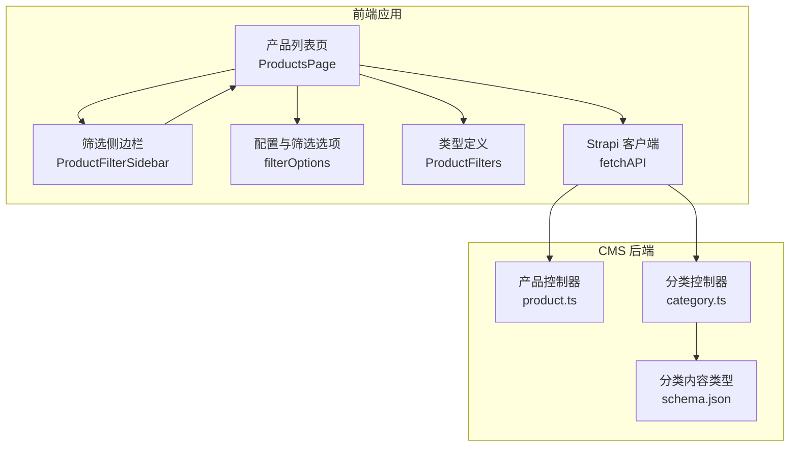
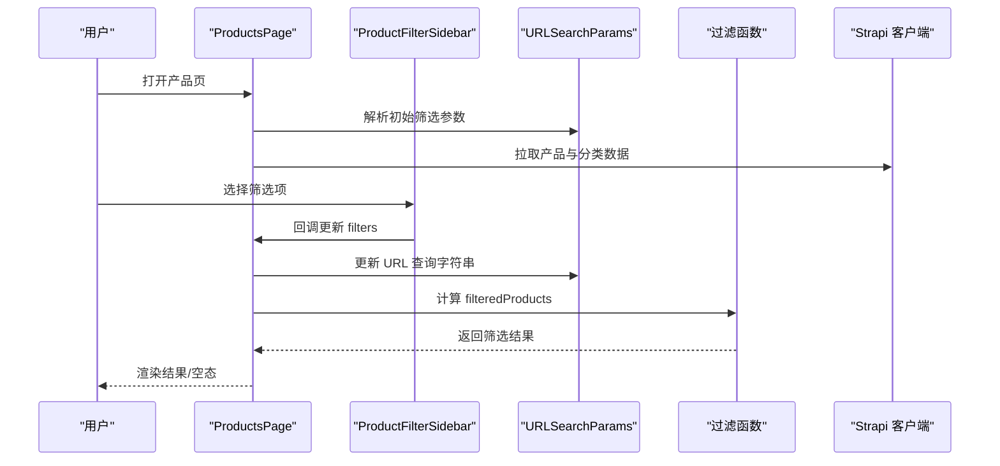
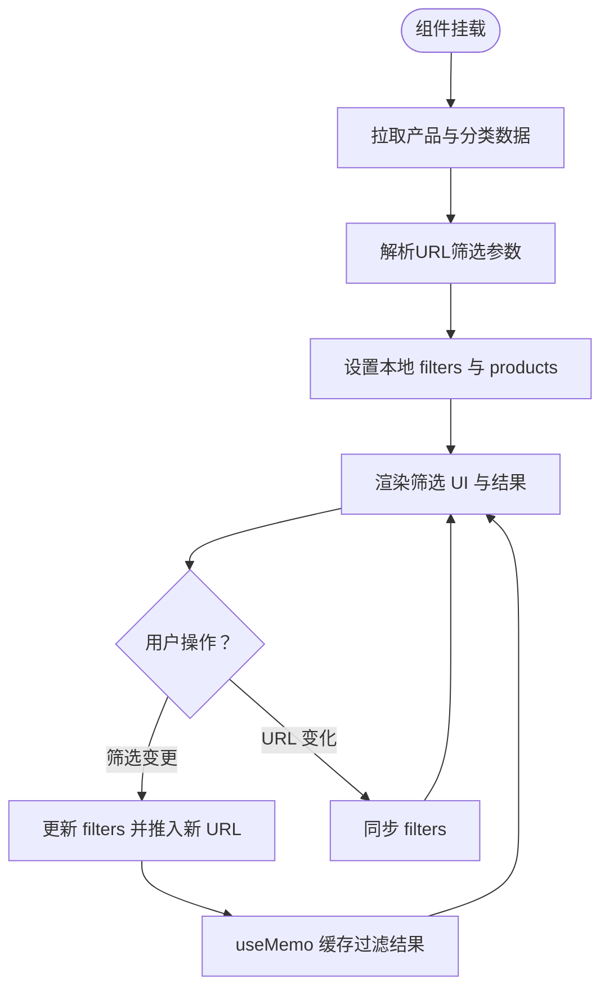
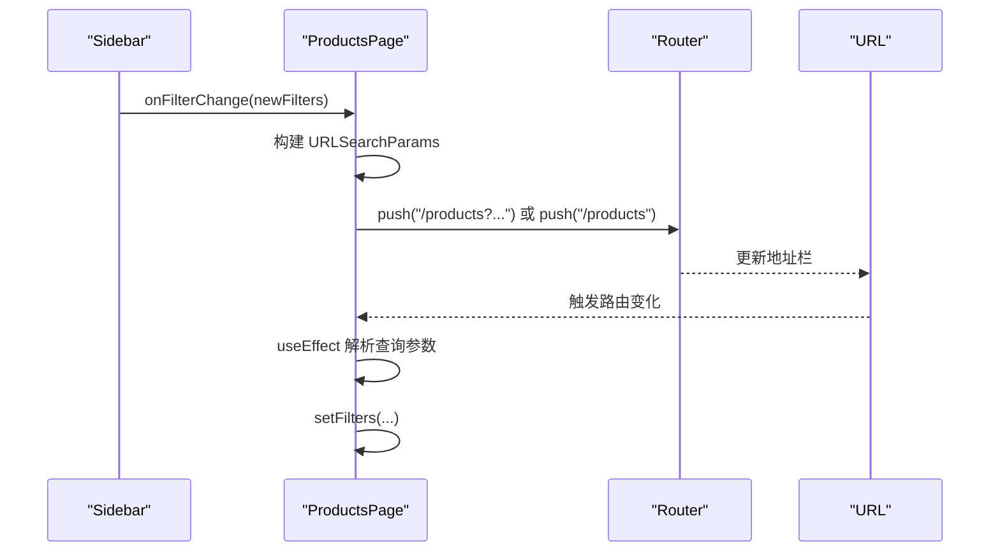
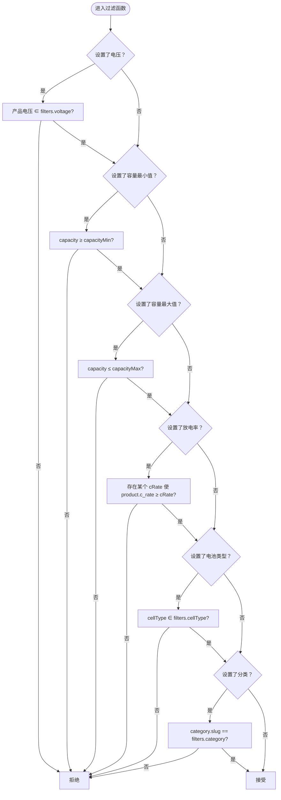
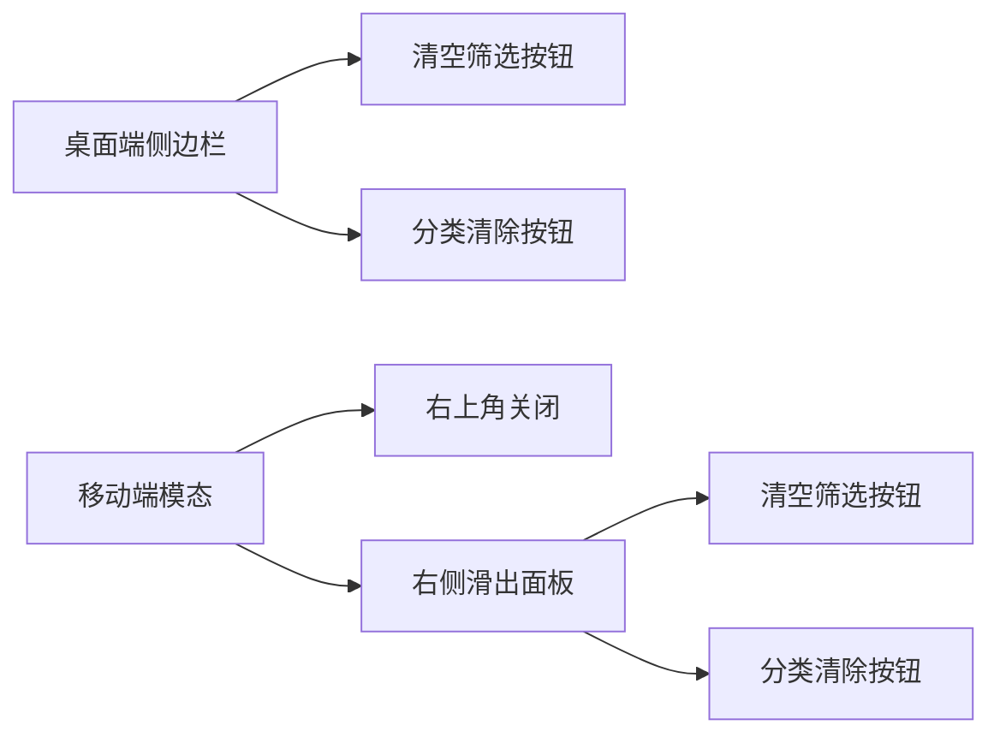
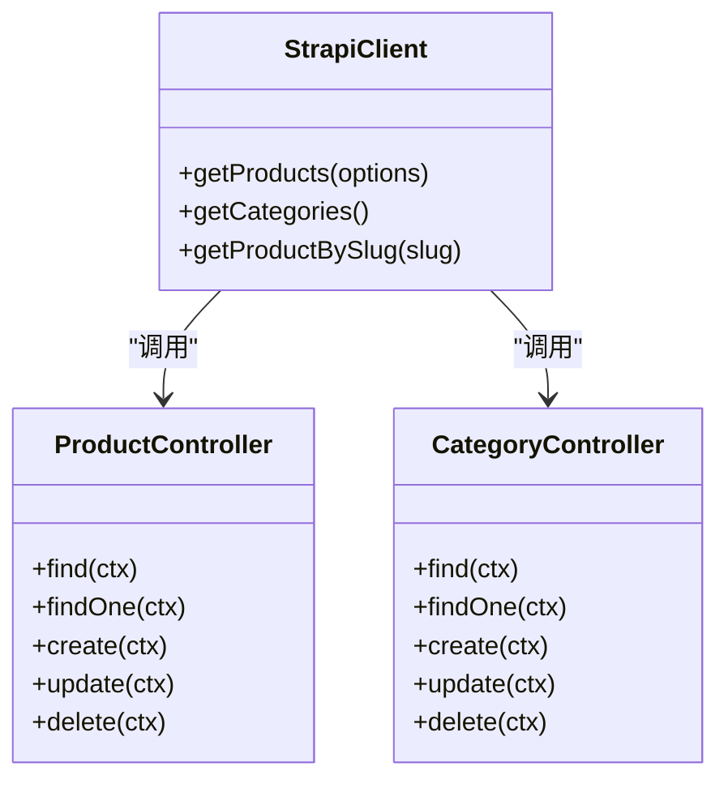
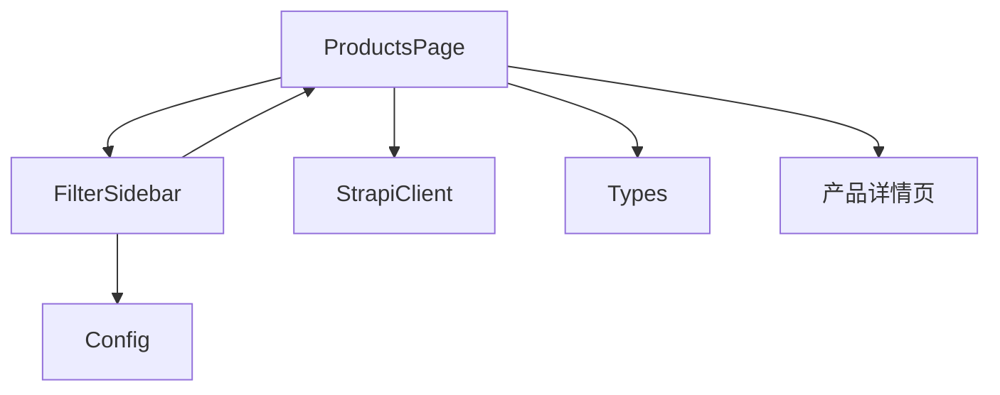

# 参数化搜索功能

<cite>
**本文档引用的文件**
- [frontend/src/app/products/page.tsx](file://frontend/src/app/products/page.tsx)
- [frontend/src/lib/config.ts](file://frontend/src/lib/config.ts)
- [frontend/src/lib/strapi.ts](file://frontend/src/lib/strapi.ts)
- [frontend/src/types/index.ts](file://frontend/src/types/index.ts)
- [cms/src/api/product/controllers/product.ts](file://cms/src/api/product/controllers/product.ts)
- [cms/src/api/category/controllers/category.ts](file://cms/src/api/category/controllers/category.ts)
- [cms/src/api/category/content-types/category/schema.json](file://cms/src/api/category/content-types/category/schema.json)
- [frontend/src/app/products/[category]/[slug]/page.tsx](file://frontend/src/app/products/[category]/[slug]/page.tsx)
</cite>

## 目录
1. [简介](#简介)
2. [项目结构](#项目结构)
3. [核心组件](#核心组件)
4. [架构总览](#架构总览)
5. [详细组件分析](#详细组件分析)
6. [依赖关系分析](#依赖关系分析)
7. [性能考虑](#性能考虑)
8. [故障排除指南](#故障排除指南)
9. [结论](#结论)
10. [附录](#附录)

## 简介
本文件系统性地文档化了参数化搜索功能，涵盖多维度筛选逻辑（电压范围、容量区间、放电率阈值、电池类型与分类）、前端筛选组件状态管理、URL 参数同步机制、实时过滤算法、组合逻辑、性能优化策略、用户体验设计、移动端与桌面端交互差异，以及筛选结果的可视化反馈。同时提供扩展方法与自定义筛选器的实现指南。

## 项目结构
该功能由前端 Next.js 应用与 Strapi CMS 后端共同实现：
- 前端负责筛选 UI、状态管理、URL 同步与本地过滤
- CMS 提供产品与分类数据接口，支持基础筛选能力
- 类型系统统一前后端数据契约

**图表来源**
- [frontend/src/app/products/page.tsx:1-580](file://frontend/src/app/products/page.tsx#L1-L580)
- [frontend/src/lib/config.ts:149-177](file://frontend/src/lib/config.ts#L149-L177)
- [frontend/src/types/index.ts:123-132](file://frontend/src/types/index.ts#L123-L132)
- [frontend/src/lib/strapi.ts:168-234](file://frontend/src/lib/strapi.ts#L168-L234)
- [cms/src/api/product/controllers/product.ts:1-40](file://cms/src/api/product/controllers/product.ts#L1-L40)
- [cms/src/api/category/controllers/category.ts:1-40](file://cms/src/api/category/controllers/category.ts#L1-L40)
- [cms/src/api/category/content-types/category/schema.json:1-21](file://cms/src/api/category/content-types/category/schema.json#L1-L21)

**章节来源**
- [frontend/src/app/products/page.tsx:1-580](file://frontend/src/app/products/page.tsx#L1-L580)
- [frontend/src/lib/config.ts:149-177](file://frontend/src/lib/config.ts#L149-L177)
- [frontend/src/types/index.ts:123-132](file://frontend/src/types/index.ts#L123-L132)
- [frontend/src/lib/strapi.ts:168-234](file://frontend/src/lib/strapi.ts#L168-L234)
- [cms/src/api/product/controllers/product.ts:1-40](file://cms/src/api/product/controllers/product.ts#L1-L40)
- [cms/src/api/category/controllers/category.ts:1-40](file://cms/src/api/category/controllers/category.ts#L1-L40)
- [cms/src/api/category/content-types/category/schema.json:1-21](file://cms/src/api/category/content-types/category/schema.json#L1-L21)

## 核心组件
- 产品列表页 ProductsPage：负责加载数据、解析 URL 过滤参数、维护本地筛选状态、构建过滤函数、渲染结果与空态。
- 筛选侧边栏 ProductFilterSidebar：提供电压、容量、放电率、电池类型与分类的交互控件，并通过回调更新父组件状态。
- 配置模块 filterOptions：集中定义可筛选的电压档位、放电率档位、电池类型枚举与容量上下限等。
- 类型定义 ProductFilters：约束筛选参数的数据结构，确保前后端一致。
- Strapi 客户端 getProducts：封装查询参数生成，支持分类、电压集合、是否精选等基础筛选。
- 产品详情页：展示单个产品的完整规格与文档，便于核对筛选结果。

**章节来源**
- [frontend/src/app/products/page.tsx:41-212](file://frontend/src/app/products/page.tsx#L41-L212)
- [frontend/src/lib/config.ts:149-177](file://frontend/src/lib/config.ts#L149-L177)
- [frontend/src/types/index.ts:123-132](file://frontend/src/types/index.ts#L123-L132)
- [frontend/src/lib/strapi.ts:184-219](file://frontend/src/lib/strapi.ts#L184-L219)
- [frontend/src/app/products/[category]/[slug]/page.tsx:19-73](file://frontend/src/app/products/[category]/[slug]/page.tsx#L19-L73)

## 架构总览
参数化搜索采用“前端本地过滤 + 后端基础筛选”的混合架构：
- 初始数据从 CMS 获取，包含产品与分类信息
- 用户在前端进行多维筛选，URL 同步当前筛选条件
- 前端使用 useMemo 缓存过滤结果，提升交互流畅度
- 当需要更复杂或高性能的后端筛选时，可通过 Strapi 客户端扩展查询参数

**图表来源**
- [frontend/src/app/products/page.tsx:288-401](file://frontend/src/app/products/page.tsx#L288-L401)
- [frontend/src/app/products/page.tsx:362-376](file://frontend/src/app/products/page.tsx#L362-L376)
- [frontend/src/lib/strapi.ts:184-219](file://frontend/src/lib/strapi.ts#L184-L219)

## 详细组件分析

### 多维度筛选逻辑与组合规则
- 电压范围选择：多选框，支持多个电压档位；匹配产品电压字段。
- 容量区间筛选：双输入框（最小值/最大值），闭区间匹配。
- 放电率阈值设置：多选框，支持多个档位；产品放电率需不小于任一选中档位。
- 电池类型过滤：多选框，支持 LiPo/Li-ion/LiFePO4；精确匹配。
- 分类筛选：单选按钮，按分类 slug 匹配。

组合逻辑遵循“AND”关系：任一维度未设置则跳过该条件；所有已设置条件均满足时才保留产品。

**章节来源**
- [frontend/src/app/products/page.tsx:378-401](file://frontend/src/app/products/page.tsx#L378-L401)
- [frontend/src/lib/config.ts:149-177](file://frontend/src/lib/config.ts#L149-L177)
- [frontend/src/types/index.ts:123-132](file://frontend/src/types/index.ts#L123-L132)

### 前端筛选组件状态管理
- 使用 useState 维护 filters 与本地产品/分类数据
- 使用 useEffect 监听 URL 变化，同步 filters
- 使用 useMemo 缓存 filteredProducts，避免重复计算
- 使用 Suspense 提供骨架屏，改善首屏体验

**图表来源**
- [frontend/src/app/products/page.tsx:288-312](file://frontend/src/app/products/page.tsx#L288-L312)
- [frontend/src/app/products/page.tsx:362-401](file://frontend/src/app/products/page.tsx#L362-L401)

**章节来源**
- [frontend/src/app/products/page.tsx:278-401](file://frontend/src/app/products/page.tsx#L278-L401)

### URL 参数同步机制
- 写入：handleFilterChange 将 filters 转换为 URLSearchParams，拼接到 /products
- 读取：组件挂载与 URL 变化时，解析查询参数并更新 filters
- 支持的键：voltage、capacityMin、capacityMax、cRate、cellType、category

**图表来源**
- [frontend/src/app/products/page.tsx:362-376](file://frontend/src/app/products/page.tsx#L362-L376)
- [frontend/src/app/products/page.tsx:302-312](file://frontend/src/app/products/page.tsx#L302-L312)

**章节来源**
- [frontend/src/app/products/page.tsx:288-312](file://frontend/src/app/products/page.tsx#L288-L312)
- [frontend/src/app/products/page.tsx:362-376](file://frontend/src/app/products/page.tsx#L362-L376)

### 实时过滤算法
- 使用数组 includes、some、every 等原语进行集合与阈值判断
- 闭区间容量比较与“至少达到某放电率”的语义
- 通过 useMemo 缓存过滤结果，减少重排成本

**图表来源**
- [frontend/src/app/products/page.tsx:378-401](file://frontend/src/app/products/page.tsx#L378-L401)

**章节来源**
- [frontend/src/app/products/page.tsx:378-401](file://frontend/src/app/products/page.tsx#L378-L401)

### 移动端与桌面端交互模式
- 桌面端：固定侧边栏，点击清空筛选与分类清除按钮即时生效
- 移动端：顶部触发“筛选产品”按钮弹出模态，右侧滑出筛选面板，支持一键关闭与清空

**图表来源**
- [frontend/src/app/products/page.tsx:425-470](file://frontend/src/app/products/page.tsx#L425-L470)
- [frontend/src/app/products/page.tsx:448-470](file://frontend/src/app/products/page.tsx#L448-L470)

**章节来源**
- [frontend/src/app/products/page.tsx:425-470](file://frontend/src/app/products/page.tsx#L425-L470)

### 筛选结果可视化反馈
- 结果头部显示“共 N 件商品”
- 加载状态提供骨架屏
- 无结果时提供“调整筛选/清空筛选”的引导
- 产品卡片展示关键规格与“精选”标识

**章节来源**
- [frontend/src/app/products/page.tsx:474-537](file://frontend/src/app/products/page.tsx#L474-L537)
- [frontend/src/app/products/page.tsx:214-276](file://frontend/src/app/products/page.tsx#L214-L276)

### 后端集成与扩展点
- 产品控制器提供通用查询接口，支持分页、排序与过滤
- 分类控制器提供分类列表与详情
- Strapi 客户端 getProducts 已支持 category、voltage 集合、featured 等筛选，可作为后端筛选的补充或替代方案

**图表来源**
- [cms/src/api/product/controllers/product.ts:1-40](file://cms/src/api/product/controllers/product.ts#L1-L40)
- [cms/src/api/category/controllers/category.ts:1-40](file://cms/src/api/category/controllers/category.ts#L1-L40)
- [frontend/src/lib/strapi.ts:184-219](file://frontend/src/lib/strapi.ts#L184-L219)

**章节来源**
- [cms/src/api/product/controllers/product.ts:1-40](file://cms/src/api/product/controllers/product.ts#L1-L40)
- [cms/src/api/category/controllers/category.ts:1-40](file://cms/src/api/category/controllers/category.ts#L1-L40)
- [frontend/src/lib/strapi.ts:184-219](file://frontend/src/lib/strapi.ts#L184-L219)

## 依赖关系分析
- ProductsPage 依赖：
  - filterOptions（筛选选项）
  - ProductFilters（类型约束）
  - Strapi 客户端（数据获取）
  - 产品详情页（面包屑与导航）
- ProductFilterSidebar 依赖：
  - onFilterChange 回调
  - categories 列表
  - filterOptions（渲染选项）

**图表来源**
- [frontend/src/app/products/page.tsx:41-212](file://frontend/src/app/products/page.tsx#L41-L212)
- [frontend/src/lib/config.ts:149-177](file://frontend/src/lib/config.ts#L149-L177)
- [frontend/src/types/index.ts:123-132](file://frontend/src/types/index.ts#L123-L132)
- [frontend/src/app/products/[category]/[slug]/page.tsx:224-231](file://frontend/src/app/products/[category]/[slug]/page.tsx#L224-L231)

**章节来源**
- [frontend/src/app/products/page.tsx:41-212](file://frontend/src/app/products/page.tsx#L41-L212)
- [frontend/src/lib/config.ts:149-177](file://frontend/src/lib/config.ts#L149-L177)
- [frontend/src/types/index.ts:123-132](file://frontend/src/types/index.ts#L123-L132)
- [frontend/src/app/products/[category]/[slug]/page.tsx:224-231](file://frontend/src/app/products/[category]/[slug]/page.tsx#L224-L231)

## 性能考虑
- 使用 useMemo 缓存过滤结果，避免每次渲染都重新计算
- 使用 Suspense 骨架屏，缩短感知等待时间
- URL 同步采用 push + scroll: false，避免页面滚动抖动
- 分类数据失败时回退到配置中的静态分类，保证可用性
- 合理的容量区间默认值与步长，减少无效输入带来的重算

[本节为通用性能建议，无需特定文件引用]

## 故障排除指南
- 无法加载产品：检查 NEXT_PUBLIC_STRAPI_URL 环境变量与网络连通性；确认 CMS 产品接口返回格式
- 分类为空：确认分类接口可用，若失败将回退到配置中的分类列表
- 筛选无结果：检查 URL 中的筛选参数是否合理；尝试清空筛选
- 过滤卡顿：确认 useMemo 是否正确缓存；避免在过滤函数中执行昂贵操作

**章节来源**
- [frontend/src/app/products/page.tsx:314-360](file://frontend/src/app/products/page.tsx#L314-L360)
- [frontend/src/lib/strapi.ts:184-219](file://frontend/src/lib/strapi.ts#L184-L219)

## 结论
该参数化搜索功能以简洁的前端本地过滤为核心，结合清晰的 URL 同步与移动端适配，提供了良好的用户体验。通过类型约束与配置化选项，系统具备良好的可维护性与扩展性。对于更大规模数据或更复杂的筛选需求，可利用 Strapi 客户端扩展后端筛选能力。

[本节为总结性内容，无需特定文件引用]

## 附录

### 自定义筛选器实现指南
- 新增筛选维度
  - 在 filterOptions 中添加新的选项集
  - 在 ProductFilters 类型中增加对应字段
  - 在 ProductFilterSidebar 中新增 UI 控件
  - 在过滤函数中加入相应判断逻辑
- 扩展后端筛选
  - 在 Strapi 客户端 getProducts 中构造 filters 对象
  - 在产品控制器中确保实体字段可被正确过滤
- 移动端适配
  - 确保筛选面板在移动端可完整展示与交互
  - 提供一键清空与分类清除按钮

**章节来源**
- [frontend/src/lib/config.ts:149-177](file://frontend/src/lib/config.ts#L149-L177)
- [frontend/src/types/index.ts:123-132](file://frontend/src/types/index.ts#L123-L132)
- [frontend/src/app/products/page.tsx:41-212](file://frontend/src/app/products/page.tsx#L41-L212)
- [frontend/src/lib/strapi.ts:184-219](file://frontend/src/lib/strapi.ts#L184-L219)