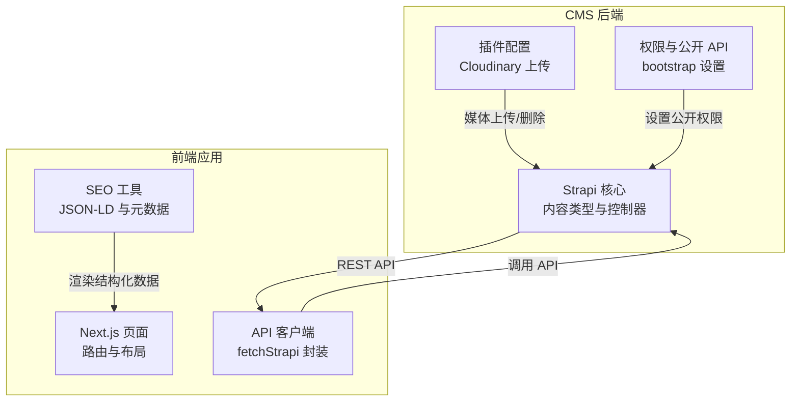
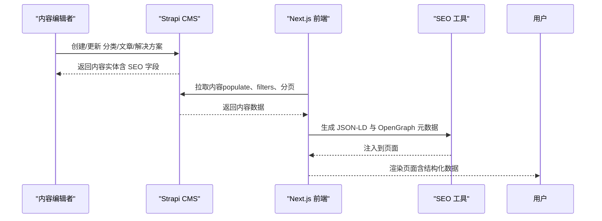
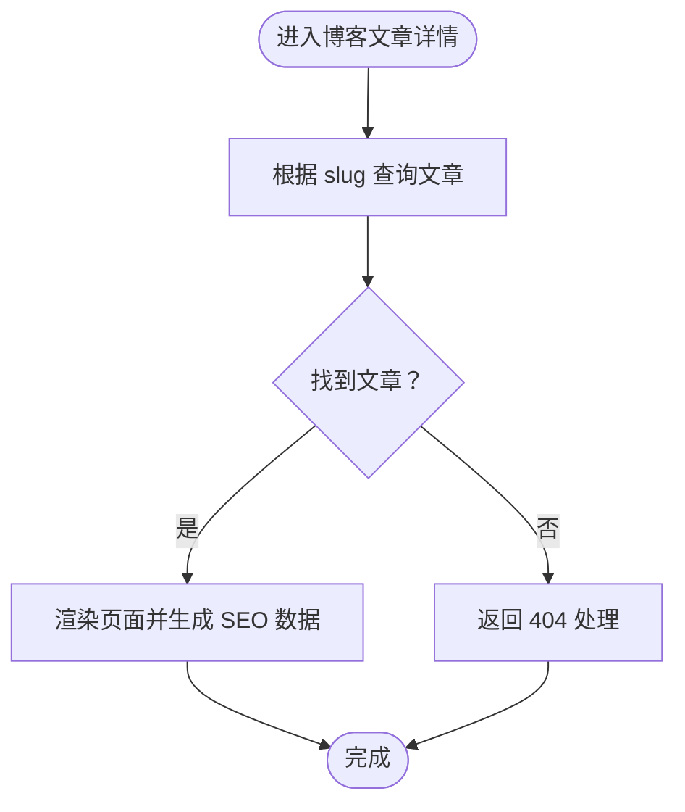
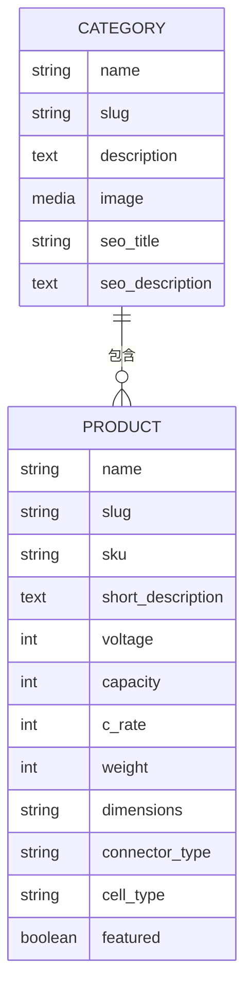
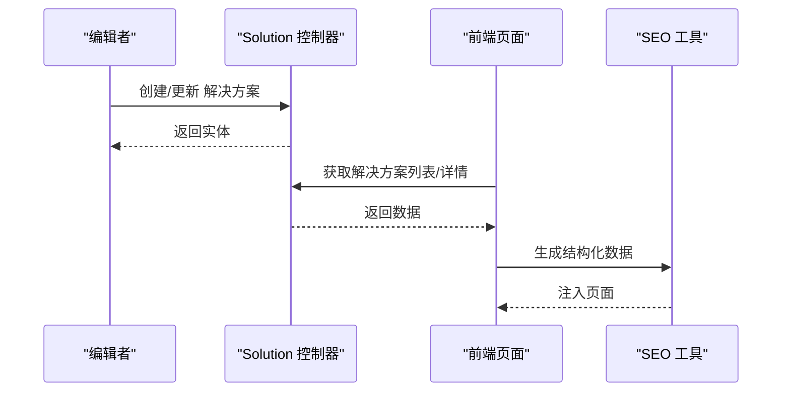
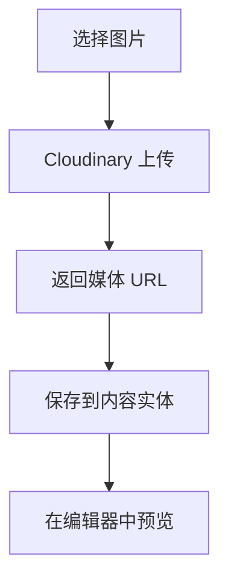
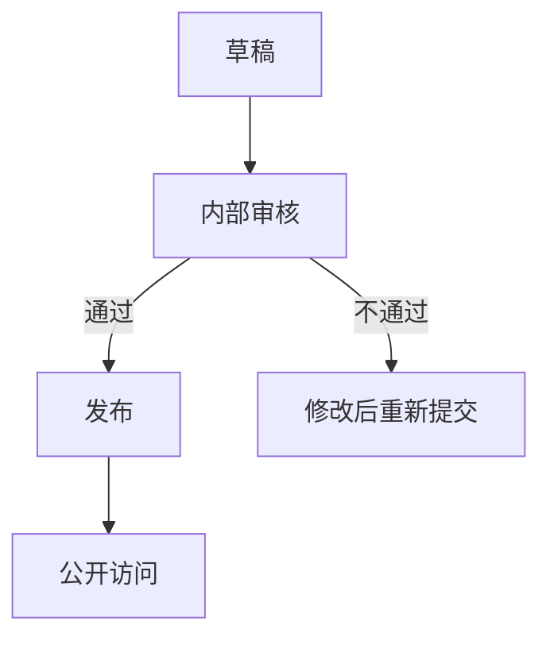
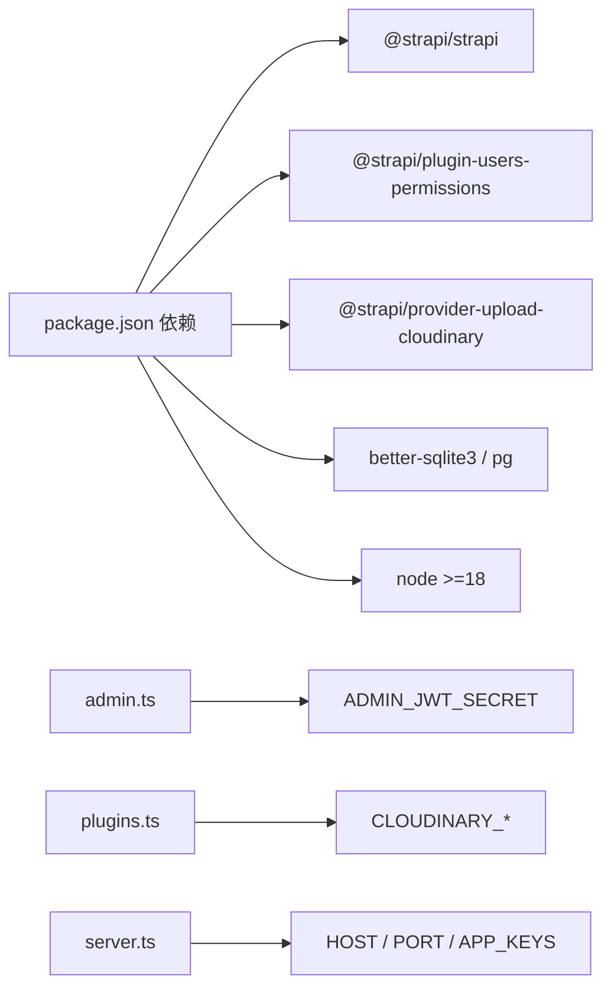

# 内容管理系统

<cite>
**本文引用的文件**
- [cms/src/index.ts](file://cms/src/index.ts)
- [cms/package.json](file://cms/package.json)
- [cms/config/admin.ts](file://cms/config/admin.ts)
- [cms/config/plugins.ts](file://cms/config/plugins.ts)
- [cms/config/server.ts](file://cms/config/server.ts)
- [cms/src/api/blog-post/content-types/blog-post/schema.json](file://cms/src/api/blog-post/content-types/blog-post/schema.json)
- [cms/src/api/category/content-types/category/schema.json](file://cms/src/api/category/content-types/category/schema.json)
- [cms/src/api/blog-post/controllers/blog-post.ts](file://cms/src/api/blog-post/controllers/blog-post.ts)
- [cms/src/api/category/controllers/category.ts](file://cms/src/api/category/controllers/category.ts)
- [cms/src/api/solution/controllers/solution.ts](file://cms/src/api/solution/controllers/solution.ts)
- [cms/scripts/seed-blog-data.js](file://cms/scripts/seed-blog-data.js)
- [frontend/src/lib/strapi.ts](file://frontend/src/lib/strapi.ts)
- [frontend/src/lib/seo.ts](file://frontend/src/lib/seo.ts)
- [frontend/src/app/robots.ts](file://frontend/src/app/robots.ts)
- [frontend/src/app/sitemap.ts](file://frontend/src/app/sitemap.ts)
</cite>

## 目录
1. [简介](#简介)
2. [项目结构](#项目结构)
3. [核心组件](#核心组件)
4. [架构总览](#架构总览)
5. [详细组件分析](#详细组件分析)
6. [依赖关系分析](#依赖关系分析)
7. [性能与缓存策略](#性能与缓存策略)
8. [故障排查指南](#故障排查指南)
9. [结论](#结论)
10. [附录](#附录)

## 简介
本文件为 Battivus 项目的内容管理系统（CMS）文档，聚焦于博客文章管理、分类组织与 SEO 优化，以及解决方案页面的内容管理流程。系统采用 Strapi 作为 Headless CMS，前端使用 Next.js 构建静态与动态页面，结合 Cloudinary 媒体上传与 JSON-LD 结构化数据，实现内容发布、多语言 SEO 友好展示与高性能访问。

## 项目结构
- CMS 层：基于 Strapi v5 的后端，提供内容类型定义、控制器、服务与权限配置；内置种子脚本与开发工具。
- 前端层：Next.js 应用，负责页面渲染、SEO 元数据生成、站点地图与爬虫规则、API 客户端封装。
- 配置层：服务器、插件（Cloudinary）、管理员安全等配置。

图表来源
- [cms/src/index.ts:161-217](file://cms/src/index.ts#L161-L217)
- [cms/config/plugins.ts:1-19](file://cms/config/plugins.ts#L1-19)
- [frontend/src/lib/strapi.ts:51-164](file://frontend/src/lib/strapi.ts#L51-L164)
- [frontend/src/lib/seo.ts:168-225](file://frontend/src/lib/seo.ts#L168-L225)

章节来源
- [cms/src/index.ts:149-217](file://cms/src/index.ts#L149-L217)
- [cms/config/plugins.ts:1-19](file://cms/config/plugins.ts#L1-19)
- [frontend/src/lib/strapi.ts:51-164](file://frontend/src/lib/strapi.ts#L51-L164)

## 核心组件
- 博客文章（Blog Post）
  - 内容类型：标题、UID 别名、摘要、富文本内容、特色图、作者、标签、SEO 标题与描述。
  - 控制器：支持按 ID 或 slug 查询单条记录，标准的 CRUD。
- 分类（Category）
  - 内容类型：名称、唯一 UID、描述、图片、SEO 标题与描述。
  - 控制器：标准 CRUD。
- 解决方案（Solution）
  - 控制器：标准 CRUD，用于解决方案页面的内容管理。
- 前端 API 客户端
  - 统一封装查询参数（populate、filters、sort、分页），统一处理响应与错误，集成 revalidate 缓存策略。
- SEO 工具
  - 生成 JSON-LD（产品、文章、网站、面包屑、组织、FAQ），以及 Next.js Metadata 对象。
- 爬虫与站点地图
  - robots.txt 规则与 sitemap 动态生成。

章节来源
- [cms/src/api/blog-post/content-types/blog-post/schema.json:1-24](file://cms/src/api/blog-post/content-types/blog-post/schema.json#L1-L24)
- [cms/src/api/category/content-types/category/schema.json:1-21](file://cms/src/api/category/content-types/category/schema.json#L1-L21)
- [cms/src/api/blog-post/controllers/blog-post.ts:1-53](file://cms/src/api/blog-post/controllers/blog-post.ts#L1-L53)
- [cms/src/api/category/controllers/category.ts:1-40](file://cms/src/api/category/controllers/category.ts#L1-L40)
- [cms/src/api/solution/controllers/solution.ts:1-40](file://cms/src/api/solution/controllers/solution.ts#L1-L40)
- [frontend/src/lib/strapi.ts:51-164](file://frontend/src/lib/strapi.ts#L51-L164)
- [frontend/src/lib/seo.ts:168-225](file://frontend/src/lib/seo.ts#L168-L225)
- [frontend/src/app/robots.ts:1-14](file://frontend/src/app/robots.ts#L1-L14)
- [frontend/src/app/sitemap.ts:1-50](file://frontend/src/app/sitemap.ts#L1-L50)

## 架构总览
系统采用“Headless CMS + 前端渲染”的架构。CMS 负责内容创作、媒体与 SEO 字段维护；前端通过 API 客户端拉取内容，渲染页面并生成结构化数据与 SEO 元信息。

图表来源
- [cms/src/api/blog-post/controllers/blog-post.ts:1-53](file://cms/src/api/blog-post/controllers/blog-post.ts#L1-L53)
- [cms/src/api/category/controllers/category.ts:1-40](file://cms/src/api/category/controllers/category.ts#L1-L40)
- [cms/src/api/solution/controllers/solution.ts:1-40](file://cms/src/api/solution/controllers/solution.ts#L1-L40)
- [frontend/src/lib/strapi.ts:51-164](file://frontend/src/lib/strapi.ts#L51-L164)
- [frontend/src/lib/seo.ts:168-225](file://frontend/src/lib/seo.ts#L168-L225)

## 详细组件分析

### 博客文章管理
- 数据模型
  - 关键字段：标题、别名、摘要、富文本、特色图、作者、标签、SEO 标题与描述。
  - 发布状态：启用草稿/发布能力。
- 控制器逻辑
  - 支持按数字 ID 或 slug 查询单条记录；其余为标准 CRUD。
- 种子数据
  - 提供多篇与无人机电池相关的技术文章，覆盖电池化学、寿命管理、半固态电池、冷天气操作、规格解读、农业应用等主题。
- SEO 集成
  - 文章详情页可注入 Article 类型 JSON-LD 与 OpenGraph 元数据。

图表来源
- [cms/src/api/blog-post/controllers/blog-post.ts:11-30](file://cms/src/api/blog-post/controllers/blog-post.ts#L11-L30)
- [frontend/src/lib/seo.ts:115-142](file://frontend/src/lib/seo.ts#L115-L142)

章节来源
- [cms/src/api/blog-post/content-types/blog-post/schema.json:1-24](file://cms/src/api/blog-post/content-types/blog-post/schema.json#L1-L24)
- [cms/src/api/blog-post/controllers/blog-post.ts:1-53](file://cms/src/api/blog-post/controllers/blog-post.ts#L1-L53)
- [cms/scripts/seed-blog-data.js:1-444](file://cms/scripts/seed-blog-data.js#L1-L444)
- [frontend/src/lib/seo.ts:115-142](file://frontend/src/lib/seo.ts#L115-L142)

### 分类系统与多层级组织
- 数据模型
  - 名称、唯一别名、描述、图片、SEO 标题与描述。
  - 发布状态：启用草稿/发布能力。
- 关联机制
  - 产品与分类为一对多关系，通过 Strapi 文档 ID 进行关联。
- 前端使用
  - 通过 populate 获取分类详情，支持按 slug 查询单个分类。
- 种子数据
  - 包含 FPV、农业、VTOL、工业四大类目及其 SEO 标题与描述，确保前端导航与 SEO 一致。

图表来源
- [cms/src/api/category/content-types/category/schema.json:1-21](file://cms/src/api/category/content-types/category/schema.json#L1-L21)
- [cms/src/index.ts:267-311](file://cms/src/index.ts#L267-L311)

章节来源
- [cms/src/api/category/content-types/category/schema.json:1-21](file://cms/src/api/category/content-types/category/schema.json#L1-L21)
- [cms/src/api/category/controllers/category.ts:1-40](file://cms/src/api/category/controllers/category.ts#L1-L40)
- [cms/src/index.ts:267-311](file://cms/src/index.ts#L267-L311)

### 解决方案页面内容管理
- 控制器
  - 提供标准的列表、详情、创建、更新、删除接口。
- 前端使用
  - 通过 API 客户端获取解决方案列表与详情，渲染解决方案页面。
- 结构化数据
  - 可结合 SEO 工具生成对应页面的 JSON-LD（如 WebSite、Article 等，视页面类型而定）。

图表来源
- [cms/src/api/solution/controllers/solution.ts:1-40](file://cms/src/api/solution/controllers/solution.ts#L1-L40)
- [frontend/src/lib/strapi.ts:276-288](file://frontend/src/lib/strapi.ts#L276-L288)
- [frontend/src/lib/seo.ts:144-161](file://frontend/src/lib/seo.ts#L144-L161)

章节来源
- [cms/src/api/solution/controllers/solution.ts:1-40](file://cms/src/api/solution/controllers/solution.ts#L1-L40)
- [frontend/src/lib/strapi.ts:276-288](file://frontend/src/lib/strapi.ts#L276-L288)

### 内容编辑器与媒体管理
- 编辑器
  - 使用 Strapi 富文本字段（richtext）存储文章内容。
- 媒体上传
  - 插件配置使用 Cloudinary，支持上传与删除操作。
- 前端媒体处理
  - API 客户端提供媒体 URL 处理函数，自动拼接完整 URL。

图表来源
- [cms/config/plugins.ts:1-19](file://cms/config/plugins.ts#L1-19)
- [frontend/src/lib/strapi.ts:11-23](file://frontend/src/lib/strapi.ts#L11-L23)

章节来源
- [cms/config/plugins.ts:1-19](file://cms/config/plugins.ts#L1-19)
- [frontend/src/lib/strapi.ts:11-23](file://frontend/src/lib/strapi.ts#L11-L23)

### 内容发布流程与审核机制
- 发布状态
  - 分类与博客文章启用草稿/发布能力，可在后台切换发布状态。
- 公开 API 权限
  - 在启动时为“公共角色”批量授予分类、产品、博客、解决方案的读取权限，允许公开访问。
- 审核建议
  - 建议在 CMS 中增加审核工作流（如审批状态字段与审批流程），以满足更严格的发布控制需求。

图表来源
- [cms/src/api/blog-post/content-types/blog-post/schema.json:9-11](file://cms/src/api/blog-post/content-types/blog-post/schema.json#L9-L11)
- [cms/src/api/category/content-types/category/schema.json:9-11](file://cms/src/api/category/content-types/category/schema.json#L9-L11)
- [cms/src/index.ts:172-210](file://cms/src/index.ts#L172-L210)

章节来源
- [cms/src/api/blog-post/content-types/blog-post/schema.json:9-11](file://cms/src/api/blog-post/content-types/blog-post/schema.json#L9-L11)
- [cms/src/api/category/content-types/category/schema.json:9-11](file://cms/src/api/category/content-types/category/schema.json#L9-L11)
- [cms/src/index.ts:172-210](file://cms/src/index.ts#L172-L210)

### 多语言支持策略
- 当前实现
  - 组织 Schema 中声明可用语言为英语与中文。
- 建议
  - 在 CMS 中为内容类型添加多语言字段与本地化界面，前端按浏览器语言或路由参数切换语言，确保 SEO 标题、描述与内容同步本地化。

章节来源
- [frontend/src/lib/seo.ts:84](file://frontend/src/lib/seo.ts#L84)

## 依赖关系分析
- CMS 依赖
  - Strapi 核心、Users & Permissions 插件、Cloudinary 上传提供程序、数据库驱动（better-sqlite3/pg）。
- 前端依赖
  - Next.js、React、styled-components、TypeScript。
- 配置依赖
  - 管理员 JWT 密钥、API Token、Cloudinary 凭证、服务器主机与端口。

图表来源
- [cms/package.json:14-24](file://cms/package.json#L14-L24)
- [cms/config/admin.ts:1-21](file://cms/config/admin.ts#L1-L21)
- [cms/config/plugins.ts:1-19](file://cms/config/plugins.ts#L1-19)
- [cms/config/server.ts:1-11](file://cms/config/server.ts#L1-L11)

章节来源
- [cms/package.json:14-24](file://cms/package.json#L14-L24)
- [cms/config/admin.ts:1-21](file://cms/config/admin.ts#L1-L21)
- [cms/config/plugins.ts:1-19](file://cms/config/plugins.ts#L1-19)
- [cms/config/server.ts:1-11](file://cms/config/server.ts#L1-L11)

## 性能与缓存策略
- 前端缓存
  - API 请求默认 revalidate 60 秒，平衡新鲜度与性能。
- 站点地图与爬虫
  - robots.txt 允许爬虫抓取，排除 /api 与 /admin；sitemap 动态生成静态页面与类别页。
- 媒体优化
  - 使用 Cloudinary 进行云端上传与缩放裁剪，减少前端加载压力。
- SEO 最佳实践
  - 为每篇文章与产品生成 JSON-LD，设置 OpenGraph 与 Twitter Card，提供 canonical 链接与 noindex 控制。

章节来源
- [frontend/src/lib/strapi.ts:111](file://frontend/src/lib/strapi.ts#L111)
- [frontend/src/app/robots.ts:4-13](file://frontend/src/app/robots.ts#L4-L13)
- [frontend/src/app/sitemap.ts:4-48](file://frontend/src/app/sitemap.ts#L4-L48)
- [frontend/src/lib/seo.ts:168-225](file://frontend/src/lib/seo.ts#L168-L225)

## 故障排查指南
- API 访问失败
  - 检查 Strapi URL 与 API Token 是否正确配置；确认公开权限已授予。
- 媒体无法显示
  - 确认 Cloudinary 配置正确且网络可达；检查返回的媒体 URL 是否拼接完整。
- 内容未更新
  - 确认内容已发布（草稿/发布）；检查前端 revalidate 配置是否过短导致缓存命中。
- 爬虫抓取异常
  - 检查 robots.txt 规则与 sitemap 地址；确认生产环境域名正确。

章节来源
- [frontend/src/lib/strapi.ts:8-9](file://frontend/src/lib/strapi.ts#L8-L9)
- [frontend/src/lib/strapi.ts:101-118](file://frontend/src/lib/strapi.ts#L101-L118)
- [frontend/src/app/robots.ts:4-13](file://frontend/src/app/robots.ts#L4-L13)
- [frontend/src/app/sitemap.ts:4-48](file://frontend/src/app/sitemap.ts#L4-L48)

## 结论
本系统通过 Strapi 实现内容创作与管理，结合前端的 SEO 工具链与缓存策略，提供了从内容发布、分类组织到 SEO 优化与性能优化的完整方案。建议后续引入多语言本地化与更完善的审核流程，以进一步提升内容治理质量与用户体验。

## 附录
- 开发与构建
  - 开发模式：npm run develop
  - 构建：npm run build
  - Schema 复制：npm run copy-schemas
- 种子数据
  - 分类与产品：由 bootstrap 自动执行
  - 博客文章：提供独立脚本进行批量导入

章节来源
- [cms/package.json:6-12](file://cms/package.json#L6-L12)
- [cms/src/index.ts:214-314](file://cms/src/index.ts#L214-L314)
- [cms/scripts/seed-blog-data.js:428-444](file://cms/scripts/seed-blog-data.js#L428-L444)