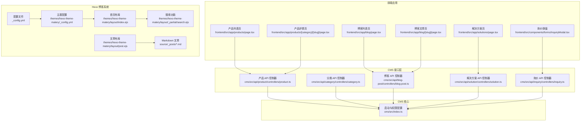
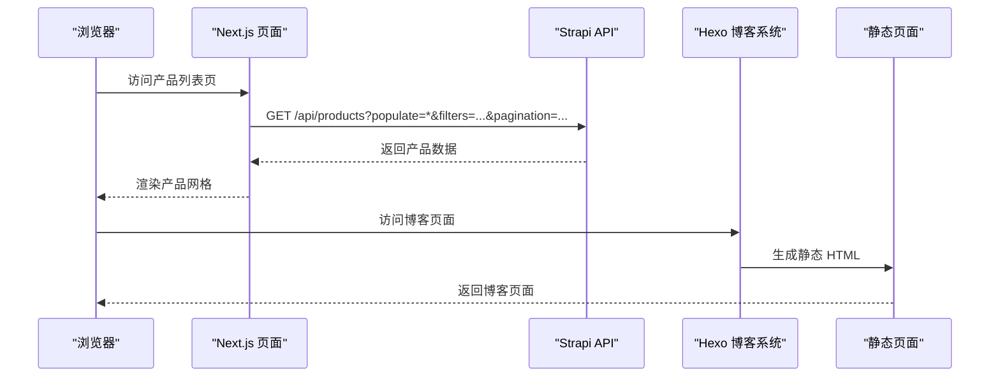
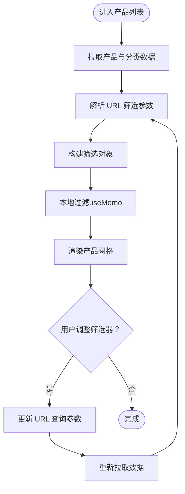
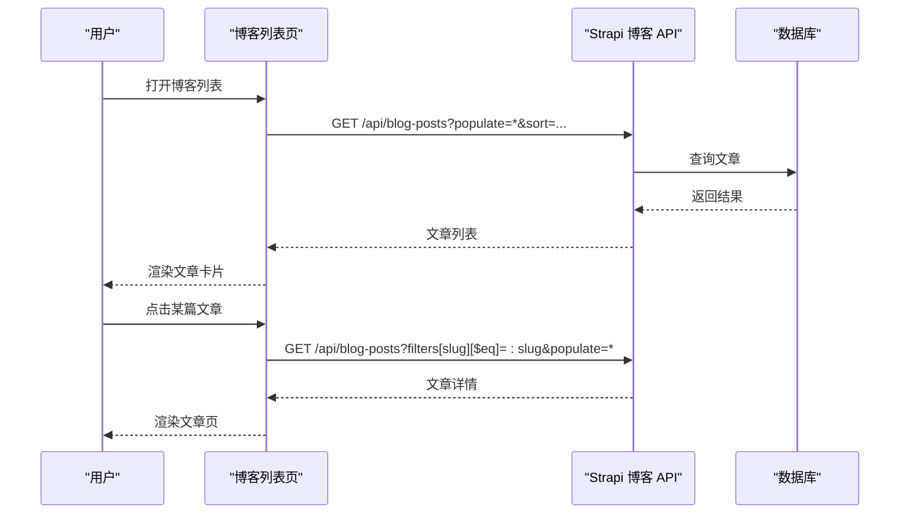
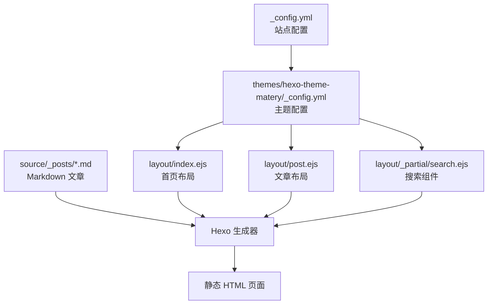
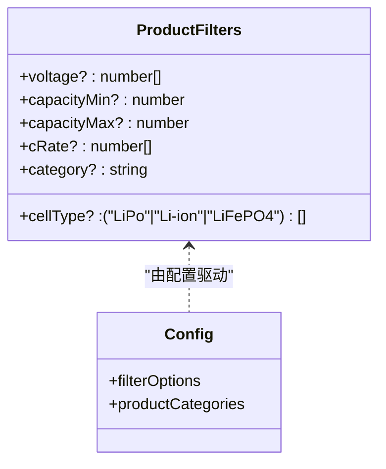
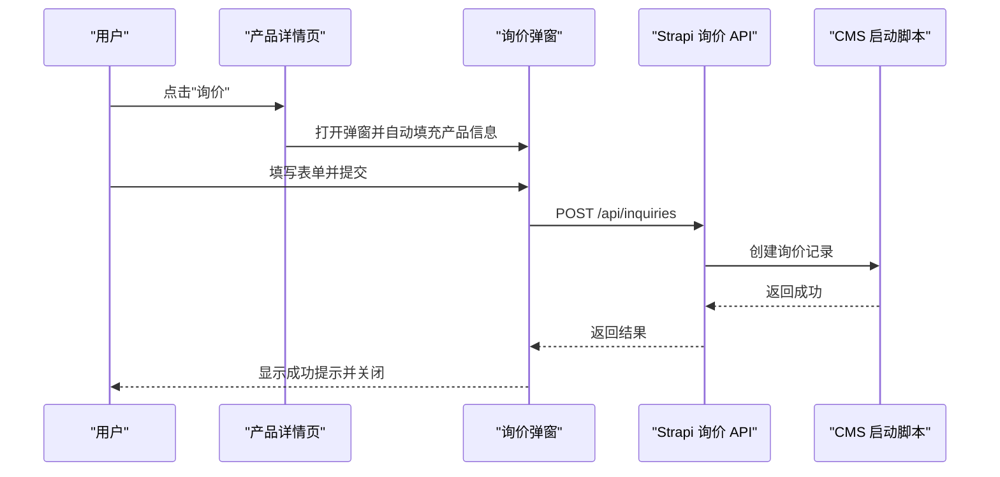
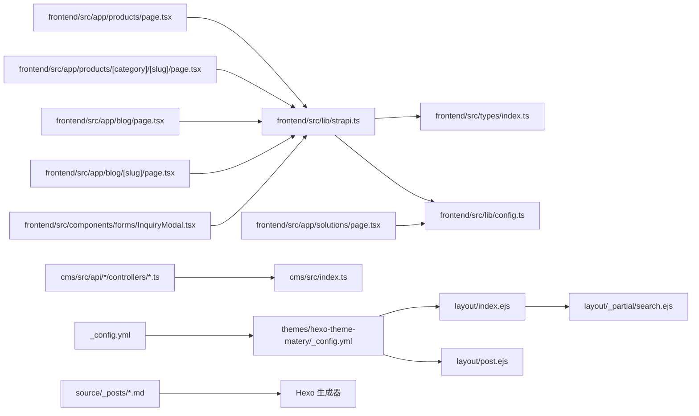

# 核心功能模块

<cite>
**本文引用的文件**
- [cms/src/index.ts](file://cms/src/index.ts)
- [cms/src/api/product/controllers/product.ts](file://cms/src/api/product/controllers/product.ts)
- [cms/src/api/category/controllers/category.ts](file://cms/src/api/category/controllers/category.ts)
- [cms/src/api/blog-post/controllers/blog-post.ts](file://cms/src/api/blog-post/controllers/blog-post.ts)
- [cms/src/api/solution/controllers/solution.ts](file://cms/src/api/solution/controllers/solution.ts)
- [cms/src/api/inquiry/controllers/inquiry.ts](file://cms/src/api/inquiry/controllers/inquiry.ts)
- [frontend/src/lib/strapi.ts](file://frontend/src/lib/strapi.ts)
- [frontend/src/lib/config.ts](file://frontend/src/lib/config.ts)
- [frontend/src/types/index.ts](file://frontend/src/types/index.ts)
- [frontend/src/app/products/page.tsx](file://frontend/src/app/products/page.tsx)
- [frontend/src/app/products/[category]/[slug]/page.tsx](file://frontend/src/app/products/[category]/[slug]/page.tsx)
- [frontend/src/app/blog/page.tsx](file://frontend/src/app/blog/page.tsx)
- [frontend/src/app/blog/[slug]/page.tsx](file://frontend/src/app/blog/[slug]/page.tsx)
- [frontend/src/app/solutions/page.tsx](file://frontend/src/app/solutions/page.tsx)
- [frontend/src/components/forms/InquiryModal.tsx](file://frontend/src/components/forms/InquiryModal.tsx)
- [_config.yml](file://_config.yml)
- [themes/hexo-theme-matery/_config.yml](file://themes/hexo-theme-matery/_config.yml)
- [themes/hexo-theme-matery/layout/index.ejs](file://themes/hexo-theme-matery/layout/index.ejs)
- [themes/hexo-theme-matery/layout/post.ejs](file://themes/hexo-theme-matery/layout/post.ejs)
- [themes/hexo-theme-matery/layout/_partial/search.ejs](file://themes/hexo-theme-matery/layout/_partial/search.ejs)
- [themes/hexo-theme-matery/layout/_partial/header.ejs](file://themes/hexo-theme-matery/layout/_partial/header.ejs)
- [themes/hexo-theme-matery/languages/zh-CN.yml](file://themes/hexo-theme-matery/languages/zh-CN.yml)
- [source/_posts/AI基础概念.md](file://source/_posts/AI基础概念.md)
- [package.json](file://package.json)
</cite>

## 更新摘要
**所做更改**
- 新增 Hexo 博客系统作为核心功能模块的详细文档
- 添加主题配置、布局模板和搜索功能的技术实现说明
- 更新项目结构图以包含 Hexo 博客系统
- 增强内容管理功能的架构描述，涵盖静态博客与动态 CMS 的双重模式

## 目录
1. [简介](#简介)
2. [项目结构](#项目结构)
3. [核心组件](#核心组件)
4. [架构总览](#架构总览)
5. [详细组件分析](#详细组件分析)
6. [依赖分析](#依赖分析)
7. [性能考虑](#性能考虑)
8. [故障排查指南](#故障排查指南)
9. [结论](#结论)
10. [附录](#附录)

## 简介
本文件面向 Battivus 项目的完整功能模块，围绕产品管理系统、内容管理功能、用户交互系统与询价处理系统进行深入解析。重点覆盖以下方面：
- 参数化搜索的前端筛选逻辑、URL 参数同步与实时过滤机制
- 询价表单的自动填充机制、数据流转与提交流程
- 产品展示、分类导航、博客系统与解决方案页面的实现模式
- **新增** Hexo 静态博客系统的技术架构与实现细节
- 各模块之间的关系与集成方式，帮助开发者快速理解系统运作机制

## 项目结构
项目采用混合架构，结合前后端分离与静态博客系统：
- 前端（Next.js 应用）：负责产品管理、用户交互与动态内容展示
- CMS（Strapi）：提供产品与内容数据的动态管理接口
- **新增** Hexo 博客系统：基于 Markdown 的静态博客生成与部署
- 主题系统：hexo-theme-matery 提供 Material Design 风格的博客主题

**图表来源**
- [frontend/src/app/products/page.tsx:1-580](file://frontend/src/app/products/page.tsx#L1-L580)
- [frontend/src/app/products/[category]/[slug]/page.tsx](file://frontend/src/app/products/[category]/[slug]/page.tsx#L1-L566)
- [frontend/src/app/blog/page.tsx:1-203](file://frontend/src/app/blog/page.tsx#L1-L203)
- [frontend/src/app/blog/[slug]/page.tsx](file://frontend/src/app/blog/[slug]/page.tsx#L1-L290)
- [frontend/src/app/solutions/page.tsx:1-274](file://frontend/src/app/solutions/page.tsx#L1-L274)
- [frontend/src/components/forms/InquiryModal.tsx:1-370](file://frontend/src/components/forms/InquiryModal.tsx#L1-L370)
- [cms/src/api/product/controllers/product.ts:1-40](file://cms/src/api/product/controllers/product.ts#L1-L40)
- [cms/src/api/category/controllers/category.ts:1-40](file://cms/src/api/category/controllers/category.ts#L1-L40)
- [cms/src/api/blog-post/controllers/blog-post.ts:1-53](file://cms/src/api/blog-post/controllers/blog-post.ts#L1-L53)
- [cms/src/api/solution/controllers/solution.ts:1-40](file://cms/src/api/solution/controllers/solution.ts#L1-L40)
- [cms/src/api/inquiry/controllers/inquiry.ts:1-40](file://cms/src/api/inquiry/controllers/inquiry.ts#L1-L40)
- [cms/src/index.ts:1-315](file://cms/src/index.ts#L1-L315)
- [_config.yml:1-112](file://_config.yml#L1-L112)
- [themes/hexo-theme-matery/_config.yml:1-634](file://themes/hexo-theme-matery/_config.yml#L1-L634)
- [themes/hexo-theme-matery/layout/index.ejs:1-132](file://themes/hexo-theme-matery/layout/index.ejs#L1-L132)
- [themes/hexo-theme-matery/layout/post.ejs:1-41](file://themes/hexo-theme-matery/layout/post.ejs#L1-L41)
- [themes/hexo-theme-matery/layout/_partial/search.ejs:1-104](file://themes/hexo-theme-matery/layout/_partial/search.ejs#L1-L104)

**章节来源**
- [cms/src/index.ts:1-315](file://cms/src/index.ts#L1-L315)
- [frontend/src/lib/strapi.ts:1-412](file://frontend/src/lib/strapi.ts#L1-L412)
- [_config.yml:1-112](file://_config.yml#L1-L112)
- [themes/hexo-theme-matery/_config.yml:1-634](file://themes/hexo-theme-matery/_config.yml#L1-L634)

## 核心组件
本节概述五大核心模块及其职责：
- 产品管理系统：提供产品数据查询、参数化筛选、详情页展示与 SEO 支持
- 内容管理系统：博客与解决方案内容的增删改查与路由生成
- 用户交互系统：参数化搜索的前端筛选、URL 同步与实时过滤
- 询价处理系统：表单自动填充、数据提交与反馈提示
- **新增** Hexo 博客系统：基于 Markdown 的静态博客生成、主题渲染与搜索功能

**章节来源**
- [frontend/src/app/products/page.tsx:1-580](file://frontend/src/app/products/page.tsx#L1-L580)
- [frontend/src/app/products/[category]/[slug]/page.tsx](file://frontend/src/app/products/[category]/[slug]/page.tsx#L1-L566)
- [frontend/src/app/blog/page.tsx:1-203](file://frontend/src/app/blog/page.tsx#L1-L203)
- [frontend/src/app/blog/[slug]/page.tsx](file://frontend/src/app/blog/[slug]/page.tsx#L1-L290)
- [frontend/src/app/solutions/page.tsx:1-274](file://frontend/src/app/solutions/page.tsx#L1-L274)
- [frontend/src/components/forms/InquiryModal.tsx:1-370](file://frontend/src/components/forms/InquiryModal.tsx#L1-L370)
- [_config.yml:1-112](file://_config.yml#L1-L112)
- [themes/hexo-theme-matery/_config.yml:1-634](file://themes/hexo-theme-matery/_config.yml#L1-L634)

## 架构总览
系统通过多种技术栈实现内容管理的灵活性：
- **动态内容**：Strapi 提供统一的数据访问层，前端通过封装的 API 客户端与之通信
- **静态博客**：Hexo 基于 Markdown 文件生成静态页面，支持主题定制与搜索功能
- **混合模式**：产品与动态内容通过 API 访问，博客内容通过静态生成

**图表来源**
- [frontend/src/lib/strapi.ts:51-119](file://frontend/src/lib/strapi.ts#L51-L119)
- [frontend/src/app/products/page.tsx:362-376](file://frontend/src/app/products/page.tsx#L362-L376)
- [_config.yml:95-99](file://_config.yml#L95-L99)

**章节来源**
- [frontend/src/lib/strapi.ts:1-412](file://frontend/src/lib/strapi.ts#L1-L412)
- [frontend/src/app/products/page.tsx:1-580](file://frontend/src/app/products/page.tsx#L1-L580)
- [_config.yml:1-112](file://_config.yml#L1-L112)

## 详细组件分析

### 产品管理系统
- 参数化搜索与筛选
  - 前端在 URL 中维护筛选参数（电压、容量范围、放电率、电池类型、分类），通过 useSearchParams 读取初始值，并在筛选变更时同步到 URL
  - 使用 useMemo 对产品进行本地过滤，确保实时响应与性能平衡
- 产品详情页
  - 从 Strapi 获取产品详情，支持 populate 关系字段（如 category）
  - 生成结构化数据（JSON-LD）与面包屑导航，提升 SEO
- 分类导航
  - 配置中定义产品分类，前端导航与筛选联动，保持一致性

**图表来源**
- [frontend/src/app/products/page.tsx:278-401](file://frontend/src/app/products/page.tsx#L278-L401)
- [frontend/src/lib/config.ts:118-177](file://frontend/src/lib/config.ts#L118-L177)

**章节来源**
- [frontend/src/app/products/page.tsx:1-580](file://frontend/src/app/products/page.tsx#L1-L580)
- [frontend/src/lib/config.ts:1-177](file://frontend/src/lib/config.ts#L1-L177)

### 内容管理功能（博客与解决方案）
- 博客系统
  - 列表页：按分页与排序返回文章，支持标签筛选
  - 文章页：根据 slug 获取文章详情，生成 OpenGraph 与 Canonical 链接
- 解决方案页面
  - 展示行业场景、痛点与解决方案，提供"定制报价"入口

**图表来源**
- [frontend/src/app/blog/page.tsx:10-22](file://frontend/src/app/blog/page.tsx#L10-L22)
- [frontend/src/app/blog/[slug]/page.tsx](file://frontend/src/app/blog/[slug]/page.tsx#L9-L30)
- [cms/src/api/blog-post/controllers/blog-post.ts:1-53](file://cms/src/api/blog-post/controllers/blog-post.ts#L1-L53)

**章节来源**
- [frontend/src/app/blog/page.tsx:1-203](file://frontend/src/app/blog/page.tsx#L1-L203)
- [frontend/src/app/blog/[slug]/page.tsx](file://frontend/src/app/blog/[slug]/page.tsx#L1-L290)
- [cms/src/api/blog-post/controllers/blog-post.ts:1-53](file://cms/src/api/blog-post/controllers/blog-post.ts#L1-L53)

### **新增** Hexo 博客系统
- **系统架构**
  - 基于 Hexo 8.1.1 框架，使用 hexo-theme-matery 主题
  - 支持 Markdown 文档编写，自动生成静态 HTML 页面
  - 配置文件 `_config.yml` 控制站点设置、URL 规则、分页等
- **主题配置**
  - 主题配置文件 `themes/hexo-theme-matery/_config.yml` 提供丰富的 UI 组件
  - 支持音乐播放器、视频展示、推荐文章、TOC 目录等功能
  - 集成多种第三方服务：Google Analytics、百度统计、评论系统等
- **布局系统**
  - 首页布局 `layout/index.ejs` 采用 Material Design 风格
  - 文章布局 `layout/post.ejs` 支持密码保护与数学公式渲染
  - 搜索功能通过 `layout/_partial/search.ejs` 实现本地搜索
- **内容管理**
  - 文章存储在 `source/_posts/` 目录，使用 YAML Front-matter
  - 支持分类、标签、摘要、封面图等元数据
  - 自动生成 RSS、sitemap 等辅助功能

**图表来源**
- [_config.yml:1-112](file://_config.yml#L1-L112)
- [themes/hexo-theme-matery/_config.yml:1-634](file://themes/hexo-theme-matery/_config.yml#L1-L634)
- [themes/hexo-theme-matery/layout/index.ejs:1-132](file://themes/hexo-theme-matery/layout/index.ejs#L1-L132)
- [themes/hexo-theme-matery/layout/post.ejs:1-41](file://themes/hexo-theme-matery/layout/post.ejs#L1-L41)
- [themes/hexo-theme-matery/layout/_partial/search.ejs:1-104](file://themes/hexo-theme-matery/layout/_partial/search.ejs#L1-L104)

**章节来源**
- [_config.yml:1-112](file://_config.yml#L1-L112)
- [themes/hexo-theme-matery/_config.yml:1-634](file://themes/hexo-theme-matery/_config.yml#L1-L634)
- [themes/hexo-theme-matery/layout/index.ejs:1-132](file://themes/hexo-theme-matery/layout/index.ejs#L1-L132)
- [themes/hexo-theme-matery/layout/post.ejs:1-41](file://themes/hexo-theme-matery/layout/post.ejs#L1-L41)
- [themes/hexo-theme-matery/layout/_partial/search.ejs:1-104](file://themes/hexo-theme-matery/layout/_partial/search.ejs#L1-L104)
- [source/_posts/AI基础概念.md:1-106](file://source/_posts/AI基础概念.md#L1-L106)

### 用户交互系统（参数化搜索与筛选）
- URL 参数同步
  - 通过 useSearchParams 读取初始筛选条件
  - 在筛选器变更时，使用 router.push 将筛选条件写入 URL，保证分享与回退可用
- 实时过滤
  - 本地过滤函数基于当前筛选条件对产品数组进行过滤，避免重复请求
- 类型与配置
  - 使用类型定义约束筛选参数与产品结构，确保前端与 CMS 的数据一致性

**图表来源**
- [frontend/src/types/index.ts:123-132](file://frontend/src/types/index.ts#L123-L132)
- [frontend/src/lib/config.ts:149-177](file://frontend/src/lib/config.ts#L149-L177)

**章节来源**
- [frontend/src/app/products/page.tsx:288-376](file://frontend/src/app/products/page.tsx#L288-L376)
- [frontend/src/types/index.ts:1-157](file://frontend/src/types/index.ts#L1-L157)
- [frontend/src/lib/config.ts:1-177](file://frontend/src/lib/config.ts#L1-L177)

### 询价处理系统
- 表单自动填充
  - 产品详情页的询价按钮将产品名称、SKU、URL 自动注入到弹窗表单
- 数据提交
  - 前端调用 submitInquiry，向 /api/inquiries 发起 POST 请求
  - 提交成功后显示成功提示并清理表单，随后关闭弹窗
- 权限与安全
  - CMS 在启动阶段为公共角色启用公开创建权限，允许匿名提交询价

**图表来源**
- [frontend/src/app/products/[category]/[slug]/page.tsx](file://frontend/src/app/products/[category]/[slug]/page.tsx#L342-L347)
- [frontend/src/components/forms/InquiryModal.tsx:46-95](file://frontend/src/components/forms/InquiryModal.tsx#L46-L95)
- [frontend/src/lib/strapi.ts:290-306](file://frontend/src/lib/strapi.ts#L290-L306)
- [cms/src/index.ts:186-187](file://cms/src/index.ts#L186-L187)

**章节来源**
- [frontend/src/components/forms/InquiryModal.tsx:1-370](file://frontend/src/components/forms/InquiryModal.tsx#L1-L370)
- [frontend/src/lib/strapi.ts:290-306](file://frontend/src/lib/strapi.ts#L290-L306)
- [cms/src/index.ts:161-216](file://cms/src/index.ts#L161-L216)

## 依赖分析
- 前端依赖
  - Strapi API 客户端：封装 fetch 调用、参数序列化、populate、filters、sort、分页与错误处理
  - 类型系统：统一的产品、博客、解决方案与询价数据结构
  - 配置系统：筛选选项、产品分类、站点信息
- CMS 依赖
  - 控制器：提供标准 CRUD 接口
  - 启动脚本：设置公开 API 权限与种子数据
- **新增** Hexo 依赖
  - 主题依赖：hexo-theme-matery 依赖 Material Design 组件库
  - 生成器：hexo-generator-* 插件支持分类、标签、索引生成
  - 渲染器：hexo-renderer-marked 支持 Markdown 渲染

**图表来源**
- [frontend/src/lib/strapi.ts:1-412](file://frontend/src/lib/strapi.ts#L1-L412)
- [frontend/src/types/index.ts:1-157](file://frontend/src/types/index.ts#L1-L157)
- [frontend/src/lib/config.ts:1-177](file://frontend/src/lib/config.ts#L1-L177)
- [frontend/src/app/products/page.tsx:1-580](file://frontend/src/app/products/page.tsx#L1-L580)
- [frontend/src/app/products/[category]/[slug]/page.tsx](file://frontend/src/app/products/[category]/[slug]/page.tsx#L1-L566)
- [frontend/src/app/blog/page.tsx:1-203](file://frontend/src/app/blog/page.tsx#L1-L203)
- [frontend/src/app/blog/[slug]/page.tsx](file://frontend/src/app/blog/[slug]/page.tsx#L1-L290)
- [frontend/src/app/solutions/page.tsx:1-274](file://frontend/src/app/solutions/page.tsx#L1-L274)
- [frontend/src/components/forms/InquiryModal.tsx:1-370](file://frontend/src/components/forms/InquiryModal.tsx#L1-L370)
- [cms/src/api/product/controllers/product.ts:1-40](file://cms/src/api/product/controllers/product.ts#L1-L40)
- [cms/src/api/category/controllers/category.ts:1-40](file://cms/src/api/category/controllers/category.ts#L1-L40)
- [cms/src/api/blog-post/controllers/blog-post.ts:1-53](file://cms/src/api/blog-post/controllers/blog-post.ts#L1-L53)
- [cms/src/api/solution/controllers/solution.ts:1-40](file://cms/src/api/solution/controllers/solution.ts#L1-L40)
- [cms/src/api/inquiry/controllers/inquiry.ts:1-40](file://cms/src/api/inquiry/controllers/inquiry.ts#L1-L40)
- [cms/src/index.ts:161-216](file://cms/src/index.ts#L161-L216)
- [_config.yml:1-112](file://_config.yml#L1-L112)
- [themes/hexo-theme-matery/_config.yml:1-634](file://themes/hexo-theme-matery/_config.yml#L1-L634)

**章节来源**
- [frontend/src/lib/strapi.ts:1-412](file://frontend/src/lib/strapi.ts#L1-L412)
- [cms/src/index.ts:1-315](file://cms/src/index.ts#L1-L315)
- [_config.yml:1-112](file://_config.yml#L1-L112)
- [themes/hexo-theme-matery/_config.yml:1-634](file://themes/hexo-theme-matery/_config.yml#L1-L634)

## 性能考虑
- 前端缓存与再验证
  - API 客户端在请求头中设置 revalidate，利用 Next.js 缓存策略降低重复请求成本
- 本地过滤优化
  - 使用 useMemo 对筛选结果进行记忆化，避免每次渲染都重新计算
- 图片与媒体
  - getStrapiMedia 统一处理媒体 URL，减少跨域与路径问题
- 分页与排序
  - CMS 支持分页与排序参数，前端可按需传入，避免一次性加载过多数据
- **新增** Hexo 性能优化
  - 静态页面生成，减少服务器负载
  - 主题资源通过 CDN 加速，提升页面加载速度
  - 搜索功能使用本地 XML 数据，避免数据库查询

## 故障排查指南
- 无法加载产品或分类
  - 检查 Strapi 是否正常运行与健康检查接口是否可达
  - 查看前端网络面板与控制台错误，确认 API URL 与 Token 配置
- 筛选无结果
  - 确认 URL 中的筛选参数格式正确（如电压、容量、放电率以逗号分隔）
  - 检查本地过滤逻辑是否与筛选条件一致
- 询价提交失败
  - 确认 CMS 已启用公开创建权限
  - 检查前端提交的请求体结构与必填字段
- **新增** Hexo 博客问题
  - 检查 Markdown 文件语法是否正确，Front-matter 格式是否规范
  - 确认主题配置文件路径与文件名正确
  - 验证静态生成过程是否出现错误，检查控制台输出
  - 检查部署配置是否正确，确认目标仓库可访问

**章节来源**
- [frontend/src/lib/strapi.ts:308-316](file://frontend/src/lib/strapi.ts#L308-L316)
- [frontend/src/app/products/page.tsx:362-376](file://frontend/src/app/products/page.tsx#L362-L376)
- [cms/src/index.ts:186-187](file://cms/src/index.ts#L186-L187)
- [_config.yml:95-99](file://_config.yml#L95-L99)

## 结论
Battivus 项目通过清晰的混合架构实现了产品参数化搜索、内容管理与用户询价的完整闭环。**新增的 Hexo 博客系统**进一步增强了内容管理能力，支持静态博客与动态内容的双重模式。前端以类型安全与配置驱动的方式组织筛选与导航，CMS 提供灵活的公开 API 与种子数据初始化能力，Hexo 主题系统提供丰富的 UI 组件与良好的用户体验。该架构便于扩展与维护，适合持续迭代与业务增长。

## 附录
- 配置项参考
  - 站点配置：站点名称、联系信息、社交链接、SEO 默认值与导航
  - 产品分类：四类应用场景与描述
  - 筛选选项：电压、放电率、电池类型与容量范围
  - **新增** Hexo 配置：主题设置、插件配置、部署选项
- API 调用要点
  - populate：用于关联字段的深度加载
  - filters：支持嵌套关系与集合匹配
  - sort：支持多字段排序
  - pagination：分页参数 page 与 pageSize
- **新增** Hexo 开发要点
  - Front-matter 元数据：title、date、categories、tags、layout 等
  - 主题定制：通过 _config.yml 调整 UI 组件与功能开关
  - 插件生态：利用 hexo-generator-* 插件扩展功能
  - 部署流程：hexo generate → 静态文件 → 部署到目标平台

**章节来源**
- [frontend/src/lib/config.ts:1-177](file://frontend/src/lib/config.ts#L1-L177)
- [frontend/src/lib/strapi.ts:51-119](file://frontend/src/lib/strapi.ts#L51-L119)
- [_config.yml:1-112](file://_config.yml#L1-L112)
- [themes/hexo-theme-matery/_config.yml:1-634](file://themes/hexo-theme-matery/_config.yml#L1-L634)
- [package.json:1-30](file://package.json#L1-L30)