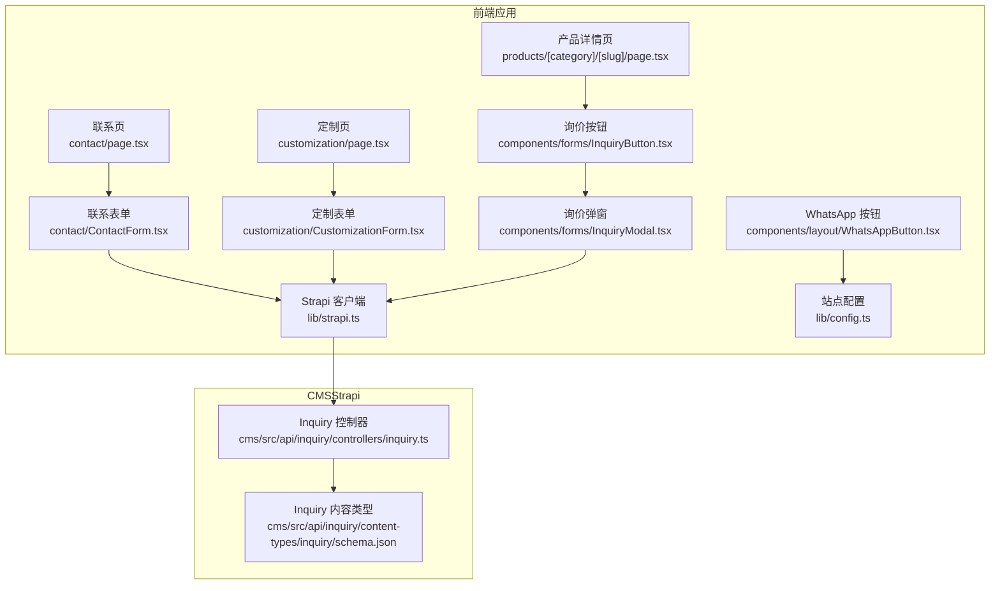
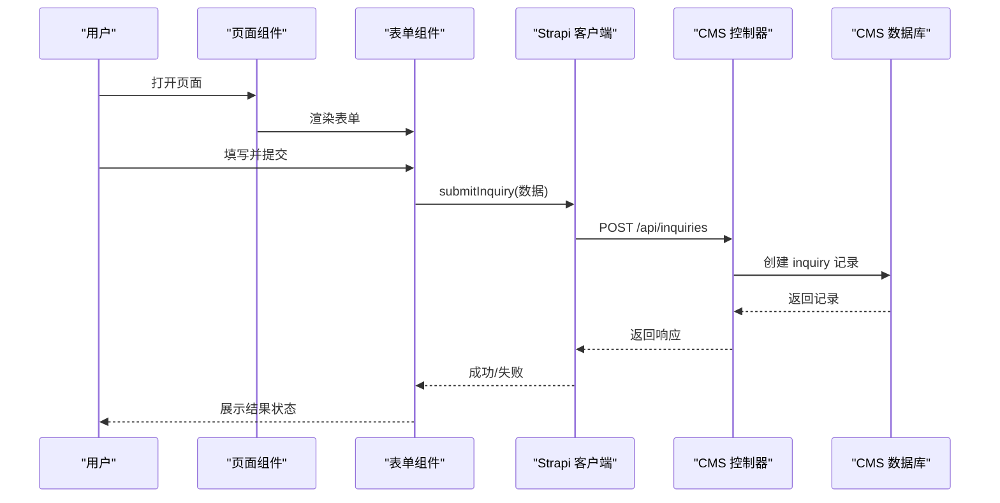
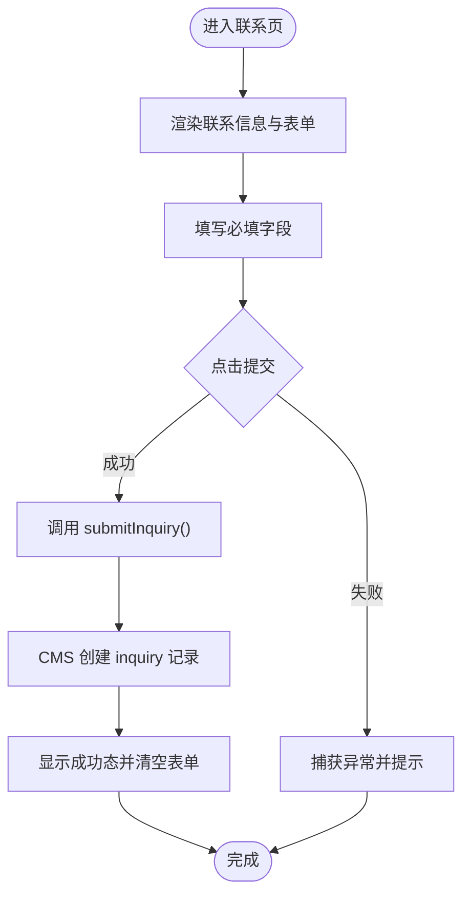
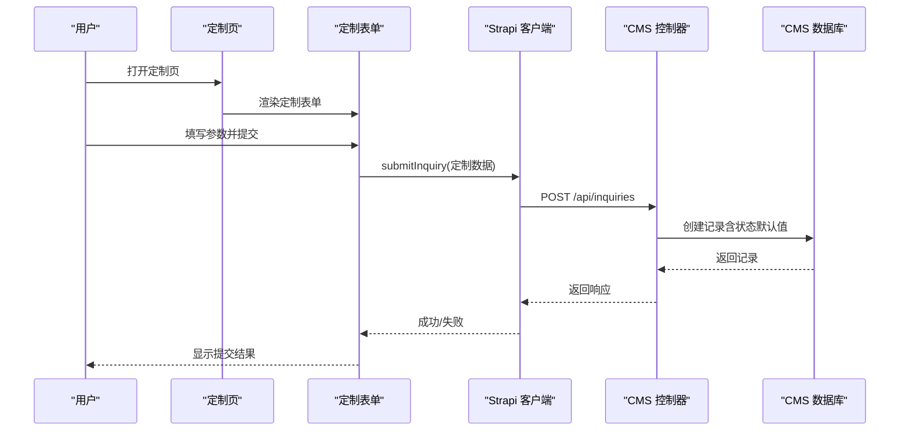
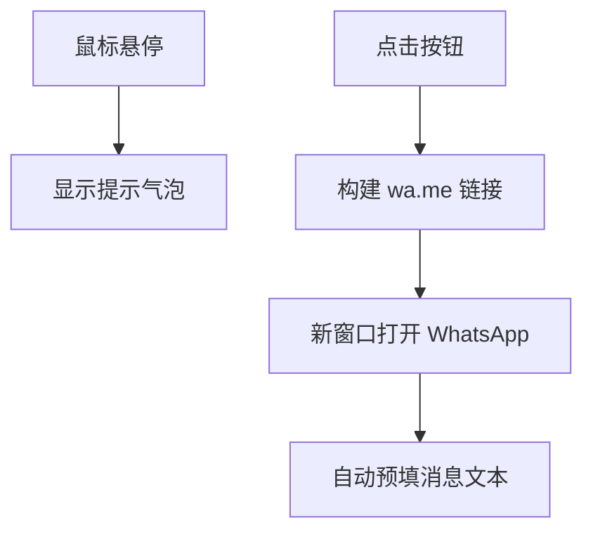
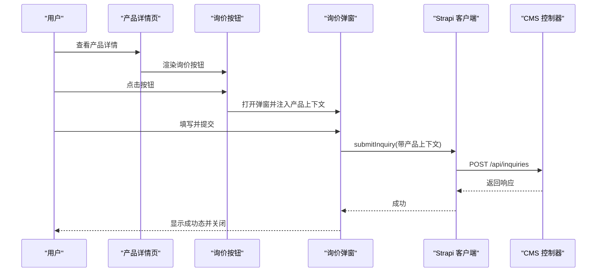
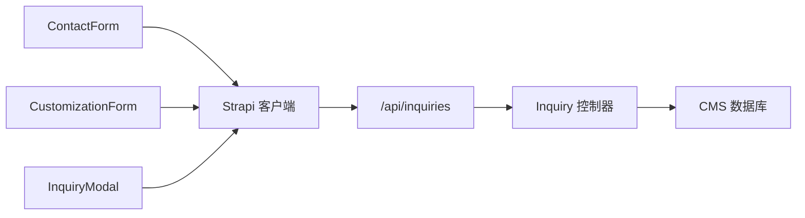

# 用户交互系统

<cite>
**本文引用的文件**
- [frontend/src/app/contact/page.tsx](file://frontend/src/app/contact/page.tsx)
- [frontend/src/app/contact/ContactForm.tsx](file://frontend/src/app/contact/ContactForm.tsx)
- [frontend/src/app/customization/page.tsx](file://frontend/src/app/customization/page.tsx)
- [frontend/src/app/customization/CustomizationForm.tsx](file://frontend/src/app/customization/CustomizationForm.tsx)
- [frontend/src/components/layout/WhatsAppButton.tsx](file://frontend/src/components/layout/WhatsAppButton.tsx)
- [frontend/src/components/forms/InquiryButton.tsx](file://frontend/src/components/forms/InquiryButton.tsx)
- [frontend/src/components/forms/InquiryModal.tsx](file://frontend/src/components/forms/InquiryModal.tsx)
- [frontend/src/lib/strapi.ts](file://frontend/src/lib/strapi.ts)
- [frontend/src/lib/config.ts](file://frontend/src/lib/config.ts)
- [frontend/src/app/products/[category]/[slug]/page.tsx](file://frontend/src/app/products/[category]/[slug]/page.tsx)
- [cms/src/api/inquiry/controllers/inquiry.ts](file://cms/src/api/inquiry/controllers/inquiry.ts)
- [cms/src/api/inquiry/content-types/inquiry/schema.json](file://cms/src/api/inquiry/content-types/inquiry/schema.json)
- [frontend/src/types/index.ts](file://frontend/src/types/index.ts)
</cite>

## 目录
1. [简介](#简介)
2. [项目结构](#项目结构)
3. [核心组件](#核心组件)
4. [架构总览](#架构总览)
5. [详细组件分析](#详细组件分析)
6. [依赖关系分析](#依赖关系分析)
7. [性能考虑](#性能考虑)
8. [故障排查指南](#故障排查指南)
9. [结论](#结论)
10. [附录](#附录)

## 简介
本文件面向 Battivus 项目的用户交互系统，围绕以下目标进行系统化文档化：
- 联系页面：表单设计、数据校验与提交处理流程
- 产品定制申请系统：参数化定制、报价生成与进度跟踪
- 社交媒体集成：WhatsApp 一键联系按钮的实现与体验优化
- 企业信息展示页面：设计与内容管理方案
- 用户反馈与客户关系管理：反馈收集、满意度调查与 CRM 集成策略
- 可访问性、跨设备兼容性与性能优化建议

## 项目结构
前端采用 Next.js 应用程序目录结构，按页面与组件分层组织；CMS 使用 Strapi 提供内容与交互数据存储。交互系统的关键模块包括：
- 页面层：联系页、定制页、产品详情页等
- 组件层：联系表单、定制表单、WhatsApp 悬浮按钮、询价弹窗等
- 服务层：Strapi API 客户端封装、配置中心
- 类型层：统一的数据模型与接口定义

**图表来源**
- [frontend/src/app/contact/page.tsx:11-197](file://frontend/src/app/contact/page.tsx#L11-L197)
- [frontend/src/app/contact/ContactForm.tsx:1-269](file://frontend/src/app/contact/ContactForm.tsx#L1-L269)
- [frontend/src/app/customization/page.tsx:1-427](file://frontend/src/app/customization/page.tsx#L1-L427)
- [frontend/src/app/customization/CustomizationForm.tsx:1-489](file://frontend/src/app/customization/CustomizationForm.tsx#L1-L489)
- [frontend/src/components/layout/WhatsAppButton.tsx:1-45](file://frontend/src/components/layout/WhatsAppButton.tsx#L1-L45)
- [frontend/src/components/forms/InquiryButton.tsx:1-55](file://frontend/src/components/forms/InquiryButton.tsx#L1-L55)
- [frontend/src/components/forms/InquiryModal.tsx:1-370](file://frontend/src/components/forms/InquiryModal.tsx#L1-L370)
- [frontend/src/lib/strapi.ts:291-306](file://frontend/src/lib/strapi.ts#L291-L306)
- [frontend/src/lib/config.ts:10-24](file://frontend/src/lib/config.ts#L10-L24)
- [frontend/src/app/products/[category]/[slug]/page.tsx](file://frontend/src/app/products/[category]/[slug]/page.tsx#L1-L566)
- [cms/src/api/inquiry/controllers/inquiry.ts:1-40](file://cms/src/api/inquiry/controllers/inquiry.ts#L1-L40)
- [cms/src/api/inquiry/content-types/inquiry/schema.json:1-25](file://cms/src/api/inquiry/content-types/inquiry/schema.json#L1-L25)

**章节来源**
- [frontend/src/app/contact/page.tsx:1-198](file://frontend/src/app/contact/page.tsx#L1-L198)
- [frontend/src/app/customization/page.tsx:1-427](file://frontend/src/app/customization/page.tsx#L1-L427)
- [frontend/src/components/layout/WhatsAppButton.tsx:1-45](file://frontend/src/components/layout/WhatsAppButton.tsx#L1-L45)
- [frontend/src/components/forms/InquiryButton.tsx:1-55](file://frontend/src/components/forms/InquiryButton.tsx#L1-L55)
- [frontend/src/components/forms/InquiryModal.tsx:1-370](file://frontend/src/components/forms/InquiryModal.tsx#L1-L370)
- [frontend/src/lib/strapi.ts:1-412](file://frontend/src/lib/strapi.ts#L1-L412)
- [frontend/src/lib/config.ts:1-177](file://frontend/src/lib/config.ts#L1-L177)
- [frontend/src/app/products/[category]/[slug]/page.tsx](file://frontend/src/app/products/[category]/[slug]/page.tsx#L1-L566)
- [cms/src/api/inquiry/controllers/inquiry.ts:1-40](file://cms/src/api/inquiry/controllers/inquiry.ts#L1-L40)
- [cms/src/api/inquiry/content-types/inquiry/schema.json:1-25](file://cms/src/api/inquiry/content-types/inquiry/schema.json#L1-L25)

## 核心组件
- 联系表单：支持姓名、邮箱、公司、电话、主题、消息与隐私协议勾选，提交后通过 Strapi API 创建 inquiry 记录。
- 定制表单：覆盖应用场景、电压/容量/放电电流、尺寸/连接器、数量/时间线、认证需求等字段，提交后生成定制请求。
- WhatsApp 一键联系：悬浮按钮，悬停显示提示，点击跳转到 wa.me 链接并预填消息。
- 询价弹窗：在产品详情页中触发，收集基础询价信息并提交至 CMS。
- Strapi 客户端：统一封装 API 请求、错误处理与响应解析，暴露 submitInquiry 方法。
- 配置中心：集中管理联系方式、社交链接、导航与 SEO 默认值。

**章节来源**
- [frontend/src/app/contact/ContactForm.tsx:1-269](file://frontend/src/app/contact/ContactForm.tsx#L1-L269)
- [frontend/src/app/customization/CustomizationForm.tsx:1-489](file://frontend/src/app/customization/CustomizationForm.tsx#L1-L489)
- [frontend/src/components/layout/WhatsAppButton.tsx:1-45](file://frontend/src/components/layout/WhatsAppButton.tsx#L1-L45)
- [frontend/src/components/forms/InquiryModal.tsx:1-370](file://frontend/src/components/forms/InquiryModal.tsx#L1-L370)
- [frontend/src/lib/strapi.ts:291-306](file://frontend/src/lib/strapi.ts#L291-L306)
- [frontend/src/lib/config.ts:10-24](file://frontend/src/lib/config.ts#L10-L24)

## 架构总览
用户交互系统以“页面组件 + 表单组件 + 服务客户端 + CMS”为核心链路，数据流如下：

**图表来源**
- [frontend/src/app/contact/ContactForm.tsx:20-58](file://frontend/src/app/contact/ContactForm.tsx#L20-L58)
- [frontend/src/app/customization/CustomizationForm.tsx:36-101](file://frontend/src/app/customization/CustomizationForm.tsx#L36-L101)
- [frontend/src/components/forms/InquiryModal.tsx:46-95](file://frontend/src/components/forms/InquiryModal.tsx#L46-L95)
- [frontend/src/lib/strapi.ts:291-306](file://frontend/src/lib/strapi.ts#L291-L306)
- [cms/src/api/inquiry/controllers/inquiry.ts:19-24](file://cms/src/api/inquiry/controllers/inquiry.ts#L19-L24)
- [cms/src/api/inquiry/content-types/inquiry/schema.json:12-23](file://cms/src/api/inquiry/content-types/inquiry/schema.json#L12-L23)

## 详细组件分析

### 联系页面与表单
- 设计要点
  - 左侧展示联系方式（邮箱、WhatsApp、电话、地址）与社交链接
  - 右侧嵌入联系表单，必填项包括姓名、邮箱、主题、消息与隐私协议
  - 提交后显示成功态，自动清空表单并延时重置
- 数据验证与提交
  - 前端使用 HTML5 必填属性与本地状态管理
  - 提交时将消息体拼装为统一格式并携带来源标识
  - 异常时捕获错误并提示用户
- 与 CMS 的集成
  - 通过 Strapi 客户端调用 /api/inquiries 接口创建记录
  - CMS schema 定义了标准字段与状态枚举

**图表来源**
- [frontend/src/app/contact/page.tsx:24-147](file://frontend/src/app/contact/page.tsx#L24-L147)
- [frontend/src/app/contact/ContactForm.tsx:20-58](file://frontend/src/app/contact/ContactForm.tsx#L20-L58)
- [frontend/src/lib/strapi.ts:291-306](file://frontend/src/lib/strapi.ts#L291-L306)
- [cms/src/api/inquiry/content-types/inquiry/schema.json:12-23](file://cms/src/api/inquiry/content-types/inquiry/schema.json#L12-L23)

**章节来源**
- [frontend/src/app/contact/page.tsx:11-198](file://frontend/src/app/contact/page.tsx#L11-L198)
- [frontend/src/app/contact/ContactForm.tsx:1-269](file://frontend/src/app/contact/ContactForm.tsx#L1-L269)
- [frontend/src/lib/strapi.ts:291-306](file://frontend/src/lib/strapi.ts#L291-L306)
- [cms/src/api/inquiry/content-types/inquiry/schema.json:12-23](file://cms/src/api/inquiry/content-types/inquiry/schema.json#L12-L23)

### 产品定制申请系统
- 功能范围
  - 参数化定制：电压/容量/放电电流/尺寸/连接器/应用场景
  - 报价生成：通过定制表单收集需求，后台生成报价与技术提案
  - 进度跟踪：CMS 中 inquiry 记录具备状态字段，便于后续跟进
- 表单设计
  - 分为“联系信息”“电池要求”“项目细节”三大区块
  - 支持多选认证需求与数量区间选择
  - 提交后统一写入 message 字段，便于客服检索
- 与 CMS 的集成
  - 字段映射遵循 CMS schema，新增字段如 country、quantity、source 等

**图表来源**
- [frontend/src/app/customization/page.tsx:199-427](file://frontend/src/app/customization/page.tsx#L199-L427)
- [frontend/src/app/customization/CustomizationForm.tsx:36-101](file://frontend/src/app/customization/CustomizationForm.tsx#L36-L101)
- [frontend/src/lib/strapi.ts:291-306](file://frontend/src/lib/strapi.ts#L291-L306)
- [cms/src/api/inquiry/controllers/inquiry.ts:19-24](file://cms/src/api/inquiry/controllers/inquiry.ts#L19-L24)
- [cms/src/api/inquiry/content-types/inquiry/schema.json:12-23](file://cms/src/api/inquiry/content-types/inquiry/schema.json#L12-L23)

**章节来源**
- [frontend/src/app/customization/page.tsx:1-427](file://frontend/src/app/customization/page.tsx#L1-L427)
- [frontend/src/app/customization/CustomizationForm.tsx:1-489](file://frontend/src/app/customization/CustomizationForm.tsx#L1-L489)
- [cms/src/api/inquiry/content-types/inquiry/schema.json:1-25](file://cms/src/api/inquiry/content-types/inquiry/schema.json#L1-L25)

### 社交媒体集成：WhatsApp 一键联系
- 实现方式
  - 读取配置中的 WhatsApp 号码列表，使用第一个号码作为主入口
  - 鼠标悬停显示提示气泡，提升可发现性
  - 点击跳转到 https://wa.me/{number}?text=预填消息
- 体验优化
  - 固定悬浮按钮，避免遮挡主要内容
  - 悬停缩放与阴影增强交互反馈
  - 无障碍：提供 aria-label

**图表来源**
- [frontend/src/components/layout/WhatsAppButton.tsx:6-44](file://frontend/src/components/layout/WhatsAppButton.tsx#L6-L44)
- [frontend/src/lib/config.ts:10-17](file://frontend/src/lib/config.ts#L10-L17)

**章节来源**
- [frontend/src/components/layout/WhatsAppButton.tsx:1-45](file://frontend/src/components/layout/WhatsAppButton.tsx#L1-L45)
- [frontend/src/lib/config.ts:10-17](file://frontend/src/lib/config.ts#L10-L17)

### 企业信息展示页面
- 设计理念
  - 采用渐变背景与信息卡片组合，突出公司文化与优势
  - 展示业务领域、核心竞争力、全球市场覆盖与统计数据
- 内容管理
  - 通过 CMS 管理静态内容与图片资源
  - 前端页面通过 SEO 工具函数生成结构化数据与面包屑

**章节来源**
- [frontend/src/app/about/page.tsx:1-345](file://frontend/src/app/about/page.tsx#L1-L345)

### 产品详情页的交互元素
- 询价按钮
  - 在产品详情页右上角提供“请求报价”按钮
  - 点击后弹出询价弹窗，自动带入产品名称、SKU、URL
- 询价弹窗
  - 收集姓名、邮箱、公司、国家、数量与消息
  - 提交后关闭弹窗并显示成功态

**图表来源**
- [frontend/src/app/products/[category]/[slug]/page.tsx](file://frontend/src/app/products/[category]/[slug]/page.tsx#L342-L371)
- [frontend/src/components/forms/InquiryButton.tsx:14-54](file://frontend/src/components/forms/InquiryButton.tsx#L14-L54)
- [frontend/src/components/forms/InquiryModal.tsx:46-95](file://frontend/src/components/forms/InquiryModal.tsx#L46-L95)
- [frontend/src/lib/strapi.ts:291-306](file://frontend/src/lib/strapi.ts#L291-L306)
- [cms/src/api/inquiry/controllers/inquiry.ts:19-24](file://cms/src/api/inquiry/controllers/inquiry.ts#L19-L24)

**章节来源**
- [frontend/src/app/products/[category]/[slug]/page.tsx](file://frontend/src/app/products/[category]/[slug]/page.tsx#L1-L566)
- [frontend/src/components/forms/InquiryButton.tsx:1-55](file://frontend/src/components/forms/InquiryButton.tsx#L1-L55)
- [frontend/src/components/forms/InquiryModal.tsx:1-370](file://frontend/src/components/forms/InquiryModal.tsx#L1-L370)

### 数据模型与类型
- 统一类型定义确保前后端一致性，涵盖产品、博客、解决方案、询价表单等
- 询价表单数据结构包含联系信息、产品上下文与来源标识

**章节来源**
- [frontend/src/types/index.ts:109-121](file://frontend/src/types/index.ts#L109-L121)

## 依赖关系分析
- 组件耦合
  - 表单组件与 Strapi 客户端松耦合，通过统一方法 submitInquiry 交互
  - 产品详情页与询价弹窗通过 props 注入产品上下文，降低重复逻辑
- 外部依赖
  - Strapi CMS 提供内容与交互数据持久化
  - 浏览器环境下的 wa.me 协议用于一键联系
- 潜在风险
  - 前端未内置强校验，建议在提交前增加前端校验与防抖
  - CMS schema 与前端字段需保持同步，避免字段不匹配

**图表来源**
- [frontend/src/app/contact/ContactForm.tsx:3-35](file://frontend/src/app/contact/ContactForm.tsx#L3-L35)
- [frontend/src/app/customization/CustomizationForm.tsx:3-67](file://frontend/src/app/customization/CustomizationForm.tsx#L3-L67)
- [frontend/src/components/forms/InquiryModal.tsx:5-65](file://frontend/src/components/forms/InquiryModal.tsx#L5-L65)
- [frontend/src/lib/strapi.ts:291-306](file://frontend/src/lib/strapi.ts#L291-L306)
- [cms/src/api/inquiry/controllers/inquiry.ts:19-24](file://cms/src/api/inquiry/controllers/inquiry.ts#L19-L24)

**章节来源**
- [frontend/src/lib/strapi.ts:291-306](file://frontend/src/lib/strapi.ts#L291-L306)
- [cms/src/api/inquiry/controllers/inquiry.ts:1-40](file://cms/src/api/inquiry/controllers/inquiry.ts#L1-L40)

## 性能考虑
- 前端性能
  - 表单提交使用受控组件与状态合并，减少重渲染
  - 提交按钮禁用与加载动画避免重复提交
  - 产品详情页使用结构化数据与面包屑，提升 SEO 与首屏体验
- 后端性能
  - Strapi 客户端设置 revalidate 缓存，降低频繁请求带来的压力
  - 建议对 /api/inquiries 接口启用限流与输入校验
- 兼容性
  - wa.me 链接在移动端微信内置浏览器可能受限，建议提供备用邮箱/电话直达
  - 为关键交互元素添加键盘可达性与屏幕阅读器支持

[本节为通用指导，无需特定文件引用]

## 故障排查指南
- 表单提交失败
  - 检查网络请求是否被拦截或 CORS 配置
  - 确认 Strapi Token 与 API 地址配置正确
  - 查看浏览器控制台错误日志
- CMS 无法保存
  - 核对 CMS schema 字段是否与前端一致
  - 确认控制器权限与发布状态
- WhatsApp 无法打开
  - 确认配置中的号码格式与预填消息编码
  - 移动端需安装 WhatsApp 或使用系统默认浏览器

**章节来源**
- [frontend/src/lib/strapi.ts:8-9](file://frontend/src/lib/strapi.ts#L8-L9)
- [frontend/src/lib/strapi.ts:109-118](file://frontend/src/lib/strapi.ts#L109-L118)
- [cms/src/api/inquiry/content-types/inquiry/schema.json:12-23](file://cms/src/api/inquiry/content-types/inquiry/schema.json#L12-L23)

## 结论
Battivus 用户交互系统以清晰的页面与组件划分、统一的 Strapi 集成以及简洁的 WhatsApp 一键联系为核心，实现了从线索收集到初步沟通的顺畅闭环。建议在后续迭代中强化前端校验、完善 CRM 状态流转与满意度调查机制，并持续优化跨设备与可访问性体验。

[本节为总结性内容，无需特定文件引用]

## 附录

### 用户反馈与 CRM 集成策略
- 反馈收集
  - 在联系页与定制页增加“满意度评分”或“问题类别”下拉
  - 通过邮件模板自动归档用户反馈与产品上下文
- 满意度调查
  - 提交成功后发送简短调查链接（可选）
  - 支持匿名与实名两种模式
- CRM 集成
  - 将 inquiry 状态字段扩展为 new → contacted → quoted → closed
  - 与邮件/工单系统对接，自动创建任务与跟进提醒

[本节为概念性建议，无需特定文件引用]