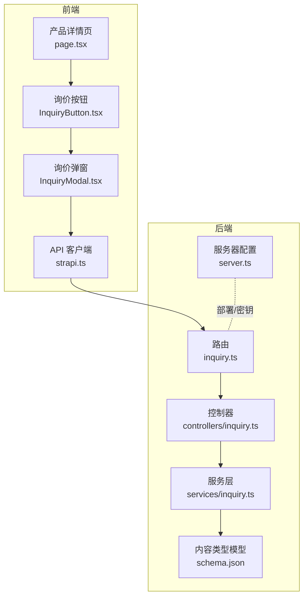
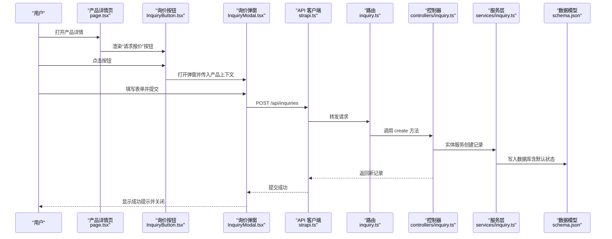
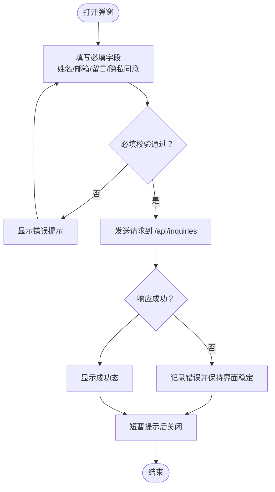
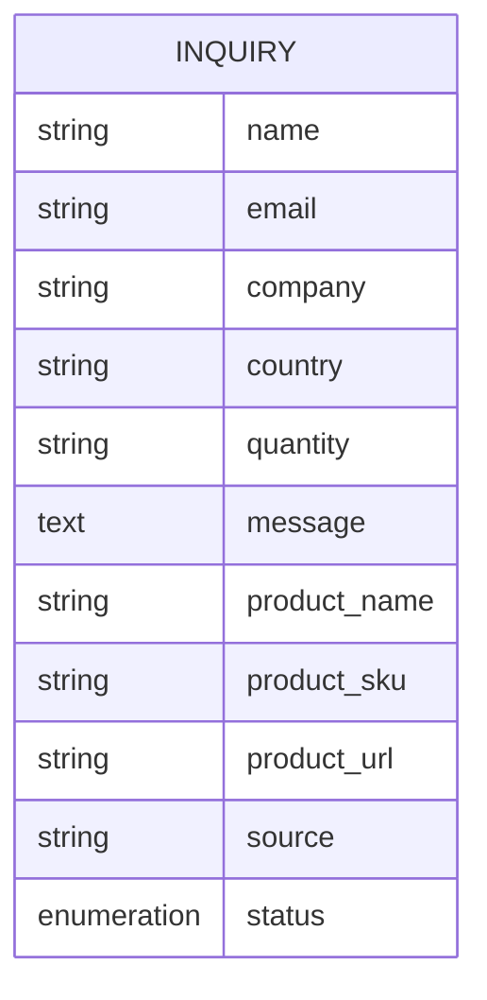
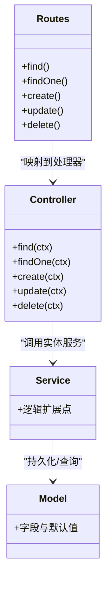
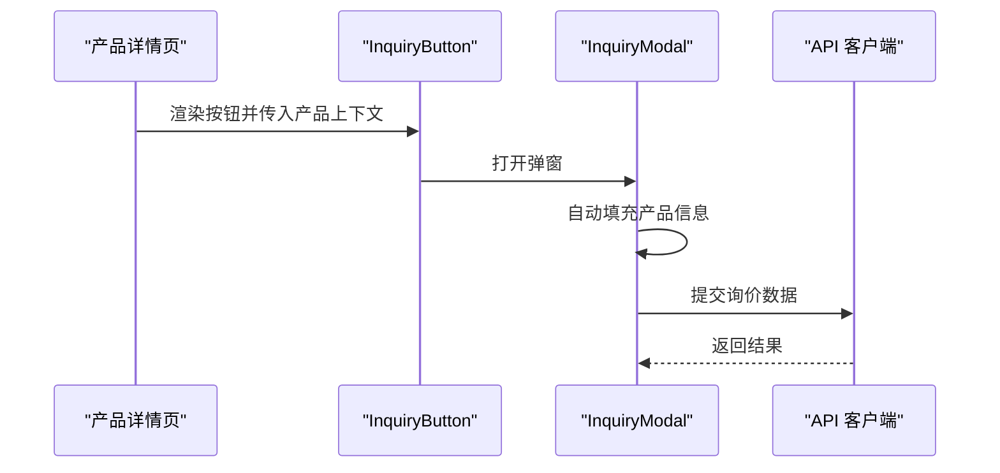
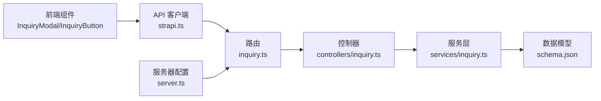

# 询价处理系统

<cite>
**本文引用的文件**
- [schema.json](file://cms/src/api/inquiry/content-types/inquiry/schema.json)
- [inquiry.ts（控制器）](file://cms/src/api/inquiry/controllers/inquiry.ts)
- [inquiry.ts（服务）](file://cms/src/api/inquiry/services/inquiry.ts)
- [inquiry.ts（路由）](file://cms/src/api/inquiry/routes/inquiry.ts)
- [strapi.ts（前端 API 客户端）](file://frontend/src/lib/strapi.ts)
- [InquiryModal.tsx](file://frontend/src/components/forms/InquiryModal.tsx)
- [InquiryButton.tsx](file://frontend/src/components/forms/InquiryButton.tsx)
- [page.tsx（产品详情页）](file://frontend/src/app/products/[category]/[slug]/page.tsx)
- [config.ts（站点配置）](file://frontend/src/lib/config.ts)
- [index.ts（类型定义）](file://frontend/src/types/index.ts)
- [server.ts（CMS 服务器配置）](file://cms/config/server.ts)
- [plugins.ts（CMS 插件配置）](file://cms/config/plugins.ts)
</cite>

## 目录
1. [引言](#引言)
2. [项目结构](#项目结构)
3. [核心组件](#核心组件)
4. [架构总览](#架构总览)
5. [详细组件分析](#详细组件分析)
6. [依赖关系分析](#依赖关系分析)
7. [性能考量](#性能考量)
8. [故障排查指南](#故障排查指南)
9. [结论](#结论)
10. [附录](#附录)

## 引言
本文件面向 Battivus 项目的“询价处理系统”，系统目标是为用户提供便捷、可靠的询价入口，并在后台完成数据接收、存储与后续通知流程。本文从前端表单交互、数据模型、后端接口到产品详情页集成进行全链路梳理，同时给出状态管理、邮件通知集成方案、安全性与隐私保护建议，以及监控与优化思路。

## 项目结构
- 前端采用 Next.js 应用，通过自研 API 客户端与 Strapi CMS 通信。
- 后端基于 Strapi，提供标准的 CRUD 接口用于询价数据管理。
- 产品详情页集成了“请求报价”按钮，打开弹窗表单并提交至后端。

图表来源
- [page.tsx（产品详情页）:342-347](file://frontend/src/app/products/[category]/[slug]/page.tsx#L342-L347)
- [InquiryButton.tsx:14-54](file://frontend/src/components/forms/InquiryButton.tsx#L14-L54)
- [InquiryModal.tsx:15-95](file://frontend/src/components/forms/InquiryModal.tsx#L15-L95)
- [strapi.ts（前端 API 客户端）:290-306](file://frontend/src/lib/strapi.ts#L290-L306)
- [inquiry.ts（路由）:1-35](file://cms/src/api/inquiry/routes/inquiry.ts#L1-L35)
- [inquiry.ts（控制器）:1-40](file://cms/src/api/inquiry/controllers/inquiry.ts#L1-L40)
- [inquiry.ts（服务）:1-2](file://cms/src/api/inquiry/services/inquiry.ts#L1-L2)
- [schema.json:1-25](file://cms/src/api/inquiry/content-types/inquiry/schema.json#L1-L25)
- [server.ts（CMS 服务器配置）:1-11](file://cms/config/server.ts#L1-L11)

章节来源
- [page.tsx（产品详情页）:1-566](file://frontend/src/app/products/[category]/[slug]/page.tsx#L1-L566)
- [InquiryButton.tsx:1-55](file://frontend/src/components/forms/InquiryButton.tsx#L1-L55)
- [InquiryModal.tsx:1-370](file://frontend/src/components/forms/InquiryModal.tsx#L1-L370)
- [strapi.ts（前端 API 客户端）:1-412](file://frontend/src/lib/strapi.ts#L1-L412)
- [inquiry.ts（路由）:1-35](file://cms/src/api/inquiry/routes/inquiry.ts#L1-L35)
- [inquiry.ts（控制器）:1-40](file://cms/src/api/inquiry/controllers/inquiry.ts#L1-L40)
- [inquiry.ts（服务）:1-2](file://cms/src/api/inquiry/services/inquiry.ts#L1-L2)
- [schema.json:1-25](file://cms/src/api/inquiry/content-types/inquiry/schema.json#L1-L25)
- [server.ts（CMS 服务器配置）:1-11](file://cms/config/server.ts#L1-L11)

## 核心组件
- 前端表单组件：InquiryModal 负责收集用户输入、提交数据；InquiryButton 触发展示。
- 前端 API 客户端：封装 Strapi 请求、鉴权头注入、错误处理。
- 后端接口：提供查询、新增、更新、删除询价记录的标准 REST 路由。
- 数据模型：定义字段、必填项、枚举状态等。
- 产品详情页：在详情页中嵌入“请求报价”入口，传递产品上下文信息。

章节来源
- [InquiryModal.tsx:15-95](file://frontend/src/components/forms/InquiryModal.tsx#L15-L95)
- [InquiryButton.tsx:14-54](file://frontend/src/components/forms/InquiryButton.tsx#L14-L54)
- [strapi.ts（前端 API 客户端）:290-306](file://frontend/src/lib/strapi.ts#L290-L306)
- [inquiry.ts（路由）:1-35](file://cms/src/api/inquiry/routes/inquiry.ts#L1-L35)
- [inquiry.ts（控制器）:1-40](file://cms/src/api/inquiry/controllers/inquiry.ts#L1-L40)
- [schema.json:12-22](file://cms/src/api/inquiry/content-types/inquiry/schema.json#L12-L22)
- [page.tsx（产品详情页）:342-347](file://frontend/src/app/products/[category]/[slug]/page.tsx#L342-L347)

## 架构总览
从前端到后端的数据流如下：

图表来源
- [page.tsx（产品详情页）:342-347](file://frontend/src/app/products/[category]/[slug]/page.tsx#L342-L347)
- [InquiryButton.tsx:14-54](file://frontend/src/components/forms/InquiryButton.tsx#L14-L54)
- [InquiryModal.tsx:46-95](file://frontend/src/components/forms/InquiryModal.tsx#L46-L95)
- [strapi.ts（前端 API 客户端）:290-306](file://frontend/src/lib/strapi.ts#L290-L306)
- [inquiry.ts（路由）:16-18](file://cms/src/api/inquiry/routes/inquiry.ts#L16-L18)
- [inquiry.ts（控制器）:19-24](file://cms/src/api/inquiry/controllers/inquiry.ts#L19-L24)
- [inquiry.ts（服务）:1-2](file://cms/src/api/inquiry/services/inquiry.ts#L1-L2)
- [schema.json:12-22](file://cms/src/api/inquiry/content-types/inquiry/schema.json#L12-L22)

## 详细组件分析

### 前端表单与交互设计
- 表单字段：姓名、邮箱、公司、国家、数量区间、留言、隐私协议勾选。
- 自动填充与上下文：产品详情页通过按钮向弹窗传递产品名称、SKU、URL，弹窗在提交时一并写入。
- 实时反馈：提交中禁用按钮、加载动画；成功后短暂展示成功态并自动关闭。
- 用户体验：遮罩层、滚动控制、无障碍关闭按钮。

图表来源
- [InquiryModal.tsx:46-95](file://frontend/src/components/forms/InquiryModal.tsx#L46-L95)
- [strapi.ts（前端 API 客户端）:290-306](file://frontend/src/lib/strapi.ts#L290-L306)

章节来源
- [InquiryModal.tsx:15-95](file://frontend/src/components/forms/InquiryModal.tsx#L15-L95)
- [InquiryButton.tsx:14-54](file://frontend/src/components/forms/InquiryButton.tsx#L14-L54)
- [page.tsx（产品详情页）:342-347](file://frontend/src/app/products/[category]/[slug]/page.tsx#L342-L347)
- [config.ts（站点配置）:10-17](file://frontend/src/lib/config.ts#L10-L17)

### 数据模型与状态管理
- 字段定义：名称、邮箱、公司、国家、数量、消息、产品名/SKU/URL、来源、状态。
- 状态枚举：new（新建）、contacted（已联系）、quoted（已报价）、closed（已关闭），默认 new。
- 关键点：前端提交时写入 source 字段（当前页面 URL），便于溯源。

图表来源
- [schema.json:12-22](file://cms/src/api/inquiry/content-types/inquiry/schema.json#L12-L22)

章节来源
- [schema.json:1-25](file://cms/src/api/inquiry/content-types/inquiry/schema.json#L1-L25)
- [index.ts（类型定义）:109-121](file://frontend/src/types/index.ts#L109-L121)

### 后端接口与处理流程
- 路由：提供 GET/POST/PUT/DELETE 询价记录的完整 CRUD。
- 控制器：直接委托实体服务进行读取、创建、更新、删除。
- 服务层：当前为空实现，可扩展业务逻辑（如校验、通知、审计）。
- 默认状态：创建时状态默认 new。

图表来源
- [inquiry.ts（路由）:1-35](file://cms/src/api/inquiry/routes/inquiry.ts#L1-L35)
- [inquiry.ts（控制器）:1-40](file://cms/src/api/inquiry/controllers/inquiry.ts#L1-L40)
- [inquiry.ts（服务）:1-2](file://cms/src/api/inquiry/services/inquiry.ts#L1-L2)
- [schema.json:12-22](file://cms/src/api/inquiry/content-types/inquiry/schema.json#L12-L22)

章节来源
- [inquiry.ts（路由）:1-35](file://cms/src/api/inquiry/routes/inquiry.ts#L1-L35)
- [inquiry.ts（控制器）:1-40](file://cms/src/api/inquiry/controllers/inquiry.ts#L1-L40)
- [inquiry.ts（服务）:1-2](file://cms/src/api/inquiry/services/inquiry.ts#L1-L2)

### 产品详情页集成模式
- 在产品详情页渲染“请求报价”按钮，点击后打开弹窗。
- 弹窗内自动带入产品名称、SKU、URL，便于销售侧快速识别来源。
- 页面还提供面包屑导航、Schema 标记等 SEO 优化。

图表来源
- [page.tsx（产品详情页）:342-347](file://frontend/src/app/products/[category]/[slug]/page.tsx#L342-L347)
- [InquiryButton.tsx:14-54](file://frontend/src/components/forms/InquiryButton.tsx#L14-L54)
- [InquiryModal.tsx:15-95](file://frontend/src/components/forms/InquiryModal.tsx#L15-L95)
- [strapi.ts（前端 API 客户端）:290-306](file://frontend/src/lib/strapi.ts#L290-L306)

章节来源
- [page.tsx（产品详情页）:342-347](file://frontend/src/app/products/[category]/[slug]/page.tsx#L342-L347)
- [InquiryButton.tsx:14-54](file://frontend/src/components/forms/InquiryButton.tsx#L14-L54)
- [InquiryModal.tsx:15-95](file://frontend/src/components/forms/InquiryModal.tsx#L15-L95)

### 批量询价功能（概念性设计）
- 当前代码未实现批量询价。可在前端增加“选择多个产品”能力，统一提交至后端。
- 后端可扩展：支持批量创建或导入模板上传，结合状态机与通知队列异步处理。
- 注意：批量场景需加强幂等、去重与限流策略。

（本节为概念性说明，不直接对应具体源码）

## 依赖关系分析
- 前端依赖：
  - API 客户端负责统一请求、鉴权头注入、分页与排序参数拼装。
  - 组件间通过 props 传递产品上下文，避免全局状态污染。
- 后端依赖：
  - 路由映射到控制器，控制器委托实体服务，最终落库。
  - 服务器配置包含应用密钥与 Webhook 设置，影响安全与集成。

图表来源
- [strapi.ts（前端 API 客户端）:1-412](file://frontend/src/lib/strapi.ts#L1-L412)
- [inquiry.ts（路由）:1-35](file://cms/src/api/inquiry/routes/inquiry.ts#L1-L35)
- [inquiry.ts（控制器）:1-40](file://cms/src/api/inquiry/controllers/inquiry.ts#L1-L40)
- [inquiry.ts（服务）:1-2](file://cms/src/api/inquiry/services/inquiry.ts#L1-L2)
- [schema.json:1-25](file://cms/src/api/inquiry/content-types/inquiry/schema.json#L1-L25)
- [server.ts（CMS 服务器配置）:1-11](file://cms/config/server.ts#L1-L11)

章节来源
- [strapi.ts（前端 API 客户端）:1-412](file://frontend/src/lib/strapi.ts#L1-L412)
- [inquiry.ts（路由）:1-35](file://cms/src/api/inquiry/routes/inquiry.ts#L1-L35)
- [inquiry.ts（控制器）:1-40](file://cms/src/api/inquiry/controllers/inquiry.ts#L1-L40)
- [inquiry.ts（服务）:1-2](file://cms/src/api/inquiry/services/inquiry.ts#L1-L2)
- [schema.json:1-25](file://cms/src/api/inquiry/content-types/inquiry/schema.json#L1-L25)
- [server.ts（CMS 服务器配置）:1-11](file://cms/config/server.ts#L1-L11)

## 性能考量
- 前端缓存与再验证：API 客户端使用 Next.js 的 revalidate 机制，降低重复请求成本。
- 请求最小化：仅在提交时发送必要字段，避免冗余数据。
- 并发控制：在高频询价场景下，前端应限制重复提交，后端应设置速率限制与幂等键。
- 存储与索引：为常用查询字段（如 email、status、source）建立索引以提升检索效率。

（本节为通用建议，不直接对应具体源码）

## 故障排查指南
- 常见问题
  - 提交失败：检查 API 客户端返回状态与错误信息，确认环境变量（如 STRAPI_URL、STRAPI_API_TOKEN）是否正确。
  - 表单无法关闭：确认弹窗关闭回调与计时器逻辑。
  - 数据未入库：检查后端路由映射与控制器调用链。
- 日志与监控
  - 前端：在提交前后打印关键参数与响应。
  - 后端：记录请求路径、参数、异常堆栈与耗时。
- 安全加固
  - 使用 STRAPI_API_TOKEN 进行鉴权。
  - 服务器密钥配置与 Webhook 关系需谨慎管理。

章节来源
- [strapi.ts（前端 API 客户端）:290-306](file://frontend/src/lib/strapi.ts#L290-L306)
- [InquiryModal.tsx:85-94](file://frontend/src/components/forms/InquiryModal.tsx#L85-L94)
- [inquiry.ts（控制器）:19-24](file://cms/src/api/inquiry/controllers/inquiry.ts#L19-L24)
- [server.ts（CMS 服务器配置）:1-11](file://cms/config/server.ts#L1-L11)

## 结论
当前询价系统以简洁的前后端协作实现：前端弹窗表单收集信息并提交，后端提供标准接口落库，默认状态管理清晰。产品详情页无缝集成“请求报价”入口，便于用户在浏览过程中快速发起询价。后续可在服务层扩展业务规则、引入通知与状态流转，并完善批量询价与监控告警体系。

## 附录

### 询价状态管理与邮件通知集成方案
- 状态机：new → contacted → quoted → closed，每一步可触发不同动作（如通知、报价生成）。
- 邮件通知：在状态变更或定时任务中调用邮件服务，发送模板化通知给客户与销售。
- 外部集成：可接入第三方邮件网关或企业 IM（如微信、WhatsApp）以提升触达率。

（本节为概念性说明，不直接对应具体源码）

### 安全性、隐私保护与合规
- 数据最小化：仅收集必要字段，避免过度采集。
- 访问控制：通过 STRAPI_API_TOKEN 限制外部访问；后端路由可增加权限策略。
- 隐私政策：表单中强制勾选隐私条款链接，确保用户知情同意。
- 数据保留：设定合理的数据保留期限与清理策略，满足地区法规要求。

（本节为通用建议，不直接对应具体源码）

### 监控、分析与优化建议
- 指标：询价量趋势、转化率（从浏览到提交）、平均处理时长、失败率。
- 工具：埋点上报、日志聚合、告警阈值设置。
- 优化：缩短首屏加载、减少表单字段、提供更明确的错误提示与重试机制。

（本节为通用建议，不直接对应具体源码）