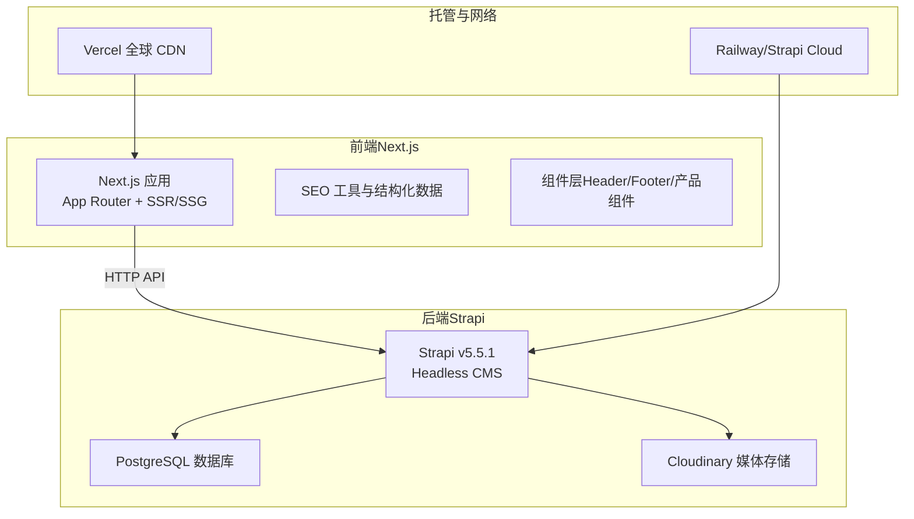
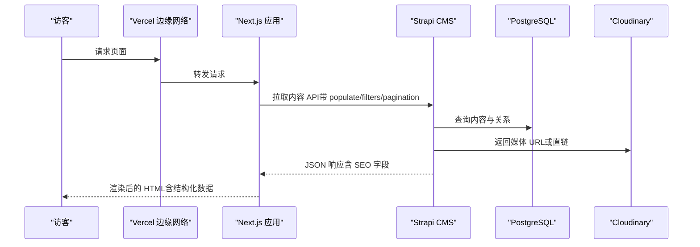
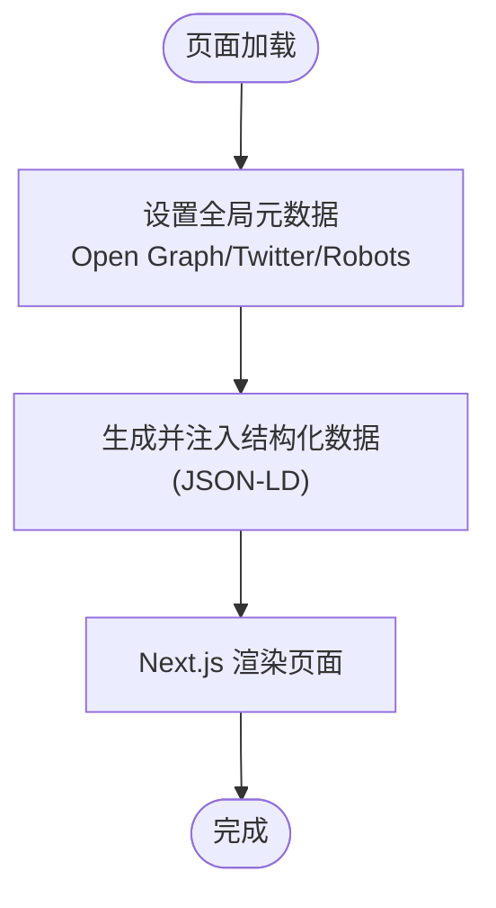
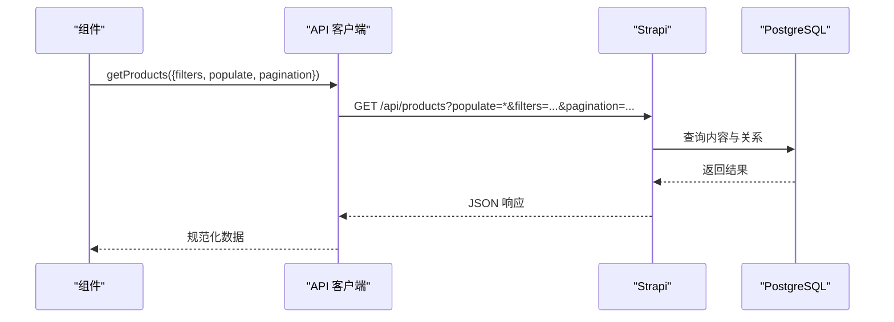
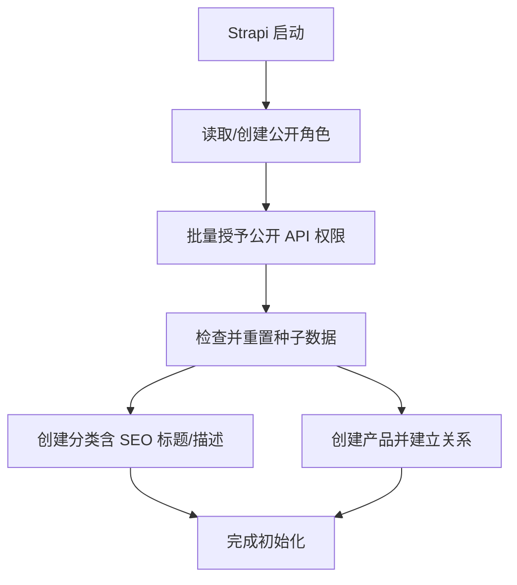
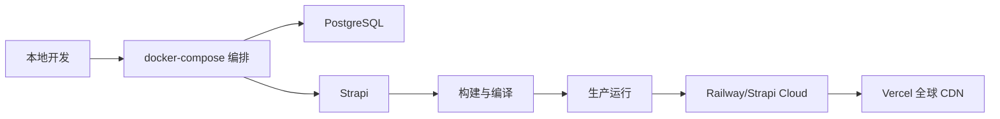
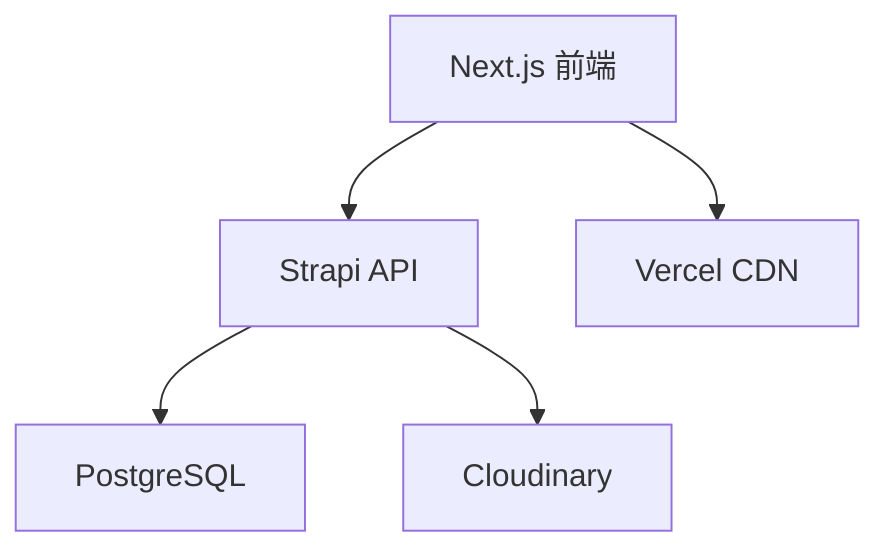

# 技术栈选型

<cite>
**本文引用的文件**
- [package.json](file://cms/package.json)
- [package.json](file://frontend/package.json)
- [tsconfig.json](file://cms/tsconfig.json)
- [tsconfig.json](file://frontend/tsconfig.json)
- [index.ts](file://cms/src/index.ts)
- [strapi.ts](file://frontend/src/lib/strapi.ts)
- [database.ts](file://cms/config/database.ts)
- [plugins.ts](file://cms/config/plugins.ts)
- [next.config.ts](file://frontend/next.config.ts)
- [postcss.config.mjs](file://frontend/postcss.config.mjs)
- [WEBSITE_ARCHITECTURE.md](file://WEBSITE_ARCHITECTURE.md)
- [DEPLOYMENT.md](file://DEPLOYMENT.md)
- [Dockerfile](file://cms/Dockerfile)
- [docker-compose.yml](file://cms/docker-compose.yml)
- [layout.tsx](file://frontend/src/app/layout.tsx)
- [Header.tsx](file://frontend/src/components/layout/Header.tsx)
</cite>

## 目录
1. [引言](#引言)
2. [项目结构](#项目结构)
3. [核心组件](#核心组件)
4. [架构总览](#架构总览)
5. [详细组件分析](#详细组件分析)
6. [依赖关系分析](#依赖关系分析)
7. [性能考量](#性能考量)
8. [故障排查指南](#故障排查指南)
9. [结论](#结论)
10. [附录](#附录)

## 引言
本技术栈选型文档面向 Battivus 无人机电池 B2B 网站，系统阐述前端 Next.js 14+、内容管理 Strapi 5.5.1、数据库 PostgreSQL、样式框架 TailwindCSS 的技术选型理由与优势，并基于仓库现有实现进行版本兼容性、性能特征与维护成本分析。同时提供与 WordPress、SaaS CMS 的对比权衡，给出技术决策矩阵与评分标准，明确为何选择 Next.js + Strapi 组合作为满足 SEO、产品参数化检索、线索转化等核心需求的最佳方案，并规划升级路径与替代方案评估。

## 项目结构
项目采用前后端分离架构：前端 Next.js 应用负责页面渲染与 SEO；后端 Strapi 提供 Headless CMS 能力，通过 API 向前端提供内容数据；数据库使用 PostgreSQL；媒体资源由 Cloudinary 托管；构建与部署通过 Vercel（前端）与 Railway/Strapi Cloud（后端）完成。

图表来源
- [DEPLOYMENT.md:10-17](file://DEPLOYMENT.md#L10-L17)
- [WEBSITE_ARCHITECTURE.md:52-71](file://WEBSITE_ARCHITECTURE.md#L52-L71)
- [layout.tsx:1-100](file://frontend/src/app/layout.tsx#L1-L100)
- [strapi.ts:1-412](file://frontend/src/lib/strapi.ts#L1-L412)

章节来源
- [WEBSITE_ARCHITECTURE.md:1-758](file://WEBSITE_ARCHITECTURE.md#L1-L758)
- [DEPLOYMENT.md:1-223](file://DEPLOYMENT.md#L1-L223)

## 核心组件
- 前端 Next.js 16.1.1（TypeScript、App Router、开发指示器禁用）
- 后端 Strapi 5.5.1（TypeScript、用户权限插件、Cloudinary 上传）
- 数据库 PostgreSQL（生产环境由 Railway/Strapi Cloud 管理）
- 样式框架 TailwindCSS 4（PostCSS 集成）
- 构建与部署：Vercel（前端）、Railway/Strapi Cloud（后端）

章节来源
- [package.json:1-26](file://frontend/package.json#L1-L26)
- [package.json:1-36](file://cms/package.json#L1-L36)
- [tsconfig.json:1-35](file://frontend/tsconfig.json#L1-L35)
- [tsconfig.json:1-19](file://cms/tsconfig.json#L1-L19)
- [postcss.config.mjs:1-8](file://frontend/postcss.config.mjs#L1-L8)
- [next.config.ts:1-9](file://frontend/next.config.ts#L1-L9)

## 架构总览
系统采用“前端静态/服务端渲染 + 后端 Headless CMS + 关系型数据库 + 全球 CDN”的分层架构。前端通过 API 客户端与 Strapi 交互，按需拉取内容并生成页面；后端负责内容管理、媒体处理与 API 管理；数据库持久化内容与关系；媒体资源独立托管以提升可靠性与性能。

图表来源
- [strapi.ts:51-119](file://frontend/src/lib/strapi.ts#L51-L119)
- [strapi.ts:121-164](file://frontend/src/lib/strapi.ts#L121-L164)
- [database.ts:1-15](file://cms/config/database.ts#L1-L15)
- [plugins.ts:1-19](file://cms/config/plugins.ts#L1-L19)

章节来源
- [WEBSITE_ARCHITECTURE.md:48-95](file://WEBSITE_ARCHITECTURE.md#L48-L95)
- [DEPLOYMENT.md:10-17](file://DEPLOYMENT.md#L10-L17)

## 详细组件分析

### 前端组件：Next.js 与 SEO/结构化数据
- 页面元数据与 Open Graph/Twitter 标签在根布局中集中配置，确保全局一致。
- 结构化数据（组织、网站）通过工具函数动态注入 JSON-LD，提升搜索可见性。
- 开发模式下禁用开发指标，减少构建输出噪音。

图表来源
- [layout.tsx:13-64](file://frontend/src/app/layout.tsx#L13-L64)
- [layout.tsx:74-87](file://frontend/src/app/layout.tsx#L74-L87)

章节来源
- [layout.tsx:1-100](file://frontend/src/app/layout.tsx#L1-L100)
- [next.config.ts:1-9](file://frontend/next.config.ts#L1-L9)

### 内容获取与 API 客户端：Strapi SDK
- 统一的 fetchAPI/fetchSingleAPI 封装，支持 populate、filters（含嵌套关系）、sort、分页。
- 默认启用增量更新策略（revalidate），平衡新鲜度与性能。
- 支持健康检查与错误处理，便于前端容错。

图表来源
- [strapi.ts:51-119](file://frontend/src/lib/strapi.ts#L51-L119)
- [strapi.ts:185-225](file://frontend/src/lib/strapi.ts#L185-L225)

章节来源
- [strapi.ts:1-412](file://frontend/src/lib/strapi.ts#L1-L412)

### 后端组件：Strapi 5.5.1 与数据库
- 初始化脚本自动配置公开角色权限与种子数据，确保首次部署即可运行。
- 使用文档 ID 关联关系（v5 特性），保证数据一致性。
- 数据库连接配置为 PostgreSQL，支持 SSL；媒体存储集成 Cloudinary。

图表来源
- [index.ts:161-217](file://cms/src/index.ts#L161-L217)
- [index.ts:219-315](file://cms/src/index.ts#L219-L315)
- [database.ts:1-15](file://cms/config/database.ts#L1-L15)
- [plugins.ts:1-19](file://cms/config/plugins.ts#L1-L19)

章节来源
- [index.ts:1-315](file://cms/src/index.ts#L1-L315)
- [database.ts:1-15](file://cms/config/database.ts#L1-L15)
- [plugins.ts:1-19](file://cms/config/plugins.ts#L1-L19)

### 样式与构建：TailwindCSS 与 PostCSS
- PostCSS 集成 Tailwind 插件，实现原子化样式与响应式设计。
- TypeScript 严格模式与模块解析配置，确保类型安全与路径别名。

章节来源
- [postcss.config.mjs:1-8](file://frontend/postcss.config.mjs#L1-L8)
- [tsconfig.json:1-35](file://frontend/tsconfig.json#L1-L35)

### 部署与可运维性：容器化与 PaaS
- Dockerfile 基于 Node.js 20 Alpine，安装编译依赖，构建并启动 Strapi。
- docker-compose 提供本地开发数据库与 CMS 服务编排，便于快速启动。
- 生产推荐使用 Railway 或 Strapi Cloud，自动处理数据库、CDN 与邮件等基础设施。

图表来源
- [Dockerfile:1-43](file://cms/Dockerfile#L1-L43)
- [docker-compose.yml:1-67](file://cms/docker-compose.yml#L1-L67)
- [DEPLOYMENT.md:43-106](file://DEPLOYMENT.md#L43-L106)

章节来源
- [Dockerfile:1-43](file://cms/Dockerfile#L1-L43)
- [docker-compose.yml:1-67](file://cms/docker-compose.yml#L1-L67)
- [DEPLOYMENT.md:1-223](file://DEPLOYMENT.md#L1-L223)

## 依赖关系分析
- 前端 Next.js 与后端 Strapi 通过 HTTP API 解耦，前端仅依赖后端提供的内容模型与媒体链接。
- 后端依赖 PostgreSQL 存储内容与关系，Cloudinary 提供媒体资源托管。
- 前端与后端均使用 TypeScript，提升类型安全与可维护性。

图表来源
- [strapi.ts:1-412](file://frontend/src/lib/strapi.ts#L1-L412)
- [database.ts:1-15](file://cms/config/database.ts#L1-L15)
- [plugins.ts:1-19](file://cms/config/plugins.ts#L1-L19)
- [DEPLOYMENT.md:10-17](file://DEPLOYMENT.md#L10-L17)

章节来源
- [WEBSITE_ARCHITECTURE.md:73-82](file://WEBSITE_ARCHITECTURE.md#L73-L82)

## 性能考量
- 页面渲染性能：Next.js App Router 支持 SSR/SSG，结合增量更新（revalidate）在保证内容新鲜度的同时优化首屏性能。
- API 查询性能：Strapi v5 使用文档 ID 关联，配合 populate 与分页参数，避免 N+1 查询；PostgreSQL 在 PaaS 上具备自动扩展与缓存能力。
- 媒体性能：Cloudinary 提供全球分发与图片处理，降低前端加载压力。
- SEO 与 Core Web Vitals：结构化数据、Open Graph、robots 与 sitemap 等配置有助于提升搜索排名与页面速度指标。

章节来源
- [strapi.ts:109-118](file://frontend/src/lib/strapi.ts#L109-L118)
- [layout.tsx:13-64](file://frontend/src/app/layout.tsx#L13-L64)
- [WEBSITE_ARCHITECTURE.md:464-527](file://WEBSITE_ARCHITECTURE.md#L464-L527)

## 故障排查指南
- API 连接失败：检查 NEXT_PUBLIC_API_URL 与 API_TOKEN 是否正确配置；确认后端已部署并可通过域名访问。
- 媒体资源缺失：确认 Cloudinary 凭据与插件配置；验证上传权限与 CORS 设置。
- 权限问题：在 Strapi 后台为公开角色开启必要权限（如 find/findOne），关闭删除/更新权限。
- 数据不一致：若数据库迁移或重建，使用 Strapi Transfer Token 同步内容至生产环境。
- 本地开发：使用 docker-compose 启动数据库与 CMS，确保端口未被占用且环境变量正确。

章节来源
- [DEPLOYMENT.md:186-220](file://DEPLOYMENT.md#L186-L220)
- [plugins.ts:1-19](file://cms/config/plugins.ts#L1-L19)
- [index.ts:161-217](file://cms/src/index.ts#L161-L217)

## 结论
Next.js + Strapi + PostgreSQL + TailwindCSS 的组合在本项目中具备以下优势：
- 优秀的 SEO 与 Core Web Vitals 表现，契合 B2B 网站对搜索可见性的高要求；
- Headless 架构带来灵活的内容管理与前端定制能力；
- PaaS 化部署（Vercel/Railway/Strapi Cloud）降低运维复杂度；
- 明确的 API 客户端封装与类型定义，提升开发效率与稳定性。

对比 WordPress 与 SaaS CMS：
- WordPress 在灵活性与 SEO 上需要额外优化，且存在插件安全与维护风险；
- SaaS CMS（如 Contentful/Sanity）虽零运维但成本随内容增长上升，且存在供应商锁定风险。

因此，Next.js + Strapi 是满足 Battivus 当前阶段与未来扩展需求的最佳技术组合。

## 附录

### 技术决策矩阵与评分标准
- 评估维度：SEO 性能、页面速度、易用性（营销团队）、定制化、成本效益、维护工作量。
- 评分权重：SEO 性能（25%）、页面速度（20%）、易用性（20%）、定制化（15%）、成本（10%）、维护（10%）。
- 评分结果：Next.js + Strapi（4.45）、Next.js + Contentful（4.30）、WordPress（3.80）。
- 结论：Next.js + Strapi 在 SEO、速度、定制化与成本方面综合最优。

章节来源
- [WEBSITE_ARCHITECTURE.md:173-186](file://WEBSITE_ARCHITECTURE.md#L173-L186)

### 版本兼容性与升级路径
- Next.js：当前使用 16.1.1，建议遵循官方 LTS 发布节奏，逐步升级以获得新特性与安全补丁。
- Strapi：当前使用 5.5.1，建议关注官方发布说明，优先升级次要版本，谨慎升级主版本。
- PostgreSQL：生产环境由 PaaS 自动管理，保持默认配置即可；如自管，遵循官方版本策略。
- TailwindCSS：当前使用 4，建议关注官方迁移指南，逐步升级以利用新功能与性能改进。

章节来源
- [package.json:11-15](file://frontend/package.json#L11-L15)
- [package.json:14-25](file://cms/package.json#L14-L25)
- [DEPLOYMENT.md:29-41](file://DEPLOYMENT.md#L29-L41)

### 替代方案评估
- WordPress：适合快速上线与非技术团队主导的内容运营，但在性能与定制化上受限。
- SaaS CMS（Contentful/Sanity）：适合无需自管后端的团队，但长期成本较高且存在锁定风险。
- 自建传统 CMS：可完全掌控，但需要持续的服务器维护与安全更新。

章节来源
- [WEBSITE_ARCHITECTURE.md:134-171](file://WEBSITE_ARCHITECTURE.md#L134-L171)