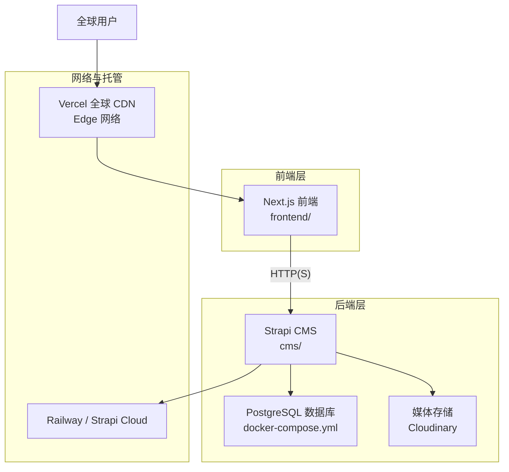
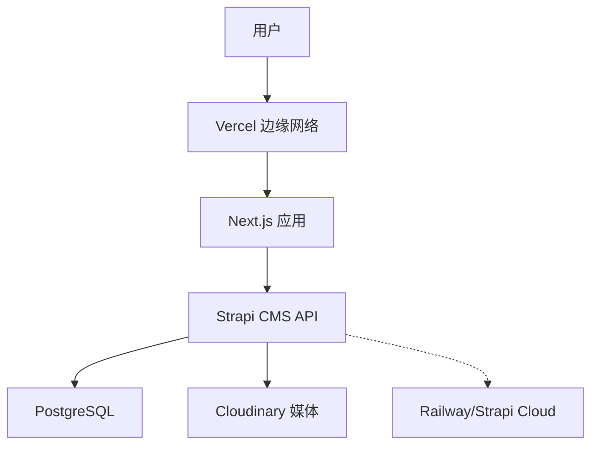
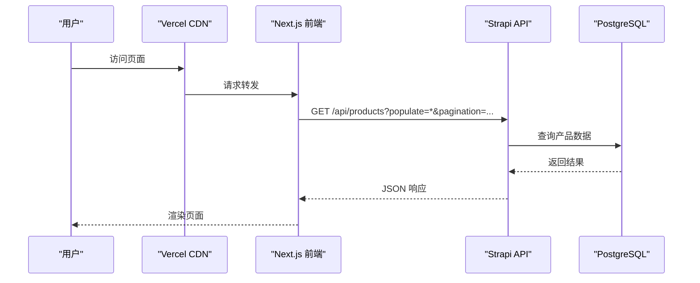
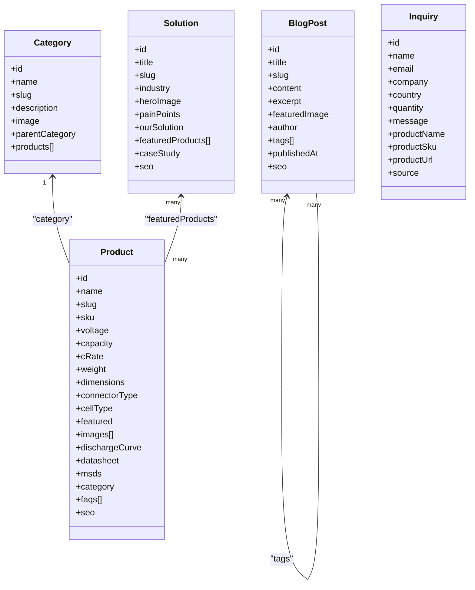
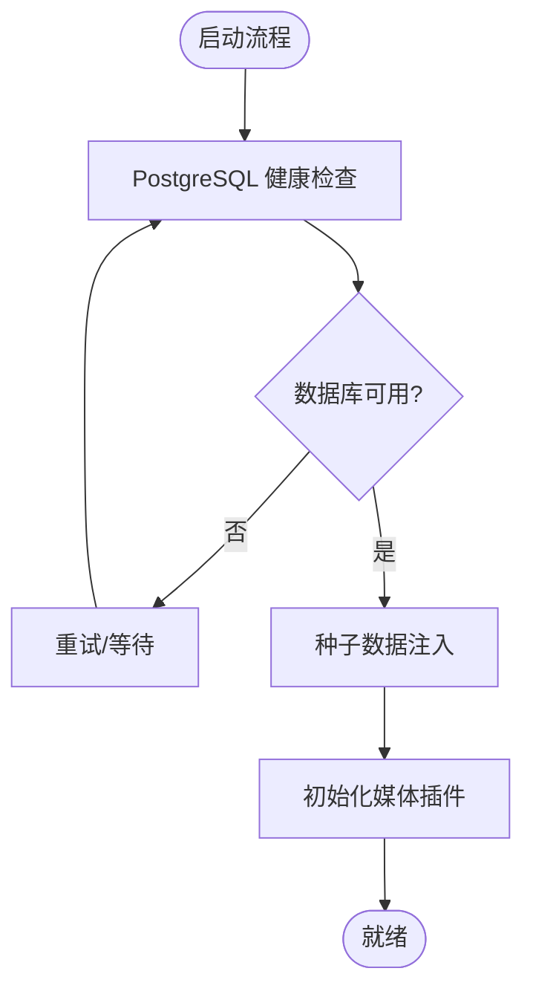
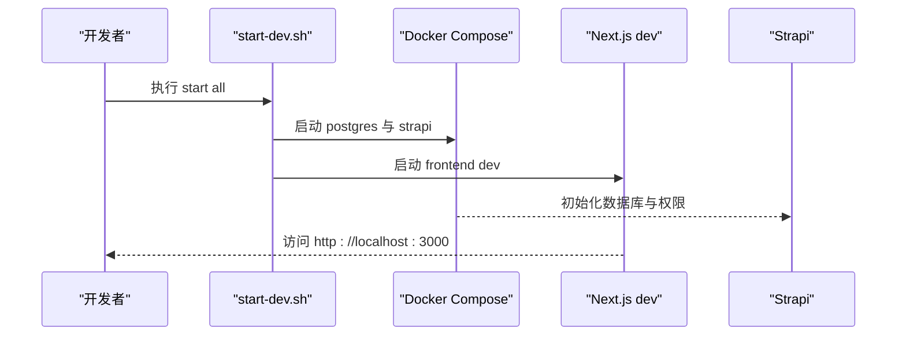
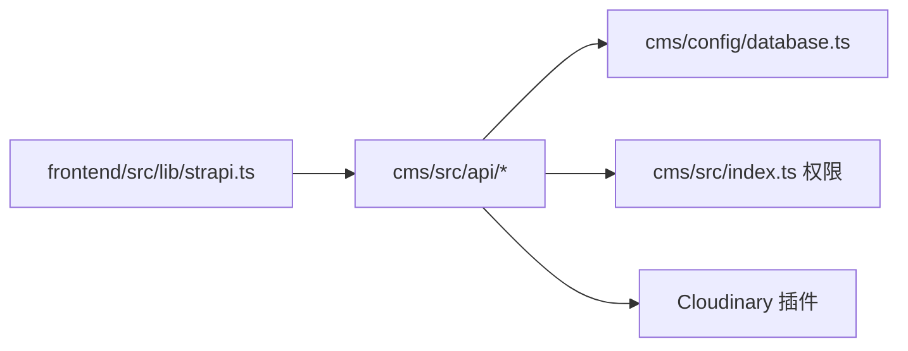

# 整体架构设计

<cite>
**本文引用的文件**
- [WEBSITE_ARCHITECTURE.md](file://WEBSITE_ARCHITECTURE.md)
- [DEPLOYMENT.md](file://DEPLOYMENT.md)
- [start-dev.sh](file://start-dev.sh)
- [cms/package.json](file://cms/package.json)
- [frontend/package.json](file://frontend/package.json)
- [cms/docker-compose.yml](file://cms/docker-compose.yml)
- [cms/Dockerfile](file://cms/Dockerfile)
- [cms/config/database.ts](file://cms/config/database.ts)
- [cms/config/server.ts](file://cms/config/server.ts)
- [frontend/next.config.ts](file://frontend/next.config.ts)
- [frontend/src/lib/strapi.ts](file://frontend/src/lib/strapi.ts)
- [frontend/src/lib/config.ts](file://frontend/src/lib/config.ts)
- [cms/src/index.ts](file://cms/src/index.ts)
- [cms/src/api/product/controllers/product.ts](file://cms/src/api/product/controllers/product.ts)
- [cms/src/api/blog-post/controllers/blog-post.ts](file://cms/src/api/blog-post/controllers/blog-post.ts)
- [cms/src/api/category/controllers/category.ts](file://cms/src/api/category/controllers/category.ts)
- [cms/src/api/inquiry/controllers/inquiry.ts](file://cms/src/api/inquiry/controllers/inquiry.ts)
</cite>

## 目录
1. [引言](#引言)
2. [项目结构](#项目结构)
3. [核心组件](#核心组件)
4. [架构总览](#架构总览)
5. [详细组件分析](#详细组件分析)
6. [依赖分析](#依赖分析)
7. [性能考虑](#性能考虑)
8. [故障排查指南](#故障排查指南)
9. [结论](#结论)
10. [附录](#附录)

## 引言
本文件面向 Battivus 项目的整体架构设计，聚焦前后端分离的微服务架构：Next.js 前端应用、Strapi CMS 后端、PostgreSQL 数据库与 CDN 部署。文档阐述架构决策的技术考量、性能优化策略与可扩展性设计，明确系统边界、组件职责与数据流，并提供架构图与部署拓扑图，覆盖安全、负载均衡与故障恢复机制。

## 项目结构
项目采用多模块组织方式：
- 前端模块（frontend）：基于 Next.js 16 的 App Router，负责页面渲染、SEO、静态资源与 API 调用。
- CMS 模块（cms）：基于 Strapi v5 的 Headless CMS，提供内容管理与 API 网关，内置数据库与媒体存储插件。
- 开发与部署脚本：统一开发控制脚本与部署指南，支持本地开发与生产部署。

**图表来源**
- [DEPLOYMENT.md:10-17](file://DEPLOYMENT.md#L10-L17)
- [cms/docker-compose.yml:1-67](file://cms/docker-compose.yml#L1-L67)
- [cms/package.json:14-25](file://cms/package.json#L14-L25)

**章节来源**
- [WEBSITE_ARCHITECTURE.md:48-95](file://WEBSITE_ARCHITECTURE.md#L48-L95)
- [DEPLOYMENT.md:8-17](file://DEPLOYMENT.md#L8-L17)

## 核心组件
- 前端（Next.js）
  - 使用 App Router 进行页面组织与数据获取，结合 revalidate 实现增量更新与 SEO 友好。
  - 通过环境变量配置 API 地址与只读令牌，实现开发与生产的无缝切换。
- CMS（Strapi）
  - 提供内容类型（产品、分类、博客、方案、询盘）的增删改查接口。
  - 内置用户权限插件，自动配置公开 API 权限；启动时进行种子数据注入。
  - 支持 Cloudinary 媒体上传与 PostgreSQL 数据持久化。
- 数据库（PostgreSQL）
  - 通过 docker-compose 提供本地开发数据库，支持健康检查与持久化卷。
- 部署与托管
  - 前端部署于 Vercel，利用其全球 CDN 与自动构建。
  - 后端可选 Railway 或 Strapi Cloud，均提供 PostgreSQL 与媒体托管能力。

**章节来源**
- [frontend/src/lib/strapi.ts:51-164](file://frontend/src/lib/strapi.ts#L51-L164)
- [cms/src/index.ts:161-217](file://cms/src/index.ts#L161-L217)
- [cms/src/api/product/controllers/product.ts:1-40](file://cms/src/api/product/controllers/product.ts#L1-L40)
- [cms/docker-compose.yml:1-67](file://cms/docker-compose.yml#L1-L67)
- [DEPLOYMENT.md:109-129](file://DEPLOYMENT.md#L109-L129)

## 架构总览
整体采用“前端静态化 + 后端无头 CMS + 数据库 + CDN”的分层架构：
- 前端通过 HTTP(S) 请求访问 CMS API，使用只读令牌提升安全性。
- CMS 作为内容聚合与 API 网关，统一管理内容模型与媒体资源。
- 数据库与媒体存储解耦，便于横向扩展与灾备。
- CDN 将静态资源与动态请求就近分发，提升全球访问性能。

**图表来源**
- [DEPLOYMENT.md:10-17](file://DEPLOYMENT.md#L10-L17)
- [cms/package.json:14-25](file://cms/package.json#L14-L25)

**章节来源**
- [WEBSITE_ARCHITECTURE.md:50-95](file://WEBSITE_ARCHITECTURE.md#L50-L95)
- [DEPLOYMENT.md:29-106](file://DEPLOYMENT.md#L29-L106)

## 详细组件分析

### 组件一：前端（Next.js）与 API 客户端
- 职责
  - 页面渲染与 SEO（动态 meta、sitemap、canonical）。
  - 通过统一的 API 客户端封装调用 Strapi，支持 populate、filters、sort、分页与 revalidate。
  - 提供产品筛选、博客列表、解决方案与询盘提交等业务功能。
- 关键点
  - 环境变量驱动：NEXT_PUBLIC_API_URL、API_TOKEN 控制开发/生产行为。
  - revalidate 策略：60 秒缓存刷新，兼顾性能与新鲜度。
  - 媒体 URL 处理：自动拼接完整路径，兼容相对路径与 CDN。
- 错误处理
  - 对 404 与非 2xx 响应进行降级处理，避免页面崩溃。

**图表来源**
- [frontend/src/lib/strapi.ts:51-164](file://frontend/src/lib/strapi.ts#L51-L164)
- [cms/src/api/product/controllers/product.ts:1-40](file://cms/src/api/product/controllers/product.ts#L1-L40)

**章节来源**
- [frontend/src/lib/strapi.ts:8-119](file://frontend/src/lib/strapi.ts#L8-L119)
- [frontend/src/lib/strapi.ts:170-234](file://frontend/src/lib/strapi.ts#L170-L234)
- [frontend/src/lib/strapi.ts:290-306](file://frontend/src/lib/strapi.ts#L290-L306)

### 组件二：CMS（Strapi）与内容模型
- 职责
  - 提供 REST 风格 API，支持 CRUD 与关系查询。
  - 自动配置公开角色权限，允许匿名访问公开内容并提交询盘。
  - 启动时执行种子数据注入，确保初始内容与关系正确。
- 内容模型
  - 产品：规格参数（电压、容量、C-rate）、图片、数据表、MSDS、SEO 字段。
  - 分类：层级关系与产品关联。
  - 博客：标题、摘要、作者、标签、发布日期、SEO。
  - 方案：行业场景、痛点、解决方案、推荐产品。
  - 询盘：联系信息与来源追踪。
- 安全与权限
  - 仅开放必要 API 权限给公共角色，禁用删除/更新。
  - 使用只读 API 令牌保护敏感操作。

**图表来源**
- [cms/src/index.ts:321-412](file://cms/src/index.ts#L321-L412)

**章节来源**
- [cms/src/api/category/controllers/category.ts:1-40](file://cms/src/api/category/controllers/category.ts#L1-L40)
- [cms/src/api/product/controllers/product.ts:1-40](file://cms/src/api/product/controllers/product.ts#L1-L40)
- [cms/src/api/blog-post/controllers/blog-post.ts:1-53](file://cms/src/api/blog-post/controllers/blog-post.ts#L1-L53)
- [cms/src/api/inquiry/controllers/inquiry.ts:1-40](file://cms/src/api/inquiry/controllers/inquiry.ts#L1-L40)
- [cms/src/index.ts:161-217](file://cms/src/index.ts#L161-L217)

### 组件三：数据库与媒体存储
- 数据库
  - 使用 PostgreSQL，容器内健康检查与持久化卷保障稳定性。
  - 环境变量驱动连接参数，支持 SSL 与端口配置。
- 媒体存储
  - 通过 Cloudinary 插件实现上传与删除，避免容器重启导致资源丢失。
  - 前端统一拼接媒体 URL，适配 CDN 与自建域名。

**图表来源**
- [cms/docker-compose.yml:17-21](file://cms/docker-compose.yml#L17-L21)
- [cms/src/index.ts:219-315](file://cms/src/index.ts#L219-L315)

**章节来源**
- [cms/docker-compose.yml:1-67](file://cms/docker-compose.yml#L1-L67)
- [cms/config/database.ts:1-15](file://cms/config/database.ts#L1-L15)
- [DEPLOYMENT.md:133-163](file://DEPLOYMENT.md#L133-L163)

### 组件四：部署与运行时
- 开发模式
  - 使用统一脚本一键启动 CMS（Docker Compose）与前端（Next.js），支持状态查询与停止。
  - Dockerfile 指定 Node LTS，安装编译依赖并执行构建与复制 schema。
- 生产部署
  - 前端：Vercel 自动构建，根目录指向 frontend，设置 NEXT_PUBLIC_API_URL 与 API_TOKEN。
  - 后端：Railway 或 Strapi Cloud，自动注入数据库连接与媒体配置。
  - 域名与 DNS：分别绑定前端与后端子域，确保 HTTPS 与全球加速。

**图表来源**
- [start-dev.sh:72-100](file://start-dev.sh#L72-L100)
- [cms/docker-compose.yml:23-60](file://cms/docker-compose.yml#L23-L60)
- [frontend/package.json:5-10](file://frontend/package.json#L5-L10)

**章节来源**
- [start-dev.sh:1-195](file://start-dev.sh#L1-L195)
- [cms/Dockerfile:1-43](file://cms/Dockerfile#L1-L43)
- [DEPLOYMENT.md:109-129](file://DEPLOYMENT.md#L109-L129)

## 依赖分析
- 组件耦合
  - 前端对 CMS 的依赖通过 API 接口与只读令牌解耦，降低版本升级风险。
  - CMS 与数据库、媒体存储通过配置文件与环境变量解耦，便于替换供应商。
- 外部依赖
  - Vercel：全局 CDN、自动构建与域名绑定。
  - Railway/Strapi Cloud：托管后端与数据库，提供自动扩容与备份。
  - Cloudinary：媒体上传与缩放，提升图片加载性能。
- 循环依赖
  - 未发现循环依赖，模块边界清晰。

**图表来源**
- [frontend/src/lib/strapi.ts:51-164](file://frontend/src/lib/strapi.ts#L51-L164)
- [cms/src/index.ts:161-217](file://cms/src/index.ts#L161-L217)
- [cms/config/database.ts:1-15](file://cms/config/database.ts#L1-15)

**章节来源**
- [cms/package.json:14-25](file://cms/package.json#L14-L25)
- [frontend/package.json:11-25](file://frontend/package.json#L11-L25)

## 性能考虑
- 前端性能
  - App Router 与增量更新：revalidate 60 秒，平衡新鲜度与缓存命中率。
  - CDN 加速：Vercel 全球节点减少延迟，提升首包时间与带宽效率。
- 后端性能
  - Strapi API 以 JSON 响应为主，避免模板渲染开销。
  - PostgreSQL 连接池与健康检查保障数据库稳定。
- 媒体优化
  - Cloudinary 提供图片压缩、格式转换与按需缩放，降低带宽与加载时间。
- SEO 与索引
  - 动态生成 sitemap、meta 标签与结构化数据，提升搜索引擎可见性。

**章节来源**
- [frontend/src/lib/strapi.ts:111-118](file://frontend/src/lib/strapi.ts#L111-L118)
- [WEBSITE_ARCHITECTURE.md:464-554](file://WEBSITE_ARCHITECTURE.md#L464-L554)

## 故障排查指南
- 常见问题
  - 前端无法访问 CMS：检查 NEXT_PUBLIC_API_URL 与 API_TOKEN 是否正确配置。
  - 媒体资源 404：确认 Cloudinary 插件已启用且凭据正确。
  - 数据库不可用：查看 docker-compose 健康检查日志，确认端口映射与卷挂载。
- 安全加固
  - 生成强随机密钥（如使用密码学安全随机数生成器）。
  - 在 Strapi 角色中仅开启必要权限，禁用删除/更新。
- 数据迁移
  - 使用 Strapi Transfer Token 将本地内容同步至生产环境。

**章节来源**
- [DEPLOYMENT.md:186-220](file://DEPLOYMENT.md#L186-L220)
- [cms/docker-compose.yml:17-21](file://cms/docker-compose.yml#L17-L21)
- [cms/src/index.ts:161-217](file://cms/src/index.ts#L161-L217)

## 结论
该架构以“前端静态化 + 无头 CMS + 数据库 + CDN”为核心，兼顾 SEO、性能与可维护性。通过明确的模块边界、环境变量驱动与只读令牌策略，系统在开发与生产环境中均具备良好的可扩展性与稳定性。建议后续在生产中引入监控与告警、灰度发布与蓝绿部署，进一步提升可靠性与交付效率。

## 附录
- 开发与部署清单
  - 本地开发：使用统一脚本启动，确认端口占用与容器健康。
  - 生产部署：在 Vercel 与 Railway/Strapi Cloud 上分别配置环境变量与域名。
  - 安全检查：密钥强度、最小权限原则与传输加密。

**章节来源**
- [start-dev.sh:120-195](file://start-dev.sh#L120-L195)
- [DEPLOYMENT.md:186-220](file://DEPLOYMENT.md#L186-L220)