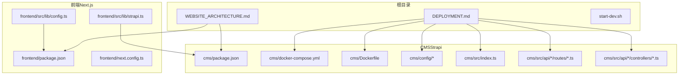
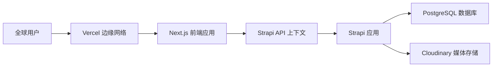
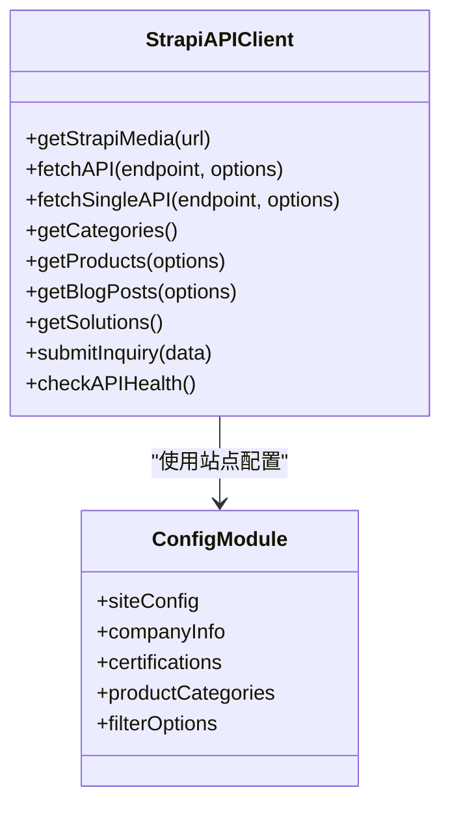
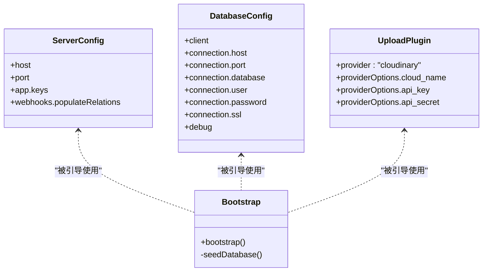
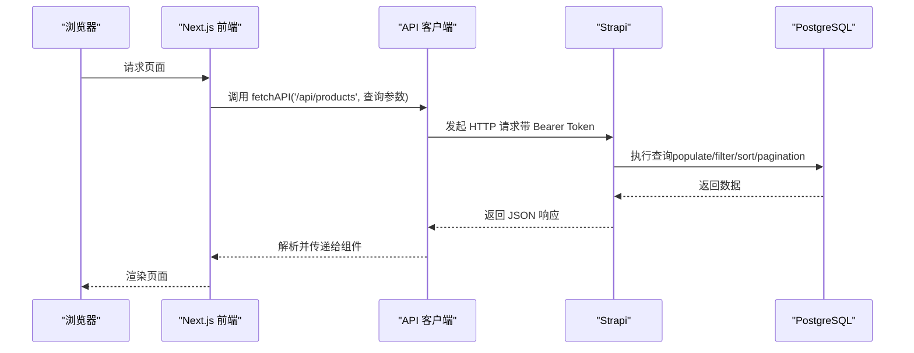
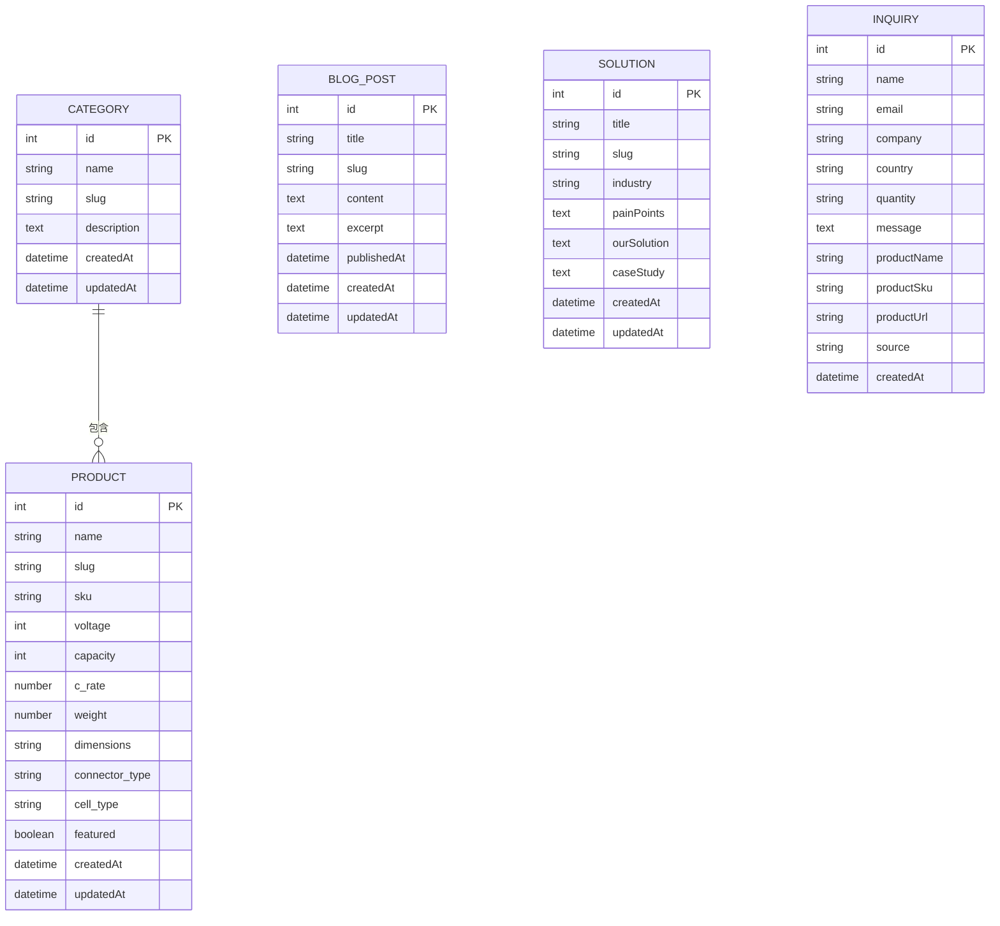
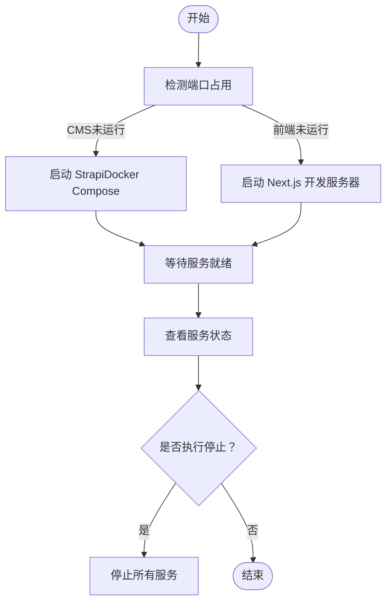
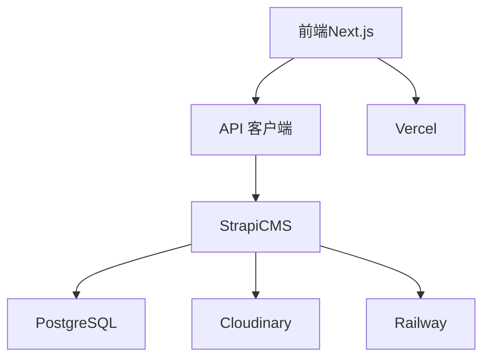

# 系统架构

<cite>
**本文引用的文件**
- [WEBSITE_ARCHITECTURE.md](file://WEBSITE_ARCHITECTURE.md)
- [DEPLOYMENT.md](file://DEPLOYMENT.md)
- [start-dev.sh](file://start-dev.sh)
- [docker-compose.yml](file://cms/docker-compose.yml)
- [Dockerfile](file://cms/Dockerfile)
- [package.json（CMS）](file://cms/package.json)
- [package.json（前端）](file://frontend/package.json)
- [next.config.ts](file://frontend/next.config.ts)
- [config.ts（前端配置）](file://frontend/src/lib/config.ts)
- [strapi.ts（前端API客户端）](file://frontend/src/lib/strapi.ts)
- [index.ts（CMS引导与种子数据）](file://cms/src/index.ts)
- [server.ts（CMS服务器配置）](file://cms/config/server.ts)
- [database.ts（CMS数据库配置）](file://cms/config/database.ts)
- [plugins.ts（CMS插件配置）](file://cms/config/plugins.ts)
- [product 路由](file://cms/src/api/product/routes/product.ts)
- [product 控制器](file://cms/src/api/product/controllers/product.ts)
- [category 控制器](file://cms/src/api/category/controllers/category.ts)
- [blog-post 控制器](file://cms/src/api/blog-post/controllers/blog-post.ts)
</cite>

## 目录
1. [引言](#引言)
2. [项目结构](#项目结构)
3. [核心组件](#核心组件)
4. [架构总览](#架构总览)
5. [详细组件分析](#详细组件分析)
6. [依赖关系分析](#依赖关系分析)
7. [性能考量](#性能考量)
8. [故障排查指南](#故障排查指南)
9. [结论](#结论)
10. [附录](#附录)

## 引言
本文件面向 Battivus B2B 无人机电池网站项目，提供系统架构文档。该系统采用前后端分离的微服务架构：前端使用 Next.js（App Router），后端使用 Strapi（Headless CMS），数据存储采用 PostgreSQL，媒体资源通过 Cloudinary 托管，并通过 Vercel 和 Railway 进行托管与部署。本文档涵盖技术选型、系统上下文与组件交互、数据流、安全与运维、可扩展性与部署拓扑，并给出可视化图示以帮助非技术读者理解。

## 项目结构
仓库采用多模块组织方式：
- cms：Strapi 后端（内容管理与 API）
- frontend：Next.js 前端（静态生成/服务端渲染）
- 根目录文档：架构说明、部署指南、开发脚本

图表来源
- [WEBSITE_ARCHITECTURE.md](file://WEBSITE_ARCHITECTURE.md)
- [DEPLOYMENT.md](file://DEPLOYMENT.md)
- [start-dev.sh](file://start-dev.sh)
- [package.json（CMS）](file://cms/package.json)
- [package.json（前端）](file://frontend/package.json)
- [docker-compose.yml](file://cms/docker-compose.yml)
- [Dockerfile](file://cms/Dockerfile)
- [server.ts](file://cms/config/server.ts)
- [database.ts](file://cms/config/database.ts)
- [plugins.ts](file://cms/config/plugins.ts)
- [index.ts](file://cms/src/index.ts)
- [product 路由](file://cms/src/api/product/routes/product.ts)
- [product 控制器](file://cms/src/api/product/controllers/product.ts)
- [category 控制器](file://cms/src/api/category/controllers/category.ts)
- [blog-post 控制器](file://cms/src/api/blog-post/controllers/blog-post.ts)
- [next.config.ts](file://frontend/next.config.ts)
- [config.ts（前端配置）](file://frontend/src/lib/config.ts)
- [strapi.ts（前端API客户端）](file://frontend/src/lib/strapi.ts)

章节来源
- [WEBSITE_ARCHITECTURE.md](file://WEBSITE_ARCHITECTURE.md)
- [DEPLOYMENT.md](file://DEPLOYMENT.md)
- [start-dev.sh](file://start-dev.sh)

## 核心组件
- 前端（Next.js）
  - 使用 App Router，支持静态生成与服务端渲染，具备良好的 SEO 性能与 Core Web Vitals 表现。
  - 通过自定义 API 客户端封装与 Strapi 通信，统一处理查询参数、分页、鉴权头等。
- 后端（Strapi）
  - Headless CMS，提供 REST 风格 API；内置用户权限与上传插件，支持 Cloudinary 媒体托管。
  - 通过 Dockerfile 与 docker-compose 支持本地开发与生产容器化部署。
- 数据层（PostgreSQL）
  - 作为 Strapi 的默认数据库，支持关系型数据与媒体资源索引。
- 媒体与静态资源（Cloudinary）
  - 提供图片与文件托管，避免容器重启导致的数据丢失。
- 部署与边缘网络（Vercel + Railway + CDN）
  - 前端在 Vercel 上自动构建与全球分发；后端在 Railway 上托管并提供数据库；CDN 加速访问。

章节来源
- [package.json（前端）](file://frontend/package.json)
- [next.config.ts](file://frontend/next.config.ts)
- [strapi.ts（前端API客户端）](file://frontend/src/lib/strapi.ts)
- [package.json（CMS）](file://cms/package.json)
- [Dockerfile](file://cms/Dockerfile)
- [docker-compose.yml](file://cms/docker-compose.yml)
- [plugins.ts](file://cms/config/plugins.ts)
- [DEPLOYMENT.md](file://DEPLOYMENT.md)

## 架构总览
系统采用“前端静态化 + 后端无头 CMS + 关系型数据库 + 全球 CDN”的架构。用户请求经由 Vercel 边缘网络到达前端，前端通过 API 客户端调用 Strapi，Strapi 访问 PostgreSQL 并从 Cloudinary 获取媒体资源。

图表来源
- [DEPLOYMENT.md](file://DEPLOYMENT.md)
- [strapi.ts（前端API客户端）](file://frontend/src/lib/strapi.ts)
- [plugins.ts](file://cms/config/plugins.ts)
- [database.ts](file://cms/config/database.ts)

## 详细组件分析

### 前端（Next.js）组件
- 配置与构建
  - 使用 next.config.ts 进行基础配置；前端依赖 Next.js 与 React 生态。
  - 开发环境通过 start-dev.sh 启动，便于同时启动 CMS 与前端。
- API 客户端
  - 统一封装 fetchAPI/fetchSingleAPI，支持 populate、filters、sort、pagination 等参数。
  - 自动注入 Authorization 头（Bearer Token），并设置 revalidate 缓存策略。
  - 提供产品、博客、解决方案、分类、询盘提交等接口方法。
- 配置与导航
  - config.ts 提供站点信息、导航、关键词、认证证书、产品分类与筛选选项等常量。

图表来源
- [strapi.ts（前端API客户端）](file://frontend/src/lib/strapi.ts)
- [config.ts（前端配置）](file://frontend/src/lib/config.ts)

章节来源
- [next.config.ts](file://frontend/next.config.ts)
- [strapi.ts（前端API客户端）](file://frontend/src/lib/strapi.ts)
- [config.ts（前端配置）](file://frontend/src/lib/config.ts)
- [start-dev.sh](file://start-dev.sh)

### 后端（Strapi）组件
- 服务器与数据库配置
  - server.ts 指定监听地址、端口与密钥；database.ts 配置 PostgreSQL 连接参数。
- 插件与媒体
  - plugins.ts 配置 Cloudinary 上传提供程序，实现媒体资源的云端存储与删除。
- 引导与权限
  - index.ts 在应用启动时为公共角色授予只读 API 权限，并按需执行种子数据写入，确保初始内容与关系正确。
- API 路由与控制器
  - product/category/blog-post 等内容类型均提供标准 CRUD 路由与控制器，支持分页、过滤与排序。

图表来源
- [server.ts](file://cms/config/server.ts)
- [database.ts](file://cms/config/database.ts)
- [plugins.ts](file://cms/config/plugins.ts)
- [index.ts](file://cms/src/index.ts)

章节来源
- [server.ts](file://cms/config/server.ts)
- [database.ts](file://cms/config/database.ts)
- [plugins.ts](file://cms/config/plugins.ts)
- [index.ts](file://cms/src/index.ts)

### API 流程（前端到后端）
以下序列图展示前端页面加载时的关键调用链：Next.js 页面发起请求，通过 API 客户端调用 Strapi，Strapi 查询数据库并返回结果。

图表来源
- [strapi.ts（前端API客户端）](file://frontend/src/lib/strapi.ts)
- [product 路由](file://cms/src/api/product/routes/product.ts)
- [product 控制器](file://cms/src/api/product/controllers/product.ts)
- [database.ts](file://cms/config/database.ts)

章节来源
- [strapi.ts（前端API客户端）](file://frontend/src/lib/strapi.ts)
- [product 路由](file://cms/src/api/product/routes/product.ts)
- [product 控制器](file://cms/src/api/product/controllers/product.ts)

### 数据模型与内容类型
系统的核心内容类型包括：产品（Product）、分类（Category）、博客文章（BlogPost）、解决方案（Solution）、询盘（Inquiry）。这些类型通过 Strapi 的内容管理界面进行维护，并通过 API 对前端开放。

图表来源
- [WEBSITE_ARCHITECTURE.md](file://WEBSITE_ARCHITECTURE.md)
- [index.ts（CMS引导与种子数据）](file://cms/src/index.ts)

章节来源
- [WEBSITE_ARCHITECTURE.md](file://WEBSITE_ARCHITECTURE.md)
- [index.ts（CMS引导与种子数据）](file://cms/src/index.ts)

### 开发与本地运行流程
start-dev.sh 提供一键启动/停止/状态检查功能，支持同时或分别启动 CMS（Docker Compose）与前端（Next.js 开发服务器）。

图表来源
- [start-dev.sh](file://start-dev.sh)
- [docker-compose.yml](file://cms/docker-compose.yml)

章节来源
- [start-dev.sh](file://start-dev.sh)
- [docker-compose.yml](file://cms/docker-compose.yml)

## 依赖关系分析
- 技术栈与版本约束
  - 前端：Next.js 16.1.1、React 19.2.3、TailwindCSS 4、TypeScript 5。
  - 后端：Strapi 5.5.1、Node.js 18–22、PostgreSQL 16（容器镜像）。
  - 媒体：Cloudinary 上传提供程序。
- 组件耦合与内聚
  - 前端通过 API 客户端与后端解耦；后端通过插件机制与数据库、媒体解耦。
  - 内容类型与路由/控制器一一对应，职责清晰，内聚度高。
- 外部依赖与集成点
  - Vercel：前端托管与全球分发。
  - Railway：后端托管与数据库服务。
  - Cloudinary：媒体资源托管。
  - GitHub：代码托管与 CI/CD 触发。

图表来源
- [package.json（前端）](file://frontend/package.json)
- [package.json（CMS）](file://cms/package.json)
- [DEPLOYMENT.md](file://DEPLOYMENT.md)

章节来源
- [package.json（前端）](file://frontend/package.json)
- [package.json（CMS）](file://cms/package.json)
- [DEPLOYMENT.md](file://DEPLOYMENT.md)

## 性能考量
- 前端性能
  - 使用 App Router 的 SSR/SSG，结合 revalidate 缓存策略，提升首屏速度与 SEO。
  - TailwindCSS 与最小化构建，减少打包体积。
- 后端性能
  - Dockerfile 中安装必要原生模块依赖，保证编译与运行效率。
  - docker-compose 健康检查与端口映射，便于本地快速验证。
- 数据库与媒体
  - PostgreSQL 作为主存储，配合 Cloudinary 提升媒体加载性能与可靠性。
- CDN 与边缘网络
  - Vercel 全球边缘节点加速静态资源与动态请求，降低延迟。

## 故障排查指南
- 常见问题定位
  - 前端无法连接后端：检查 NEXT_PUBLIC_API_URL 与 API_TOKEN 是否正确配置；确认 Strapi 已启动且可访问。
  - 媒体资源 404：确认 Cloudinary 插件已启用并正确配置密钥；检查上传权限与 CORS 设置。
  - 数据库连接失败：核对 DATABASE_URL、主机名、端口、凭据；确认容器健康状态。
- 运维建议
  - 使用 start-dev.sh 快速检查服务状态与端口占用。
  - 在 Railway/Strapi Cloud 中开启自动备份与监控告警。
  - 严格控制公共 API 权限，仅开放必要读取权限，禁用写/删操作。

章节来源
- [strapi.ts（前端API客户端）](file://frontend/src/lib/strapi.ts)
- [plugins.ts](file://cms/config/plugins.ts)
- [database.ts](file://cms/config/database.ts)
- [start-dev.sh](file://start-dev.sh)

## 结论
Battivus 项目采用“Next.js + Strapi + PostgreSQL + CDN”的成熟组合，兼顾 SEO、性能与可维护性。通过清晰的模块划分、标准化的 API 客户端与完善的部署文档，团队可以高效迭代内容与功能，满足 B2B 场景下的专业展示与转化目标。

## 附录
- 基础设施与部署拓扑
  - 前端：Vercel（自动部署、全球 CDN）
  - 后端：Railway（容器化 Strapi + PostgreSQL）
  - 媒体：Cloudinary（上传与加速）
  - CI/CD：Git 推送触发自动部署
- 可扩展性建议
  - 前端：按需扩展页面与组件，保持 API 客户端稳定。
  - 后端：引入缓存层（如 Redis）与异步任务队列，优化高并发场景。
  - 监控与日志：接入 APM 与日志聚合平台，建立告警机制。
- 安全与合规
  - 强制 HTTPS、最小权限原则、定期轮换密钥、启用 WAF 与速率限制。
- 灾难恢复
  - 定期备份数据库与媒体资源；制定回滚与切换方案；演练跨区域恢复流程。