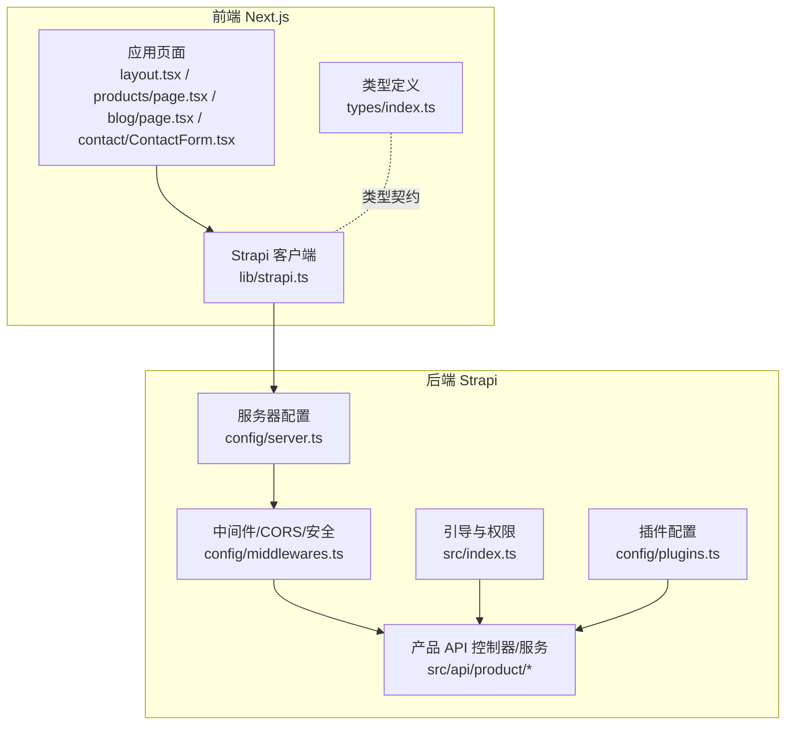
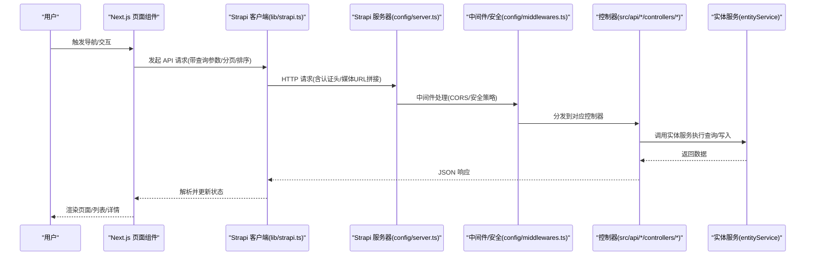
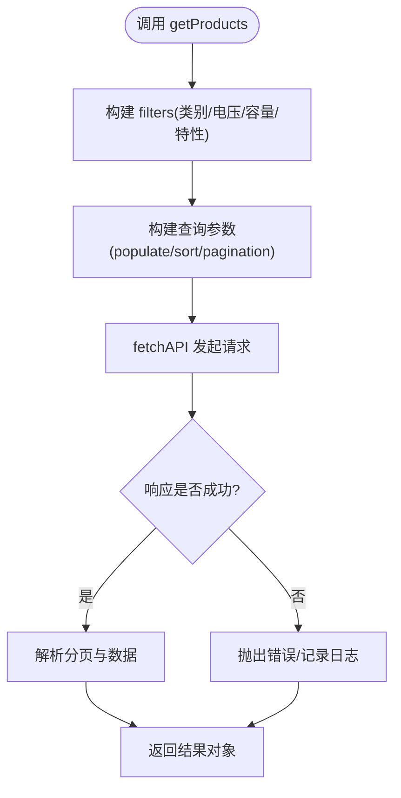
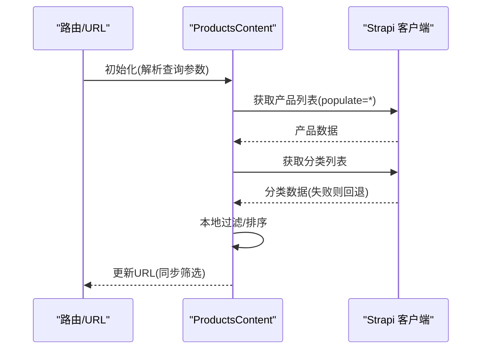
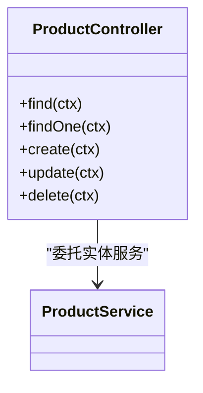
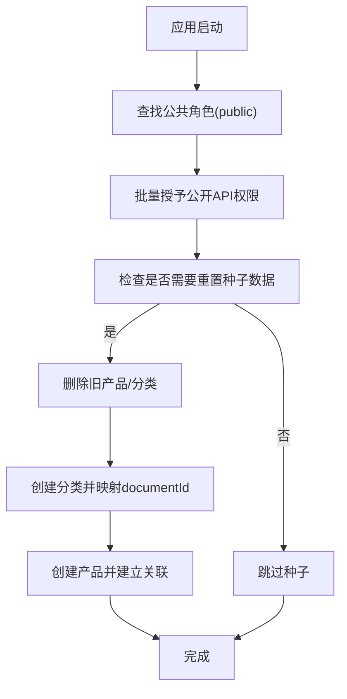
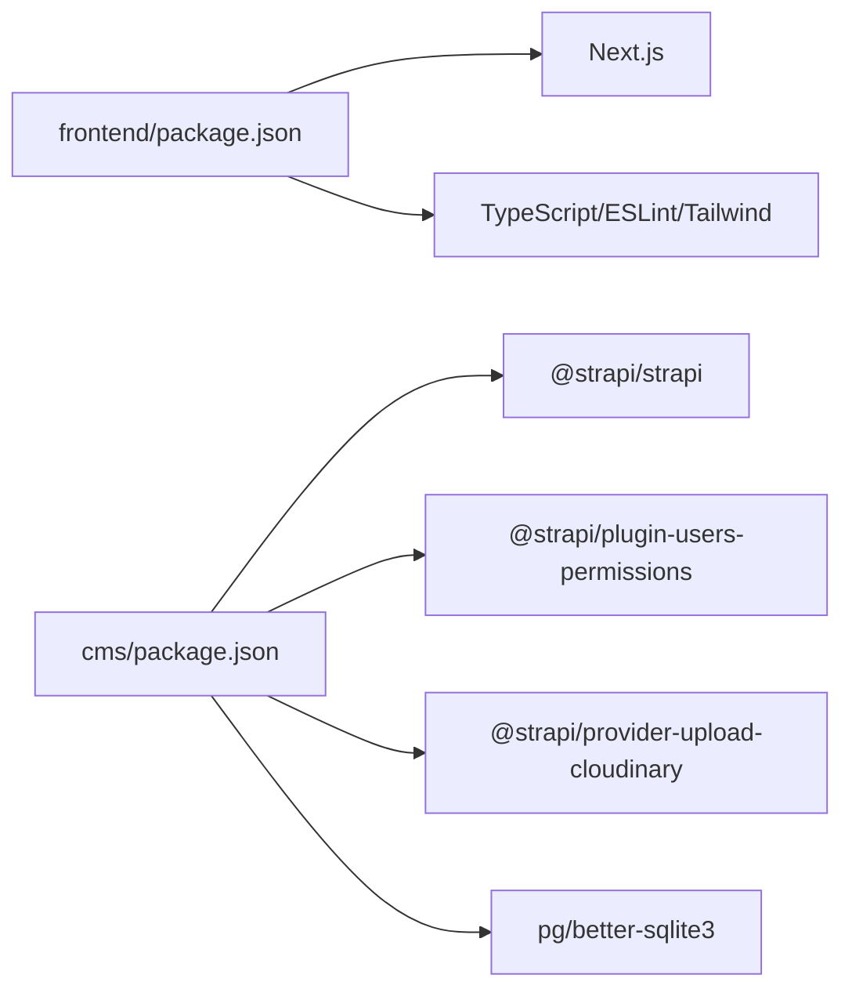

# 组件交互模式

<cite>
**本文引用的文件**
- [cms/package.json](file://cms/package.json)
- [frontend/package.json](file://frontend/package.json)
- [cms/src/index.ts](file://cms/src/index.ts)
- [cms/config/server.ts](file://cms/config/server.ts)
- [cms/config/middlewares.ts](file://cms/config/middlewares.ts)
- [cms/config/plugins.ts](file://cms/config/plugins.ts)
- [cms/src/api/product/controllers/product.ts](file://cms/src/api/product/controllers/product.ts)
- [cms/src/api/product/services/product.ts](file://cms/src/api/product/services/product.ts)
- [frontend/src/lib/strapi.ts](file://frontend/src/lib/strapi.ts)
- [frontend/src/app/layout.tsx](file://frontend/src/app/layout.tsx)
- [frontend/src/app/products/page.tsx](file://frontend/src/app/products/page.tsx)
- [frontend/src/app/blog/page.tsx](file://frontend/src/app/blog/page.tsx)
- [frontend/src/app/contact/ContactForm.tsx](file://frontend/src/app/contact/ContactForm.tsx)
- [frontend/src/types/index.ts](file://frontend/src/types/index.ts)
</cite>

## 目录
1. [简介](#简介)
2. [项目结构](#项目结构)
3. [核心组件](#核心组件)
4. [架构总览](#架构总览)
5. [详细组件分析](#详细组件分析)
6. [依赖关系分析](#依赖关系分析)
7. [性能考量](#性能考量)
8. [故障排查指南](#故障排查指南)
9. [结论](#结论)
10. [附录](#附录)

## 简介
本文件系统性梳理 Battivus 项目中前端 Next.js 应用与 Strapi CMS 后端之间的组件交互模式，覆盖数据交换机制（API 调用流程、认证与鉴权、错误处理）、组件间通信协议、状态管理与数据同步、请求-响应模式、实时更新机制与缓存策略，并提供具体调用链路图与实践建议。目标是帮助开发者快速理解从前端用户交互到后端内容返回的完整流程，以及在生产环境中的跨域、安全与性能优化要点。

## 项目结构
项目采用前后端分离架构：前端使用 Next.js（App Router），后端使用 Strapi v5。前端通过统一的 Strapi 客户端封装发起请求，后端通过控制器与服务层处理业务逻辑，并通过插件与中间件实现上传、CORS、安全策略等。

图表来源
- [frontend/src/app/layout.tsx:66-99](file://frontend/src/app/layout.tsx#L66-L99)
- [frontend/src/app/products/page.tsx:1-580](file://frontend/src/app/products/page.tsx#L1-L580)
- [frontend/src/app/blog/page.tsx:1-203](file://frontend/src/app/blog/page.tsx#L1-L203)
- [frontend/src/app/contact/ContactForm.tsx:1-269](file://frontend/src/app/contact/ContactForm.tsx#L1-L269)
- [frontend/src/lib/strapi.ts:1-412](file://frontend/src/lib/strapi.ts#L1-L412)
- [frontend/src/types/index.ts:1-157](file://frontend/src/types/index.ts#L1-L157)
- [cms/src/index.ts:161-217](file://cms/src/index.ts#L161-L217)
- [cms/config/server.ts:1-11](file://cms/config/server.ts#L1-L11)
- [cms/config/middlewares.ts:1-32](file://cms/config/middlewares.ts#L1-L32)
- [cms/config/plugins.ts:1-19](file://cms/config/plugins.ts#L1-L19)
- [cms/src/api/product/controllers/product.ts:1-40](file://cms/src/api/product/controllers/product.ts#L1-L40)

章节来源
- [frontend/src/app/layout.tsx:66-99](file://frontend/src/app/layout.tsx#L66-L99)
- [frontend/src/lib/strapi.ts:1-412](file://frontend/src/lib/strapi.ts#L1-L412)
- [cms/src/index.ts:161-217](file://cms/src/index.ts#L161-L217)
- [cms/config/middlewares.ts:1-32](file://cms/config/middlewares.ts#L1-L32)

## 核心组件
- 前端应用层
  - 页面组件负责路由与渲染，如产品页、博客页、联系表单页。
  - 使用 Suspense 进行水合前的骨架屏占位，提升首屏体验。
- 前端数据层
  - Strapi 客户端封装了统一的请求构建、查询参数序列化、分页与排序、媒体资源拼接、认证头注入与错误处理。
  - 提供分类、产品、博客、解决方案、询盘提交等 API 方法。
- 后端数据层
  - Strapi 引导脚本在启动时自动配置公开角色的 API 权限，并按需进行种子数据重置。
  - 中间件启用安全策略与 CORS，允许跨域访问以适配 Vercel 预览环境。
  - 插件配置云存储（Cloudinary）用于媒体上传与加速。
  - 产品 API 的控制器直接委托 entityService 执行 CRUD 操作。

章节来源
- [frontend/src/app/products/page.tsx:1-580](file://frontend/src/app/products/page.tsx#L1-L580)
- [frontend/src/app/blog/page.tsx:1-203](file://frontend/src/app/blog/page.tsx#L1-L203)
- [frontend/src/app/contact/ContactForm.tsx:1-269](file://frontend/src/app/contact/ContactForm.tsx#L1-L269)
- [frontend/src/lib/strapi.ts:51-164](file://frontend/src/lib/strapi.ts#L51-L164)
- [cms/src/index.ts:161-217](file://cms/src/index.ts#L161-L217)
- [cms/config/middlewares.ts:18-24](file://cms/config/middlewares.ts#L18-L24)
- [cms/config/plugins.ts:3-16](file://cms/config/plugins.ts#L3-L16)
- [cms/src/api/product/controllers/product.ts:1-40](file://cms/src/api/product/controllers/product.ts#L1-L40)

## 架构总览
下图展示了从用户交互到数据展示的完整链路：浏览器发起请求，Next.js 页面组件通过 Strapi 客户端调用 Strapi API；后端根据中间件与安全策略处理请求，控制器调用实体服务完成数据读取或写入；最终返回 JSON 数据并在前端渲染。

图表来源
- [frontend/src/lib/strapi.ts:51-164](file://frontend/src/lib/strapi.ts#L51-L164)
- [cms/config/server.ts:1-11](file://cms/config/server.ts#L1-L11)
- [cms/config/middlewares.ts:1-32](file://cms/config/middlewares.ts#L1-L32)
- [cms/src/api/product/controllers/product.ts:1-40](file://cms/src/api/product/controllers/product.ts#L1-L40)

## 详细组件分析

### 前端数据客户端（Strapi 客户端）
- 功能职责
  - 构建查询参数：支持 populate、filters（含嵌套关系过滤）、sort、分页。
  - 统一请求头：JSON 内容类型与可选的 Bearer 认证头。
  - 媒体资源拼接：自动补齐相对路径为完整 URL。
  - 缓存与增量刷新：使用 Next.js fetch 的 revalidate 参数实现增量缓存。
  - 错误处理：对非 2xx 响应抛出异常，单条查询对 404 返回空值。
  - 公共 API：提供分类、产品、博客、解决方案、询盘提交等方法。
- 关键实现位置
  - 查询构建与 fetch 封装：[fetchAPI:51-119](file://frontend/src/lib/strapi.ts#L51-L119)、[fetchSingleAPI:121-164](file://frontend/src/lib/strapi.ts#L121-L164)
  - 媒体 URL 处理：[getStrapiMedia:11-23](file://frontend/src/lib/strapi.ts#L11-L23)
  - 产品查询与筛选：[getProducts:185-219](file://frontend/src/lib/strapi.ts#L185-L219)、[getProductBySlug:221-225](file://frontend/src/lib/strapi.ts#L221-L225)
  - 博客查询与筛选：[getBlogPosts:242-259](file://frontend/src/lib/strapi.ts#L242-L259)、[getBlogPostBySlug:261-265](file://frontend/src/lib/strapi.ts#L261-L265)
  - 询盘提交：[submitInquiry:291-306](file://frontend/src/lib/strapi.ts#L291-L306)

图表来源
- [frontend/src/lib/strapi.ts:185-219](file://frontend/src/lib/strapi.ts#L185-L219)

章节来源
- [frontend/src/lib/strapi.ts:11-412](file://frontend/src/lib/strapi.ts#L11-L412)

### 产品页面（Products Page）
- 功能职责
  - 从 URL 查询参数解析初始筛选条件，支持电压、容量范围、放电率、电池类型与分类筛选。
  - 并行拉取产品与分类数据，失败时回退到配置数据。
  - 本地过滤与排序，移动端侧边栏筛选，URL 同步。
  - 使用 Suspense 提供骨架屏占位，提升加载体验。
- 关键实现位置
  - 侧边栏筛选与 URL 同步：[ProductFilterSidebar:47-212](file://frontend/src/app/products/page.tsx#L47-L212)、[handleFilterChange:362-377](file://frontend/src/app/products/page.tsx#L362-L377)
  - 数据获取与回退：[useEffect fetchData:314-360](file://frontend/src/app/products/page.tsx#L314-L360)
  - 本地过滤逻辑：[filteredProducts:378-401](file://frontend/src/app/products/page.tsx#L378-L401)

图表来源
- [frontend/src/app/products/page.tsx:278-377](file://frontend/src/app/products/page.tsx#L278-L377)
- [frontend/src/lib/strapi.ts:171-182](file://frontend/src/lib/strapi.ts#L171-L182)

章节来源
- [frontend/src/app/products/page.tsx:1-580](file://frontend/src/app/products/page.tsx#L1-L580)

### 博客页面（Blog Page）
- 功能职责
  - 通过 Strapi 客户端获取博客文章列表与分页元信息，支持标签筛选。
  - 展示文章卡片、作者信息、标签与发布时间。
  - 分页导航与“无内容”回退。
- 关键实现位置
  - 博客查询与分页：[getBlogPosts:15-22](file://frontend/src/app/blog/page.tsx#L15-L22)
  - 图片媒体拼接：[getStrapiMedia:49-49](file://frontend/src/app/blog/page.tsx#L49-L49)

章节来源
- [frontend/src/app/blog/page.tsx:1-203](file://frontend/src/app/blog/page.tsx#L1-L203)
- [frontend/src/lib/strapi.ts:11-23](file://frontend/src/lib/strapi.ts#L11-L23)

### 联系表单（Contact Form）
- 功能职责
  - 收集用户输入，组装询盘数据并调用后端提交接口。
  - 成功后显示确认态并清空表单，失败显示错误提示。
- 关键实现位置
  - 表单提交：[handleSubmit:20-58](file://frontend/src/app/contact/ContactForm.tsx#L20-L58)
  - 询盘提交调用：[submitInquiry:35-35](file://frontend/src/app/contact/ContactForm.tsx#L35-L35)

章节来源
- [frontend/src/app/contact/ContactForm.tsx:1-269](file://frontend/src/app/contact/ContactForm.tsx#L1-L269)
- [frontend/src/lib/strapi.ts:291-306](file://frontend/src/lib/strapi.ts#L291-L306)

### 后端 API 控制器与服务
- 产品 API 控制器
  - 提供 find/findOne/create/update/delete，直接委托 entityService 执行。
- 产品 API 服务
  - 当前为空实现，便于扩展业务逻辑。
- 关键实现位置
  - 控制器：[product 控制器:1-40](file://cms/src/api/product/controllers/product.ts#L1-L40)
  - 服务：[product 服务:1-2](file://cms/src/api/product/services/product.ts#L1-L2)

图表来源
- [cms/src/api/product/controllers/product.ts:1-40](file://cms/src/api/product/controllers/product.ts#L1-L40)
- [cms/src/api/product/services/product.ts:1-2](file://cms/src/api/product/services/product.ts#L1-L2)

章节来源
- [cms/src/api/product/controllers/product.ts:1-40](file://cms/src/api/product/controllers/product.ts#L1-L40)
- [cms/src/api/product/services/product.ts:1-2](file://cms/src/api/product/services/product.ts#L1-L2)

### 后端引导与权限配置
- 启动阶段
  - 自动获取“public”角色并批量授予公开 API 权限（分类/产品/博客/解决方案的查询与创建）。
  - 种子数据库：若检测到需要重置，则删除旧数据并重建分类与产品关联。
- 关键实现位置
  - 权限配置与种子：[bootstrap:161-217](file://cms/src/index.ts#L161-L217)、[seedDatabase:219-315](file://cms/src/index.ts#L219-L315)

图表来源
- [cms/src/index.ts:161-315](file://cms/src/index.ts#L161-L315)

章节来源
- [cms/src/index.ts:161-315](file://cms/src/index.ts#L161-L315)

### 中间件与安全策略
- 安全中间件
  - 内容安全策略（CSP）限制连接源与媒体源，提升 XSS 与注入风险防护。
- CORS 中间件
  - 允许所有来源与头部，便于在 Vercel 预览 URL 等环境下正常联调。
- 关键实现位置
  - 安全与 CORS 配置：[middlewares:4-24](file://cms/config/middlewares.ts#L4-L24)

章节来源
- [cms/config/middlewares.ts:1-32](file://cms/config/middlewares.ts#L1-L32)

### 插件与媒体上传
- 上传插件
  - 使用 Cloudinary 提供的 provider 与 actionOptions，支持上传与删除。
- 关键实现位置
  - 插件配置：[plugins:3-16](file://cms/config/plugins.ts#L3-L16)

章节来源
- [cms/config/plugins.ts:1-19](file://cms/config/plugins.ts#L1-L19)

## 依赖关系分析
- 前端依赖
  - Next.js 16 与 React 19，类型与工具链由 TypeScript 与 ESLint/Tailwind 等维护。
- 后端依赖
  - Strapi 5、Users Permissions 插件、Cloudinary 上传提供者、数据库驱动（pg/better-sqlite3）。
- 关键实现位置
  - 前端依赖：[frontend/package.json:1-26](file://frontend/package.json#L1-L26)
  - 后端依赖：[cms/package.json:1-36](file://cms/package.json#L1-L36)

图表来源
- [frontend/package.json:1-26](file://frontend/package.json#L1-L26)
- [cms/package.json:1-36](file://cms/package.json#L1-L36)

章节来源
- [frontend/package.json:1-26](file://frontend/package.json#L1-L26)
- [cms/package.json:1-36](file://cms/package.json#L1-L36)

## 性能考量
- 增量缓存与再验证
  - 前端 fetch 默认设置 revalidate 为 60 秒，适合内容更新频率较低的场景，减少重复请求与数据库压力。
  - 参考：[fetchAPI/fetchSingleAPI:109-112](file://frontend/src/lib/strapi.ts#L109-L112)、[fetchAPI/fetchSingleAPI:148-151](file://frontend/src/lib/strapi.ts#L148-L151)
- 分页与排序
  - 后端控制器直接透传查询参数，前端可结合分页与排序避免一次性加载大量数据。
  - 参考：[product 控制器:4-17](file://cms/src/api/product/controllers/product.ts#L4-L17)
- 媒体资源优化
  - 通过 Cloudinary 提供的上传与裁剪能力，配合 CSP 的媒体源白名单，确保图片加载性能与安全性。
  - 参考：[plugins:3-16](file://cms/config/plugins.ts#L3-L16)、[middlewares:10-14](file://cms/config/middlewares.ts#L10-L14)
- 首屏体验
  - 使用 Suspense 与骨架屏，降低感知延迟。
  - 参考：[products/page.tsx:560-579](file://frontend/src/app/products/page.tsx#L560-L579)

## 故障排查指南
- 常见问题定位
  - API 404：单条查询在 404 时返回空值，检查 slug 是否正确或内容是否发布。
    - 参考：[fetchSingleAPI:153-156](file://frontend/src/lib/strapi.ts#L153-L156)
  - API 401/403：确认 STRAPI_API_TOKEN 是否配置，且后端已授予相应权限。
    - 参考：[middlewares 权限授予:172-208](file://cms/src/index.ts#L172-L208)
  - CORS 报错：确认 CORS 中间件允许来源与头部。
    - 参考：[middlewares CORS:18-24](file://cms/config/middlewares.ts#L18-L24)
  - 媒体无法加载：确认媒体 URL 拼接逻辑与 CSP 媒体源白名单。
    - 参考：[getStrapiMedia:11-23](file://frontend/src/lib/strapi.ts#L11-L23)、[middlewares CSP:10-14](file://cms/config/middlewares.ts#L10-L14)
- 日志与健康检查
  - 后端引导日志输出重置与创建过程，便于定位种子数据问题。
    - 参考：[bootstrap/seedDatabase:219-315](file://cms/src/index.ts#L219-L315)
  - 前端健康检查方法可用于诊断后端可达性。
    - 参考：[checkAPIHealth:309-316](file://frontend/src/lib/strapi.ts#L309-L316)

章节来源
- [frontend/src/lib/strapi.ts:11-412](file://frontend/src/lib/strapi.ts#L11-L412)
- [cms/src/index.ts:161-315](file://cms/src/index.ts#L161-L315)
- [cms/config/middlewares.ts:1-32](file://cms/config/middlewares.ts#L1-L32)

## 结论
Battivus 项目通过清晰的前后端分层与统一的 Strapi 客户端封装，实现了稳定的数据交换与良好的用户体验。前端侧利用 Next.js 的增量缓存与 Suspense 提升性能与可用性，后端侧通过中间件与权限配置保障安全与跨域兼容。后续可在以下方面持续优化：引入更细粒度的缓存控制、增强错误边界与监控告警、完善鉴权与敏感字段脱敏、以及在产品控制器中扩展业务逻辑与校验规则。

## 附录
- 环境变量与部署
  - 前端 NEXT_PUBLIC_STRAPI_URL 与 STRAPI_API_TOKEN 用于指定后端地址与认证令牌。
  - 参考：[frontend/src/lib/strapi.ts:8-9](file://frontend/src/lib/strapi.ts#L8-L9)
- 类型契约
  - 前端 types/index.ts 定义了产品、分类、博客、解决方案与询盘等类型，与 Strapi schema 对齐。
  - 参考：[types/index.ts:23-157](file://frontend/src/types/index.ts#L23-L157)