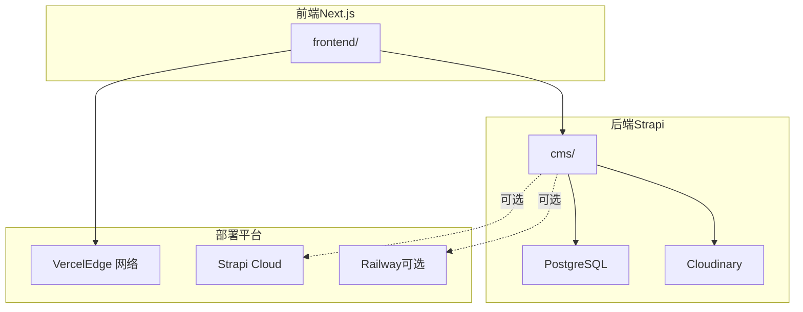
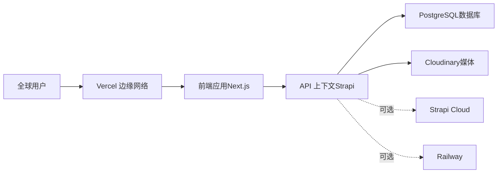
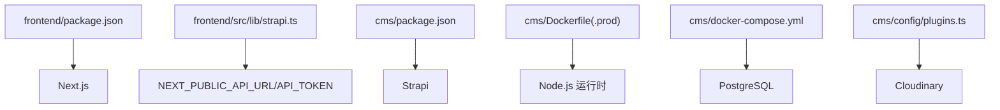
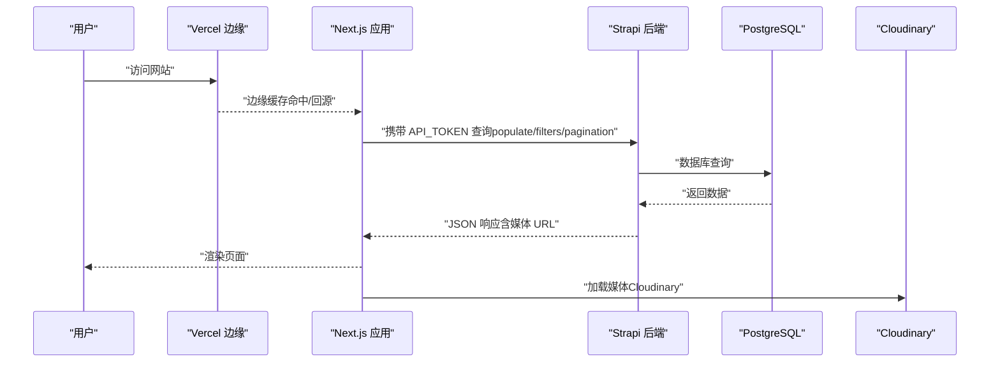

# 部署架构

<cite>
**本文引用的文件**
- [DEPLOYMENT.md](file://DEPLOYMENT.md)
- [WEBSITE_ARCHITECTURE.md](file://WEBSITE_ARCHITECTURE.md)
- [cms/Dockerfile](file://cms/Dockerfile)
- [cms/Dockerfile.prod](file://cms/Dockerfile.prod)
- [cms/docker-compose.yml](file://cms/docker-compose.yml)
- [cms/config/database.ts](file://cms/config/database.ts)
- [cms/config/server.ts](file://cms/config/server.ts)
- [cms/config/plugins.ts](file://cms/config/plugins.ts)
- [cms/package.json](file://cms/package.json)
- [cms/scripts/copy-schemas.js](file://cms/scripts/copy-schemas.js)
- [cms/scripts/dev-with-schemas.js](file://cms/scripts/dev-with-schemas.js)
- [frontend/package.json](file://frontend/package.json)
- [frontend/next.config.ts](file://frontend/next.config.ts)
- [frontend/src/lib/strapi.ts](file://frontend/src/lib/strapi.ts)
- [frontend/src/lib/config.ts](file://frontend/src/lib/config.ts)
- [start-dev.sh](file://start-dev.sh)
</cite>

## 目录
1. [简介](#简介)
2. [项目结构](#项目结构)
3. [核心组件](#核心组件)
4. [架构总览](#架构总览)
5. [详细组件分析](#详细组件分析)
6. [依赖关系分析](#依赖关系分析)
7. [性能考量](#性能考量)
8. [故障排查指南](#故障排查指南)
9. [结论](#结论)
10. [附录](#附录)

## 简介
本文件面向 Battivus 项目的部署与运维团队，系统化阐述端到端部署架构：包含容器化策略（Docker 多阶段构建、Compose 编排）、服务发现与负载均衡、Vercel 全球 CDN 部署、Strapi Cloud/自管后端（Railway）与 PostgreSQL 数据库的部署模式、环境配置与密钥管理、安全策略、CI/CD 自动化与测试流程、故障转移与备份恢复、监控告警以及域名与 SSL、性能调优等。

## 项目结构
项目采用前后端分离架构，前端基于 Next.js，后端基于 Strapi，数据库使用 PostgreSQL，媒体资源通过 Cloudinary 提供托管。部署采用“前端在 Vercel、后端在 Strapi Cloud 或 Railway、数据库由平台托管”的推荐方案；同时提供本地开发一键启动脚本与 Docker Compose 编排用于本地联调。

图示来源
- [WEBSITE_ARCHITECTURE.md:50-95](file://WEBSITE_ARCHITECTURE.md#L50-L95)
- [DEPLOYMENT.md:10-17](file://DEPLOYMENT.md#L10-L17)

章节来源
- [WEBSITE_ARCHITECTURE.md:1-100](file://WEBSITE_ARCHITECTURE.md#L1-L100)
- [DEPLOYMENT.md:1-223](file://DEPLOYMENT.md#L1-L223)

## 核心组件
- 前端（Next.js）
  - 使用 Vercel 全球 CDN 进行静态/动态内容分发，支持自动部署与边缘缓存。
  - 通过环境变量配置后端 API 地址与只读 API Token。
- 后端（Strapi）
  - 支持 Docker 多阶段构建与单阶段生产镜像；提供 Compose 本地编排。
  - 通过插件配置 Cloudinary 媒体存储；数据库连接配置支持环境变量注入。
- 数据库（PostgreSQL）
  - 推荐使用平台托管（Railway/Strapi Cloud），或本地 Compose 模式。
- 媒体存储（Cloudinary）
  - 通过插件与环境变量启用，避免容器重启导致媒体丢失。
- CI/CD
  - Vercel 自动监听主分支进行前端部署；Railway 自动监听主分支进行后端部署。

章节来源
- [frontend/package.json:1-26](file://frontend/package.json#L1-L26)
- [frontend/next.config.ts:1-9](file://frontend/next.config.ts#L1-L9)
- [frontend/src/lib/strapi.ts:1-412](file://frontend/src/lib/strapi.ts#L1-L412)
- [cms/Dockerfile:1-43](file://cms/Dockerfile#L1-L43)
- [cms/Dockerfile.prod:1-38](file://cms/Dockerfile.prod#L1-L38)
- [cms/docker-compose.yml:1-67](file://cms/docker-compose.yml#L1-L67)
- [cms/config/plugins.ts:1-19](file://cms/config/plugins.ts#L1-L19)
- [cms/config/database.ts:1-15](file://cms/config/database.ts#L1-L15)
- [DEPLOYMENT.md:109-130](file://DEPLOYMENT.md#L109-L130)
- [DEPLOYMENT.md:181-185](file://DEPLOYMENT.md#L181-L185)

## 架构总览
下图展示从全球用户到前端、后端、数据库与媒体存储的整体链路，以及可选的 Strapi Cloud 与 Railway 托管路径。

图示来源
- [DEPLOYMENT.md:10-17](file://DEPLOYMENT.md#L10-L17)
- [WEBSITE_ARCHITECTURE.md:50-95](file://WEBSITE_ARCHITECTURE.md#L50-L95)

章节来源
- [DEPLOYMENT.md:1-223](file://DEPLOYMENT.md#L1-L223)
- [WEBSITE_ARCHITECTURE.md:1-100](file://WEBSITE_ARCHITECTURE.md#L1-L100)

## 详细组件分析

### 前端（Next.js）在 Vercel 的部署
- 项目导入 Vercel 后，选择 Next.js 框架预设并设置根目录为 frontend。
- 环境变量：
  - NEXT_PUBLIC_API_URL：指向后端地址（Railway 或 Strapi Cloud）。
  - API_TOKEN：Strapi 设置中的只读 API Token。
- 自动化：主分支推送即触发构建与部署，上线后自动启用边缘缓存与全球分发。

章节来源
- [DEPLOYMENT.md:109-130](file://DEPLOYMENT.md#L109-L130)
- [frontend/package.json:1-26](file://frontend/package.json#L1-L26)
- [frontend/src/lib/strapi.ts:8-10](file://frontend/src/lib/strapi.ts#L8-L10)

### 后端（Strapi）在 Strapi Cloud 或 Railway 的部署
- Strapi Cloud
  - 连接 GitHub 仓库，指定 Base Directory 为 cms。
  - 平台自动注入数据库连接信息，无需手动配置本地 database.ts。
  - 自动处理 CDN 与媒体托管（可选使用 Cloudinary 插件）。
- Railway
  - 在同一项目中创建 PostgreSQL 服务与 Strapi 服务。
  - Root Directory 设为 /cms，DockerfilePath 使用 Dockerfile.prod。
  - 环境变量包括 NODE_ENV、DATABASE_URL、JWT_SECRET、APP_KEYS、Cloudinary 凭据等。

章节来源
- [DEPLOYMENT.md:92-106](file://DEPLOYMENT.md#L92-L106)
- [DEPLOYMENT.md:43-90](file://DEPLOYMENT.md#L43-L90)
- [DEPLOYMENT.md:66-82](file://DEPLOYMENT.md#L66-L82)

### 数据库（PostgreSQL）部署模式
- 平台托管（Railway/Strapi Cloud）
  - 由平台自动创建并注入 DATABASE_URL，无需本地配置。
- 本地 Compose
  - 使用 docker-compose.yml 启动 postgres 与 strapi 服务，定义健康检查与依赖关系。
  - 通过环境变量注入数据库凭据与连接参数。

章节来源
- [DEPLOYMENT.md:50-65](file://DEPLOYMENT.md#L50-L65)
- [cms/docker-compose.yml:1-67](file://cms/docker-compose.yml#L1-L67)
- [cms/config/database.ts:1-15](file://cms/config/database.ts#L1-L15)

### 媒体存储（Cloudinary）配置
- 在 plugins.ts 中启用 cloudinary provider，并通过环境变量注入 cloud_name、api_key、api_secret。
- 在 cms/package.json 中确保 @strapi/provider-upload-cloudinary 已安装。
- 重新部署后，媒体资源将托管于 Cloudinary，避免容器重启导致数据丢失。

章节来源
- [DEPLOYMENT.md:133-164](file://DEPLOYMENT.md#L133-L164)
- [cms/config/plugins.ts:1-19](file://cms/config/plugins.ts#L1-L19)
- [cms/package.json:14-25](file://cms/package.json#L14-L25)

### 容器化与编排
- 开发镜像（Dockerfile）
  - 基于 node:20-alpine，安装构建依赖，设置开发环境，暴露 1337 端口。
  - 构建时执行 copy-schemas 脚本以保证 schema.json 正确复制至 dist。
- 生产镜像（Dockerfile.prod）
  - 多阶段构建：build 阶段安装依赖并构建，runtime 阶段仅拷贝必要文件，精简体积。
  - 运行时保持 NODE_ENV=production，CMD 启动 strapi。
- 本地编排（docker-compose.yml）
  - 启动 postgres 与 strapi 服务，定义健康检查、端口映射、卷挂载与依赖顺序。
  - 通过环境变量注入数据库与 Strapi 密钥。

章节来源
- [cms/Dockerfile:1-43](file://cms/Dockerfile#L1-L43)
- [cms/Dockerfile.prod:1-38](file://cms/Dockerfile.prod#L1-L38)
- [cms/scripts/copy-schemas.js:1-47](file://cms/scripts/copy-schemas.js#L1-L47)
- [cms/docker-compose.yml:1-67](file://cms/docker-compose.yml#L1-L67)

### 本地开发一键启动
- start-dev.sh
  - 支持 start/stop/restart/status/help 子命令与 cms/frontend/all 目标。
  - 后端通过 docker compose 启动，前端通过 npm run dev 启动。
  - 提供端口占用检测与进程终止能力，便于快速排查。

章节来源
- [start-dev.sh:1-195](file://start-dev.sh#L1-L195)

### 前后端交互与 API 客户端
- 前端通过 NEXT_PUBLIC_API_URL 与 API_TOKEN 访问 Strapi。
- strapi.ts 封装了通用的查询与提交逻辑，支持 populate、filters、sort、pagination 等参数。
- 默认开启 next revalidate（60 秒），平衡新鲜度与性能。

章节来源
- [frontend/src/lib/strapi.ts:1-412](file://frontend/src/lib/strapi.ts#L1-L412)
- [frontend/src/lib/config.ts:1-177](file://frontend/src/lib/config.ts#L1-L177)

### CI/CD 与自动化测试
- 前端：Vercel 自动监听主分支进行构建与部署。
- 后端：Railway 自动监听主分支进行构建与部署（可配置仅对 /cms 变更触发）。
- 测试建议：可在各自平台的构建脚本中集成 lint 与单元测试命令（如 npm run lint、测试脚本）。

章节来源
- [DEPLOYMENT.md:181-185](file://DEPLOYMENT.md#L181-L185)
- [frontend/package.json:5-10](file://frontend/package.json#L5-L10)
- [cms/package.json:6-13](file://cms/package.json#L6-L13)

### 环境配置与密钥管理
- 关键环境变量（示例）
  - NODE_ENV=production
  - DATABASE_URL（由平台注入）
  - JWT_SECRET、ADMIN_JWT_SECRET、API_TOKEN_SALT、APP_KEYS
  - CLOUDINARY_NAME、CLOUDINARY_KEY、CLOUDINARY_SECRET
  - NEXT_PUBLIC_API_URL、API_TOKEN
- 建议
  - 使用平台提供的密钥管理功能，避免硬编码。
  - 对敏感变量进行最小权限授权（如只读 API Token）。

章节来源
- [DEPLOYMENT.md:66-82](file://DEPLOYMENT.md#L66-L82)
- [DEPLOYMENT.md:119-125](file://DEPLOYMENT.md#L119-L125)
- [cms/config/server.ts:1-11](file://cms/config/server.ts#L1-L11)
- [cms/config/database.ts:1-15](file://cms/config/database.ts#L1-L15)

### 安全策略
- 最小权限原则：公共角色仅开放必要接口（如查找），禁用删除/更新。
- 强密码与随机密钥：使用强随机源生成密钥。
- HTTPS 与证书：通过平台自动签发与续期（Vercel/Railway/Strapi Cloud）。
- CORS 与速率限制：在平台层面配置，避免跨域与滥用风险。

章节来源
- [DEPLOYMENT.md:186-191](file://DEPLOYMENT.md#L186-L191)

### 域名与 DNS
- 前端（Vercel）：添加域名并按指示配置 A/CNAME 记录。
- 后端（Railway）：在 Networking -> Custom Domain 添加 api.battivus.com 并配置 CNAME。
- 建议：为 www 与 api 子域分别配置，确保 CDN 与 API 域名一致。

章节来源
- [DEPLOYMENT.md:167-178](file://DEPLOYMENT.md#L167-L178)

### 数据迁移（可选）
- 使用 Strapi Transfer 功能在本地与生产之间同步内容与媒体。
- 步骤：在生产创建 Transfer Token，本地运行 transfer 命令并确认覆盖远程数据库。

章节来源
- [DEPLOYMENT.md:194-220](file://DEPLOYMENT.md#L194-L220)

## 依赖关系分析

图示来源
- [frontend/package.json:1-26](file://frontend/package.json#L1-L26)
- [frontend/src/lib/strapi.ts:8-10](file://frontend/src/lib/strapi.ts#L8-L10)
- [cms/package.json:14-25](file://cms/package.json#L14-L25)
- [cms/Dockerfile.prod:1-38](file://cms/Dockerfile.prod#L1-L38)
- [cms/docker-compose.yml:1-67](file://cms/docker-compose.yml#L1-L67)
- [cms/config/plugins.ts:1-19](file://cms/config/plugins.ts#L1-L19)

章节来源
- [frontend/package.json:1-26](file://frontend/package.json#L1-L26)
- [cms/package.json:14-25](file://cms/package.json#L14-L25)
- [cms/Dockerfile.prod:1-38](file://cms/Dockerfile.prod#L1-L38)
- [cms/docker-compose.yml:1-67](file://cms/docker-compose.yml#L1-L67)
- [cms/config/plugins.ts:1-19](file://cms/config/plugins.ts#L1-L19)

## 性能考量
- 前端
  - 利用 Vercel Edge Network 与自动缓存，减少回源压力。
  - 合理设置 revalidate（默认 60s）以平衡新鲜度与成本。
- 后端
  - 使用多阶段 Dockerfile.prod 缩小镜像体积，提升拉取与启动速度。
  - 通过平台托管数据库与媒体，降低运维与网络延迟。
- 数据库
  - 使用平台托管的高可用数据库，避免自管带来的扩展与延迟问题。
- 媒体
  - 使用 Cloudinary 提升图片处理与分发效率，避免容器内存储。

章节来源
- [DEPLOYMENT.md:109-130](file://DEPLOYMENT.md#L109-L130)
- [cms/Dockerfile.prod:1-38](file://cms/Dockerfile.prod#L1-L38)
- [cms/config/plugins.ts:1-19](file://cms/config/plugins.ts#L1-L19)
- [frontend/src/lib/strapi.ts:109-112](file://frontend/src/lib/strapi.ts#L109-L112)

## 故障排查指南
- 前端无法访问后端
  - 检查 NEXT_PUBLIC_API_URL 是否正确，是否缺少协议与尾部斜杠。
  - 确认 API_TOKEN 是否有效且具备只读权限。
- 后端无法连接数据库
  - 若使用平台托管，确认 DATABASE_URL 注入成功。
  - 若使用 Compose，检查 postgres 健康状态与网络连通性。
- 媒体上传失败
  - 检查 Cloudinary 环境变量是否完整，插件配置是否正确。
- 本地开发冲突
  - 使用 start-dev.sh status 查看端口占用，必要时 stop 对应服务。
- CI/CD 失败
  - 查看平台构建日志，确认环境变量与 Dockerfile 配置无误。

章节来源
- [DEPLOYMENT.md:109-130](file://DEPLOYMENT.md#L109-L130)
- [cms/docker-compose.yml:17-21](file://cms/docker-compose.yml#L17-L21)
- [cms/config/plugins.ts:1-19](file://cms/config/plugins.ts#L1-L19)
- [start-dev.sh:102-118](file://start-dev.sh#L102-L118)

## 结论
该部署架构以“前端 Vercel、后端 Strapi Cloud/Railway、数据库与媒体托管”为核心，结合容器化与平台自动化能力，实现低成本、高性能、易维护的 B2B 网站部署。通过严格的环境变量管理、最小权限授权与平台托管的高可用基础设施，可满足 Battivus 的全球化业务需求。

## 附录

### 关键流程图：前端请求到后端 API 的序列

图示来源
- [frontend/src/lib/strapi.ts:51-119](file://frontend/src/lib/strapi.ts#L51-L119)
- [cms/config/database.ts:1-15](file://cms/config/database.ts#L1-L15)
- [cms/config/plugins.ts:1-19](file://cms/config/plugins.ts#L1-L19)