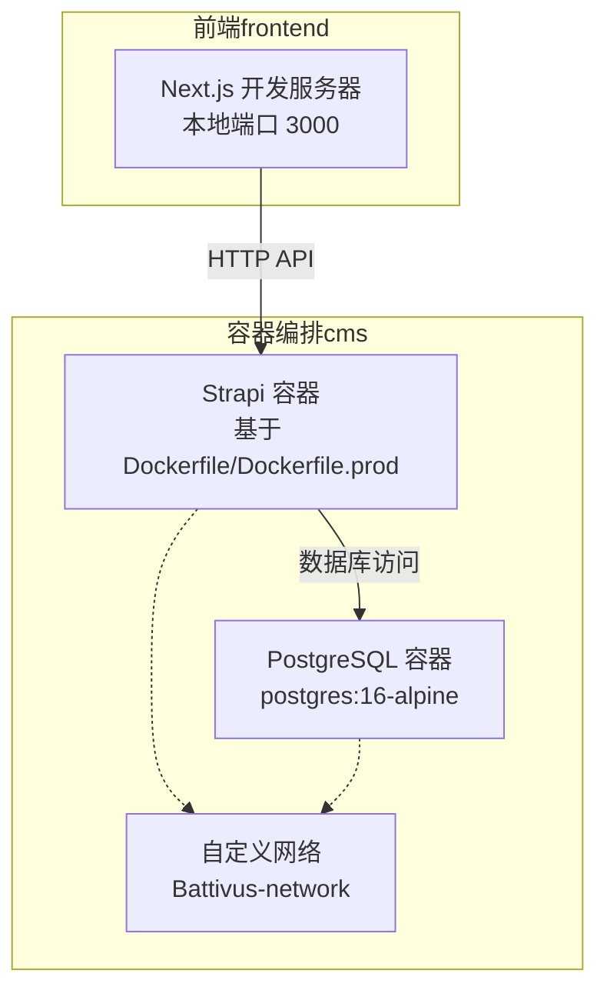
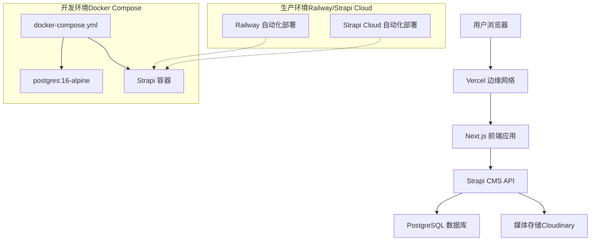
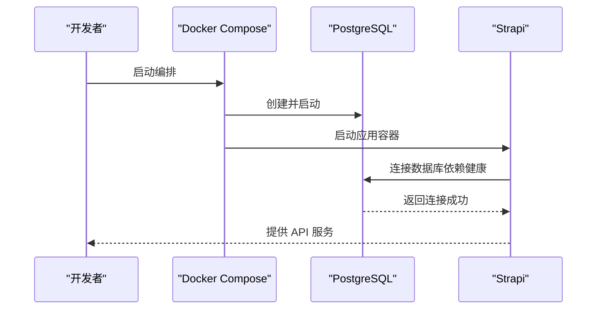

# 容器化部署

<cite>
**本文引用的文件**
- [docker-compose.yml](file://cms/docker-compose.yml)
- [Dockerfile](file://cms/Dockerfile)
- [Dockerfile.prod](file://cms/Dockerfile.prod)
- [database.ts](file://cms/config/database.ts)
- [server.ts](file://cms/config/server.ts)
- [package.json](file://cms/package.json)
- [copy-schemas.js](file://cms/scripts/copy-schemas.js)
- [dev-with-schemas.js](file://cms/scripts/dev-with-schemas.js)
- [DEPLOYMENT.md](file://DEPLOYMENT.md)
- [WEBSITE_ARCHITECTURE.md](file://WEBSITE_ARCHITECTURE.md)
- [start-dev.sh](file://start-dev.sh)
- [strapi.ts](file://frontend/src/lib/strapi.ts)
- [frontend/package.json](file://frontend/package.json)
</cite>

## 目录
1. [简介](#简介)
2. [项目结构](#项目结构)
3. [核心组件](#核心组件)
4. [架构总览](#架构总览)
5. [详细组件分析](#详细组件分析)
6. [依赖关系分析](#依赖关系分析)
7. [性能考量](#性能考量)
8. [故障排查指南](#故障排查指南)
9. [结论](#结论)
10. [附录](#附录)

## 简介
本文件面向 Battivus 项目的容器化部署，系统性阐述 Docker Compose 编排结构与服务配置（PostgreSQL 数据库、Strapi CMS、网络与卷），对比开发与生产环境的 Dockerfile 差异（多阶段构建、优化与安全配置），并覆盖容器间依赖、健康检查与重启策略、部署命令与环境变量、卷挂载、监控与日志、资源限制以及更新回滚与版本管理策略。文档同时结合项目现有部署指南与架构文档，确保可操作性与一致性。

## 项目结构
Battivus 采用“前端 Next.js + 后端 Strapi + 数据库 PostgreSQL”的分层架构。容器编排位于 cms 目录下的 Compose 文件中，数据库与 CMS 通过自定义桥接网络互通；前端独立运行于本地开发服务器或 Vercel 生产环境。

图表来源
- [docker-compose.yml:1-67](file://cms/docker-compose.yml#L1-L67)

章节来源
- [docker-compose.yml:1-67](file://cms/docker-compose.yml#L1-L67)
- [WEBSITE_ARCHITECTURE.md:48-95](file://WEBSITE_ARCHITECTURE.md#L48-L95)

## 核心组件
- PostgreSQL 数据库服务：使用官方 Alpine 镜像，持久化数据卷，暴露 5432 端口，并配置健康检查。
- Strapi CMS 服务：基于自定义 Dockerfile 构建，开发模式下挂载源码与配置目录，生产模式建议使用 Dockerfile.prod 进行多阶段构建。
- 网络与卷：自定义桥接网络隔离服务；PostgreSQL 使用命名卷持久化数据。
- 前后端交互：前端通过 NEXT_PUBLIC_API_URL 指向后端 API 地址，本地默认指向 1337 端口。

章节来源
- [docker-compose.yml:1-67](file://cms/docker-compose.yml#L1-L67)
- [Dockerfile:1-43](file://cms/Dockerfile#L1-L43)
- [Dockerfile.prod:1-38](file://cms/Dockerfile.prod#L1-L38)
- [strapi.ts:7-9](file://frontend/src/lib/strapi.ts#L7-L9)

## 架构总览
容器化部署围绕“开发环境（Compose）+ 生产环境（Railway/Strapi Cloud）”两条路径展开。开发阶段通过 Compose 快速拉起数据库与 CMS；生产阶段推荐使用 Railway 或 Strapi Cloud，自动注入数据库连接与域名，简化运维。

图表来源
- [DEPLOYMENT.md:8-17](file://DEPLOYMENT.md#L8-L17)
- [DEPLOYMENT.md:43-105](file://DEPLOYMENT.md#L43-L105)
- [docker-compose.yml:1-67](file://cms/docker-compose.yml#L1-L67)

章节来源
- [DEPLOYMENT.md:1-223](file://DEPLOYMENT.md#L1-L223)
- [WEBSITE_ARCHITECTURE.md:48-95](file://WEBSITE_ARCHITECTURE.md#L48-L95)

## 详细组件分析

### PostgreSQL 数据库服务
- 镜像与端口映射：使用 postgres:16-alpine，容器内 5432 映射到主机 5432。
- 环境变量：设置数据库用户、密码与库名。
- 卷：命名卷 postgres_data 挂载至容器内数据目录，保障数据持久化。
- 健康检查：使用 pg_isready 命令轮询检测数据库可用性。
- 重启策略：unless-stopped，避免开发中断导致的服务停止。

章节来源
- [docker-compose.yml:3-21](file://cms/docker-compose.yml#L3-L21)

### Strapi CMS 服务
- 构建方式：开发环境使用 Dockerfile，生产环境建议使用 Dockerfile.prod（多阶段构建）。
- 环境变量：数据库连接参数、节点环境、监听地址与端口、应用密钥与加密盐值等。
- 卷挂载：挂载 config、src、uploads 与 .env，便于开发时热更新与数据持久化。
- 端口映射：1337 端口映射至主机。
- 依赖关系：依赖数据库服务健康后再启动。
- 健康检查：可通过外部探针或 API 健康端点验证（需在生产环境补充）。

章节来源
- [docker-compose.yml:23-60](file://cms/docker-compose.yml#L23-L60)
- [Dockerfile:1-43](file://cms/Dockerfile#L1-L43)
- [Dockerfile.prod:1-38](file://cms/Dockerfile.prod#L1-L38)

### 网络与卷
- 网络：自定义桥接网络 Battivus-network，实现服务间解析与隔离。
- 卷：postgres_data 用于 PostgreSQL 数据持久化；uploads 用于媒体文件持久化（开发场景）。

章节来源
- [docker-compose.yml:61-67](file://cms/docker-compose.yml#L61-L67)

### 开发与生产 Dockerfile 差异
- 开发 Dockerfile（Dockerfile）
  - 基于 node:20-alpine，安装构建依赖，设置工作目录与环境变量，拷贝依赖与源码，执行构建与 schema 复制，暴露 1337 端口，使用 start 启动。
  - 特点：适合本地开发，挂载源码与配置，便于调试与热更新。
- 生产 Dockerfile（Dockerfile.prod）
  - 多阶段构建：第一阶段构建产物，第二阶段仅复制运行时所需文件，减少镜像体积与攻击面。
  - 运行时仅保留必要依赖，降低镜像大小与安全风险。
  - 建议在生产环境使用该镜像以提升安全性与性能。

章节来源
- [Dockerfile:1-43](file://cms/Dockerfile#L1-L43)
- [Dockerfile.prod:1-38](file://cms/Dockerfile.prod#L1-L38)

### 数据库与服务器配置（Strapi）
- 数据库配置：通过环境变量读取主机、端口、库名、用户名、密码与 SSL 设置。
- 服务器配置：监听地址、端口与应用密钥数组等。

章节来源
- [database.ts:1-15](file://cms/config/database.ts#L1-L15)
- [server.ts:1-11](file://cms/config/server.ts#L1-L11)

### 构建与脚本支持
- 构建脚本：package.json 中提供 build、start、develop、develop:watch、strapi 等脚本。
- schema 复制：copy-schemas.js 将 schema.json 从 src/api 复制到 dist/src/api，保证运行时 schema 可用。
- 开发辅助：dev-with-schemas.js 在开发模式下监听编译完成事件后复制 schema，确保热更新时 schema 不丢失。

章节来源
- [package.json:6-13](file://cms/package.json#L6-L13)
- [copy-schemas.js:1-47](file://cms/scripts/copy-schemas.js#L1-L47)
- [dev-with-schemas.js:1-80](file://cms/scripts/dev-with-schemas.js#L1-L80)

### 前后端交互与 API 访问
- 前端通过 NEXT_PUBLIC_API_URL 或 NEXT_PUBLIC_STRAPI_URL 指定 Strapi API 地址，默认本地 1337 端口。
- 健康检查：提供 /api/health 探测接口，便于外部监控与编排系统判断服务状态。

章节来源
- [strapi.ts:7-9](file://frontend/src/lib/strapi.ts#L7-L9)
- [strapi.ts:308-316](file://frontend/src/lib/strapi.ts#L308-L316)

## 依赖关系分析
- 服务依赖：Strapi 依赖 PostgreSQL 健康（service_healthy）才启动，确保数据库可用后再加载应用。
- 网络依赖：所有服务加入同一自定义桥接网络，实现服务间通过服务名解析。
- 数据依赖：PostgreSQL 使用命名卷持久化数据；uploads 挂载用于媒体持久化（开发场景）。

图表来源
- [docker-compose.yml:57-59](file://cms/docker-compose.yml#L57-L59)

章节来源
- [docker-compose.yml:57-59](file://cms/docker-compose.yml#L57-L59)

## 性能考量
- 多阶段构建：生产镜像采用多阶段构建，显著减小镜像体积，降低启动时间与运行内存占用。
- 依赖精简：运行时仅复制必要文件，移除开发依赖与构建工具链，减少攻击面。
- 健康检查：数据库健康检查可配合编排系统实现快速故障恢复。
- 资源限制：可在 Compose 中为服务设置 CPU/内存限制，避免资源争用（建议在生产环境补充）。

章节来源
- [Dockerfile.prod:18-38](file://cms/Dockerfile.prod#L18-L38)
- [docker-compose.yml:17-21](file://cms/docker-compose.yml#L17-L21)

## 故障排查指南
- 数据库不可用
  - 检查 PostgreSQL 健康检查是否通过，确认环境变量与网络连通性。
  - 查看容器日志定位连接错误。
- Strapi 启动失败
  - 确认数据库已健康且可连接；检查 APP_KEYS、JWT_SECRET 等密钥配置。
  - 查看构建日志，确认 schema 复制步骤是否成功。
- 媒体上传异常
  - 确认 uploads 挂载正确；如需持久化，建议使用对象存储（Cloudinary）替代容器内卷。
- 前端无法访问 API
  - 检查 NEXT_PUBLIC_API_URL 是否指向正确的后端地址；确认防火墙与端口映射。

章节来源
- [docker-compose.yml:3-21](file://cms/docker-compose.yml#L3-L21)
- [copy-schemas.js:12-46](file://cms/scripts/copy-schemas.js#L12-L46)
- [strapi.ts:7-9](file://frontend/src/lib/strapi.ts#L7-L9)

## 结论
通过 Docker Compose 可快速搭建本地开发环境，结合多阶段生产的 Dockerfile.prod 实现更安全、高效的生产部署。配合 Railway/Strapi Cloud 的自动化部署能力，可进一步降低运维复杂度。建议在生产环境补充健康检查、资源限制与监控告警，确保系统稳定性与可维护性。

## 附录

### 部署命令与环境变量
- 开发环境
  - 启动：进入 cms 目录执行编排启动命令。
  - 停止：执行编排停止命令。
  - 状态：使用控制脚本查询服务状态。
- 生产环境（Railway/Strapi Cloud）
  - 在平台侧配置根目录为 cms，选择 Dockerfile.prod 作为构建镜像。
  - 注入 DATABASE_URL（由平台自动注入）、JWT_SECRET、ADMIN_JWT_SECRET、API_TOKEN_SALT、APP_KEYS、Cloudinary 凭证等。

章节来源
- [start-dev.sh:72-118](file://start-dev.sh#L72-L118)
- [DEPLOYMENT.md:55-82](file://DEPLOYMENT.md#L55-L82)

### 卷挂载与持久化
- PostgreSQL：使用命名卷 postgres_data 持久化数据库。
- 上传文件：开发场景挂载 public/uploads 至容器，生产建议使用云存储。

章节来源
- [docker-compose.yml:11-12](file://cms/docker-compose.yml#L11-L12)
- [docker-compose.yml:48-52](file://cms/docker-compose.yml#L48-L52)

### 健康检查与重启策略
- 数据库：健康检查使用 pg_isready，间隔与超时可按需调整。
- 重启策略：unless-stopped，避免意外退出影响开发体验。

章节来源
- [docker-compose.yml:17-21](file://cms/docker-compose.yml#L17-L21)
- [docker-compose.yml:6](file://cms/docker-compose.yml#L6)

### 容器监控与日志
- 日志：使用容器日志查看服务输出；建议在生产环境接入集中式日志系统。
- 健康检查：数据库健康检查可作为编排层面的健康探测；前端可调用 /api/health 进行业务层健康探测。

章节来源
- [docker-compose.yml:17-21](file://cms/docker-compose.yml#L17-L21)
- [strapi.ts:308-316](file://frontend/src/lib/strapi.ts#L308-L316)

### 更新、回滚与版本管理
- 更新：生产环境通过平台的 Git 触发自动重建与部署；本地可重新构建镜像并替换运行实例。
- 回滚：平台通常支持回滚至上一个稳定版本；建议在变更前备份数据库与媒体。
- 版本管理：建议对镜像打标签，结合 Git 标签进行追踪；数据库迁移与 schema 变更需谨慎评估。

章节来源
- [DEPLOYMENT.md:181-185](file://DEPLOYMENT.md#L181-L185)
- [Dockerfile.prod:18-38](file://cms/Dockerfile.prod#L18-L38)