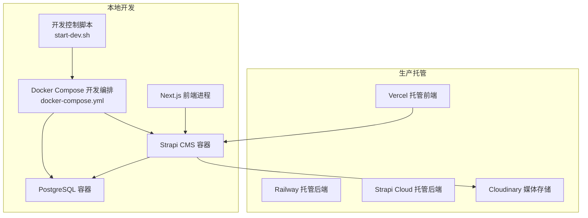
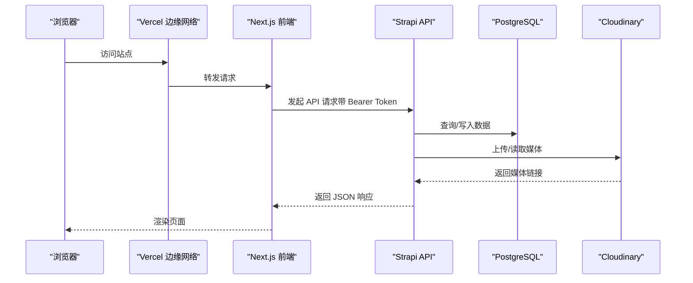
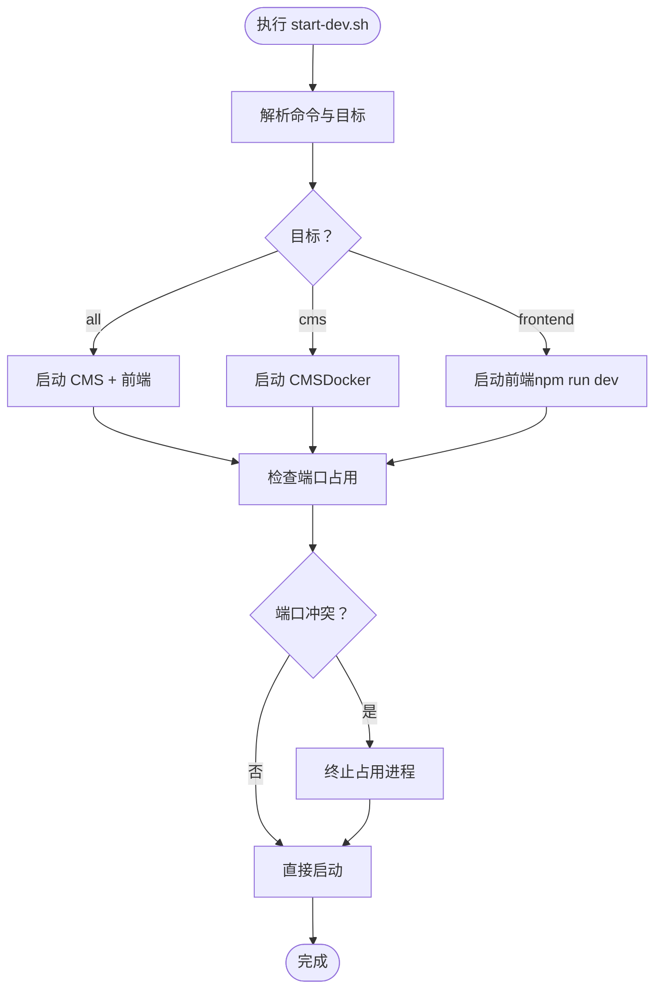
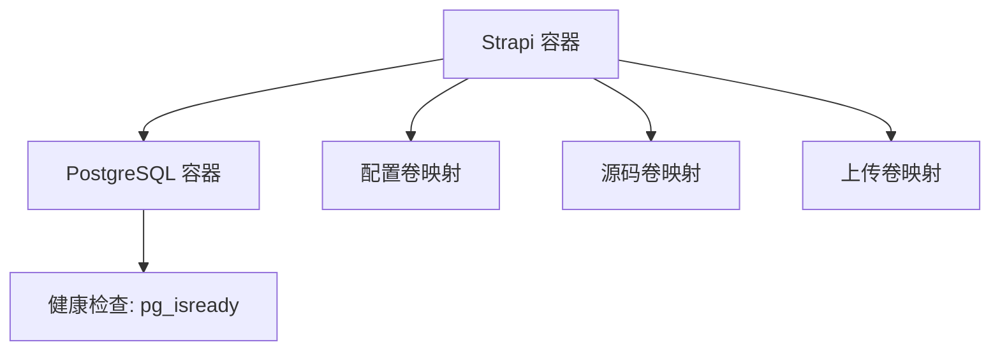
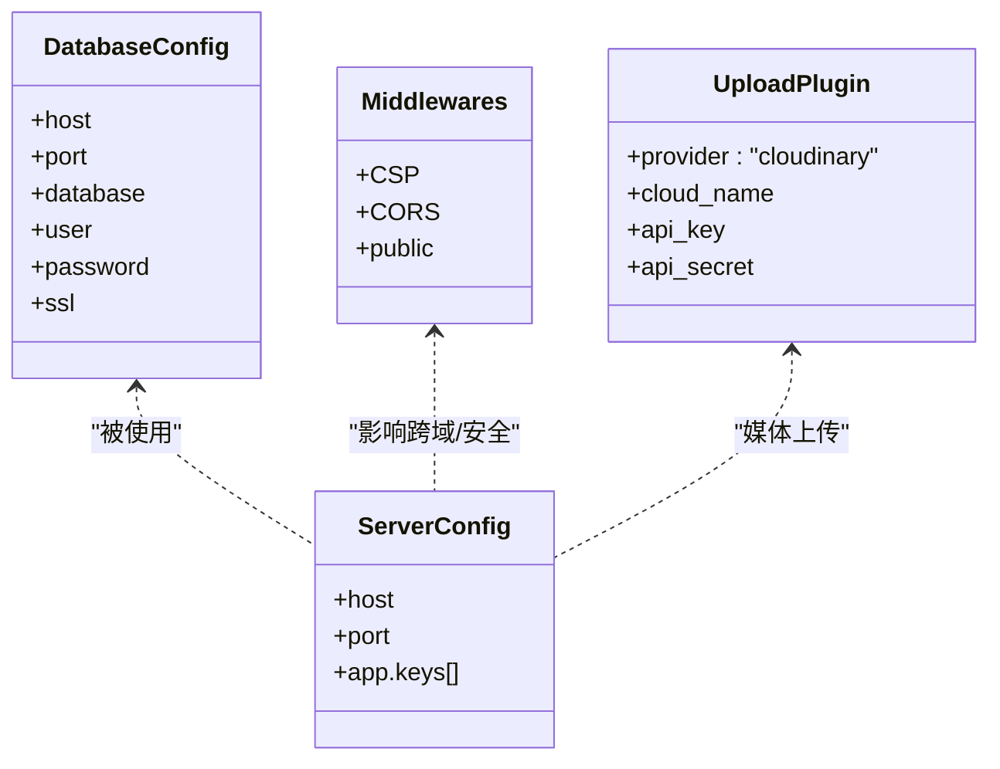
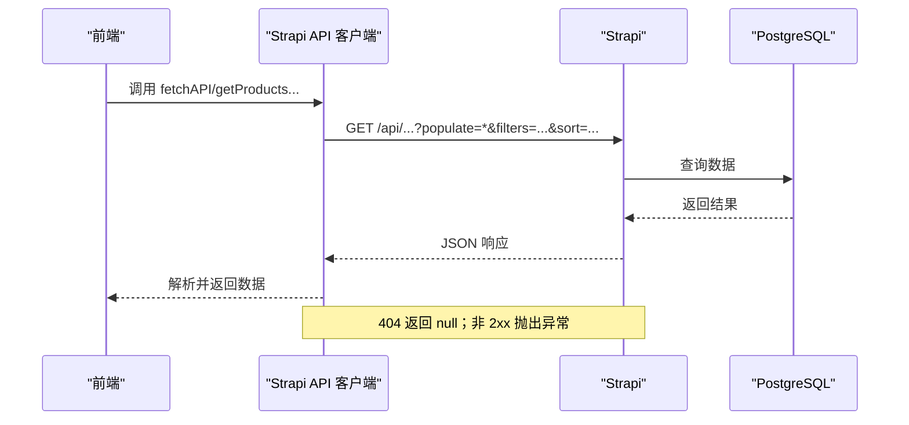
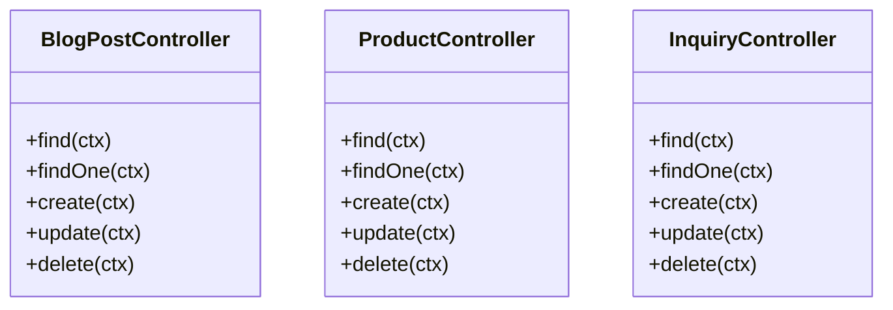
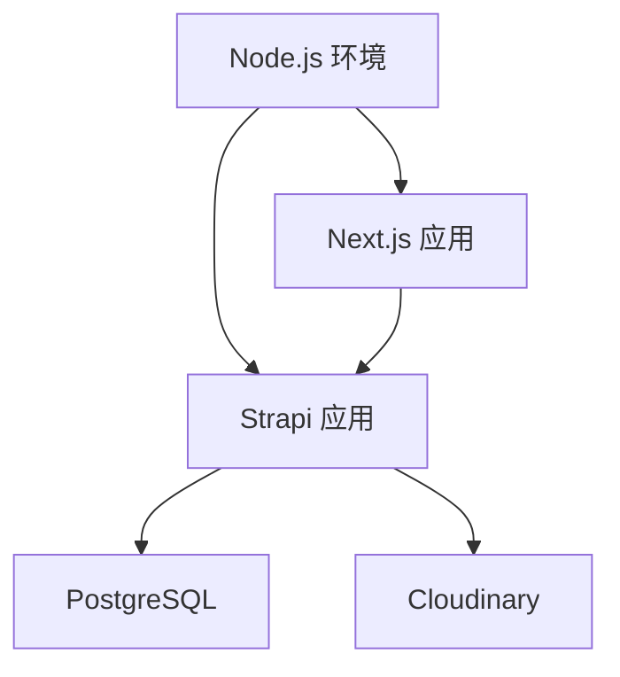

# 故障排除与常见问题

<cite>
**本文引用的文件**
- [start-dev.sh](file://start-dev.sh)
- [docker-compose.yml](file://cms/docker-compose.yml)
- [Dockerfile](file://cms/Dockerfile)
- [Dockerfile.prod](file://cms/Dockerfile.prod)
- [package.json（CMS）](file://cms/package.json)
- [package.json（前端）](file://frontend/package.json)
- [数据库配置](file://cms/config/database.ts)
- [服务器配置](file://cms/config/server.ts)
- [中间件配置](file://cms/config/middlewares.ts)
- [插件配置（Cloudinary）](file://cms/config/plugins.ts)
- [部署指南](file://DEPLOYMENT.md)
- [架构文档](file://WEBSITE_ARCHITECTURE.md)
- [Strapi API 客户端](file://frontend/src/lib/strapi.ts)
- [前端配置（导航/过滤等）](file://frontend/src/lib/config.ts)
- [博客文章控制器](file://cms/src/api/blog-post/controllers/blog-post.ts)
- [产品控制器](file://cms/src/api/product/controllers/product.ts)
- [询价控制器](file://cms/src/api/inquiry/controllers/inquiry.ts)
</cite>

## 目录
1. [简介](#简介)
2. [项目结构](#项目结构)
3. [核心组件](#核心组件)
4. [架构总览](#架构总览)
5. [详细组件分析](#详细组件分析)
6. [依赖关系分析](#依赖关系分析)
7. [性能考虑](#性能考虑)
8. [故障排除指南](#故障排除指南)
9. [结论](#结论)
10. [附录](#附录)

## 简介
本文件面向 Battivus 项目的开发者与运维人员，系统性梳理开发与生产环境中的常见启动失败、连接问题与性能问题，并提供可操作的诊断步骤与修复方案。内容覆盖：
- 容器启动失败：端口冲突、权限问题、依赖服务不可用
- 数据库连接问题：连接参数、健康检查、迁移与初始化
- API 错误码与含义：常见 HTTP 状态码及对应处理
- JWT 认证失败：密钥配置、令牌生成与校验
- 文件上传异常：Cloudinary 配置、媒体存储与访问
- 性能瓶颈识别与优化：缓存策略、资源调优与 CDN

## 项目结构
Battivus 采用“Next.js 前端 + Strapi 后端 + PostgreSQL 数据库”的分层架构，支持本地开发脚本与 Docker 编排部署，同时提供 Railway/Strapi Cloud 的生产托管选项。

**图表来源**
- [start-dev.sh:1-195](file://start-dev.sh#L1-L195)
- [docker-compose.yml:1-67](file://cms/docker-compose.yml#L1-L67)
- [Dockerfile:1-43](file://cms/Dockerfile#L1-L43)
- [Dockerfile.prod:1-38](file://cms/Dockerfile.prod#L1-L38)
- [部署指南:1-223](file://DEPLOYMENT.md#L1-L223)

**章节来源**
- [start-dev.sh:1-195](file://start-dev.sh#L1-L195)
- [docker-compose.yml:1-67](file://cms/docker-compose.yml#L1-L67)
- [Dockerfile:1-43](file://cms/Dockerfile#L1-L43)
- [Dockerfile.prod:1-38](file://cms/Dockerfile.prod#L1-L38)
- [部署指南:1-223](file://DEPLOYMENT.md#L1-L223)

## 核心组件
- 开发控制脚本：统一管理 CMS 与前端服务的启动、停止、重启与状态查询，内置端口占用检测与强制终止能力。
- Docker 编排：定义 PostgreSQL 与 Strapi 服务，含健康检查、环境变量注入与卷挂载。
- Strapi 配置：数据库连接、服务器监听、CORS/安全策略、上传插件（Cloudinary）。
- 前端客户端：基于 Next.js 的 API 客户端，负责与 Strapi 通信、参数化查询、鉴权头注入与健康检查。
- 生产部署：Railway/Strapi Cloud 的环境变量、构建命令与域名配置。

**章节来源**
- [start-dev.sh:51-118](file://start-dev.sh#L51-L118)
- [docker-compose.yml:1-67](file://cms/docker-compose.yml#L1-L67)
- [数据库配置:1-15](file://cms/config/database.ts#L1-L15)
- [服务器配置:1-11](file://cms/config/server.ts#L1-L11)
- [中间件配置:1-32](file://cms/config/middlewares.ts#L1-L32)
- [插件配置（Cloudinary）:1-19](file://cms/config/plugins.ts#L1-L19)
- [Strapi API 客户端:1-412](file://frontend/src/lib/strapi.ts#L1-L412)
- [部署指南:66-82](file://DEPLOYMENT.md#L66-L82)

## 架构总览
下图展示从浏览器到后端 API、数据库与媒体存储的完整链路，以及开发与生产的差异点。

**图表来源**
- [架构文档:1-758](file://WEBSITE_ARCHITECTURE.md#L1-L758)
- [部署指南:10-17](file://DEPLOYMENT.md#L10-L17)
- [Strapi API 客户端:109-119](file://frontend/src/lib/strapi.ts#L109-L119)
- [插件配置（Cloudinary）:1-19](file://cms/config/plugins.ts#L1-L19)

## 详细组件分析

### 组件一：开发控制脚本（start-dev.sh）
- 功能：一键启动/停止/重启 CMS 与前端；检查端口占用；显示服务状态。
- 关键点：默认 CMS 端口 1337、前端端口 3000；支持仅启动某一项服务；后台运行前端时保持脚本活跃以便查看日志。
- 常见问题定位：若提示端口被占用，使用“停止”或“重启”命令释放；确认 Docker Compose 是否在后台运行。

**图表来源**
- [start-dev.sh:120-152](file://start-dev.sh#L120-L152)
- [start-dev.sh:51-70](file://start-dev.sh#L51-L70)

**章节来源**
- [start-dev.sh:1-195](file://start-dev.sh#L1-L195)

### 组件二：Docker 编排与容器健康检查
- 服务定义：PostgreSQL（健康检查）、Strapi（开发模式，暴露 1337）。
- 环境变量：数据库连接、应用密钥、JWT 密钥、API 令牌盐值。
- 卷挂载：配置目录、源码目录、上传目录、.env。
- 健康检查：PostgreSQL 使用 pg_isready 检测可用性，Strapi 依赖数据库健康。

**图表来源**
- [docker-compose.yml:1-67](file://cms/docker-compose.yml#L1-L67)

**章节来源**
- [docker-compose.yml:1-67](file://cms/docker-compose.yml#L1-L67)

### 组件三：Strapi 配置与中间件
- 数据库：通过环境变量配置主机、端口、数据库名、用户名、密码、SSL。
- 服务器：监听地址、端口、应用密钥数组。
- 中间件：CSP、CORS 允许任意来源以适配 Vercel 预览；允许所有头；favicon、public 静态资源。
- 上传：Cloudinary 提供商，需配置 cloud_name、api_key、api_secret。

**图表来源**
- [数据库配置:1-15](file://cms/config/database.ts#L1-L15)
- [服务器配置:1-11](file://cms/config/server.ts#L1-L11)
- [中间件配置:1-32](file://cms/config/middlewares.ts#L1-L32)
- [插件配置（Cloudinary）:1-19](file://cms/config/plugins.ts#L1-L19)

**章节来源**
- [数据库配置:1-15](file://cms/config/database.ts#L1-L15)
- [服务器配置:1-11](file://cms/config/server.ts#L1-L11)
- [中间件配置:1-32](file://cms/config/middlewares.ts#L1-L32)
- [插件配置（Cloudinary）:1-19](file://cms/config/plugins.ts#L1-L19)

### 组件四：前端 API 客户端与类型
- API 客户端：自动拼接查询参数（populate、filters、sort、pagination），注入 Authorization 头（Bearer Token），对 404 返回 null，其他错误抛出异常。
- 健康检查：访问 /api/health 判断后端可用性。
- 类型：与 Strapi Schema 对齐，支持 snake_case 与 camelCase 字段别名。

**图表来源**
- [Strapi API 客户端:51-119](file://frontend/src/lib/strapi.ts#L51-L119)
- [Strapi API 客户端:121-164](file://frontend/src/lib/strapi.ts#L121-L164)
- [Strapi API 客户端:309-316](file://frontend/src/lib/strapi.ts#L309-L316)

**章节来源**
- [Strapi API 客户端:1-412](file://frontend/src/lib/strapi.ts#L1-L412)

### 组件五：API 控制器（示例：博客、产品、询价）
- 统一 CRUD：find/findOne/create/update/delete。
- 博客文章：支持按 ID 数字或 slug 查询。
- 产品/询价：标准实体操作。

**图表来源**
- [博客文章控制器:1-53](file://cms/src/api/blog-post/controllers/blog-post.ts#L1-L53)
- [产品控制器:1-40](file://cms/src/api/product/controllers/product.ts#L1-L40)
- [询价控制器:1-40](file://cms/src/api/inquiry/controllers/inquiry.ts#L1-L40)

**章节来源**
- [博客文章控制器:1-53](file://cms/src/api/blog-post/controllers/blog-post.ts#L1-L53)
- [产品控制器:1-40](file://cms/src/api/product/controllers/product.ts#L1-L40)
- [询价控制器:1-40](file://cms/src/api/inquiry/controllers/inquiry.ts#L1-L40)

## 依赖关系分析
- 运行时依赖：Node.js 版本范围由两个 package.json 明确约束；CMS 使用 better-sqlite3 或 pg（取决于环境）。
- 构建依赖：Strapi v5、React、TypeScript、esbuild 等。
- 生产依赖：Next.js、TailwindCSS、styled-components（前端）；Strapi 插件与 Cloudinary（CMS）。

**图表来源**
- [package.json（CMS）:14-34](file://cms/package.json#L14-L34)
- [package.json（前端）:11-25](file://frontend/package.json#L11-L25)
- [部署指南:137-162](file://DEPLOYMENT.md#L137-L162)

**章节来源**
- [package.json（CMS）:1-36](file://cms/package.json#L1-L36)
- [package.json（前端）:1-26](file://frontend/package.json#L1-L26)
- [部署指南:137-162](file://DEPLOYMENT.md#L137-L162)

## 性能考虑
- 缓存策略：前端 fetch 默认启用 revalidate（60 秒），可在业务场景中根据页面类型调整。
- 资源优化：使用 Vercel 边缘网络与 CDN；媒体存储使用 Cloudinary。
- 数据库：生产环境推荐使用 Railway/Strapi Cloud 提供的托管数据库，减少自维护成本。
- 构建与运行：生产镜像拆分为多阶段构建，减小体积并提升启动速度。

**章节来源**
- [Strapi API 客户端:109-119](file://frontend/src/lib/strapi.ts#L109-L119)
- [Dockerfile.prod:1-38](file://cms/Dockerfile.prod#L1-L38)
- [部署指南:43-90](file://DEPLOYMENT.md#L43-L90)

## 故障排除指南

### 一、启动失败与端口冲突
- 现象：启动失败或提示端口已被占用。
- 排查步骤：
  - 使用开发控制脚本查看状态：start-dev.sh status
  - 若端口占用，先 stop 再 start；必要时强制终止占用进程
  - 检查 Docker Compose 是否已在后台运行
- 修复建议：
  - 修改 start-dev.sh 中的默认端口或在 docker-compose.yml 中调整映射
  - 在 CI/CD 环境中确保端口唯一性

**章节来源**
- [start-dev.sh:102-118](file://start-dev.sh#L102-L118)
- [start-dev.sh:154-171](file://start-dev.sh#L154-L171)
- [docker-compose.yml:53-54](file://cms/docker-compose.yml#L53-L54)

### 二、容器启动失败（数据库/依赖服务不可用）
- 现象：Strapi 启动后立即退出或无法连接数据库。
- 排查步骤：
  - 查看 PostgreSQL 健康检查是否通过（compose 中 healthcheck）
  - 检查 DATABASE_* 环境变量是否正确（主机、端口、数据库名、用户名、密码）
  - 确认数据库已初始化且具备相应权限
- 修复建议：
  - 使用独立数据库实例或确保本地 Docker 网络连通
  - 在生产环境使用 Railway/Strapi Cloud 注入 DATABASE_URL

**章节来源**
- [docker-compose.yml:17-21](file://cms/docker-compose.yml#L17-L21)
- [docker-compose.yml:30-47](file://cms/docker-compose.yml#L30-L47)
- [数据库配置:1-15](file://cms/config/database.ts#L1-L15)
- [部署指南:66-82](file://DEPLOYMENT.md#L66-L82)

### 三、API 错误码与含义
- 400 Bad Request：请求参数格式错误或缺少必填字段
- 401 Unauthorized：缺少或无效的 Bearer Token
- 403 Forbidden：无权限访问（角色/权限不足）
- 404 Not Found：资源不存在（如按 slug 查询时）
- 500 Internal Server Error：服务器内部错误（数据库连接失败、插件异常等）

- 诊断要点：
  - 前端客户端对 404 返回 null，其他错误抛出异常
  - 检查 Authorization 头是否正确设置
  - 核对 API 路径与查询参数

**章节来源**
- [Strapi API 客户端:114-118](file://frontend/src/lib/strapi.ts#L114-L118)
- [Strapi API 客户端:153-156](file://frontend/src/lib/strapi.ts#L153-L156)

### 四、JWT 认证失败
- 现象：登录成功但后续接口返回 401。
- 排查步骤：
  - 确认 ADMIN_JWT_SECRET、JWT_SECRET、API_TOKEN_SALT、APP_KEYS 已正确设置
  - 检查前端 NEXT_PUBLIC_API_URL 与后端域名一致
  - 确认 API Token 权限范围与调用场景匹配
- 修复建议：
  - 在生产环境使用随机强密钥，避免硬编码
  - 使用 Strapi 管理员界面生成只读 API Token 并注入到前端环境变量

**章节来源**
- [docker-compose.yml:40-47](file://cms/docker-compose.yml#L40-L47)
- [部署指南:66-82](file://DEPLOYMENT.md#L66-L82)
- [中间件配置:1-32](file://cms/config/middlewares.ts#L1-L32)

### 五、文件上传异常（Cloudinary）
- 现象：媒体上传失败或返回空链接。
- 排查步骤：
  - 确认 plugins.ts 中已启用 upload.provider = cloudinary
  - 检查 CLOUDINARY_NAME、CLOUDINARY_KEY、CLOUDINARY_SECRET 是否正确
  - 确认 Strapi 与 Cloudinary 网络连通
- 修复建议：
  - 在生产环境使用 Railway/Strapi Cloud 注入 Cloudinary 变量
  - 如需本地测试，可切换为本地上传或使用替代提供商

**章节来源**
- [插件配置（Cloudinary）:1-19](file://cms/config/plugins.ts#L1-L19)
- [部署指南:133-163](file://DEPLOYMENT.md#L133-L163)

### 六、网络连接检查与日志分析
- 前端健康检查：调用 /api/health，判断后端可用性
- 日志定位：
  - Docker Compose 日志：查看 Strapi 与 PostgreSQL 容器输出
  - 前端错误：观察浏览器控制台与网络面板
- 建议工具：
  - curl 或 Postman 测试 /api/health 与关键端点
  - 在 CI/CD 中记录容器启动时间与健康检查状态

**章节来源**
- [Strapi API 客户端:309-316](file://frontend/src/lib/strapi.ts#L309-L316)
- [docker-compose.yml:17-21](file://cms/docker-compose.yml#L17-L21)

### 七、数据库状态验证
- 开发环境：使用 compose 健康检查验证数据库可用性
- 生产环境：Railway/Strapi Cloud 自动注入 DATABASE_URL，无需手动配置本地数据库
- 建议：
  - 在部署前执行一次数据库连接测试
  - 使用迁移脚本或 Strapi Cloud 的自动同步功能

**章节来源**
- [docker-compose.yml:17-21](file://cms/docker-compose.yml#L17-L21)
- [部署指南:66-82](file://DEPLOYMENT.md#L66-L82)

### 八、性能瓶颈识别与优化
- 瓶颈识别：
  - 前端：频繁 revalidate 导致重复请求，适当调整 revalidate 时间
  - 后端：数据库慢查询、上传耗时，结合日志与指标分析
- 优化建议：
  - 使用 Vercel 边缘缓存与预取
  - 合理分页与筛选，避免一次性加载大量数据
  - 媒体资源使用 CDN 加速

**章节来源**
- [Strapi API 客户端:109-119](file://frontend/src/lib/strapi.ts#L109-L119)
- [部署指南:10-17](file://DEPLOYMENT.md#L10-L17)

## 结论
通过统一的开发控制脚本、完善的 Docker 编排与清晰的配置体系，Battivus 项目在开发与生产环境均具备良好的可观测性与可维护性。遇到问题时，优先从端口占用、数据库健康检查、认证令牌与媒体提供商配置入手，再结合前端健康检查与日志分析快速定位根因。生产环境建议采用 Railway/Strapi Cloud 的托管方案，降低运维复杂度并提升稳定性。

## 附录

### A. 常用命令与环境变量清单
- 开发控制脚本命令：start、stop、restart、status、help
- 关键环境变量（示例）：
  - DATABASE_CLIENT、DATABASE_HOST、DATABASE_PORT、DATABASE_NAME、DATABASE_USERNAME、DATABASE_PASSWORD、DATABASE_SSL
  - NODE_ENV、HOST、PORT、APP_KEYS、API_TOKEN_SALT、ADMIN_JWT_SECRET、JWT_SECRET
  - CLOUDINARY_NAME、CLOUDINARY_KEY、CLOUDINARY_SECRET
  - NEXT_PUBLIC_API_URL、API_TOKEN

**章节来源**
- [start-dev.sh:125-187](file://start-dev.sh#L125-L187)
- [docker-compose.yml:30-47](file://cms/docker-compose.yml#L30-L47)
- [部署指南:66-82](file://DEPLOYMENT.md#L66-L82)