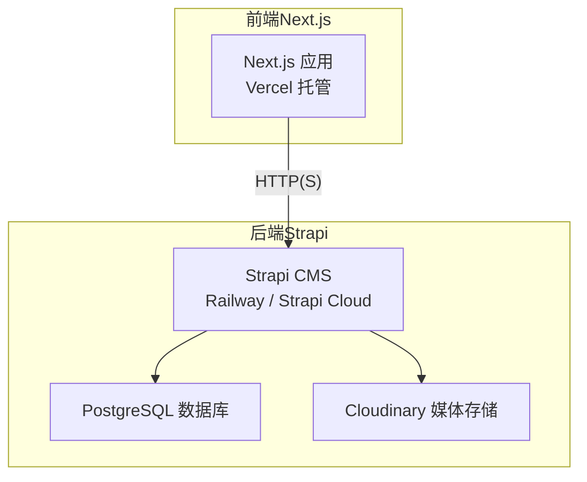
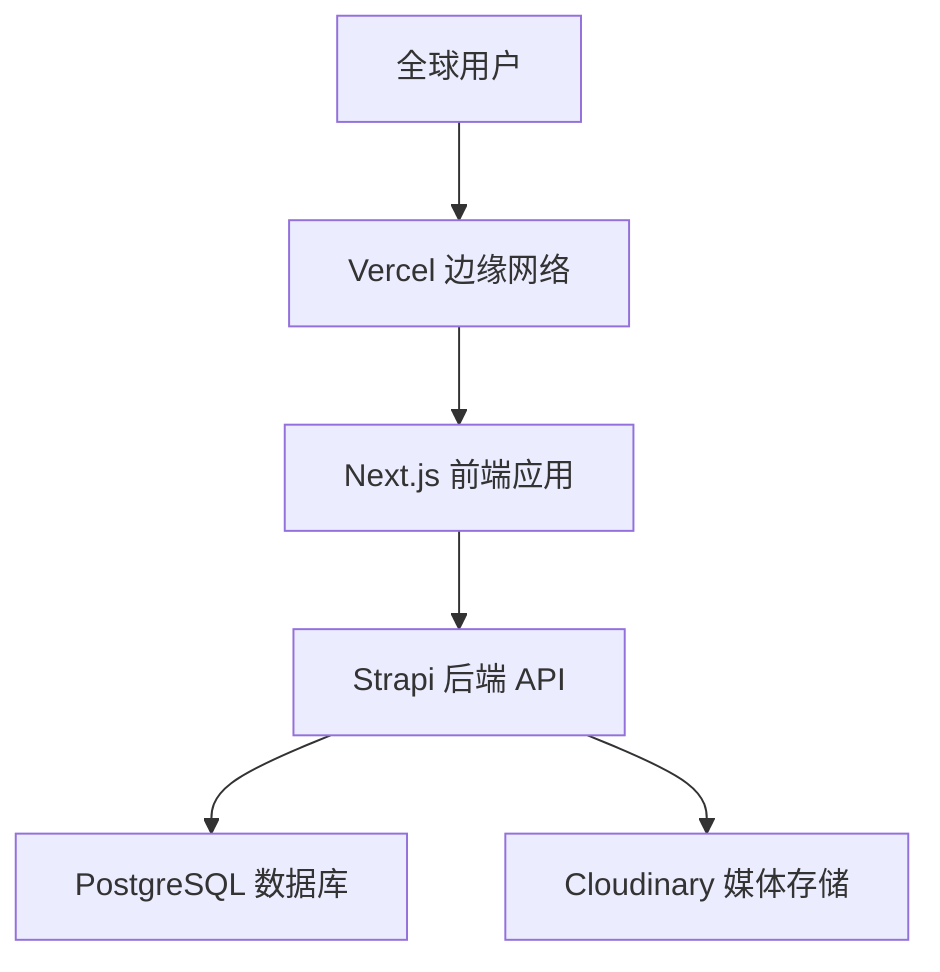
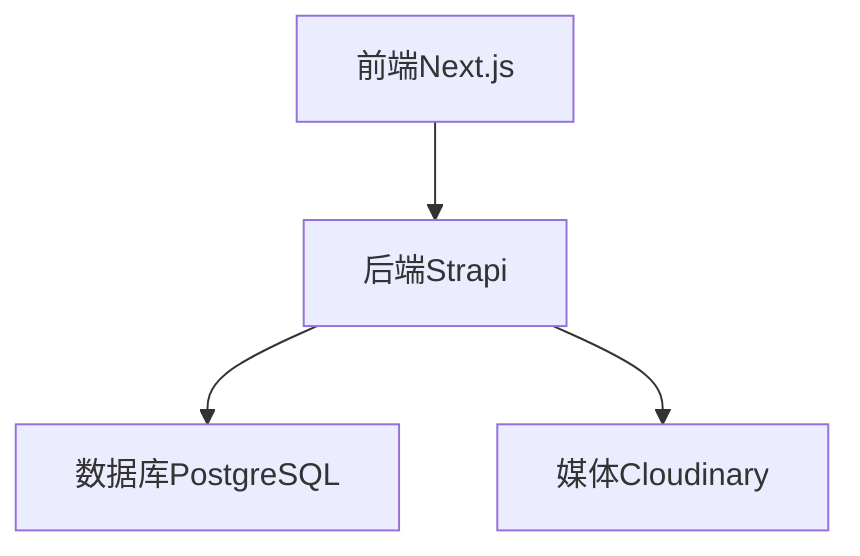

# 生产环境配置

<cite>
**本文引用的文件**
- [DEPLOYMENT.md](file://DEPLOYMENT.md)
- [WEBSITE_ARCHITECTURE.md](file://WEBSITE_ARCHITECTURE.md)
- [docker-compose.yml](file://cms/docker-compose.yml)
- [Dockerfile.prod](file://cms/Dockerfile.prod)
- [package.json（CMS）](file://cms/package.json)
- [database.ts](file://cms/config/database.ts)
- [server.ts](file://cms/config/server.ts)
- [middlewares.ts](file://cms/config/middlewares.ts)
- [plugins.ts](file://cms/config/plugins.ts)
- [package.json（前端）](file://frontend/package.json)
- [next.config.ts](file://frontend/next.config.ts)
</cite>

## 目录
1. [简介](#简介)
2. [项目结构](#项目结构)
3. [核心组件](#核心组件)
4. [架构总览](#架构总览)
5. [详细组件分析](#详细组件分析)
6. [依赖关系分析](#依赖关系分析)
7. [性能与扩展](#性能与扩展)
8. [安全与合规](#安全与合规)
9. [备份与灾难恢复](#备份与灾难恢复)
10. [监控与可观测性](#监控与可观测性)
11. [故障排查指南](#故障排查指南)
12. [结论](#结论)

## 简介
本文件面向 Battivus 项目的生产部署，围绕服务器与硬件要求、网络与域名、反向代理、SSL/TLS、环境变量安全、负载均衡与高可用、备份与迁移、监控与性能优化等维度，提供可落地的配置说明与最佳实践。项目采用“前端（Next.js）+ 后端（Strapi）+ 数据库（PostgreSQL）”的分层架构，并通过云平台实现托管与弹性伸缩。

## 项目结构
- 前端（Next.js）：负责页面渲染、SEO、静态资源与用户交互，部署于 Vercel。
- 后端（Strapi）：提供 Headless CMS 的内容管理与 API，部署于 Railway 或 Strapi Cloud。
- 数据库（PostgreSQL）：由后端服务托管或外部托管，存储内容与媒体元数据。
- 媒体存储（Cloudinary）：用于图片与文件上传，避免容器重启导致的数据丢失。

图表来源
- [WEBSITE_ARCHITECTURE.md](file://WEBSITE_ARCHITECTURE.md)
- [DEPLOYMENT.md](file://DEPLOYMENT.md)

章节来源
- [WEBSITE_ARCHITECTURE.md](file://WEBSITE_ARCHITECTURE.md)
- [DEPLOYMENT.md](file://DEPLOYMENT.md)

## 核心组件
- 前端（Next.js）
  - 使用 Vercel 全球边缘网络加速访问，支持自动部署与 HTTPS。
  - 通过环境变量配置 API 地址与只读令牌，确保生产安全。
- 后端（Strapi）
  - 支持 Docker 多阶段构建，生产模式运行，暴露 1337 端口。
  - 通过环境变量配置数据库连接、密钥与上传提供商。
- 数据库（PostgreSQL）
  - 通过环境变量或平台注入的连接字符串进行连接，支持 SSL。
- 媒体存储（Cloudinary）
  - 通过插件配置，使用独立的云存储，提升可靠性与性能。

章节来源
- [package.json（前端）](file://frontend/package.json)
- [next.config.ts](file://frontend/next.config.ts)
- [package.json（CMS）](file://cms/package.json)
- [Dockerfile.prod](file://cms/Dockerfile.prod)
- [database.ts](file://cms/config/database.ts)
- [plugins.ts](file://cms/config/plugins.ts)

## 架构总览
生产环境推荐采用“前端（Vercel）+ 后端（Railway/Strapi Cloud）+ 数据库（托管 PostgreSQL）+ 媒体（Cloudinary）”的组合，实现全球加速、零运维与高可用。

图表来源
- [DEPLOYMENT.md](file://DEPLOYMENT.md)
- [WEBSITE_ARCHITECTURE.md](file://WEBSITE_ARCHITECTURE.md)

## 详细组件分析

### 服务器与硬件要求
- 前端（Next.js）
  - Vercel 提供按需扩缩容与全球边缘节点，无需自建服务器。
  - 建议启用压缩与缓存策略，减少带宽与延迟。
- 后端（Strapi）
  - 推荐使用容器化部署（Docker），在 Railway 或云 PaaS 上运行。
  - 资源建议：CPU 1 核起步，内存 512MB-1GB；根据流量与查询复杂度动态调整。
- 数据库（PostgreSQL）
  - 使用托管数据库（Railway/Strapi Cloud 提供的数据库）以获得高可用与备份。
  - 建议开启只读副本与自动备份，保障业务连续性。

章节来源
- [DEPLOYMENT.md](file://DEPLOYMENT.md)
- [WEBSITE_ARCHITECTURE.md](file://WEBSITE_ARCHITECTURE.md)

### 网络与域名绑定
- 域名与 DNS
  - 前端域名：battivus.com、www.battivus.com（在 Vercel 中添加并按指引配置 DNS 记录）。
  - 后端域名：api.battivus.com（在 Railway 设置自定义域名并配置 CNAME）。
- 反向代理与边缘加速
  - Vercel 已内置 CDN 与 TLS 终止，无需额外 Nginx。
  - 若使用自建反向代理，请参考“安全与合规”中的 SSL/TLS 与 CORS 配置要点。

章节来源
- [DEPLOYMENT.md](file://DEPLOYMENT.md)

### 环境变量与安全配置
- 必填环境变量（后端）
  - 运行模式：NODE_ENV=production
  - 数据库：DATABASE_CLIENT、DATABASE_URL（或主机、端口、用户名、密码、SSL）
  - 安全密钥：JWT_SECRET、ADMIN_JWT_SECRET、API_TOKEN_SALT、APP_KEYS
  - 上传提供商：CLOUDINARY_NAME、CLOUDINARY_KEY、CLOUDINARY_SECRET
- 前端
  - NEXT_PUBLIC_API_URL：指向后端域名（无尾随斜杠）
  - API_TOKEN：Strapi 管理后台生成的只读令牌
- 安全建议
  - 使用强随机值生成密钥，定期轮换。
  - 在 Strapi 角色中最小权限原则开放公共接口。
  - 严格控制 CORS 与 CSP，避免跨域与脚本注入风险。

章节来源
- [DEPLOYMENT.md](file://DEPLOYMENT.md)
- [server.ts](file://cms/config/server.ts)
- [database.ts](file://cms/config/database.ts)
- [middlewares.ts](file://cms/config/middlewares.ts)
- [plugins.ts](file://cms/config/plugins.ts)

### SSL/TLS 与证书
- 前端（Vercel）
  - 自动启用 HTTPS 与免费证书，建议强制跳转到 HTTPS。
- 后端（Railway/Strapi Cloud）
  - 平台默认提供 HTTPS 与证书管理；如使用自建反向代理，需正确配置证书链与协议版本。
- 数据库
  - 建议启用 SSL 连接（DATABASE_SSL=true），并在平台侧配置信任根证书。

章节来源
- [DEPLOYMENT.md](file://DEPLOYMENT.md)
- [database.ts](file://cms/config/database.ts)

### 反向代理与负载均衡
- 推荐方案
  - 前端：使用 Vercel 的全球 CDN，默认具备负载均衡与高可用。
  - 后端：Railway/Strapi Cloud 提供多实例与自动扩缩容；若自建，可在平台内配置多实例与健康检查。
- 自建反向代理（可选）
  - 如需在自建环境中部署，可使用 Nginx/HAProxy，结合健康检查与会话保持策略。
  - 注意：本仓库未提供 Nginx 配置文件，此处为概念性指导。

章节来源
- [DEPLOYMENT.md](file://DEPLOYMENT.md)
- [docker-compose.yml](file://cms/docker-compose.yml)

### 数据库与媒体存储
- 数据库
  - 使用平台提供的 PostgreSQL 实例，自动完成备份与高可用。
  - 如需迁移，使用 Strapi Transfer 功能从本地推送至生产。
- 媒体存储
  - 通过 Cloudinary 插件实现上传与删除操作，避免容器重启导致的数据丢失。

章节来源
- [DEPLOYMENT.md](file://DEPLOYMENT.md)
- [plugins.ts](file://cms/config/plugins.ts)

### 部署流程与自动化
- 前端（Next.js）
  - Vercel 自动监听主分支变更并触发构建与发布。
- 后端（Strapi）
  - Railway 自动检测 Dockerfile 或 package.json，按配置构建与部署。
  - 可配置仅对 cms 目录变更触发后端部署，减少误触发。
- 媒体与域名
  - 按部署指南在各平台设置域名与 DNS 记录。

章节来源
- [DEPLOYMENT.md](file://DEPLOYMENT.md)

## 依赖关系分析

图表来源
- [WEBSITE_ARCHITECTURE.md](file://WEBSITE_ARCHITECTURE.md)
- [DEPLOYMENT.md](file://DEPLOYMENT.md)

章节来源
- [WEBSITE_ARCHITECTURE.md](file://WEBSITE_ARCHITECTURE.md)
- [DEPLOYMENT.md](file://DEPLOYMENT.md)

## 性能与扩展
- 前端性能
  - 利用 Vercel 的边缘缓存与预渲染，减少首屏时间与带宽消耗。
  - 启用图片优化与懒加载，降低大图对性能的影响。
- 后端性能
  - 使用生产镜像与多阶段构建，减小镜像体积与启动时间。
  - 合理设置并发与超时，避免慢查询拖垮整体吞吐。
- 扩展策略
  - 前端：按流量自动扩缩容，边缘节点就近分发。
  - 后端：平台提供多实例与自动扩缩容；必要时引入只读副本与缓存中间件。
  - 数据库：启用高可用与备份，按需增加只读副本。

章节来源
- [Dockerfile.prod](file://cms/Dockerfile.prod)
- [package.json（CMS）](file://cms/package.json)
- [WEBSITE_ARCHITECTURE.md](file://WEBSITE_ARCHITECTURE.md)

## 安全与合规
- 密钥管理
  - 使用强随机值生成密钥，定期轮换；避免硬编码与泄露。
- CORS 与 CSP
  - 后端已配置 CORS 与 CSP，生产环境建议限制来源与资源加载范围。
- 最小权限
  - 在 Strapi 角色中仅开放必要的公共接口权限，禁用删除与更新。
- 传输安全
  - 强制 HTTPS，启用 HSTS；数据库连接启用 SSL。

章节来源
- [DEPLOYMENT.md](file://DEPLOYMENT.md)
- [middlewares.ts](file://cms/config/middlewares.ts)
- [database.ts](file://cms/config/database.ts)

## 备份与灾难恢复
- 数据备份
  - 使用平台提供的数据库备份功能，定期验证恢复流程。
- 内容迁移
  - 使用 Strapi Transfer 将本地内容推送到生产环境，首次迁移可选择清空远程数据库。
- 媒体备份
  - 媒体存储位于 Cloudinary，无需担心容器重启导致的数据丢失。

章节来源
- [DEPLOYMENT.md](file://DEPLOYMENT.md)

## 监控与可观测性
- 指标建议
  - 前端：页面加载时间、4xx/5xx 错误率、边缘命中率。
  - 后端：请求延迟、错误率、数据库连接数、队列长度。
  - 数据库：慢查询、连接池利用率、备份状态。
- 工具建议
  - 前端：Vercel 分析与日志。
  - 后端：平台自带监控与日志聚合。
  - 建议接入统一告警系统，设置阈值与通知渠道。

章节来源
- [DEPLOYMENT.md](file://DEPLOYMENT.md)

## 故障排查指南
- 常见问题定位
  - 前端无法访问后端：检查 NEXT_PUBLIC_API_URL 与 API_TOKEN 是否正确。
  - CORS 报错：核对后端 CORS 配置与来源白名单。
  - 媒体上传失败：检查 Cloudinary 凭据与网络连通性。
  - 数据库连接失败：确认连接字符串、SSL 设置与防火墙规则。
- 快速修复步骤
  - 更新环境变量后重新部署。
  - 查看平台日志与健康检查状态。
  - 对照部署清单逐项核对密钥与域名配置。

章节来源
- [DEPLOYMENT.md](file://DEPLOYMENT.md)
- [middlewares.ts](file://cms/config/middlewares.ts)
- [plugins.ts](file://cms/config/plugins.ts)
- [database.ts](file://cms/config/database.ts)

## 结论
Battivus 的生产环境应以“前端（Vercel）、后端（Railway/Strapi Cloud）、数据库（托管 PostgreSQL）、媒体（Cloudinary）”为核心，结合平台的自动扩缩容、高可用与备份能力，实现低运维与高性能。同时，严格遵循密钥管理、CORS/CSP、最小权限与 HTTPS 等安全实践，配合监控与灾备演练，确保业务稳定运行。