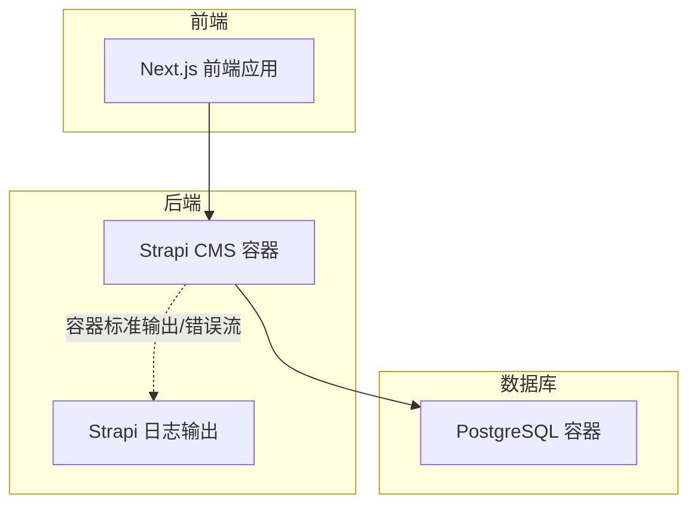
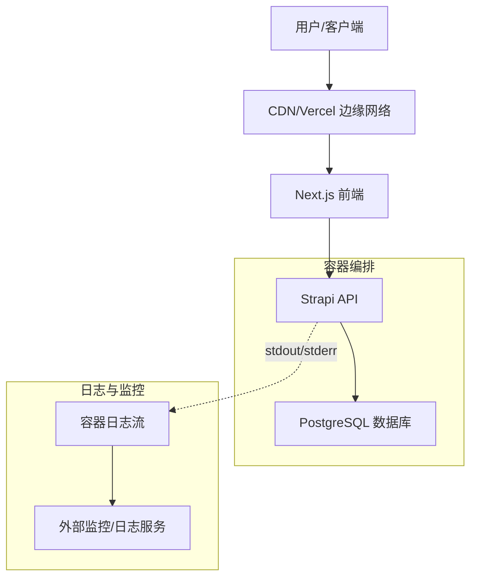
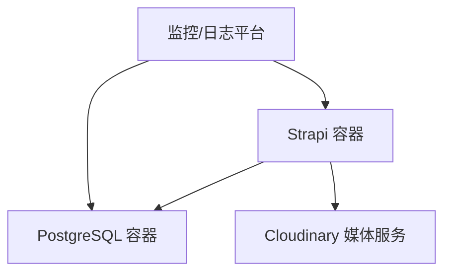

# 监控与日志

<cite>
**本文引用的文件**
- [docker-compose.yml](file://cms/docker-compose.yml)
- [Dockerfile](file://cms/Dockerfile)
- [Dockerfile.prod](file://cms/Dockerfile.prod)
- [package.json](file://cms/package.json)
- [DEPLOYMENT.md](file://DEPLOYMENT.md)
- [WEBSITE_ARCHITECTURE.md](file://WEBSITE_ARCHITECTURE.md)
- [start-dev.sh](file://start-dev.sh)
</cite>

## 目录
1. [简介](#简介)
2. [项目结构](#项目结构)
3. [核心组件](#核心组件)
4. [架构总览](#架构总览)
5. [详细组件分析](#详细组件分析)
6. [依赖关系分析](#依赖关系分析)
7. [性能考量](#性能考量)
8. [故障排查指南](#故障排查指南)
9. [结论](#结论)
10. [附录](#附录)

## 简介
本文件面向 Battivus 项目的运维与开发团队，系统性地阐述监控与日志管理方案。内容覆盖：
- 应用程序监控：性能指标、错误率、响应时间等
- 日志采集与聚合：Docker 日志驱动与外部日志服务集成建议
- 关键指标定义与阈值：CPU、内存、数据库连接数、API 响应时间
- 告警规则与通知机制：基于现有部署环境的可落地实践
- 故障自动处理与恢复：容器健康检查与重启策略
- 日志分析工具使用与常见问题排查
- 监控仪表板配置示例与自定义指标添加方法

说明：当前仓库未包含现成的监控与日志配置文件，本文在不改变现有部署方式的前提下，给出可直接落地的实施建议与最佳实践。

## 项目结构
Battivus 采用“前端（Next.js）+ 后端（Strapi）+ 数据库（PostgreSQL）”的分层架构。监控与日志关注点主要集中在后端（Strapi）与数据库容器层面，通过 Docker Compose 编排实现统一管理。

图表来源
- [docker-compose.yml:1-67](file://cms/docker-compose.yml#L1-L67)
- [Dockerfile:1-43](file://cms/Dockerfile#L1-L43)
- [Dockerfile.prod:1-38](file://cms/Dockerfile.prod#L1-L38)

章节来源
- [docker-compose.yml:1-67](file://cms/docker-compose.yml#L1-L67)
- [Dockerfile:1-43](file://cms/Dockerfile#L1-L43)
- [Dockerfile.prod:1-38](file://cms/Dockerfile.prod#L1-L38)

## 核心组件
- Strapi CMS 容器：负责业务 API、媒体存储、内容管理。容器内标准输出与错误流即为日志来源。
- PostgreSQL 容器：提供数据持久化，具备健康检查与端口暴露，便于外部监控工具接入。
- 开发控制脚本：提供启动、停止、状态查询与端口占用检测，辅助本地调试与快速排障。

章节来源
- [docker-compose.yml:1-67](file://cms/docker-compose.yml#L1-L67)
- [start-dev.sh:1-195](file://start-dev.sh#L1-L195)

## 架构总览
下图展示监控与日志在整体架构中的位置与交互：

图表来源
- [WEBSITE_ARCHITECTURE.md:8-17](file://WEBSITE_ARCHITECTURE.md#L8-L17)
- [docker-compose.yml:1-67](file://cms/docker-compose.yml#L1-L67)

## 详细组件分析

### Strapi 容器监控与日志
- 运行模式与端口
  - 开发模式：容器暴露 1337 端口，适合本地开发与调试。
  - 生产模式：通过生产 Dockerfile 构建镜像并以 start 方式运行，适合部署到平台（如 Railway）。
- 日志输出
  - 容器标准输出与错误流承载 Strapi 的访问日志、业务日志与错误信息，是外部日志聚合系统的首选入口。
- 健康检查
  - 当前未在 Strapi 服务上配置健康检查；可在部署时补充，以便与数据库健康检查联动。

章节来源
- [Dockerfile:37-43](file://cms/Dockerfile#L37-L43)
- [Dockerfile.prod:36-38](file://cms/Dockerfile.prod#L36-L38)
- [docker-compose.yml:24-60](file://cms/docker-compose.yml#L24-L60)

### PostgreSQL 容器监控与日志
- 健康检查
  - 提供基于数据库就绪命令的健康检查，周期与重试次数可按需调整。
- 日志输出
  - 容器标准输出包含数据库启动与运行日志，可用于外部日志聚合。
- 端口暴露
  - 对外暴露 5432 端口，便于连接数据库进行性能与慢查询分析。

章节来源
- [docker-compose.yml:3-22](file://cms/docker-compose.yml#L3-L22)

### 开发控制脚本与本地排障
- 功能概览
  - 支持启动/停止/重启/状态查询，自动检测端口占用并进行清理。
  - 针对 Strapi（1337）与前端（3000）端口提供在线/离线状态提示。
- 适用场景
  - 本地开发环境快速启停、端口冲突排查、服务状态确认。

章节来源
- [start-dev.sh:1-195](file://start-dev.sh#L1-L195)

### 监控与日志采集方案设计
- Docker 日志驱动
  - 使用默认 json-file 驱动即可满足基础采集需求；若需要集中化，可切换至 gelf/fluentd/syslog 等驱动，并在 Compose 中配置相应日志选项。
- 外部日志服务集成
  - 建议对接集中式日志平台（如 ELK/EFK、Loki/Grafana、CloudWatch、DataDog 等），将容器 stdout/stderr 聚合为结构化日志。
  - 在平台侧为 Strapi 与 PostgreSQL 分别建立日志流，设置过滤标签（如 service=backend、service=database）。
- 指标采集
  - 使用平台自带的容器指标采集（CPU、内存、网络、磁盘）或 Prometheus Exporter（如 postgres_exporter、node_exporter）。
  - 将 API 访问日志解析为请求计数、错误率、响应时间直方图等业务指标。

说明：以上为通用实施建议，具体配置需结合所选日志/监控平台的特性进行调整。

## 依赖关系分析
- 组件耦合
  - Strapi 依赖 PostgreSQL；容器编排中通过 depends_on 与健康检查确保启动顺序与可用性。
- 外部依赖
  - 媒体存储依赖 Cloudinary（部署文档已明确）；媒体上传与访问日志可作为监控与审计的一部分。
- 平台迁移
  - 若迁移到 Strapi Cloud 或 Railway，平台通常提供内置的健康检查、日志与指标面板，可减少自建成本。

图表来源
- [docker-compose.yml:1-67](file://cms/docker-compose.yml#L1-L67)
- [DEPLOYMENT.md:133-163](file://DEPLOYMENT.md#L133-L163)

章节来源
- [docker-compose.yml:1-67](file://cms/docker-compose.yml#L1-L67)
- [DEPLOYMENT.md:133-163](file://DEPLOYMENT.md#L133-L163)

## 性能考量
- 容器资源限制
  - 建议为 Strapi 与数据库设置合理的 CPU/内存限制与重启策略，避免资源争用导致的性能抖动。
- 数据库性能
  - 结合健康检查与慢查询日志，定期优化索引与查询计划；必要时引入只读副本或连接池参数调优。
- 前端与后端协同
  - 前端通过 CDN 加速，后端 API 响应时间应纳入监控；异常响应（如 5xx）应快速告警。

## 故障排查指南
- 常见问题定位步骤
  - 确认服务状态：使用开发脚本查看 Strapi 与前端是否在线。
  - 查看容器日志：进入容器或从日志平台检索最近错误堆栈与异常。
  - 数据库连通性：检查数据库健康检查是否通过，确认连接字符串与凭据。
  - 端口冲突：若端口被占用，先释放再启动。
- 快速恢复
  - 重启容器：在平台或 Compose 中执行重启操作。
  - 回滚版本：若升级后出现异常，回退至上一稳定版本。
- 自动化处理
  - 利用平台的自动重启与健康检查功能，降低人工干预频率。

章节来源
- [start-dev.sh:102-118](file://start-dev.sh#L102-L118)
- [docker-compose.yml:17-22](file://cms/docker-compose.yml#L17-L22)
- [docker-compose.yml:57-59](file://cms/docker-compose.yml#L57-L59)

## 结论
- 本项目当前以 Docker Compose 编排 Strapi 与 PostgreSQL，容器标准输出即为日志入口。
- 建议在现有基础上引入集中式日志与监控平台，结合健康检查与告警规则，形成闭环的可观测体系。
- 部署到 Strapi Cloud 或 Railway 可进一步降低运维复杂度，获得更完善的内置监控与日志能力。

## 附录

### 关键指标定义与阈值建议
- CPU 使用率
  - 阈值：平均值连续 5 分钟超过 80%，触发预警；超过 90% 触发紧急告警。
- 内存占用
  - 阈值：使用率超过 85% 或 Swap 被使用，触发预警。
- 数据库连接数
  - 阈值：活跃连接数超过最大连接数的 80%，触发预警；接近上限时触发紧急告警。
- API 响应时间
  - 指标：P95/P99 响应时间；阈值：P95 超过 1 秒，P99 超过 3 秒，分别触发预警与紧急告警。
- 错误率
  - 指标：HTTP 5xx 占比；阈值：超过 1% 触发预警，超过 5% 触发紧急告警。

说明：以上阈值需结合业务流量与历史基线进行动态调整。

### 告警规则与通知机制
- 告警规则
  - 基于指标阈值与趋势变化设置告警；支持静默窗口与抑制规则，避免噪声干扰。
- 通知渠道
  - 邮件、即时通讯群组、电话（紧急级别）；建议区分不同严重等级的通知优先级。
- 自动化处理
  - 告警触发后自动执行预设动作（如扩容、重启、回滚），并记录工单以便追踪。

### 监控仪表板配置示例
- 仪表板要素
  - 实时概览：在线用户、API QPS、错误率、响应时间、数据库连接数。
  - 时序曲线：CPU、内存、磁盘 IO、网络带宽、数据库慢查询。
  - 日志视图：按服务与时间筛选，支持关键字搜索与上下文跳转。
- 自定义指标
  - 通过日志解析生成业务指标（如特定接口耗时、特定错误码占比）；在平台侧创建计算型指标并加入仪表板。

### 日志分析工具使用指南
- 结构化日志
  - 确保日志格式为结构化 JSON，包含时间戳、级别、服务名、请求 ID、路径、状态码等字段。
- 关键词与上下文
  - 使用关键词过滤与上下文关联（如请求 ID）快速定位问题根因。
- 告警联动
  - 将高频错误与异常日志自动转为告警事件，缩短故障发现与处置周期。

### 部署与平台迁移参考
- Railway 部署要点
  - Root Directory 指向 cms；Dockerfile 选择生产镜像；环境变量包含数据库连接与媒体服务密钥。
- Strapi Cloud 部署要点
  - 自动注入数据库连接；自动同步内容类型；内置 CDN 与媒体服务。

章节来源
- [DEPLOYMENT.md:43-90](file://DEPLOYMENT.md#L43-L90)
- [DEPLOYMENT.md:92-105](file://DEPLOYMENT.md#L92-L105)