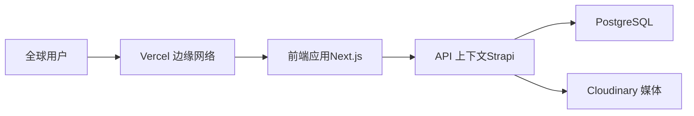
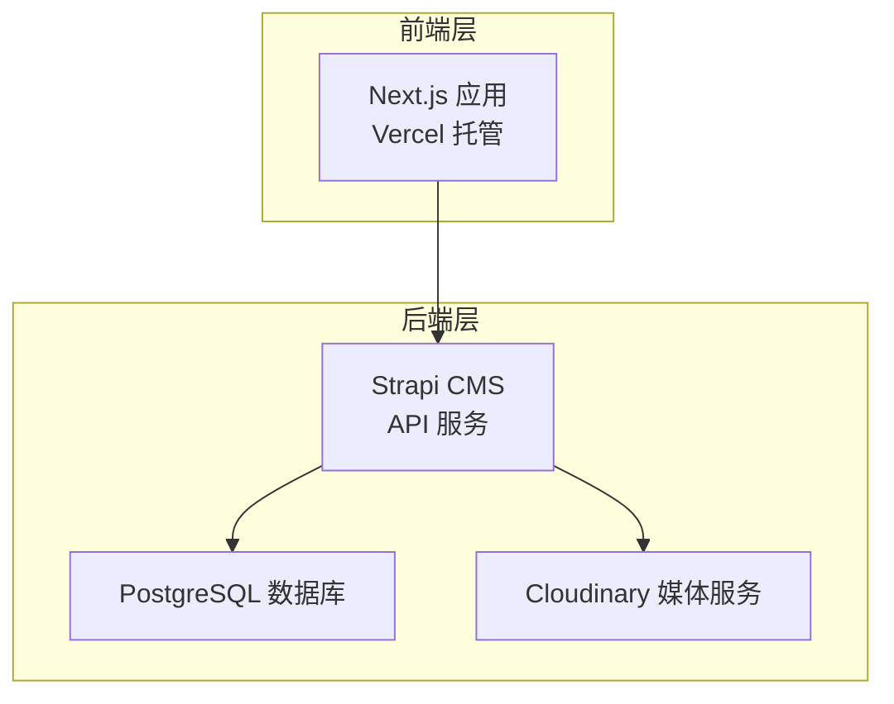
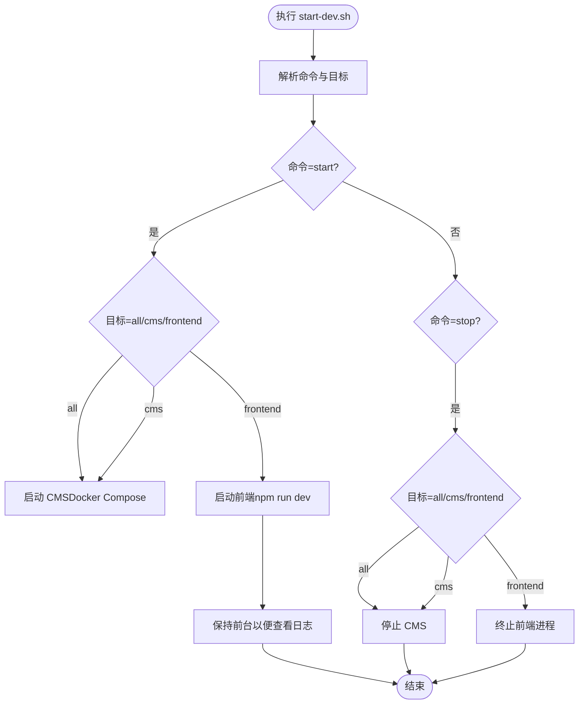
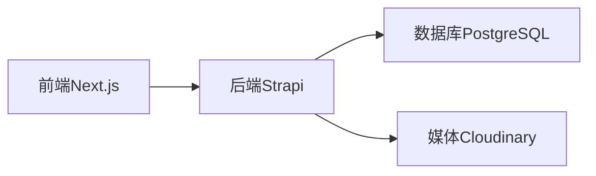

# 部署与运维

<cite>
**本文引用的文件**
- [DEPLOYMENT.md](file://DEPLOYMENT.md)
- [WEBSITE_ARCHITECTURE.md](file://WEBSITE_ARCHITECTURE.md)
- [start-dev.sh](file://start-dev.sh)
- [cms/Dockerfile](file://cms/Dockerfile)
- [cms/Dockerfile.prod](file://cms/Dockerfile.prod)
- [cms/docker-compose.yml](file://cms/docker-compose.yml)
- [cms/package.json](file://cms/package.json)
- [frontend/package.json](file://frontend/package.json)
- [cms/config/server.ts](file://cms/config/server.ts)
- [cms/config/database.ts](file://cms/config/database.ts)
- [cms/config/plugins.ts](file://cms/config/plugins.ts)
- [cms/scripts/copy-schemas.js](file://cms/scripts/copy-schemas.js)
- [cms/scripts/reseed-data.js](file://cms/scripts/reseed-data.js)
- [frontend/next.config.ts](file://frontend/next.config.ts)
- [frontend/src/lib/config.ts](file://frontend/src/lib/config.ts)
</cite>

## 目录
1. [简介](#简介)
2. [项目结构](#项目结构)
3. [核心组件](#核心组件)
4. [架构总览](#架构总览)
5. [详细组件分析](#详细组件分析)
6. [依赖关系分析](#依赖关系分析)
7. [性能考量](#性能考量)
8. [故障排除指南](#故障排除指南)
9. [结论](#结论)
10. [附录](#附录)

## 简介
本文件面向 Battivus 项目的生产部署与运维，覆盖以下主题：
- 生产环境部署流程（前端 Next.js、后端 Strapi、数据库 PostgreSQL）
- 容器化最佳实践与 Docker 配置
- 环境变量管理与安全加固
- 监控与日志管理建议
- CI/CD 自动化与部署策略
- 性能优化、安全配置与备份策略
- 故障排除、调试技巧与性能诊断
- 负载均衡、缓存与扩展性考虑
- 运维监控工具与告警配置
- 灾难恢复与业务连续性策略

## 项目结构
项目采用前后端分离架构：前端基于 Next.js，后端基于 Strapi，数据存储使用 PostgreSQL，媒体资源通过 Cloudinary 托管。部署推荐方案为：
- 前端：Vercel（Edge 网络 + 全球分发）
- 后端：Railway 或 Strapi Cloud（托管 PaaS）
- 数据库：Railway 提供的 PostgreSQL
- 媒体：Cloudinary

图表来源
- [DEPLOYMENT.md:10-17](file://DEPLOYMENT.md#L10-L17)

章节来源
- [DEPLOYMENT.md:3-17](file://DEPLOYMENT.md#L3-L17)
- [WEBSITE_ARCHITECTURE.md:50-95](file://WEBSITE_ARCHITECTURE.md#L50-L95)

## 核心组件
- 前端（Next.js）
  - 使用 Vercel 托管，支持自动构建与部署；根目录在 frontend。
  - 关键配置项包括开发指示器关闭等。
- 后端（Strapi）
  - 支持本地 Docker 开发与生产多阶段构建；默认监听 1337 端口。
  - 通过环境变量配置数据库连接、密钥与上传插件。
- 数据库（PostgreSQL）
  - 本地开发使用 docker-compose 提供的 PostgreSQL 容器；生产可由 Railway 或 Strapi Cloud 注入连接串。
- 媒体（Cloudinary）
  - 通过插件配置上传与删除操作选项。

章节来源
- [frontend/package.json:1-26](file://frontend/package.json#L1-L26)
- [frontend/next.config.ts:1-9](file://frontend/next.config.ts#L1-L9)
- [cms/package.json:1-36](file://cms/package.json#L1-L36)
- [cms/Dockerfile:1-43](file://cms/Dockerfile#L1-L43)
- [cms/Dockerfile.prod:1-38](file://cms/Dockerfile.prod#L1-L38)
- [cms/docker-compose.yml:1-67](file://cms/docker-compose.yml#L1-L67)
- [cms/config/server.ts:1-11](file://cms/config/server.ts#L1-L11)
- [cms/config/database.ts:1-15](file://cms/config/database.ts#L1-L15)
- [cms/config/plugins.ts:1-19](file://cms/config/plugins.ts#L1-L19)

## 架构总览
整体系统由前端、后端、数据库与媒体服务组成，采用“前端静态分发 + 后端无状态 API”的现代 B2B 网站架构。前端通过 API 获取内容，后端负责内容管理与数据持久化，并将媒体资源托管于 Cloudinary。

图表来源
- [WEBSITE_ARCHITECTURE.md:50-95](file://WEBSITE_ARCHITECTURE.md#L50-L95)
- [DEPLOYMENT.md:109-130](file://DEPLOYMENT.md#L109-L130)

## 详细组件分析

### 前端（Next.js）部署与配置
- 部署平台：Vercel
- 根目录：frontend
- 关键点：
  - 自动检测框架与根目录
  - 环境变量：NEXT_PUBLIC_API_URL（指向后端域名）、API_TOKEN（只读令牌）
  - 构建与运行：dev/build/start/lint 脚本
  - 开发体验：关闭 dev 指示器以减少干扰

章节来源
- [DEPLOYMENT.md:109-130](file://DEPLOYMENT.md#L109-L130)
- [frontend/package.json:5-10](file://frontend/package.json#L5-L10)
- [frontend/next.config.ts:3-6](file://frontend/next.config.ts#L3-L6)

### 后端（Strapi）容器化与配置
- 本地开发
  - docker-compose 启动 PostgreSQL 与 Strapi，暴露 5432/1337 端口
  - 环境变量：数据库连接、密钥（APP_KEYS/JWT_SECRET/ADMIN_JWT_SECRET/API_TOKEN_SALT）、上传插件参数
  - 卷挂载：config、src、uploads、.env
- 生产构建
  - 多阶段 Dockerfile.prod，区分构建与运行阶段，仅复制必要文件
  - 运行时设置 NODE_ENV=production 并暴露 1337 端口
- 开发构建
  - Dockerfile（开发镜像）安装编译依赖并执行 build/copy-schemas

章节来源
- [cms/docker-compose.yml:1-67](file://cms/docker-compose.yml#L1-L67)
- [cms/Dockerfile.prod:1-38](file://cms/Dockerfile.prod#L1-L38)
- [cms/Dockerfile:1-43](file://cms/Dockerfile#L1-L43)
- [cms/scripts/copy-schemas.js:1-47](file://cms/scripts/copy-schemas.js#L1-L47)

### 数据库（PostgreSQL）与迁移
- 本地：docker-compose 提供健康检查与持久卷
- 生产：Railway 或 Strapi Cloud 注入 DATABASE_URL，无需手动配置本地连接
- 迁移与同步：可通过 Strapi Cloud 的自动注入与内容类型同步机制完成

章节来源
- [cms/docker-compose.yml:3-22](file://cms/docker-compose.yml#L3-L22)
- [DEPLOYMENT.md:100-105](file://DEPLOYMENT.md#L100-L105)

### 媒体（Cloudinary）集成
- 插件配置：provider 为 cloudinary，需提供 cloud_name、api_key、api_secret
- 动作选项：upload/delete
- 依赖：@strapi/provider-upload-cloudinary

章节来源
- [cms/config/plugins.ts:1-19](file://cms/config/plugins.ts#L1-L19)
- [cms/package.json:17](file://cms/package.json#L17)
- [DEPLOYMENT.md:133-164](file://DEPLOYMENT.md#L133-L164)

### 开发控制脚本（start-dev.sh）
- 功能：统一启动/停止/重启/查看状态，支持目标选择（all/cms/frontend）
- 行为：
  - 启动 CMS：进入 cms 目录执行 docker compose up -d
  - 启动前端：进入 frontend 目录执行 npm run dev
  - 状态查询：检测端口占用并输出在线/离线
  - 停止：停止 CMS 并终止前端进程

图表来源
- [start-dev.sh:120-195](file://start-dev.sh#L120-L195)

章节来源
- [start-dev.sh:1-195](file://start-dev.sh#L1-L195)

### 数据迁移与重置（Strapi Transfer 与重播种）
- 数据迁移：使用 Strapi Transfer 在生产与本地之间推送/拉取内容
- 重播种：reseed-data.js 脚本按前端导航分类创建产品与分类，并发布
- 步骤要点：
  - 在生产后台创建 Transfer Token
  - 在本地执行 transfer 命令并确认覆盖远程数据库
  - 使用 reseed-data.js 清理并重建分类与产品数据

章节来源
- [DEPLOYMENT.md:194-220](file://DEPLOYMENT.md#L194-L220)
- [cms/scripts/reseed-data.js:1-461](file://cms/scripts/reseed-data.js#L1-L461)

## 依赖关系分析
- 组件耦合
  - 前端依赖后端提供的 API 与只读令牌
  - 后端依赖数据库与媒体服务
  - 媒体服务与后端通过插件解耦
- 外部依赖
  - Vercel（前端托管与分发）
  - Railway/Strapi Cloud（后端与数据库托管）
  - Cloudinary（媒体托管）

图表来源
- [DEPLOYMENT.md:3-17](file://DEPLOYMENT.md#L3-L17)
- [cms/config/plugins.ts:1-19](file://cms/config/plugins.ts#L1-L19)

章节来源
- [DEPLOYMENT.md:3-17](file://DEPLOYMENT.md#L3-L17)
- [cms/config/plugins.ts:1-19](file://cms/config/plugins.ts#L1-L19)

## 性能考量
- 前端性能
  - 利用 Vercel 边缘网络提升全球访问速度
  - 使用 Next.js App Router 与静态生成/服务端渲染优化 SEO 与首屏性能
- 后端性能
  - 生产镜像采用多阶段构建，减少镜像体积与启动时间
  - 使用 PostgreSQL 并启用连接池与索引优化
- 缓存策略
  - 前端：利用 Vercel 缓存与浏览器缓存
  - 后端：对热点查询结果进行缓存（如产品列表页），结合 CDN 与数据库索引
- 负载均衡与扩展
  - 前端：Vercel 已内置全球负载均衡
  - 后端：Railway/Strapi Cloud 支持水平扩展；数据库可使用主从或托管高可用方案
- 监控与日志
  - 建议在后端开启结构化日志，结合外部监控平台（如日志聚合与指标面板）进行告警

## 故障排除指南
- 常见问题与定位
  - 前端无法访问后端 API：检查 NEXT_PUBLIC_API_URL 是否正确，确认后端域名与证书
  - 上传失败：核对 Cloudinary 配置与密钥，确保插件已安装且 actionOptions 正确
  - 数据库连接失败：核对 DATABASE_URL 或本地 docker-compose 环境变量
  - 开发脚本无法启动：使用 start-dev.sh status 查看端口占用情况，必要时 kill 对应进程
- 调试技巧
  - 查看后端容器日志与健康检查状态
  - 使用 reseed-data.js 快速重建分类与产品数据，验证 API 返回
  - 使用 Strapi Transfer 在本地与生产间同步内容，排查数据不一致
- 性能诊断
  - 前端：使用浏览器性能面板与 Core Web Vitals 指标
  - 后端：分析慢查询、连接数与内存使用，优化索引与查询

章节来源
- [start-dev.sh:102-118](file://start-dev.sh#L102-L118)
- [cms/scripts/reseed-data.js:409-461](file://cms/scripts/reseed-data.js#L409-L461)
- [DEPLOYMENT.md:181-185](file://DEPLOYMENT.md#L181-L185)

## 结论
本部署与运维文档提供了从开发到生产的完整路径：明确的容器化配置、环境变量管理、CI/CD 自动化、监控与日志、性能优化与安全加固、故障排除与灾难恢复策略。建议在生产环境中优先采用 Railway/Strapi Cloud 的托管方案，结合 Vercel 的全球分发能力，实现低成本、低维护、高性能的 B2B 网站交付。

## 附录

### 环境变量清单（后端）
- NODE_ENV：生产模式
- DATABASE_CLIENT：postgres
- DATABASE_URL：由平台注入（Railway/Strapi Cloud）
- JWT_SECRET、ADMIN_JWT_SECRET、API_TOKEN_SALT：随机字符串
- APP_KEYS：逗号分隔的随机字符串
- CLOUDINARY_NAME、CLOUDINARY_KEY、CLOUDINARY_SECRET：媒体服务凭据

章节来源
- [DEPLOYMENT.md:66-82](file://DEPLOYMENT.md#L66-L82)
- [cms/docker-compose.yml:30-47](file://cms/docker-compose.yml#L30-L47)

### 前端环境变量清单
- NEXT_PUBLIC_API_URL：后端 API 地址（无尾随斜杠）
- API_TOKEN：只读 API 令牌

章节来源
- [DEPLOYMENT.md:119-125](file://DEPLOYMENT.md#L119-L125)

### CI/CD 自动化
- 前端：Vercel 在 main 分支变更时自动部署
- 后端：Railway 在 main 分支变更时自动部署（可配置为仅在 cms 目录变更时触发）

章节来源
- [DEPLOYMENT.md:181-185](file://DEPLOYMENT.md#L181-L185)

### 安全配置要点
- 生成强随机密钥（如使用密码学安全的随机源）
- 最小权限原则：公共角色仅开放必要权限
- 传输加密：启用 HTTPS 与 TLS
- 定期轮换密钥与令牌

章节来源
- [DEPLOYMENT.md:186-191](file://DEPLOYMENT.md#L186-L191)

### 备份与灾难恢复
- 数据库备份：使用托管平台的自动备份功能（Railway/Strapi Cloud）
- 内容迁移：使用 Strapi Transfer 在不同环境间同步
- 媒体备份：Cloudinary 自带冗余与版本管理

章节来源
- [DEPLOYMENT.md:194-220](file://DEPLOYMENT.md#L194-L220)

### 运维监控与告警
- 日志：集中收集后端容器日志与错误事件
- 指标：CPU/内存/连接数/响应时间/错误率
- 告警：针对异常增长与不可用状态触发通知

[本节为通用运维建议，不直接分析具体文件]