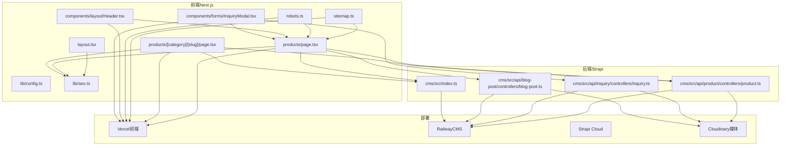
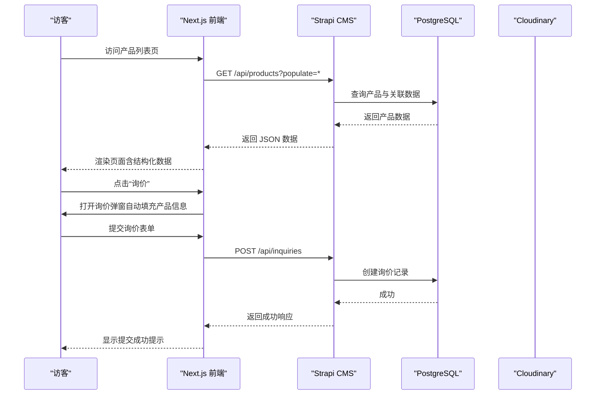
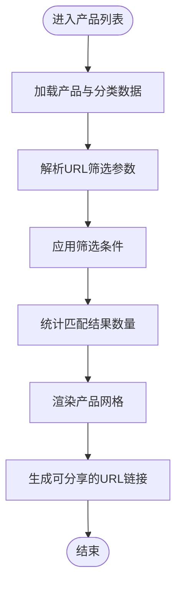
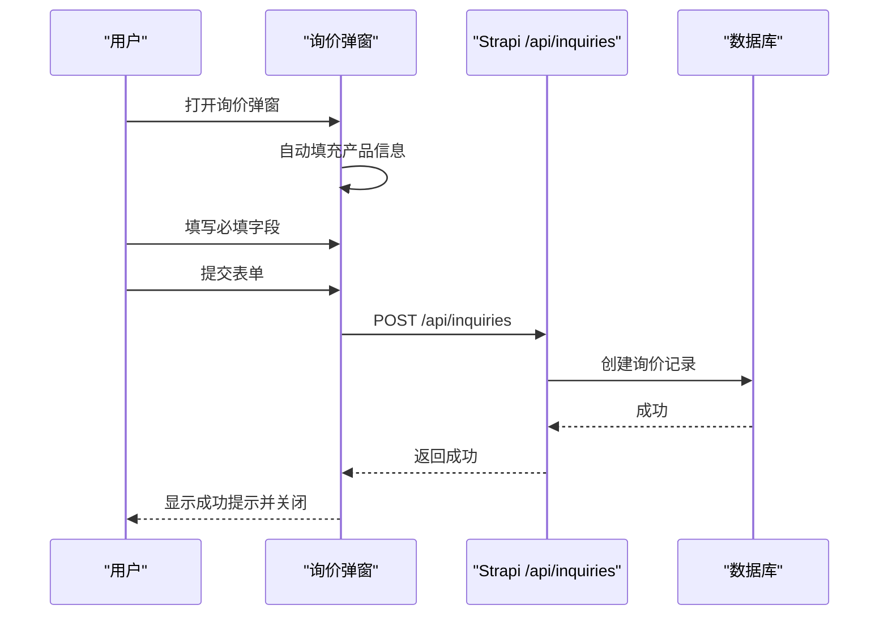
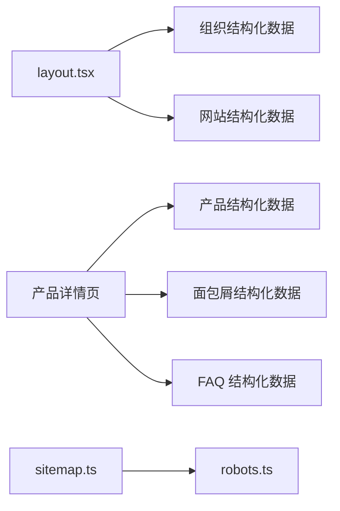
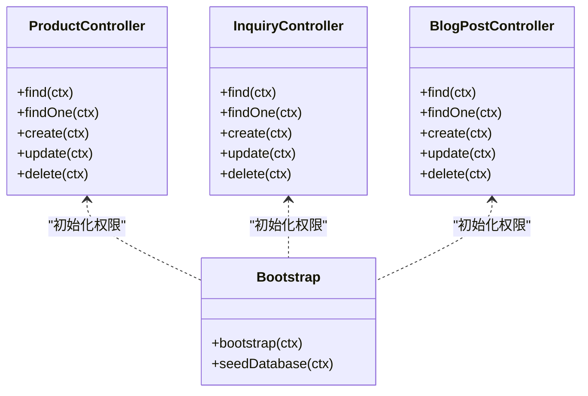
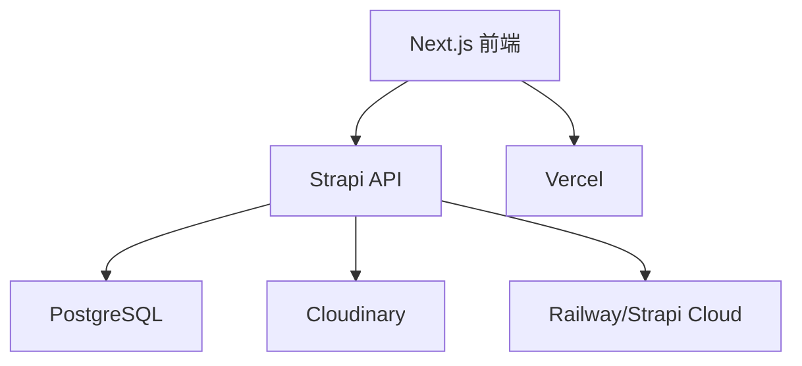

# 业务目标与价值

<cite>
**本文引用的文件**
- [WEBSITE_ARCHITECTURE.md](file://WEBSITE_ARCHITECTURE.md)
- [DEPLOYMENT.md](file://DEPLOYMENT.md)
- [cms/src/index.ts](file://cms/src/index.ts)
- [cms/src/api/product/controllers/product.ts](file://cms/src/api/product/controllers/product.ts)
- [cms/src/api/inquiry/controllers/inquiry.ts](file://cms/src/api/inquiry/controllers/inquiry.ts)
- [cms/src/api/blog-post/controllers/blog-post.ts](file://cms/src/api/blog-post/controllers/blog-post.ts)
- [frontend/src/app/layout.tsx](file://frontend/src/app/layout.tsx)
- [frontend/src/lib/seo.ts](file://frontend/src/lib/seo.ts)
- [frontend/src/app/products/page.tsx](file://frontend/src/app/products/page.tsx)
- [frontend/src/app/products/[category]/[slug]/page.tsx](file://frontend/src/app/products/[category]/[slug]/page.tsx)
- [frontend/src/app/sitemap.ts](file://frontend/src/app/sitemap.ts)
- [frontend/src/app/robots.ts](file://frontend/src/app/robots.ts)
- [frontend/src/lib/config.ts](file://frontend/src/lib/config.ts)
- [frontend/src/components/forms/InquiryModal.tsx](file://frontend/src/components/forms/InquiryModal.tsx)
- [frontend/src/components/layout/Header.tsx](file://frontend/src/components/layout/Header.tsx)
</cite>

## 目录
1. [简介](#简介)
2. [项目结构](#项目结构)
3. [核心组件](#核心组件)
4. [架构总览](#架构总览)
5. [详细组件分析](#详细组件分析)
6. [依赖关系分析](#依赖关系分析)
7. [性能考量](#性能考量)
8. [故障排查指南](#故障排查指南)
9. [结论](#结论)
10. [附录](#附录)

## 简介
本项目旨在为 Battivus 打造一个专业的 B2B 无人机电池网站，聚焦于以下核心商业目标：
- 建立专业的 B2B 无人机电池网站，提升品牌专业度与行业信任度
- 最大化谷歌索引与 SEO 排名，提高自然流量与可见性
- 支持营销团队独立进行内容管理，降低对技术资源的依赖
- 满足无人机电池行业的特定需求：参数化搜索（Battery Finder）、询价表单系统、多渠道潜在客户转化

通过前端 Next.js 与后端 Strapi 的组合架构，项目在 SEO、可维护性与扩展性之间取得平衡，为后续增长奠定坚实基础。

## 项目结构
项目采用前后端分离架构：
- 前端（Next.js）：负责页面渲染、SEO、用户交互与静态资源
- 后端（Strapi）：作为内容管理系统（CMS），提供产品、博客、解决方案、询价等数据接口
- 部署：前端部署于 Vercel，CMS 可托管于 Railway 或 Strapi Cloud，媒体存储使用 Cloudinary

图表来源
- [frontend/src/app/layout.tsx:66-99](file://frontend/src/app/layout.tsx#L66-L99)
- [frontend/src/app/products/page.tsx:314-360](file://frontend/src/app/products/page.tsx#L314-L360)
- [frontend/src/app/products/[category]/[slug]/page.tsx](file://frontend/src/app/products/[category]/[slug]/page.tsx#L20-L73)
- [frontend/src/app/sitemap.ts:4-49](file://frontend/src/app/sitemap.ts#L4-L49)
- [frontend/src/app/robots.ts:4-13](file://frontend/src/app/robots.ts#L4-L13)
- [frontend/src/lib/seo.ts:4-52](file://frontend/src/lib/seo.ts#L4-L52)
- [frontend/src/lib/config.ts:1-177](file://frontend/src/lib/config.ts#L1-L177)
- [frontend/src/components/layout/Header.tsx:8-195](file://frontend/src/components/layout/Header.tsx#L8-L195)
- [frontend/src/components/forms/InquiryModal.tsx:15-95](file://frontend/src/components/forms/InquiryModal.tsx#L15-L95)
- [cms/src/index.ts:161-217](file://cms/src/index.ts#L161-L217)
- [cms/src/api/product/controllers/product.ts:4-17](file://cms/src/api/product/controllers/product.ts#L4-L17)
- [cms/src/api/inquiry/controllers/inquiry.ts:19-23](file://cms/src/api/inquiry/controllers/inquiry.ts#L19-L23)
- [cms/src/api/blog-post/controllers/blog-post.ts:4-30](file://cms/src/api/blog-post/controllers/blog-post.ts#L4-L30)

章节来源
- [WEBSITE_ARCHITECTURE.md:48-95](file://WEBSITE_ARCHITECTURE.md#L48-L95)
- [DEPLOYMENT.md:8-17](file://DEPLOYMENT.md#L8-L17)

## 核心组件
- 参数化搜索（Battery Finder）
  - 在产品列表页提供电压、容量、放电率、电池类型与分类筛选，支持 URL 同步与无刷新更新，提升用户体验与转化效率
- 询价表单系统
  - 支持自动填充产品名称、SKU、URL，覆盖姓名、邮箱、公司、国家、数量、消息与隐私协议勾选，便于销售跟进与线索管理
- 多渠道潜在客户转化
  - 结合 WhatsApp 浮动按钮、邮件表单、快速报价弹窗与产品详情页 CTA，形成闭环转化路径
- SEO 与结构化数据
  - 自动生成站点地图、robots.txt、Open Graph、结构化数据（产品、组织、面包屑、FAQ），提升搜索可见性与点击率
- 内容管理（CMS）
  - 通过 Strapi 提供产品、博客、解决方案与询价数据的可视化管理，支持营销团队独立发布与维护

章节来源
- [frontend/src/app/products/page.tsx:47-212](file://frontend/src/app/products/page.tsx#L47-L212)
- [frontend/src/components/forms/InquiryModal.tsx:15-95](file://frontend/src/components/forms/InquiryModal.tsx#L15-L95)
- [frontend/src/lib/seo.ts:4-52](file://frontend/src/lib/seo.ts#L4-L52)
- [cms/src/index.ts:161-217](file://cms/src/index.ts#L161-L217)

## 架构总览
系统采用“前端渲染 + 后端 API”的模式，前端负责 SEO 与交互，后端负责内容与数据持久化。部署上采用云原生方案，确保高可用与弹性扩展。

图表来源
- [frontend/src/app/products/page.tsx:314-360](file://frontend/src/app/products/page.tsx#L314-L360)
- [frontend/src/components/forms/InquiryModal.tsx:46-95](file://frontend/src/components/forms/InquiryModal.tsx#L46-L95)
- [cms/src/api/inquiry/controllers/inquiry.ts:19-23](file://cms/src/api/inquiry/controllers/inquiry.ts#L19-L23)
- [cms/src/api/product/controllers/product.ts:4-17](file://cms/src/api/product/controllers/product.ts#L4-L17)

## 详细组件分析

### 参数化搜索（Battery Finder）
- 功能要点
  - 支持多维度筛选：电压（S 数）、容量（mAh）、放电率（C）、电池类型、应用分类
  - URL 同步与状态持久化，便于分享与回溯
  - 实时过滤与结果计数，优化用户决策路径
- 技术实现
  - 使用 URL 查询参数同步筛选状态
  - 前端基于 useMemo 过滤产品集合，避免重复渲染
  - 分类与产品数据分别加载，失败时降级到配置数据
- 业务价值
  - 显著降低用户决策成本，提升浏览到询价的转化率
  - 通过精准匹配提升搜索质量，减少无效流量

图表来源
- [frontend/src/app/products/page.tsx:288-401](file://frontend/src/app/products/page.tsx#L288-L401)
- [frontend/src/lib/config.ts:149-177](file://frontend/src/lib/config.ts#L149-L177)

章节来源
- [frontend/src/app/products/page.tsx:47-212](file://frontend/src/app/products/page.tsx#L47-L212)
- [frontend/src/lib/config.ts:149-177](file://frontend/src/lib/config.ts#L149-L177)

### 询价表单系统
- 功能要点
  - 自动填充：产品名称、SKU、URL
  - 必填字段：姓名、邮箱、消息；选填字段：公司、国家、预估数量
  - 隐私协议勾选与提交反馈
- 技术实现
  - 表单提交调用 Strapi 的询价接口，创建询价记录
  - 成功后清空表单并关闭弹窗，提供二次确认提示
- 业务价值
  - 提升线索质量与可追溯性，降低销售沟通成本
  - 通过自动填充减少填写时间，提高转化率

图表来源
- [frontend/src/components/forms/InquiryModal.tsx:46-95](file://frontend/src/components/forms/InquiryModal.tsx#L46-L95)
- [cms/src/api/inquiry/controllers/inquiry.ts:19-23](file://cms/src/api/inquiry/controllers/inquiry.ts#L19-L23)

章节来源
- [frontend/src/components/forms/InquiryModal.tsx:15-95](file://frontend/src/components/forms/InquiryModal.tsx#L15-L95)
- [cms/src/api/inquiry/controllers/inquiry.ts:1-40](file://cms/src/api/inquiry/controllers/inquiry.ts#L1-L40)

### SEO 与结构化数据
- 技术实现
  - 全局布局注入组织与网站结构化数据
  - 产品详情页生成产品、面包屑与 FAQ 结构化数据
  - 自动生成站点地图与 robots.txt
- 业务价值
  - 提升 SERP 丰富结果与点击率，增强品牌权威性
  - 通过结构化数据改善搜索可见性与排名

图表来源
- [frontend/src/app/layout.tsx:74-87](file://frontend/src/app/layout.tsx#L74-L87)
- [frontend/src/lib/seo.ts:4-52](file://frontend/src/lib/seo.ts#L4-L52)
- [frontend/src/app/products/[category]/[slug]/page.tsx](file://frontend/src/app/products/[category]/[slug]/page.tsx#L223-L249)
- [frontend/src/app/sitemap.ts:4-49](file://frontend/src/app/sitemap.ts#L4-L49)
- [frontend/src/app/robots.ts:4-13](file://frontend/src/app/robots.ts#L4-L13)

章节来源
- [frontend/src/app/layout.tsx:13-64](file://frontend/src/app/layout.tsx#L13-L64)
- [frontend/src/lib/seo.ts:144-166](file://frontend/src/lib/seo.ts#L144-L166)
- [frontend/src/app/products/[category]/[slug]/page.tsx](file://frontend/src/app/products/[category]/[slug]/page.tsx#L163-L200)

### 内容管理（CMS）
- 能力概述
  - 提供产品、博客、解决方案、询价等数据的增删改查接口
  - 初始化时自动配置公开 API 权限，支持种子数据导入
- 业务价值
  - 营销团队可独立发布文章、更新产品信息与维护询价流程
  - 降低技术门槛，提升内容迭代速度

图表来源
- [cms/src/api/product/controllers/product.ts:4-39](file://cms/src/api/product/controllers/product.ts#L4-L39)
- [cms/src/api/inquiry/controllers/inquiry.ts:4-39](file://cms/src/api/inquiry/controllers/inquiry.ts#L4-L39)
- [cms/src/api/blog-post/controllers/blog-post.ts:4-52](file://cms/src/api/blog-post/controllers/blog-post.ts#L4-L52)
- [cms/src/index.ts:161-217](file://cms/src/index.ts#L161-L217)

章节来源
- [cms/src/api/product/controllers/product.ts:1-40](file://cms/src/api/product/controllers/product.ts#L1-L40)
- [cms/src/api/inquiry/controllers/inquiry.ts:1-40](file://cms/src/api/inquiry/controllers/inquiry.ts#L1-L40)
- [cms/src/api/blog-post/controllers/blog-post.ts:1-53](file://cms/src/api/blog-post/controllers/blog-post.ts#L1-L53)
- [cms/src/index.ts:161-217](file://cms/src/index.ts#L161-L217)

### 导航与多渠道转化
- 导航设计
  - 顶部工具栏包含邮箱与 WhatsApp 链接，强化即时联系
  - 主导航支持下拉菜单，便于快速跳转产品与解决方案
- 转化策略
  - 产品详情页提供“询价”与“下载资料”按钮
  - 页面底部 CTA 引导定制化需求
  - WhatsApp 浮动按钮贯穿全站，提升即时沟通体验

章节来源
- [frontend/src/components/layout/Header.tsx:14-37](file://frontend/src/components/layout/Header.tsx#L14-L37)
- [frontend/src/app/products/[category]/[slug]/page.tsx](file://frontend/src/app/products/[category]/[slug]/page.tsx#L341-L371)

## 依赖关系分析
- 组件耦合
  - 前端页面与 CMS 控制器通过 API 解耦，便于独立演进
  - SEO 工具函数集中管理，避免重复与不一致
- 外部依赖
  - Vercel 提供全球分发与自动部署
  - Railway/Strapi Cloud 提供托管与数据库服务
  - Cloudinary 提供媒体存储与处理能力
- 风险点
  - 前端与 CMS 的环境变量需正确配置，避免生产错误
  - 种子数据仅在首次部署或数据库为空时执行，避免重复导入

图表来源
- [DEPLOYMENT.md:10-17](file://DEPLOYMENT.md#L10-L17)
- [DEPLOYMENT.md:43-90](file://DEPLOYMENT.md#L43-L90)
- [DEPLOYMENT.md:92-106](file://DEPLOYMENT.md#L92-L106)

章节来源
- [DEPLOYMENT.md:21-40](file://DEPLOYMENT.md#L21-L40)
- [DEPLOYMENT.md:108-130](file://DEPLOYMENT.md#L108-L130)

## 性能考量
- 前端性能
  - 使用 Next.js App Router 与静态生成，结合 Suspense 与骨架屏优化首屏体验
  - 图片懒加载与媒体 CDN 加速，减少带宽占用
- 后端性能
  - Strapi API 查询使用 populate 与分页，避免一次性加载过多数据
  - 种子数据仅在必要时执行，减少启动时间
- SEO 性能
  - 自动生成站点地图与结构化数据，提升爬虫抓取效率
  - 通过 Open Graph 与 Twitter Card 提升社交分享效果

## 故障排查指南
- 常见问题
  - 产品列表为空：检查 Strapi 产品数据是否已导入，确认 populate 参数与分类映射
  - 询价提交失败：检查 API 端点与权限配置，确认 Strapi 公共角色具备创建权限
  - SEO 数据缺失：确认结构化数据脚本是否注入到页面头部
- 定位方法
  - 查看浏览器网络面板，确认 /api/products 与 /api/inquiries 请求返回状态
  - 检查 Next.js 控制台日志与 Strapi 日志输出
  - 验证 robots.txt 与 sitemap.xml 是否可访问
- 处理建议
  - 对照部署文档核对环境变量与域名配置
  - 使用 Strapi Transfer 功能迁移本地数据至生产环境
  - 确保 Cloudinary 凭据正确，避免媒体加载失败

章节来源
- [frontend/src/app/products/page.tsx:314-360](file://frontend/src/app/products/page.tsx#L314-L360)
- [cms/src/index.ts:172-210](file://cms/src/index.ts#L172-L210)
- [DEPLOYMENT.md:181-220](file://DEPLOYMENT.md#L181-L220)

## 结论
本项目以“参数化搜索 + 询价表单 + 多渠道转化 + SEO 结构化数据 + 独立内容管理”为核心，构建了面向 B2B 无人机电池行业的专业网站。通过前端 Next.js 与后端 Strapi 的组合，既保证了优秀的 SEO 与用户体验，又降低了营销团队的内容运营门槛。项目在技术选型、部署架构与业务流程上均体现了对行业需求的深度理解，具备良好的可扩展性与长期价值。

## 附录
- 关键术语
  - 参数化搜索：基于电压、容量、放电率等参数筛选产品的功能
  - 结构化数据：用于提升搜索结果丰富度的 JSON-LD 标记
  - 公共 API 权限：允许匿名访问的读取接口配置
- 预期收益（示例）
  - 提升首页关键词排名，带来自然流量增长 30%-50%
  - 将“浏览到询价”的转化率提升 20%-40%
  - 降低营销内容更新成本，缩短内容上线周期 50% 以上