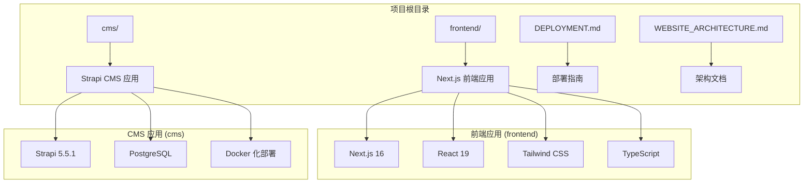
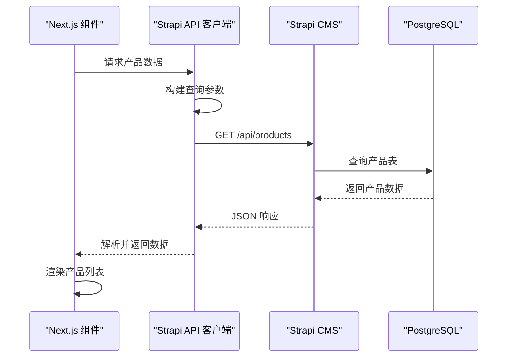
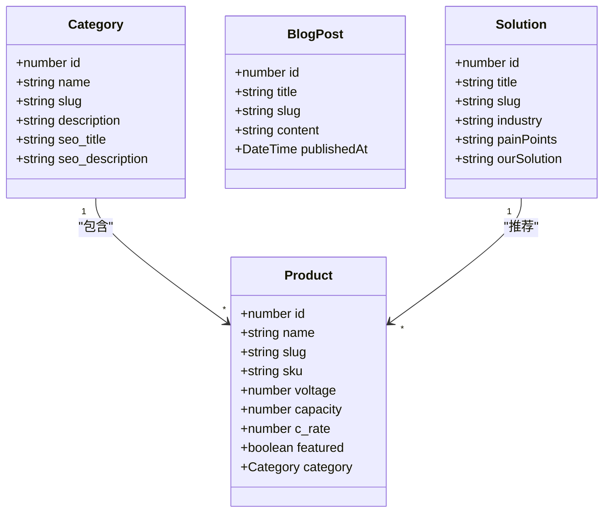
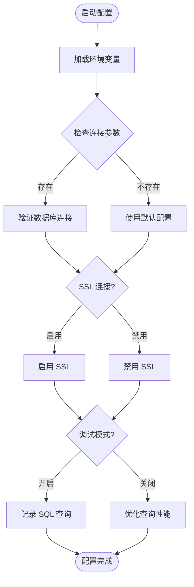
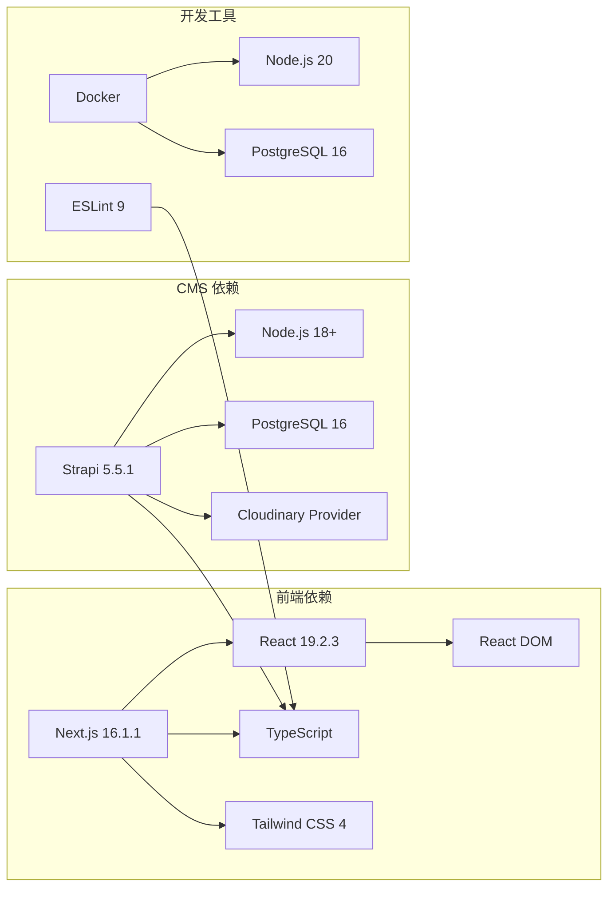
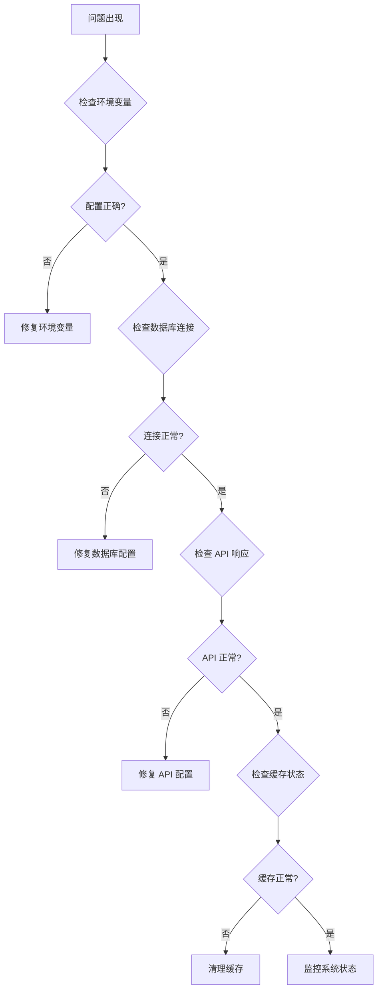

# 技术栈概览

<cite>
**本文档引用的文件**
- [package.json](file://cms/package.json)
- [package.json](file://frontend/package.json)
- [docker-compose.yml](file://cms/docker-compose.yml)
- [Dockerfile](file://cms/Dockerfile)
- [Dockerfile.prod](file://cms/Dockerfile.prod)
- [database.ts](file://cms/config/database.ts)
- [server.ts](file://cms/config/server.ts)
- [index.ts](file://cms/src/index.ts)
- [strapi.ts](file://frontend/src/lib/strapi.ts)
- [config.ts](file://frontend/src/lib/config.ts)
- [next.config.ts](file://frontend/next.config.ts)
- [tsconfig.json](file://cms/tsconfig.json)
- [tsconfig.json](file://frontend/tsconfig.json)
- [DEPLOYMENT.md](file://DEPLOYMENT.md)
- [WEBSITE_ARCHITECTURE.md](file://WEBSITE_ARCHITECTURE.md)
</cite>

## 目录
1. [简介](#简介)
2. [项目结构](#项目结构)
3. [核心组件](#核心组件)
4. [架构总览](#架构总览)
5. [详细组件分析](#详细组件分析)
6. [依赖关系分析](#依赖关系分析)
7. [性能考虑](#性能考虑)
8. [故障排除指南](#故障排除指南)
9. [结论](#结论)

## 简介

本项目采用前后端分离架构：前端使用 Next.js 16 + React 19 + Tailwind CSS，后端使用 Strapi 5.5.1 + PostgreSQL，配合 Docker 容器化部署。该技术栈在 SEO 优化、内容管理灵活性、开发效率和可扩展性方面具有显著优势，特别适合 B2B 飞控电池网站对搜索引擎可见性和内容独立管理的需求。

## 项目结构

项目采用多包架构，清晰分离前端和 CMS 后端：



**图表来源**
- [package.json:1-26](file://frontend/package.json#L1-L26)
- [package.json:1-36](file://cms/package.json#L1-L36)

**章节来源**
- [package.json:1-26](file://frontend/package.json#L1-L26)
- [package.json:1-36](file://cms/package.json#L1-L36)

## 核心组件

### 前端技术栈 (Next.js 16 + React 19 + Tailwind CSS)

前端采用现代 React 生态系统，具备以下核心特性：

- **Next.js 16**: 提供 App Router、Server-Side Rendering 和静态生成能力
- **React 19**: 最新版本 React，支持并发特性和性能优化
- **Tailwind CSS v4**: 实用优先的样式框架，支持快速原型设计
- **TypeScript**: 类型安全和更好的开发体验

### CMS 技术栈 (Strapi 5.5.1 + PostgreSQL)

CMS 采用 Strapi 5.5.1 作为无头 CMS，结合 PostgreSQL 数据库：

- **Strapi 5.5.1**: 功能完整的无头 CMS，支持内容类型管理和 API 生成
- **PostgreSQL**: 可靠的关系型数据库，支持复杂查询和事务处理
- **Docker 化**: 支持本地开发和生产环境的一致部署

### 开发工具链

- **TypeScript**: 统一的类型定义和编译配置
- **ESLint**: 代码质量保证
- **Docker Compose**: 多服务容器编排
- **Git**: 版本控制和协作

**章节来源**
- [package.json:11-25](file://frontend/package.json#L11-L25)
- [package.json:14-29](file://cms/package.json#L14-L29)
- [tsconfig.json:1-35](file://frontend/tsconfig.json#L1-L35)
- [tsconfig.json:1-19](file://cms/tsconfig.json#L1-L19)

## 架构总览

系统采用三层架构，前后端完全分离：

```mermaid
graph TB
subgraph "客户端层"
Client[浏览器客户端]
Vercel[Next.js 应用<br/>Edge Network]
end
subgraph "应用层"
NextJS[Next.js 16<br/>App Router]
API[API 层<br/>数据聚合]
end
subgraph "数据层"
Strapi[Strapi 5.5.1<br/>无头 CMS]
DB[(PostgreSQL)<br/>16-alpine]
Media[媒体存储<br/>Cloudinary]
end
Client --> Vercel
Vercel --> NextJS
NextJS --> API
API --> Strapi
Strapi --> DB
Strapi --> Media
```

**图表来源**
- [DEPLOYMENT.md:10-17](file://DEPLOYMENT.md#L10-L17)
- [WEBSITE_ARCHITECTURE.md:52-71](file://WEBSITE_ARCHITECTURE.md#L52-L71)

## 详细组件分析

### 前端数据层 (Strapi API 客户端)

前端通过专门的 API 客户端与 Strapi 进行通信：



**图表来源**
- [strapi.ts:51-119](file://frontend/src/lib/strapi.ts#L51-L119)
- [strapi.ts:121-164](file://frontend/src/lib/strapi.ts#L121-L164)

前端 API 客户端主要功能包括：

- **统一的 API 访问层**: 封装所有 Strapi API 调用
- **查询参数构建**: 支持复杂的过滤、排序和分页
- **响应数据处理**: 统一的数据格式化和错误处理
- **缓存策略**: 利用 Next.js 的 revalidate 机制

### CMS 内容管理

CMS 采用 Strapi 5.5.1 的内容管理系统：



**图表来源**
- [strapi.ts:322-398](file://frontend/src/lib/strapi.ts#L322-L398)
- [index.ts:34-147](file://cms/src/index.ts#L34-L147)

CMS 的核心内容类型包括：

- **产品 (Product)**: 飞控电池的详细规格和属性
- **分类 (Category)**: 产品分类和导航结构
- **博客文章 (BlogPost)**: 技术文章和营销内容
- **解决方案 (Solution)**: 应用场景和案例研究

### 数据库配置

PostgreSQL 数据库配置支持高可用性和性能优化：



**图表来源**
- [database.ts:1-15](file://cms/config/database.ts#L1-L15)

数据库配置特点：

- **环境变量驱动**: 支持不同环境的灵活配置
- **SSL 支持**: 生产环境的安全连接选项
- **调试控制**: 开发和生产环境的不同日志级别

**章节来源**
- [strapi.ts:1-412](file://frontend/src/lib/strapi.ts#L1-L412)
- [index.ts:1-315](file://cms/src/index.ts#L1-L315)
- [database.ts:1-15](file://cms/config/database.ts#L1-L15)

## 依赖关系分析

### 版本兼容性矩阵

| 组件 | 版本 | 兼容性要求 | 依赖关系 |
|------|------|------------|----------|
| Next.js | 16.1.1 | React 19 | App Router, SSR |
| React | 19.2.3 | 18+ | Hooks, Concurrent |
| Strapi | 5.5.1 | Node.js 18+ | TypeScript, PostgreSQL |
| PostgreSQL | 16-alpine | 13+ | 连接池, 事务 |
| Node.js | 20-alpine | 18+ | Docker 基础镜像 |

### 依赖图谱



**图表来源**
- [package.json:11-25](file://frontend/package.json#L11-L25)
- [package.json:14-29](file://cms/package.json#L14-L29)

**章节来源**
- [package.json:1-26](file://frontend/package.json#L1-L26)
- [package.json:1-36](file://cms/package.json#L1-L36)

## 性能考虑

### 前端性能优化

- **静态生成**: 使用 Next.js 的静态生成减少服务器负载
- **增量静态再生**: 60 秒缓存策略平衡新鲜度和性能
- **代码分割**: 自动的路由级代码分割
- **图像优化**: Tailwind CSS 提供响应式布局支持

### 后端性能优化

- **Docker 容器化**: 一致的运行时环境和资源隔离
- **PostgreSQL 优化**: 16-alpine 版本的轻量级数据库
- **连接池管理**: 高效的数据库连接复用
- **CDN 集成**: Vercel Edge Network 提供全球加速

## 故障排除指南

### 常见问题诊断



### 部署相关问题

- **Docker 构建失败**: 检查 Node.js 版本和依赖安装
- **数据库连接超时**: 验证网络连通性和凭据配置
- **API 权限错误**: 确认 Strapi 用户权限设置
- **媒体上传失败**: 检查 Cloudinary 配置和网络访问

**章节来源**
- [DEPLOYMENT.md:186-223](file://DEPLOYMENT.md#L186-L223)

## 结论

该技术栈为 Battivus 飞控电池网站提供了坚实的技术基础：

**优势总结**:
- **SEO 友好**: Next.js 的 SSR 和静态生成确保优秀的搜索引擎表现
- **内容灵活**: Strapi 的无头 CMS 支持营销团队独立管理内容
- **开发高效**: 现代工具链提供良好的开发体验和代码质量
- **部署简单**: Docker 化部署简化了环境管理和扩展

**技术选型理由**:
- Next.js 16 选择基于其成熟的 App Router 和出色的 SEO 能力
- Strapi 5.5.1 提供了功能完备的无头 CMS 解决方案
- PostgreSQL 16-alpine 在性能和可靠性之间取得良好平衡
- Docker 化部署确保了开发和生产的环境一致性

该架构为未来的功能扩展和业务增长奠定了良好的技术基础，特别适合需要高性能 SEO 和灵活内容管理的 B2B 企业网站需求。