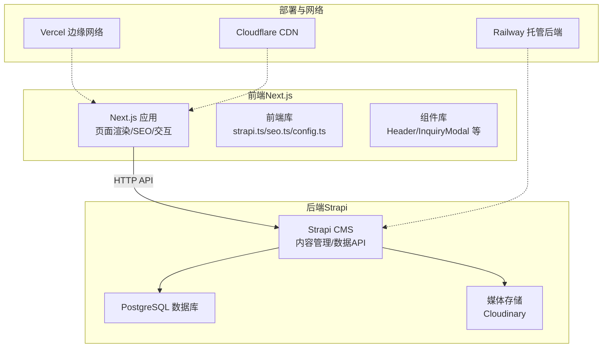
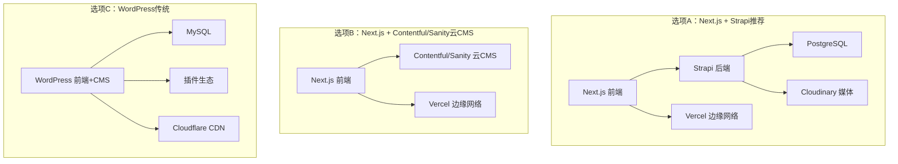
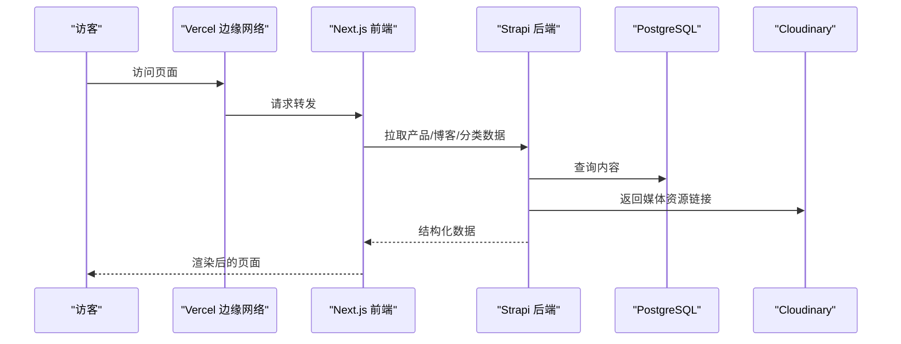
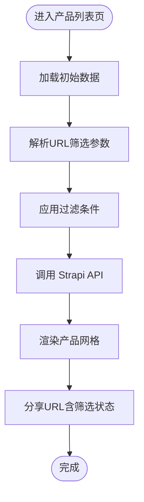
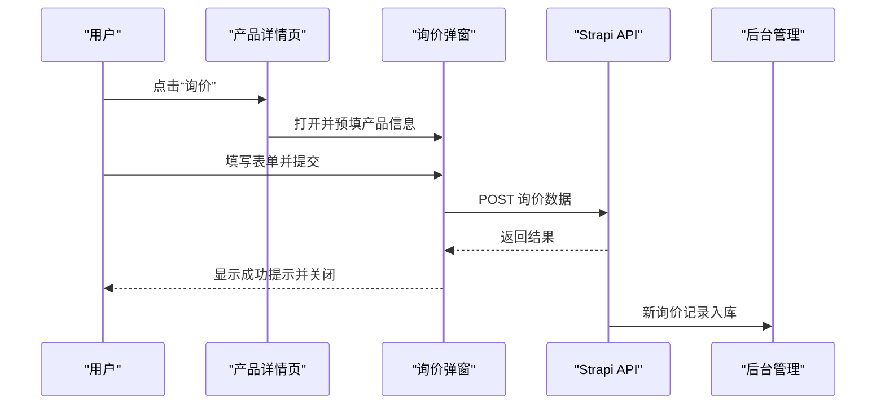
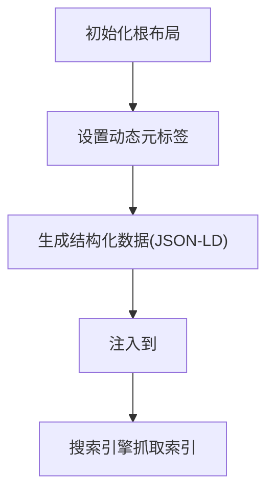
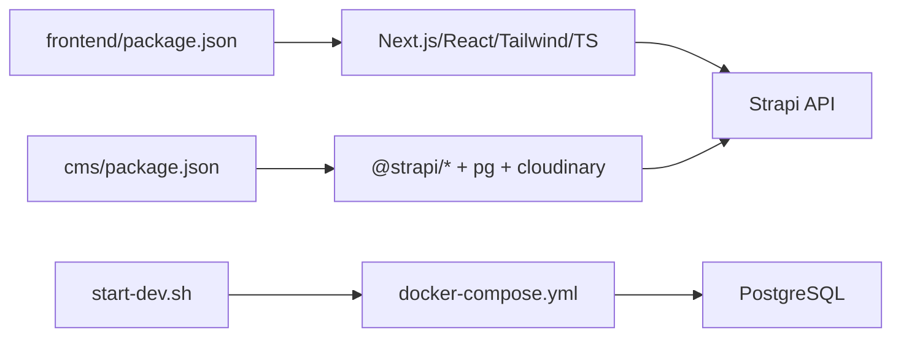

# 架构方案对比

<cite>
**本文引用的文件**
- [WEBSITE_ARCHITECTURE.md](file://WEBSITE_ARCHITECTURE.md)
- [DEPLOYMENT.md](file://DEPLOYMENT.md)
- [start-dev.sh](file://start-dev.sh)
- [cms/package.json](file://cms/package.json)
- [frontend/package.json](file://frontend/package.json)
- [cms/docker-compose.yml](file://cms/docker-compose.yml)
- [cms/Dockerfile](file://cms/Dockerfile)
- [frontend/src/lib/strapi.ts](file://frontend/src/lib/strapi.ts)
- [frontend/src/lib/config.ts](file://frontend/src/lib/config.ts)
- [frontend/src/lib/seo.ts](file://frontend/src/lib/seo.ts)
- [frontend/src/types/index.ts](file://frontend/src/types/index.ts)
- [frontend/src/app/layout.tsx](file://frontend/src/app/layout.tsx)
- [frontend/next.config.ts](file://frontend/next.config.ts)
- [frontend/src/components/layout/Header.tsx](file://frontend/src/components/layout/Header.tsx)
- [frontend/src/components/forms/InquiryModal.tsx](file://frontend/src/components/forms/InquiryModal.tsx)
- [cms/src/index.ts](file://cms/src/index.ts)
</cite>

## 目录
1. [引言](#引言)
2. [项目结构](#项目结构)
3. [核心组件](#核心组件)
4. [架构总览](#架构总览)
5. [详细组件分析](#详细组件分析)
6. [依赖关系分析](#依赖关系分析)
7. [性能考量](#性能考量)
8. [故障排查指南](#故障排查指南)
9. [结论](#结论)
10. [附录](#附录)

## 引言
本文件针对 Battivus 飞控电池网站项目，系统性对比三种技术架构方案，并给出最终选型与实施建议。目标是帮助不同背景的决策者快速理解各方案在 SEO 性能、页面速度、易用性、自定义程度、成本效率、维护努力等方面的差异，明确为何选择“Next.js + Strapi”作为推荐方案，并提供成本估算、实施难度与扩展性建议。

## 项目结构
项目采用前后端分离的双仓库结构：
- 前端：Next.js 应用，负责页面渲染、SEO、交互与业务逻辑调用
- 后端：Strapi CMS，提供内容管理与数据 API，支持产品、博客、解决方案等模型
- 开发与部署：通过脚本与容器编排实现本地开发与云端部署

图表来源
- [DEPLOYMENT.md:10-17](file://DEPLOYMENT.md#L10-L17)
- [cms/docker-compose.yml:1-67](file://cms/docker-compose.yml#L1-L67)
- [frontend/src/lib/strapi.ts:51-119](file://frontend/src/lib/strapi.ts#L51-L119)

章节来源
- [WEBSITE_ARCHITECTURE.md:48-96](file://WEBSITE_ARCHITECTURE.md#L48-L96)
- [DEPLOYMENT.md:3-5](file://DEPLOYMENT.md#L3-L5)

## 核心组件
- 前端 Next.js 组件与库
  - 页面布局与元数据：根布局、站点配置、SEO 工具函数
  - API 客户端：统一请求封装、查询参数构建、错误处理
  - 类型定义：产品、博客、解决方案、筛选器等类型
  - 业务组件：导航栏、询价弹窗等
- 后端 Strapi
  - 内容类型：产品、分类、博客、解决方案、询价表单
  - 初始化脚本：自动配置公开权限、种子数据导入
  - 容器化：Dockerfile 与 docker-compose 编排数据库与服务

章节来源
- [frontend/src/app/layout.tsx:13-64](file://frontend/src/app/layout.tsx#L13-L64)
- [frontend/src/lib/seo.ts:4-52](file://frontend/src/lib/seo.ts#L4-L52)
- [frontend/src/lib/strapi.ts:51-119](file://frontend/src/lib/strapi.ts#L51-L119)
- [frontend/src/types/index.ts:23-43](file://frontend/src/types/index.ts#L23-L43)
- [cms/src/index.ts:161-217](file://cms/src/index.ts#L161-L217)
- [cms/Dockerfile:1-43](file://cms/Dockerfile#L1-L43)
- [cms/docker-compose.yml:1-67](file://cms/docker-compose.yml#L1-L67)

## 架构总览
下图展示三种架构选项的对比与最终确认的“Next.js + Strapi”方案：

图表来源
- [WEBSITE_ARCHITECTURE.md:50-96](file://WEBSITE_ARCHITECTURE.md#L50-L96)
- [WEBSITE_ARCHITECTURE.md:98-131](file://WEBSITE_ARCHITECTURE.md#L98-L131)
- [WEBSITE_ARCHITECTURE.md:134-170](file://WEBSITE_ARCHITECTURE.md#L134-L170)

章节来源
- [WEBSITE_ARCHITECTURE.md:173-185](file://WEBSITE_ARCHITECTURE.md#L173-L185)

## 详细组件分析

### 方案A：Next.js + Strapi（推荐）
- 技术栈与职责
  - 前端：Next.js（App Router），负责 SEO、SSG/SSR、组件化页面
  - 后端：Strapi v4，提供内容管理与 API，支持产品、博客、解决方案等模型
  - 数据库：PostgreSQL
  - 媒体：Cloudinary
  - 部署：Vercel（前端）、Railway/Strapi Cloud（后端）
- 关键优势
  - 优秀的 Core Web Vitals，利于 SEO 与搜索排名
  - 营销团队可直接使用后台进行内容更新
  - 自定义能力强，适合复杂产品筛选与富文本内容
  - 成本可控，长期运维成本低
- 关键劣势
  - 初期需要开发者参与部署与配置
  - 自托管需关注服务器维护与安全
- 成本估算
  - 开发成本：一次性
  - 运营成本：Strapi Cloud 或 Railway + Vercel + Cloudinary + 域名 + 邮件服务

图表来源
- [DEPLOYMENT.md:10-17](file://DEPLOYMENT.md#L10-L17)
- [frontend/src/lib/strapi.ts:51-119](file://frontend/src/lib/strapi.ts#L51-L119)

章节来源
- [WEBSITE_ARCHITECTURE.md:50-96](file://WEBSITE_ARCHITECTURE.md#L50-L96)
- [DEPLOYMENT.md:29-41](file://DEPLOYMENT.md#L29-L41)
- [DEPLOYMENT.md:702-717](file://DEPLOYMENT.md#L702-L717)

### 方案B：Next.js + Contentful/Sanity（云CMS）
- 技术栈与职责
  - 前端：Next.js
  - CMS：Contentful/Sanity（SaaS）
  - 部署：Vercel
- 关键优势
  - 无需自管服务器，零运维
  - 企业级可靠性与开发者体验
- 关键劣势
  - 随内容增长成本上升
  - 供应商锁定风险
  - 免费额度限制
- 成本估算
  - 免费额度 → 团队计划约 $300+/月

章节来源
- [WEBSITE_ARCHITECTURE.md:98-131](file://WEBSITE_ARCHITECTURE.md#L98-L131)

### 方案C：WordPress（传统）
- 技术栈与职责
  - 前端+CMS：WordPress
  - 插件：SEO 插件（如 Rank Math/Yoast）
  - 部署：托管平台 + Cloudflare CDN
- 关键优势
  - 对非技术用户最友好
  - 生态丰富，上线最快
  - 初期开发成本低
- 关键劣势
  - 相对较慢（需优化）
  - 安全维护持续投入
  - 自定义功能灵活性有限
- 成本估算
  - 月租约 $30-50

章节来源
- [WEBSITE_ARCHITECTURE.md:134-170](file://WEBSITE_ARCHITECTURE.md#L134-L170)

### 评分矩阵与权衡分析
- 权重分配：SEO 性能（25%）、页面速度（20%）、易用性（营销）（20%）、自定义程度（15%）、成本效率（10%）、维护努力（10%）
- 综合得分
  - 方案A：4.45
  - 方案B：4.30
  - 方案C：3.80
- 推荐结论：方案A 在性能、灵活性与成本之间取得最佳平衡，适合以 SEO 为核心、强调产品筛选与内容独立运营的 B2B 网站

章节来源
- [WEBSITE_ARCHITECTURE.md:173-185](file://WEBSITE_ARCHITECTURE.md#L173-L185)

### 产品筛选与参数化搜索（前端实现要点）
- URL 参数驱动筛选：支持电压、容量、C-rate、应用类型、电池类型等多维过滤
- 实时筛选与分页：基于 URL 状态保持分享友好
- SSR 友好：利于搜索引擎抓取与索引

图表来源
- [frontend/src/lib/strapi.ts:185-219](file://frontend/src/lib/strapi.ts#L185-L219)
- [frontend/src/lib/config.ts:149-177](file://frontend/src/lib/config.ts#L149-L177)

章节来源
- [WEBSITE_ARCHITECTURE.md:225-272](file://WEBSITE_ARCHITECTURE.md#L225-L272)

### 询价表单与上下文联动（前端实现要点）
- 上下文预填：产品名称、SKU、URL 自动填充
- 提交流程：前端收集表单数据，调用 Strapi 的询价接口
- 用户反馈：提交成功提示与自动关闭

图表来源
- [frontend/src/components/forms/InquiryModal.tsx:46-95](file://frontend/src/components/forms/InquiryModal.tsx#L46-L95)
- [frontend/src/lib/strapi.ts:291-306](file://frontend/src/lib/strapi.ts#L291-L306)

章节来源
- [WEBSITE_ARCHITECTURE.md:275-338](file://WEBSITE_ARCHITECTURE.md#L275-L338)

### SEO 实施（前端实现要点）
- 动态元标签：标题、描述、关键词、Open Graph、Twitter 卡片
- 结构化数据：组织、网站、产品、文章、FAQ 等 JSON-LD
- 站点地图与爬虫协议：由 Next.js 生成与配置

图表来源
- [frontend/src/app/layout.tsx:74-87](file://frontend/src/app/layout.tsx#L74-L87)
- [frontend/src/lib/seo.ts:4-52](file://frontend/src/lib/seo.ts#L4-L52)
- [frontend/src/lib/seo.ts:144-161](file://frontend/src/lib/seo.ts#L144-L161)

章节来源
- [WEBSITE_ARCHITECTURE.md:464-565](file://WEBSITE_ARCHITECTURE.md#L464-L565)

## 依赖关系分析
- 前端依赖
  - Next.js 16、React 19、TailwindCSS、ESLint、TypeScript
- 后端依赖
  - Strapi v5、PostgreSQL、Cloudinary 上传插件、用户权限插件
- 开发与部署
  - Docker Compose 用于本地数据库与 CMS 容器编排
  - start-dev.sh 提供一键启动/停止前后端服务

图表来源
- [frontend/package.json:11-25](file://frontend/package.json#L11-L25)
- [cms/package.json:14-34](file://cms/package.json#L14-L34)
- [start-dev.sh:72-81](file://start-dev.sh#L72-L81)
- [cms/docker-compose.yml:1-67](file://cms/docker-compose.yml#L1-L67)

章节来源
- [frontend/package.json:11-25](file://frontend/package.json#L11-L25)
- [cms/package.json:14-34](file://cms/package.json#L14-L34)
- [start-dev.sh:120-152](file://start-dev.sh#L120-L152)

## 性能考量
- 前端性能
  - 使用 App Router 与边缘网络，提升首屏与交互性能
  - 结构化数据与元标签减少二次请求
- 后端性能
  - 数据库存储与媒体分离，避免容器重启导致数据丢失
  - API 查询参数化与分页，降低一次性负载
- SEO 与速度
  - 通过 Vercel 边缘缓存与 CDN 加速，结合合理的 revalidate 策略，兼顾新鲜度与性能

章节来源
- [WEBSITE_ARCHITECTURE.md:464-565](file://WEBSITE_ARCHITECTURE.md#L464-L565)
- [DEPLOYMENT.md:133-164](file://DEPLOYMENT.md#L133-L164)
- [frontend/src/lib/strapi.ts:111](file://frontend/src/lib/strapi.ts#L111)

## 故障排查指南
- 开发环境
  - 使用 start-dev.sh 控制前后端服务启停，检查端口占用与日志
  - docker-compose 健康检查确保数据库可用
- 部署问题
  - 环境变量缺失或不正确会导致 API 无法访问
  - Strapi Cloud/Railway 需要正确的 Base Directory 与 Root Directory 配置
  - 媒体存储需启用 Cloudinary 并配置插件
- API 与权限
  - 确保公开角色已授权读取权限
  - 种子数据脚本会自动清理旧数据并重建关系

章节来源
- [start-dev.sh:51-70](file://start-dev.sh#L51-L70)
- [cms/docker-compose.yml:17-21](file://cms/docker-compose.yml#L17-L21)
- [DEPLOYMENT.md:66-82](file://DEPLOYMENT.md#L66-L82)
- [cms/src/index.ts:161-217](file://cms/src/index.ts#L161-L217)

## 结论
综合 SEO 性能、页面速度、易用性、自定义能力、成本效率与维护努力，推荐采用“Next.js + Strapi”的混合架构。该方案在保证高性能与灵活定制的同时，具备较低的长期运维成本与良好的扩展性，适合 Battivus 的 B2B 产品展示与营销需求。

## 附录
- 成本估算（确认方案）
  - 开发成本：一次性
  - 运营成本：Strapi Cloud（Pro）+ Vercel（Pro）+ Cloudinary + 域名 + 邮件服务
  - 月均费用：约 $120-230（以实际计费为准）

章节来源
- [DEPLOYMENT.md:702-717](file://DEPLOYMENT.md#L702-L717)