# SEO结构化数据标记

<cite>
**本文档引用的文件**
- [seo.ts](file://frontend/src/lib/seo.ts)
- [strapi.ts](file://frontend/src/lib/strapi.ts)
- [config.ts](file://frontend/src/lib/config.ts)
- [layout.tsx](file://frontend/src/app/layout.tsx)
- [robots.ts](file://frontend/src/app/robots.ts)
- [sitemap.ts](file://frontend/src/app/sitemap.ts)
- [product-page.tsx](file://frontend/src/app/products/[category]/[slug]/page.tsx)
- [blog-page.tsx](file://frontend/src/app/blog/[slug]/page.tsx)
- [home-page.tsx](file://frontend/src/app/page.tsx)
- [types.ts](file://frontend/src/types/index.ts)
- [product-schema.json](file://cms/src/api/product/content-types/product/schema.json)
- [blog-schema.json](file://cms/src/api/blog-post/content-types/blog-post/schema.json)
- [package.json](file://frontend/package.json)
</cite>

## 目录
1. [简介](#简介)
2. [项目结构概览](#项目结构概览)
3. [核心组件分析](#核心组件分析)
4. [架构总览](#架构总览)
5. [详细组件分析](#详细组件分析)
6. [依赖关系分析](#依赖关系分析)
7. [性能考虑](#性能考虑)
8. [故障排除指南](#故障排除指南)
9. [结论](#结论)

## 简介

本项目实现了完整的SEO结构化数据标记功能，基于Next.js App Router架构，集成了JSON-LD结构化数据、动态元数据生成、Open Graph标签、robots.txt和sitemap.xml配置。该系统支持多种Schema类型，包括产品Schema、组织Schema、FAQ Schema、面包屑Schema和文章Schema，为搜索引擎提供了丰富的语义化信息。

系统通过Strapi CMS获取SEO字段，自动生成Open Graph标签，并配置了完整的robots.txt和sitemap.xml以优化搜索引擎抓取效果。所有实现都遵循Next.js 16的App Router最佳实践，确保了预渲染优化和搜索引擎友好性。

## 项目结构概览

项目采用前后端分离架构，前端使用Next.js 16构建，后端使用Strapi CMS管理内容。

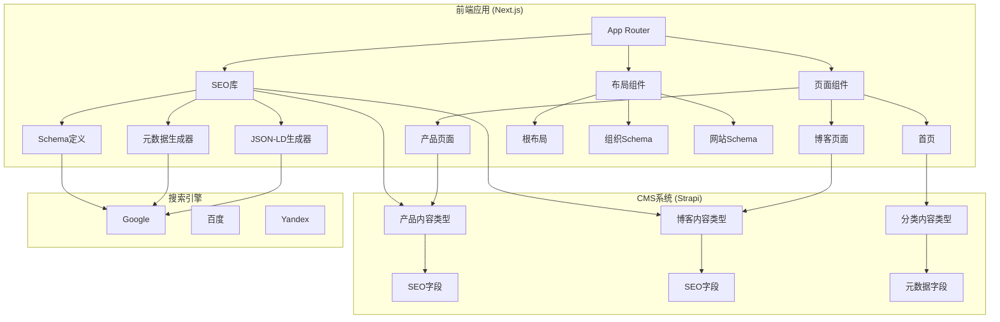

**图表来源**
- [layout.tsx:1-100](file://frontend/src/app/layout.tsx#L1-L100)
- [seo.ts:1-225](file://frontend/src/lib/seo.ts#L1-L225)
- [strapi.ts:1-412](file://frontend/src/lib/strapi.ts#L1-L412)

**章节来源**
- [layout.tsx:1-100](file://frontend/src/app/layout.tsx#L1-L100)
- [seo.ts:1-225](file://frontend/src/lib/seo.ts#L1-L225)
- [strapi.ts:1-412](file://frontend/src/lib/strapi.ts#L1-L412)

## 核心组件分析

### SEO库架构

SEO库是整个结构化数据标记系统的核心，提供了完整的Schema生成和元数据管理功能。

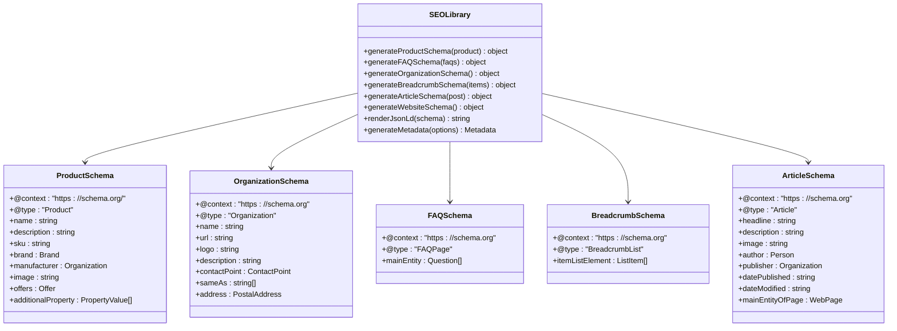

**图表来源**
- [seo.ts:4-166](file://frontend/src/lib/seo.ts#L4-L166)

### 数据流架构

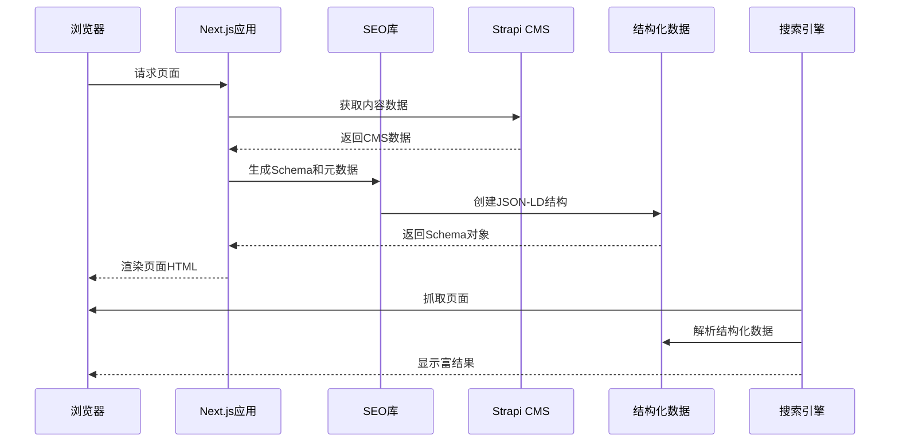

**图表来源**
- [product-page.tsx:163-200](file://frontend/src/app/products/[category]/[slug]/page.tsx#L163-L200)
- [seo.ts:168-225](file://frontend/src/lib/seo.ts#L168-L225)

**章节来源**
- [seo.ts:1-225](file://frontend/src/lib/seo.ts#L1-L225)
- [types.ts:1-157](file://frontend/src/types/index.ts#L1-L157)

## 架构总览

系统采用分层架构设计，确保了高内聚低耦合的特性。

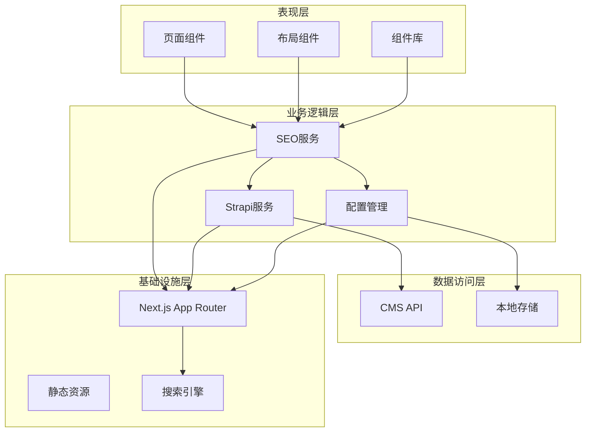

**图表来源**
- [layout.tsx:66-99](file://frontend/src/app/layout.tsx#L66-L99)
- [seo.ts:1-225](file://frontend/src/lib/seo.ts#L1-L225)
- [strapi.ts:51-164](file://frontend/src/lib/strapi.ts#L51-L164)

## 详细组件分析

### 产品页面SEO实现

产品页面是结构化数据标记的核心场景，实现了完整的JSON-LD产品Schema和相关Schema。

#### 产品Schema生成流程

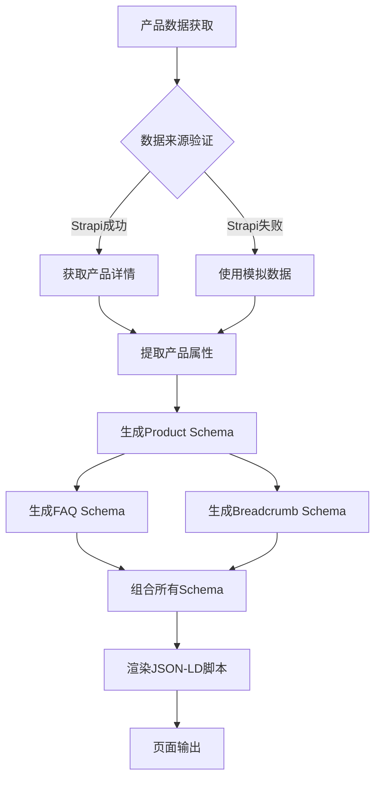

**图表来源**
- [product-page.tsx:20-73](file://frontend/src/app/products/[category]/[slug]/page.tsx#L20-L73)
- [product-page.tsx:223-250](file://frontend/src/app/products/[category]/[slug]/page.tsx#L223-L250)

#### 产品Schema字段映射

| Schema字段 | 数据源 | 描述 |
|------------|--------|------|
| @context | 固定值 | JSON-LD上下文 |
| @type | 固定值 | 产品类型标识 |
| name | product.name | 产品名称 |
| description | product.shortDescription | 产品描述 |
| sku | product.sku | 库存单位编号 |
| brand.name | siteConfig.name | 品牌名称 |
| manufacturer.name | siteConfig.name | 制造商名称 |
| image | product.images[0] | 产品主图URL |
| offers.availability | 固定值 | 库存状态 |
| offers.priceCurrency | 固定值 | 货币单位 |
| offers.price | 计算值 | 价格（固定为0） |
| offers.priceValidUntil | 动态计算 | 价格有效期 |
| offers.url | 动态生成 | 产品详情页URL |

**章节来源**
- [product-page.tsx:163-200](file://frontend/src/app/products/[category]/[slug]/page.tsx#L163-L200)
- [seo.ts:4-52](file://frontend/src/lib/seo.ts#L4-L52)

### 组织Schema实现

组织Schema为网站提供了权威的品牌信息，增强了搜索结果的可信度。

#### 组织Schema结构

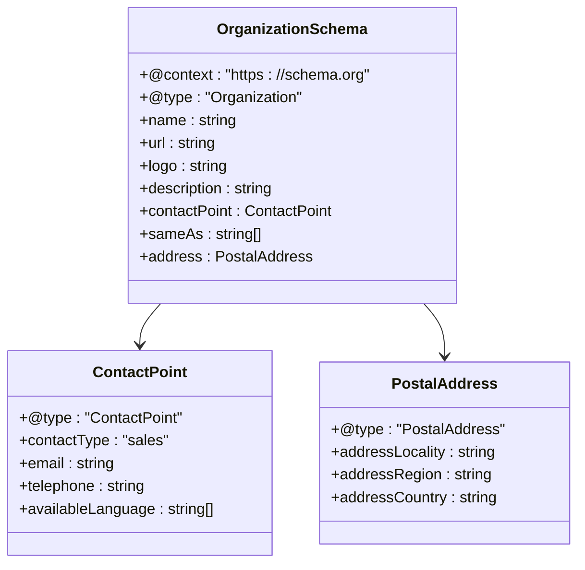

**图表来源**
- [seo.ts:70-97](file://frontend/src/lib/seo.ts#L70-L97)

### FAQ Schema实现

FAQ Schema为常见问题提供了结构化的问答格式，提升了搜索结果的丰富性。

#### FAQ Schema生成逻辑

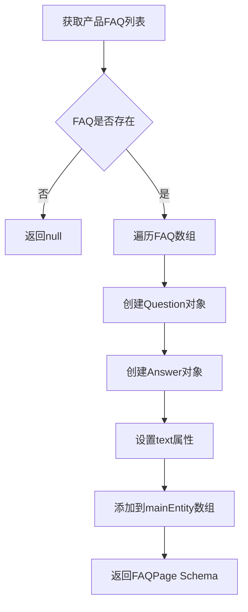

**图表来源**
- [seo.ts:54-68](file://frontend/src/lib/seo.ts#L54-L68)
- [product-page.tsx:225-226](file://frontend/src/app/products/[category]/[slug]/page.tsx#L225-L226)

**章节来源**
- [seo.ts:54-68](file://frontend/src/lib/seo.ts#L54-L68)
- [product-page.tsx:114-131](file://frontend/src/app/products/[category]/[slug]/page.tsx#L114-L131)

### 面包屑Schema实现

面包屑Schema帮助用户和搜索引擎理解页面在网站结构中的位置。

#### 面包屑导航生成

| 位置 | 名称 | URL路径 |
|------|------|---------|
| 1 | 首页 | `/` |
| 2 | 产品 | `/products` |
| 3 | 产品类别 | `/products?category={slug}` |
| 4 | 产品详情 | `/products/{category}/{slug}` |

**章节来源**
- [seo.ts:99-113](file://frontend/src/lib/seo.ts#L99-L113)
- [product-page.tsx:226-231](file://frontend/src/app/products/[category]/[slug]/page.tsx#L226-L231)

### 博客文章Schema实现

博客文章页面实现了Article Schema，为内容营销提供了结构化标记。

#### 文章Schema字段映射

| Schema字段 | 数据源 | 描述 |
|------------|--------|------|
| @type | 固定值 | Article类型 |
| headline | post.title | 文章标题 |
| description | post.excerpt | 文章摘要 |
| image | post.featuredImage | 封面图片 |
| author.name | post.author.name | 作者姓名 |
| publisher.name | siteConfig.name | 发布者名称 |
| datePublished | post.publishedAt | 发布日期 |
| dateModified | post.publishedAt | 修改日期 |
| mainEntityOfPage.@id | 动态生成 | 文章页面URL |

**章节来源**
- [seo.ts:115-142](file://frontend/src/lib/seo.ts#L115-L142)
- [blog-page.tsx:48-82](file://frontend/src/app/blog/[slug]/page.tsx#L48-L82)

### 元数据生成器

元数据生成器负责创建Next.js的Metadata对象，支持Open Graph、Twitter Card等社交标签。

#### 元数据生成流程

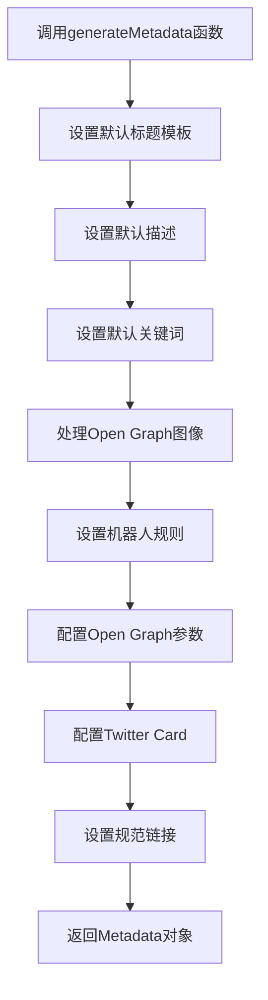

**图表来源**
- [seo.ts:168-225](file://frontend/src/lib/seo.ts#L168-L225)

**章节来源**
- [seo.ts:168-225](file://frontend/src/lib/seo.ts#L168-L225)

### CMS集成架构

系统通过Strapi CMS提供内容管理能力，支持SEO字段的编辑和管理。

#### CMS Schema定义

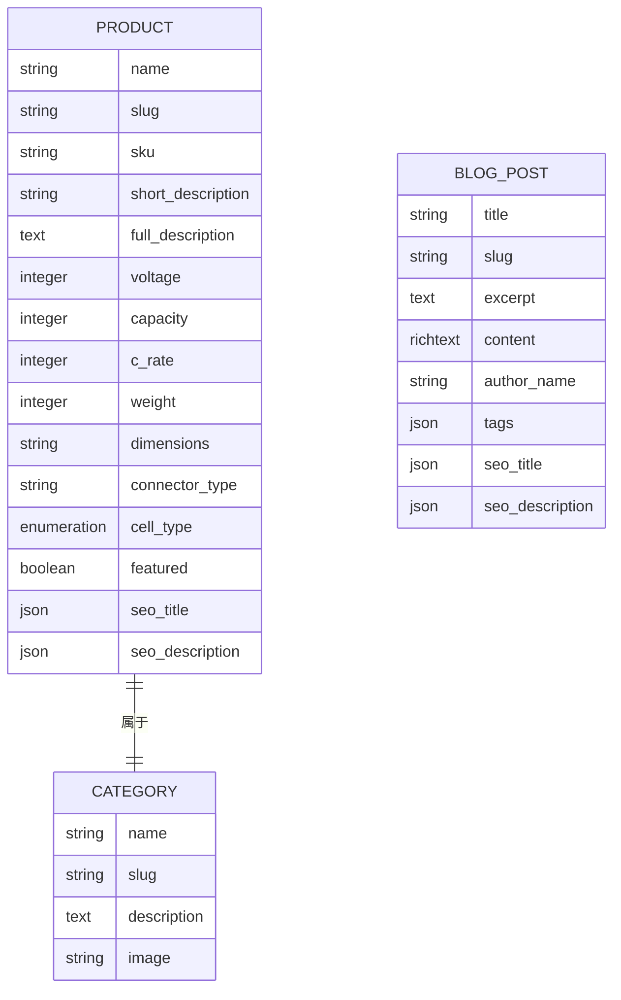

**图表来源**
- [product-schema.json:12-32](file://cms/src/api/product/content-types/product/schema.json#L12-L32)
- [blog-schema.json:12-22](file://cms/src/api/blog-post/content-types/blog-post/schema.json#L12-L22)

**章节来源**
- [product-schema.json:12-32](file://cms/src/api/product/content-types/product/schema.json#L12-L32)
- [blog-schema.json:12-22](file://cms/src/api/blog-post/content-types/blog-post/schema.json#L12-L22)

## 依赖关系分析

### 外部依赖

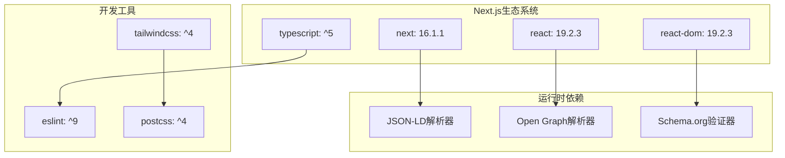

**图表来源**
- [package.json:11-25](file://frontend/package.json#L11-L25)

### 内部模块依赖

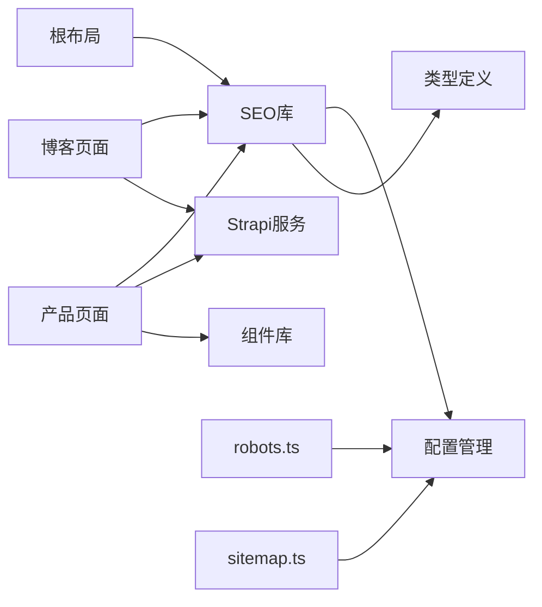

**图表来源**
- [seo.ts:1-2](file://frontend/src/lib/seo.ts#L1-L2)
- [layout.tsx:5-6](file://frontend/src/app/layout.tsx#L5-L6)

**章节来源**
- [package.json:11-25](file://frontend/package.json#L11-L25)

## 性能考虑

### 缓存策略

系统采用了多层缓存机制来优化性能：

1. **API缓存**: Strapi API请求缓存60秒
2. **页面缓存**: Next.js自动缓存静态页面
3. **Schema缓存**: JSON-LD结构化数据在内存中缓存

### 预渲染优化

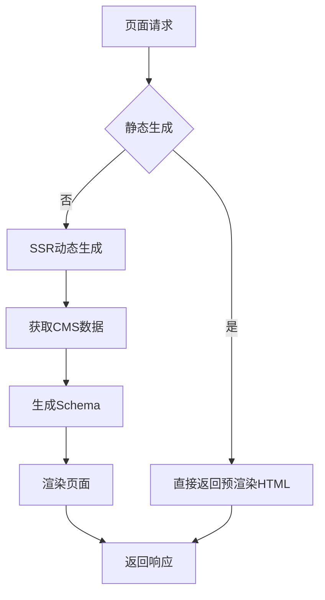

**图表来源**
- [strapi.ts:109-118](file://frontend/src/lib/strapi.ts#L109-L118)

### SEO性能监控

建议实施以下监控指标：
- 页面加载时间
- 结构化数据验证通过率
- 搜索引擎点击率
- 网站排名变化

## 故障排除指南

### 常见问题及解决方案

#### 1. 结构化数据验证失败

**症状**: Google Rich Results Test显示错误

**可能原因**:
- Schema字段缺失
- URL格式不正确
- 图片链接无效

**解决方法**:
```javascript
// 确保所有必需字段都有值
if (!product.images || product.images.length === 0) {
  // 提供默认图片或跳过Schema生成
}
```

#### 2. Open Graph标签不显示

**症状**: 社交媒体分享时不显示图片

**解决方法**:
```javascript
// 确保OG图片URL完整
const ogImage = product.images[0] 
  ? `${siteConfig.url}${product.images[0]}` 
  : siteConfig.ogImage;
```

#### 3. 动态路由SEO问题

**症状**: 产品页面SEO不正确

**解决方法**:
```javascript
// 在generateMetadata中正确处理动态参数
export async function generateMetadata({ params }) {
  const { category, slug } = await params;
  // 确保URL和元数据正确映射
}
```

**章节来源**
- [product-page.tsx:163-200](file://frontend/src/app/products/[category]/[slug]/page.tsx#L163-L200)
- [blog-page.tsx:48-82](file://frontend/src/app/blog/[slug]/page.tsx#L48-L82)

## 结论

本SEO结构化数据标记系统实现了以下关键功能：

1. **完整的Schema支持**: 支持Product、Organization、FAQ、Breadcrumb、Article等多种Schema类型
2. **动态内容集成**: 通过Strapi CMS实现内容驱动的SEO优化
3. **Next.js最佳实践**: 完全兼容App Router架构，支持预渲染和SSR
4. **搜索引擎友好**: 实现了robots.txt、sitemap.xml配置，优化抓取效果
5. **性能优化**: 采用多层缓存和预渲染策略，确保快速加载

该系统为无人机电池制造商提供了专业级的SEO解决方案，能够有效提升搜索引擎可见性和用户体验。通过持续的内容管理和Schema优化，可以进一步提升网站在搜索结果中的表现。