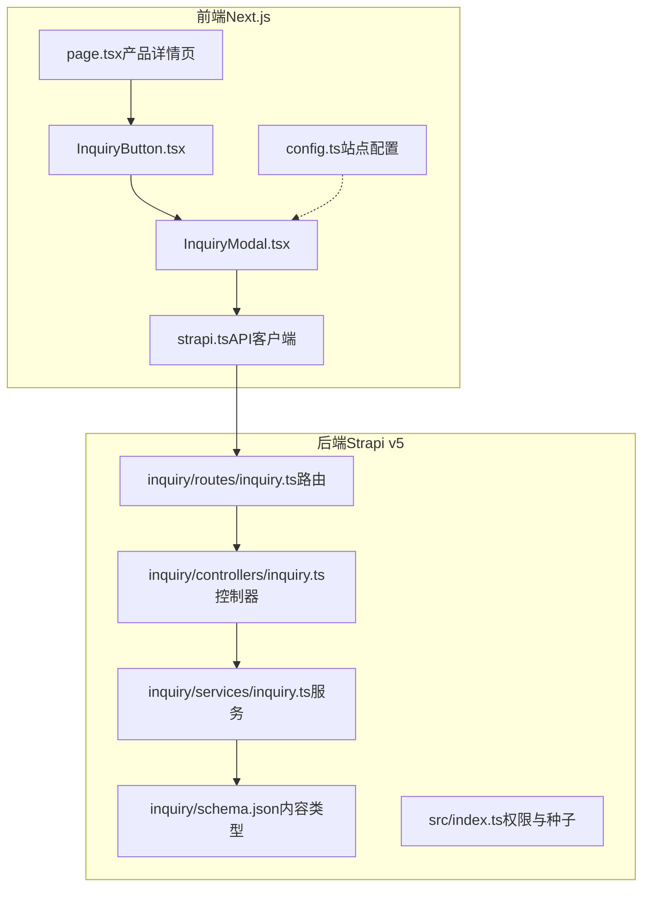
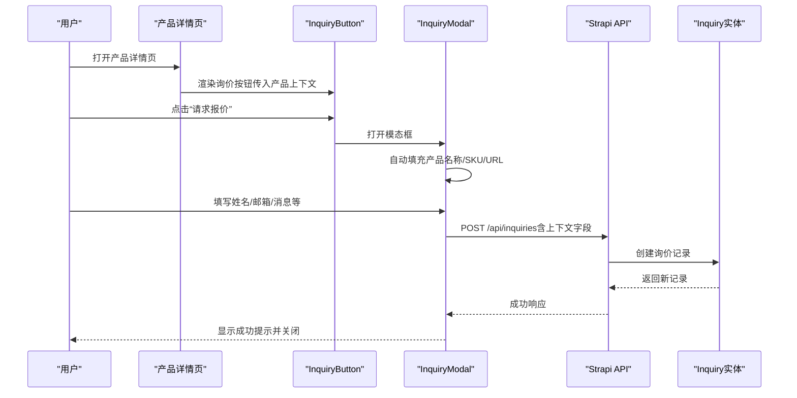
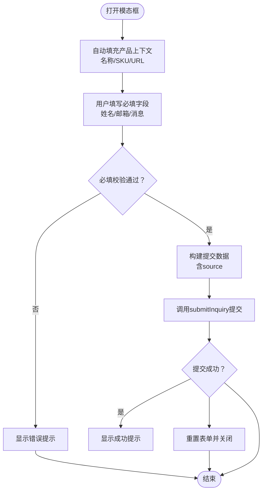
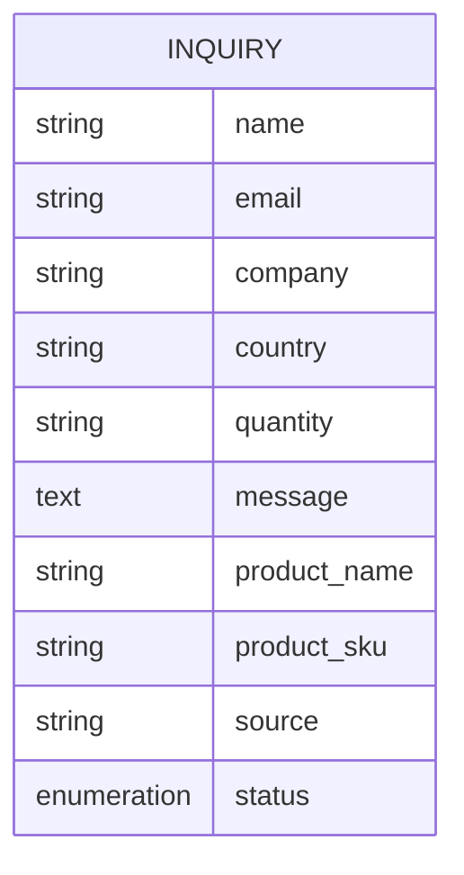
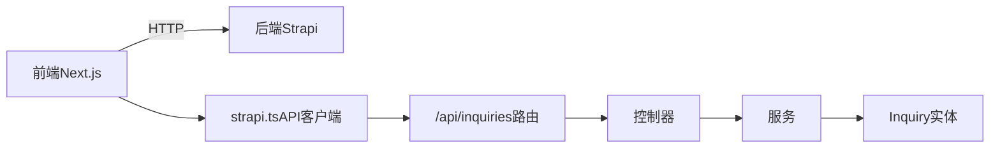

# 上下文相关询价表单

<cite>
**本文引用的文件列表**
- [schema.json](file://cms/src/api/inquiry/content-types/inquiry/schema.json)
- [inquiry.ts（控制器）](file://cms/src/api/inquiry/controllers/inquiry.ts)
- [inquiry.ts（路由）](file://cms/src/api/inquiry/routes/inquiry.ts)
- [inquiry.ts（服务）](file://cms/src/api/inquiry/services/inquiry.ts)
- [index.ts（CMS入口）](file://cms/src/index.ts)
- [InquiryButton.tsx](file://frontend/src/components/forms/InquiryButton.tsx)
- [InquiryModal.tsx](file://frontend/src/components/forms/InquiryModal.tsx)
- [strapi.ts](file://frontend/src/lib/strapi.ts)
- [config.ts](file://frontend/src/lib/config.ts)
- [page.tsx（产品详情页）](file://frontend/src/app/products/[category]/[slug]/page.tsx)
- [index.ts（类型定义）](file://frontend/src/types/index.ts)
- [package.json（CMS）](file://cms/package.json)
- [package.json（前端）](file://frontend/package.json)
</cite>

## 目录
1. [简介](#简介)
2. [项目结构](#项目结构)
3. [核心组件](#核心组件)
4. [架构总览](#架构总览)
5. [详细组件分析](#详细组件分析)
6. [依赖关系分析](#依赖关系分析)
7. [性能考量](#性能考量)
8. [故障排查指南](#故障排查指南)
9. [结论](#结论)
10. [附录](#附录)

## 简介
本技术文档围绕“上下文相关询价表单”功能展开，系统性阐述从前端组件到后端API的数据流、验证与存储机制，以及与Strapi CMS的集成方式。重点包括：
- 前端组件：模态框触发、表单自动填充（产品名称、SKU、URL）、表单验证与提交流程
- 后端API：数据接收、权限控制、实体存储
- 字段定义：必填项与可选项的设计考虑
- 集成实践：在产品详情页集成询价按钮，通过URL参数传递产品信息
- 与Strapi的集成：内容类型定义、API端点配置与权限策略

## 项目结构
该仓库采用前后端分离架构，前端使用Next.js，后端使用Strapi v5作为Headless CMS。询价表单涉及以下关键目录与文件：
- 前端：components/forms（InquiryButton、InquiryModal）、lib/strapi（API客户端）、app/products/[category]/[slug]/page.tsx（产品详情页）
- 后端：src/api/inquiry（内容类型、控制器、路由、服务）、src/index.ts（权限与种子数据）

图表来源
- [InquiryButton.tsx:1-55](file://frontend/src/components/forms/InquiryButton.tsx#L1-L55)
- [InquiryModal.tsx:1-370](file://frontend/src/components/forms/InquiryModal.tsx#L1-L370)
- [strapi.ts:290-306](file://frontend/src/lib/strapi.ts#L290-L306)
- [schema.json:1-25](file://cms/src/api/inquiry/content-types/inquiry/schema.json#L1-L25)
- [inquiry.ts（路由）:1-35](file://cms/src/api/inquiry/routes/inquiry.ts#L1-L35)
- [inquiry.ts（控制器）:1-40](file://cms/src/api/inquiry/controllers/inquiry.ts#L1-L40)
- [inquiry.ts（服务）:1-2](file://cms/src/api/inquiry/services/inquiry.ts#L1-L2)
- [index.ts（CMS入口）:161-217](file://cms/src/index.ts#L161-L217)

章节来源
- [InquiryButton.tsx:1-55](file://frontend/src/components/forms/InquiryButton.tsx#L1-L55)
- [InquiryModal.tsx:1-370](file://frontend/src/components/forms/InquiryModal.tsx#L1-L370)
- [strapi.ts:290-306](file://frontend/src/lib/strapi.ts#L290-L306)
- [schema.json:1-25](file://cms/src/api/inquiry/content-types/inquiry/schema.json#L1-L25)
- [inquiry.ts（路由）:1-35](file://cms/src/api/inquiry/routes/inquiry.ts#L1-L35)
- [inquiry.ts（控制器）:1-40](file://cms/src/api/inquiry/controllers/inquiry.ts#L1-L40)
- [inquiry.ts（服务）:1-2](file://cms/src/api/inquiry/services/inquiry.ts#L1-L2)
- [index.ts（CMS入口）:161-217](file://cms/src/index.ts#L161-L217)

## 核心组件
- 前端组件
  - InquiryButton：用于在产品详情页渲染“请求报价”按钮，支持传入产品上下文（名称、SKU、URL），并打开模态框
  - InquiryModal：负责表单渲染、自动填充上下文信息、表单校验、提交至Strapi API
- 后端API
  - 内容类型：定义询价记录的字段集合（必填项与可选项）
  - 路由：暴露REST端点（GET/POST/PUT/DELETE）
  - 控制器：封装实体查询与创建逻辑
  - 服务：当前为空，预留扩展
  - 权限：通过src/index.ts为公共角色授予“创建询价”权限

章节来源
- [InquiryButton.tsx:14-54](file://frontend/src/components/forms/InquiryButton.tsx#L14-L54)
- [InquiryModal.tsx:15-370](file://frontend/src/components/forms/InquiryModal.tsx#L15-L370)
- [schema.json:12-22](file://cms/src/api/inquiry/content-types/inquiry/schema.json#L12-L22)
- [inquiry.ts（路由）:1-35](file://cms/src/api/inquiry/routes/inquiry.ts#L1-L35)
- [inquiry.ts（控制器）:19-38](file://cms/src/api/inquiry/controllers/inquiry.ts#L19-L38)
- [inquiry.ts（服务）:1-2](file://cms/src/api/inquiry/services/inquiry.ts#L1-L2)
- [index.ts（CMS入口）:186-188](file://cms/src/index.ts#L186-L188)

## 架构总览
从用户在产品详情页点击“请求报价”，到后端存储询价记录的完整流程如下：

图表来源
- [page.tsx（产品详情页）:342-347](file://frontend/src/app/products/[category]/[slug]/page.tsx#L342-L347)
- [InquiryButton.tsx:14-54](file://frontend/src/components/forms/InquiryButton.tsx#L14-L54)
- [InquiryModal.tsx:46-95](file://frontend/src/components/forms/InquiryModal.tsx#L46-L95)
- [strapi.ts:290-306](file://frontend/src/lib/strapi.ts#L290-L306)
- [inquiry.ts（路由）:16-19](file://cms/src/api/inquiry/routes/inquiry.ts#L16-L19)
- [inquiry.ts（控制器）:19-24](file://cms/src/api/inquiry/controllers/inquiry.ts#L19-L24)
- [schema.json:12-22](file://cms/src/api/inquiry/content-types/inquiry/schema.json#L12-L22)

## 详细组件分析

### 前端组件：InquiryButton
- 功能要点
  - 接收产品上下文参数（名称、SKU、URL）
  - 管理模态框状态，渲染按钮并传递上下文给InquiryModal
- 关键行为
  - 点击事件切换模态框可见性
  - 将产品信息透传给子组件，便于自动填充

章节来源
- [InquiryButton.tsx:14-54](file://frontend/src/components/forms/InquiryButton.tsx#L14-L54)

### 前端组件：InquiryModal
- 表单字段与自动填充
  - 自动填充：产品名称、SKU、URL（来自父组件props）
  - 用户输入：姓名、邮箱、公司、国家、数量、消息、隐私协议勾选
- 提交流程
  - 收集表单数据，附加source（当前页面URL）
  - 调用strapi.ts中的submitInquiry方法POST到/api/inquiries
  - 成功后短暂显示成功提示并重置表单、关闭模态框
- 样式与交互
  - 模态框遮罩、滚动锁定、关闭按钮
  - 提交按钮禁用状态与加载动画
  - 邮件联系作为替代联系方式

图表来源
- [InquiryModal.tsx:22-95](file://frontend/src/components/forms/InquiryModal.tsx#L22-L95)
- [strapi.ts:290-306](file://frontend/src/lib/strapi.ts#L290-L306)

章节来源
- [InquiryModal.tsx:15-370](file://frontend/src/components/forms/InquiryModal.tsx#L15-L370)
- [strapi.ts:290-306](file://frontend/src/lib/strapi.ts#L290-L306)

### 后端API：内容类型与路由
- 内容类型（Inquiry）
  - 必填字段：name、email、message、status（默认值为new）
  - 可选字段：company、country、quantity、productName、productSku、productUrl、source
- 路由端点
  - GET /api/inquiries、/api/inquiries/:id
  - POST /api/inquiries（用于表单提交）
  - PUT /api/inquiries/:id
  - DELETE /api/inquiries/:id

图表来源
- [schema.json:12-22](file://cms/src/api/inquiry/content-types/inquiry/schema.json#L12-L22)

章节来源
- [schema.json:1-25](file://cms/src/api/inquiry/content-types/inquiry/schema.json#L1-L25)
- [inquiry.ts（路由）:1-35](file://cms/src/api/inquiry/routes/inquiry.ts#L1-L35)

### 后端API：控制器与服务
- 控制器
  - 实现find、findOne、create、update、delete，委托entityService完成数据操作
- 服务
  - 当前为空，预留扩展（如业务规则、邮件通知等）

章节来源
- [inquiry.ts（控制器）:1-40](file://cms/src/api/inquiry/controllers/inquiry.ts#L1-L40)
- [inquiry.ts（服务）:1-2](file://cms/src/api/inquiry/services/inquiry.ts#L1-L2)

### 权限与种子数据（CMS入口）
- 权限
  - 为公共角色授予“api::inquiry.inquiry.create”权限，允许匿名提交
- 种子数据
  - 初始化分类与产品数据，确保数据库一致性

章节来源
- [index.ts（CMS入口）:186-217](file://cms/src/index.ts#L186-L217)

### 产品详情页集成与URL参数传递
- 在产品详情页中，通过InquiryButton将当前产品名称、SKU与URL作为props传入
- 无需额外URL参数即可实现上下文传递；若需通过URL参数透传，可在页面层解析查询参数并传入

章节来源
- [page.tsx（产品详情页）:342-347](file://frontend/src/app/products/[category]/[slug]/page.tsx#L342-L347)

## 依赖关系分析
- 前端依赖
  - Next.js 16.1.1
  - React 19.2.3
  - TailwindCSS（样式）
- 后端依赖
  - Strapi v5.5.1
  - 用户权限插件、云存储插件等

图表来源
- [package.json（前端）:11-25](file://frontend/package.json#L11-L25)
- [package.json（CMS）:14-34](file://cms/package.json#L14-L34)
- [strapi.ts:290-306](file://frontend/src/lib/strapi.ts#L290-L306)
- [inquiry.ts（路由）:16-19](file://cms/src/api/inquiry/routes/inquiry.ts#L16-L19)

章节来源
- [package.json（前端）:1-26](file://frontend/package.json#L1-L26)
- [package.json（CMS）:1-36](file://cms/package.json#L1-L36)
- [strapi.ts:290-306](file://frontend/src/lib/strapi.ts#L290-L306)
- [inquiry.ts（路由）:1-35](file://cms/src/api/inquiry/routes/inquiry.ts#L1-L35)

## 性能考量
- 前端
  - 使用Next.js的缓存与增量静态生成（revalidate）减少重复请求
  - 模态框打开时锁定body滚动，避免布局抖动
- 后端
  - entityService提供高效的数据访问接口
  - 公共角色仅开放必要权限，降低安全风险与不必要的鉴权开销

## 故障排查指南
- 提交失败
  - 检查Strapi API是否可达（checkAPIHealth）
  - 确认环境变量NEXT_PUBLIC_STRAPI_URL与STRAPI_API_TOKEN已正确配置
  - 查看浏览器网络面板与控制台错误日志
- 字段缺失或格式错误
  - 确保必填字段（name、email、message、agreedToPrivacy）已填写
  - 确认邮箱格式与隐私协议勾选
- 数据未入库
  - 检查CMS权限：确认公共角色已授权“api::inquiry.inquiry.create”
  - 查看CMS日志与数据库状态

章节来源
- [strapi.ts:308-316](file://frontend/src/lib/strapi.ts#L308-L316)
- [index.ts（CMS入口）:186-217](file://cms/src/index.ts#L186-L217)
- [InquiryModal.tsx:46-95](file://frontend/src/components/forms/InquiryModal.tsx#L46-L95)

## 结论
该询价表单功能以“上下文相关”为核心设计，通过前端组件自动填充产品信息，结合后端Strapi的REST API与内容类型，实现了从用户交互到数据存储的完整闭环。权限控制与种子数据初始化确保了系统可用性与一致性。后续可在此基础上扩展邮件通知、工作流与报表统计等功能。

## 附录

### 表单字段定义与设计考虑
- 必填项
  - 姓名：name
  - 邮箱：email
  - 消息：message
  - 隐私协议：agreedToPrivacy（checkbox）
- 可选项
  - 公司：company
  - 国家：country
  - 数量：quantity（枚举选择）
  - 产品上下文：productName、productSku、productUrl
  - 来源：source（自动填充当前页面URL）
  - 状态：status（默认new，可由后台管理更新）

章节来源
- [schema.json:12-22](file://cms/src/api/inquiry/content-types/inquiry/schema.json#L12-L22)
- [InquiryModal.tsx:174-318](file://frontend/src/components/forms/InquiryModal.tsx#L174-L318)
- [index.ts（类型定义）:109-121](file://frontend/src/types/index.ts#L109-L121)

### 在产品详情页集成询价按钮
- 步骤
  - 引入InquiryButton组件
  - 从产品数据中提取name、sku、slug，拼接为URL
  - 将上述参数传入InquiryButton
- 示例路径
  - [page.tsx（产品详情页）:342-347](file://frontend/src/app/products/[category]/[slug]/page.tsx#L342-L347)

章节来源
- [page.tsx（产品详情页）:342-347](file://frontend/src/app/products/[category]/[slug]/page.tsx#L342-L347)

### 与Strapi CMS的集成方式
- 内容类型
  - inquiry内容类型定义于cms/src/api/inquiry/content-types/inquiry/schema.json
- API端点
  - 路由定义于cms/src/api/inquiry/routes/inquiry.ts
  - 控制器实现于cms/src/api/inquiry/controllers/inquiry.ts
  - 服务位于cms/src/api/inquiry/services/inquiry.ts
- 权限配置
  - 在cms/src/index.ts中为公共角色授予“创建询价”权限
- 前端API客户端
  - 前端通过frontend/src/lib/strapi.ts的submitInquiry方法调用/api/inquiries

章节来源
- [schema.json:1-25](file://cms/src/api/inquiry/content-types/inquiry/schema.json#L1-L25)
- [inquiry.ts（路由）:1-35](file://cms/src/api/inquiry/routes/inquiry.ts#L1-L35)
- [inquiry.ts（控制器）:1-40](file://cms/src/api/inquiry/controllers/inquiry.ts#L1-L40)
- [inquiry.ts（服务）:1-2](file://cms/src/api/inquiry/services/inquiry.ts#L1-L2)
- [index.ts（CMS入口）:186-217](file://cms/src/index.ts#L186-L217)
- [strapi.ts:290-306](file://frontend/src/lib/strapi.ts#L290-L306)