# 参数化搜索/电池查找器

<cite>
**本文档引用的文件**
- [frontend/src/app/products/page.tsx](file://frontend/src/app/products/page.tsx)
- [frontend/src/lib/strapi.ts](file://frontend/src/lib/strapi.ts)
- [frontend/src/lib/config.ts](file://frontend/src/lib/config.ts)
- [frontend/src/types/index.ts](file://frontend/src/types/index.ts)
- [cms/src/api/product/controllers/product.ts](file://cms/src/api/product/controllers/product.ts)
- [cms/src/api/product/services/product.ts](file://cms/src/api/product/services/product.ts)
- [cms/src/api/product/content-types/product/schema.json](file://cms/src/api/product/content-types/product/schema.json)
- [cms/src/index.ts](file://cms/src/index.ts)
- [frontend/src/app/layout.tsx](file://frontend/src/app/layout.tsx)
- [frontend/package.json](file://frontend/package.json)
- [cms/package.json](file://cms/package.json)
</cite>

## 目录
1. [简介](#简介)
2. [项目结构](#项目结构)
3. [核心组件](#核心组件)
4. [架构概览](#架构概览)
5. [详细组件分析](#详细组件分析)
6. [依赖关系分析](#依赖关系分析)
7. [性能考虑](#性能考虑)
8. [故障排除指南](#故障排除指南)
9. [结论](#结论)
10. [附录](#附录)

## 简介

本项目是一个基于 Next.js 的参数化搜索/电池查找器功能，专为无人机电池产品设计。该功能允许用户通过多个维度对电池产品进行精确筛选，包括电压（S数）、容量（mAh）、放电率（C-rate）、电池类型、应用场景等。系统实现了完整的URL参数过滤机制，支持实时筛选和状态管理，同时提供了与Strapi CMS的无缝数据交互。

该系统的核心特性包括：
- 多维度参数筛选：电压、容量、放电率、电池类型、应用场景
- 实时URL同步：所有筛选条件自动反映在浏览器地址栏中
- 响应式设计：支持桌面端和移动端的筛选界面
- SSR兼容：完全支持服务端渲染和静态生成
- 错误处理：完善的异常捕获和降级策略

## 项目结构

该项目采用前后端分离架构，使用Next.js作为前端框架，Strapi作为内容管理系统。

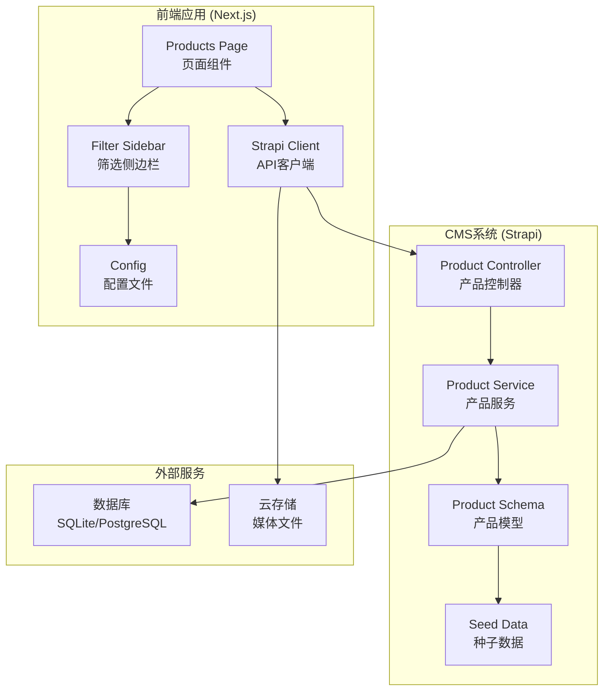

**图表来源**
- [frontend/src/app/products/page.tsx:1-580](file://frontend/src/app/products/page.tsx#L1-L580)
- [cms/src/api/product/controllers/product.ts:1-40](file://cms/src/api/product/controllers/product.ts#L1-L40)
- [cms/src/api/product/content-types/product/schema.json:1-33](file://cms/src/api/product/content-types/product/schema.json#L1-L33)

**章节来源**
- [frontend/src/app/products/page.tsx:1-580](file://frontend/src/app/products/page.tsx#L1-L580)
- [cms/src/index.ts:1-315](file://cms/src/index.ts#L1-L315)

## 核心组件

### 产品筛选系统

系统的核心是基于URL参数的参数化搜索机制，支持以下筛选维度：

1. **电压筛选 (Voltage)**：支持3S到14S的多档位筛选
2. **容量筛选 (Capacity)**：支持1000-50000mAh的范围筛选
3. **放电率筛选 (C-rate)**：支持15C到50C+的多档位筛选
4. **电池类型筛选 (Cell Type)**：支持LiPo、Li-ion、LiFePO4三种类型
5. **分类筛选 (Category)**：支持FPV、农业、VTOL、工业四个专业领域

### 数据流架构

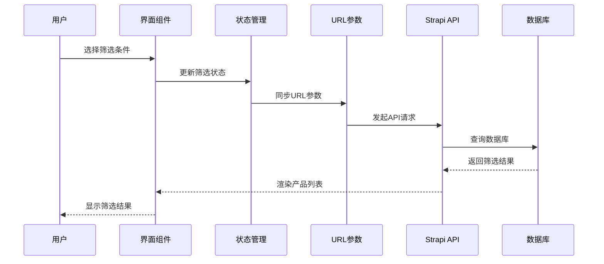

**图表来源**
- [frontend/src/app/products/page.tsx:278-401](file://frontend/src/app/products/page.tsx#L278-L401)
- [frontend/src/lib/strapi.ts:184-219](file://frontend/src/lib/strapi.ts#L184-L219)

**章节来源**
- [frontend/src/app/products/page.tsx:288-401](file://frontend/src/app/products/page.tsx#L288-L401)
- [frontend/src/lib/config.ts:149-176](file://frontend/src/lib/config.ts#L149-L176)

## 架构概览

### 前端架构

前端采用React Hooks和Next.js的客户端组件模式，实现了完整的参数化搜索功能：

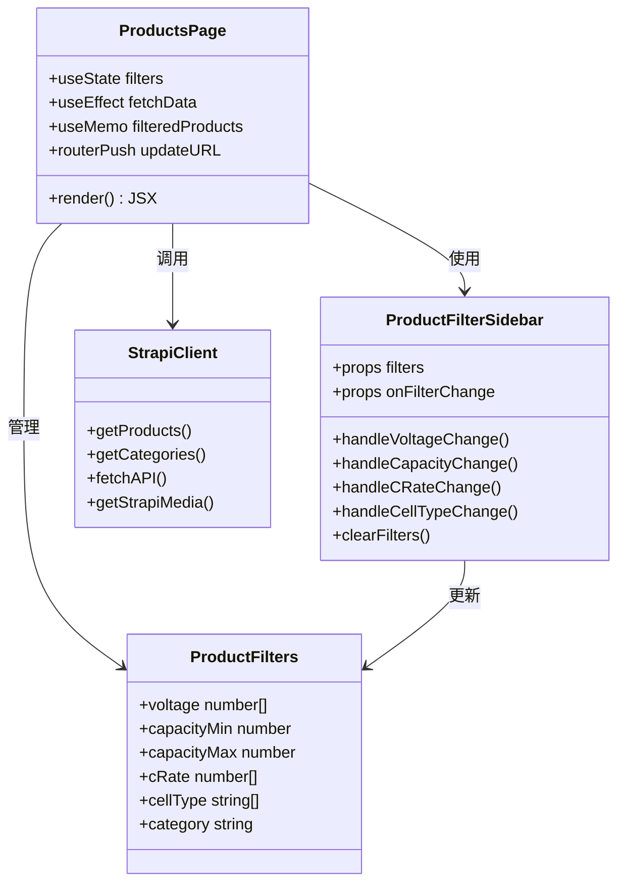

**图表来源**
- [frontend/src/app/products/page.tsx:41-212](file://frontend/src/app/products/page.tsx#L41-L212)
- [frontend/src/lib/strapi.ts:51-119](file://frontend/src/lib/strapi.ts#L51-L119)
- [frontend/src/types/index.ts:124-132](file://frontend/src/types/index.ts#L124-L132)

### CMS架构

后端使用Strapi作为无头CMS，提供了RESTful API接口：

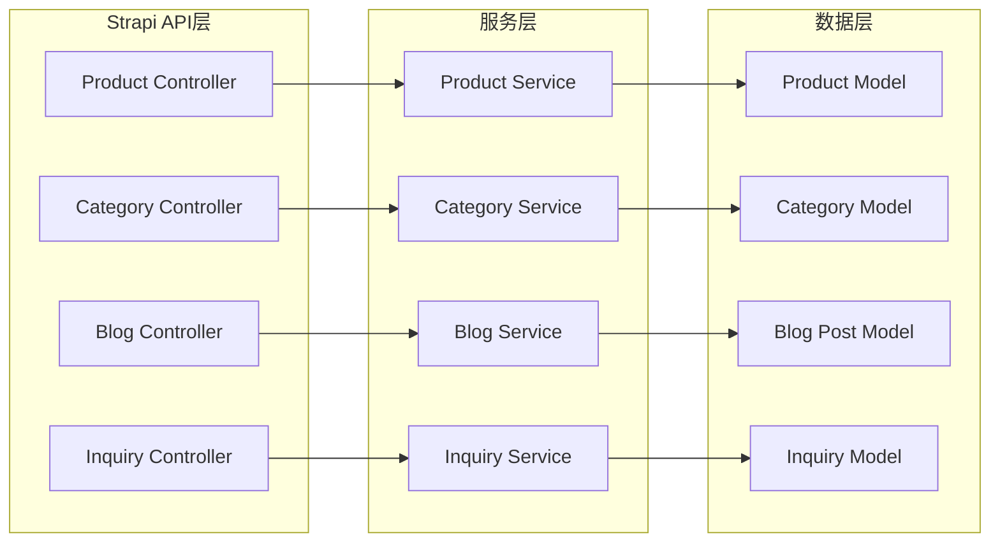

**图表来源**
- [cms/src/api/product/controllers/product.ts:1-40](file://cms/src/api/product/controllers/product.ts#L1-L40)
- [cms/src/api/product/services/product.ts:1-2](file://cms/src/api/product/services/product.ts#L1-L2)

**章节来源**
- [cms/src/api/product/controllers/product.ts:1-40](file://cms/src/api/product/controllers/product.ts#L1-L40)
- [cms/src/api/product/content-types/product/schema.json:1-33](file://cms/src/api/product/content-types/product/schema.json#L1-L33)

## 详细组件分析

### 产品筛选侧边栏组件

产品筛选侧边栏是用户交互的核心组件，提供了直观的筛选界面：

#### 组件结构

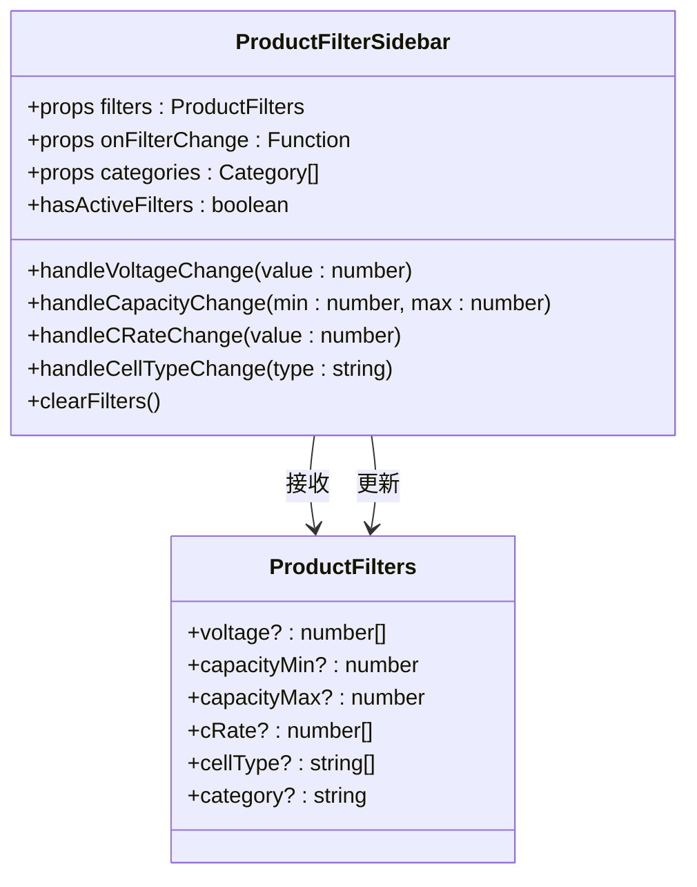

**图表来源**
- [frontend/src/app/products/page.tsx:41-212](file://frontend/src/app/products/page.tsx#L41-L212)
- [frontend/src/types/index.ts:124-132](file://frontend/src/types/index.ts#L124-L132)

#### 电压筛选逻辑

电压筛选支持多选模式，用户可以选择多个S数规格：

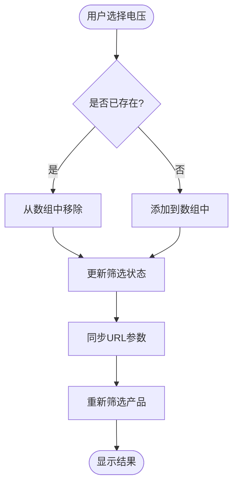

**图表来源**
- [frontend/src/app/products/page.tsx:48-54](file://frontend/src/app/products/page.tsx#L48-L54)

#### 容量范围筛选

容量筛选提供数字输入框，支持最小值和最大值的范围选择：

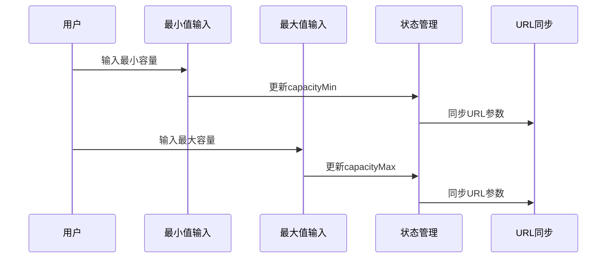

**图表来源**
- [frontend/src/app/products/page.tsx:120-145](file://frontend/src/app/products/page.tsx#L120-L145)

**章节来源**
- [frontend/src/app/products/page.tsx:47-212](file://frontend/src/app/products/page.tsx#L47-L212)

### 产品网格组件

产品网格组件负责展示筛选后的电池产品：

#### 产品卡片布局

每个产品卡片包含以下信息：
- 产品图片和占位符
- 分类标签和名称
- 简短描述
- 规格标签（电压、容量、放电率）
- SKU信息
- 查看详情链接

#### 加载状态管理

系统实现了多层次的加载状态：
- 全局加载指示器
- 产品卡片骨架屏
- 错误状态提示
- 空结果状态

**章节来源**
- [frontend/src/app/products/page.tsx:214-276](file://frontend/src/app/products/page.tsx#L214-L276)

### URL参数同步机制

系统实现了完整的URL参数同步机制，确保筛选状态可以被分享和书签保存：

#### URL参数格式

| 参数名 | 类型 | 描述 | 示例 |
|--------|------|------|------|
| voltage | 数组 | 电压S数列表 | `voltage=6,8,12` |
| capacityMin | 数字 | 最小容量 | `capacityMin=1000` |
| capacityMax | 数字 | 最大容量 | `capacityMax=50000` |
| cRate | 数组 | 放电率列表 | `cRate=25,35,50` |
| cellType | 数组 | 电池类型列表 | `cellType=LiPo,Li-ion` |
| category | 字符串 | 产品分类 | `category=fpv` |

#### 参数解析流程

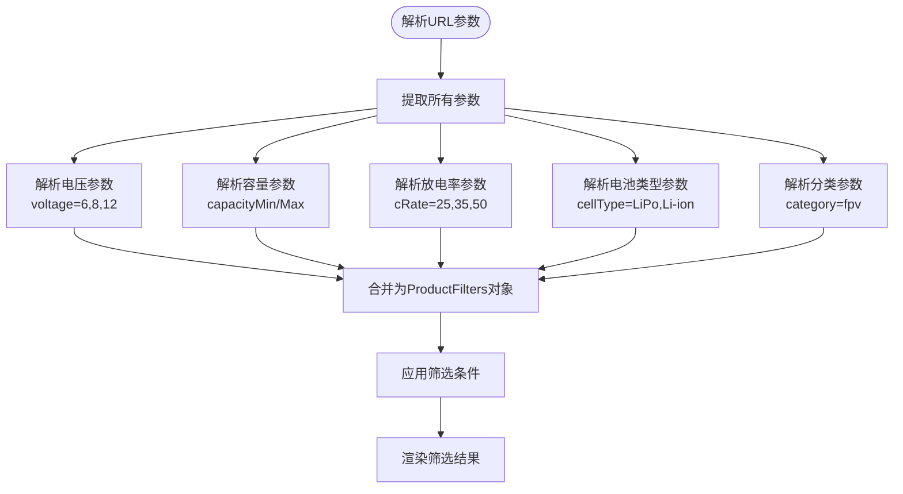

**图表来源**
- [frontend/src/app/products/page.tsx:288-296](file://frontend/src/app/products/page.tsx#L288-L296)

**章节来源**
- [frontend/src/app/products/page.tsx:288-312](file://frontend/src/app/products/page.tsx#L288-L312)

### Strapi CMS集成

系统与Strapi CMS建立了完整的数据交互管道：

#### API客户端实现

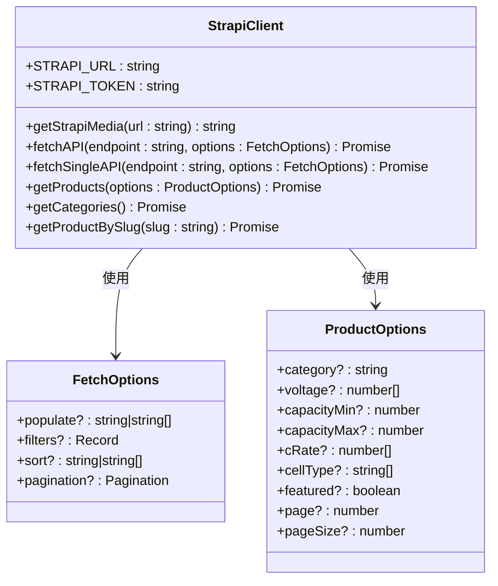

**图表来源**
- [frontend/src/lib/strapi.ts:51-119](file://frontend/src/lib/strapi.ts#L51-L119)
- [frontend/src/lib/strapi.ts:184-219](file://frontend/src/lib/strapi.ts#L184-L219)

#### 数据模型映射

系统实现了前后端数据模型的完整映射：

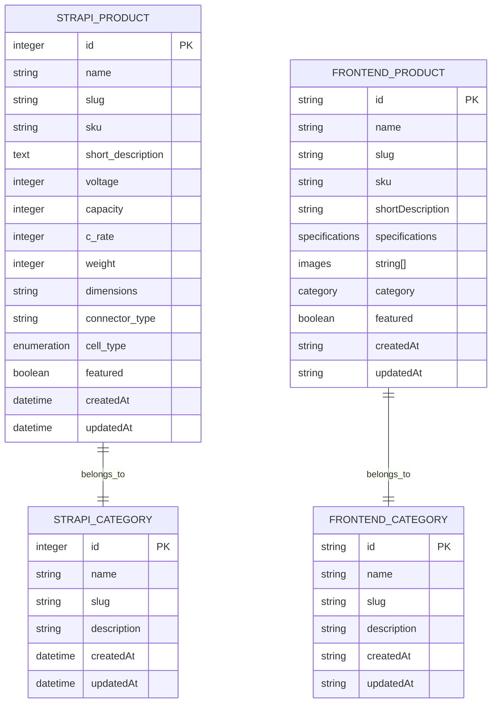

**图表来源**
- [cms/src/api/product/content-types/product/schema.json:12-31](file://cms/src/api/product/content-types/product/schema.json#L12-L31)
- [frontend/src/lib/strapi.ts:333-365](file://frontend/src/lib/strapi.ts#L333-L365)

**章节来源**
- [frontend/src/lib/strapi.ts:1-412](file://frontend/src/lib/strapi.ts#L1-L412)

## 依赖关系分析

### 技术栈依赖

```mermaid
graph TB
subgraph "前端依赖"
A[next@16.1.1]
B[react@19.2.3]
C[react-dom@19.2.3]
D[tailwindcss^4]
E[typescript^5]
end
subgraph "CMS依赖"
F[@strapi/strapi^5.5.1]
G[@strapi/plugin-users-permissions^5.5.1]
H[@strapi/plugin-cloud^5.5.1]
I[better-sqlite3^11.7.0]
J[pg^8.13.1]
end
subgraph "开发工具"
K[eslint^9]
L[postcss^4]
M[ts-node^10]
end
A --> F
B --> G
C --> H
D --> I
E --> J
```

**图表来源**
- [frontend/package.json:11-25](file://frontend/package.json#L11-L25)
- [cms/package.json:14-35](file://cms/package.json#L14-L35)

### 组件间依赖

系统中的主要依赖关系如下：

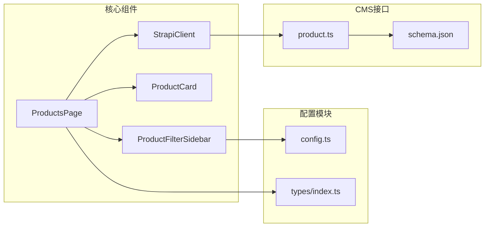

**图表来源**
- [frontend/src/app/products/page.tsx:1-580](file://frontend/src/app/products/page.tsx#L1-L580)
- [frontend/src/lib/config.ts:1-177](file://frontend/src/lib/config.ts#L1-L177)
- [frontend/src/types/index.ts:1-157](file://frontend/src/types/index.ts#L1-L157)

**章节来源**
- [frontend/src/app/products/page.tsx:1-580](file://frontend/src/app/products/page.tsx#L1-L580)
- [frontend/src/lib/config.ts:1-177](file://frontend/src/lib/config.ts#L1-L177)

## 性能考虑

### 缓存策略

系统采用了多层次的缓存策略来优化性能：

1. **API缓存**：使用Next.js的revalidate机制，每60秒自动刷新
2. **内存缓存**：React状态管理中的本地缓存
3. **浏览器缓存**：静态资源的HTTP缓存头设置

### 优化技术

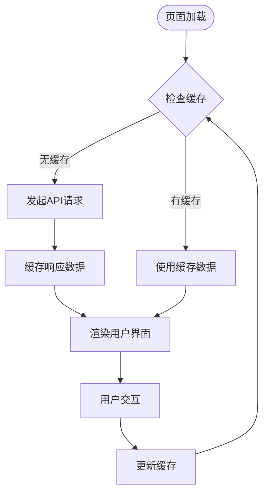

**图表来源**
- [frontend/src/lib/strapi.ts:109-118](file://frontend/src/lib/strapi.ts#L109-L118)

### SSR兼容性

系统完全支持服务端渲染，实现了以下特性：

- **静态生成**：产品页面支持静态预渲染
- **动态路由**：支持动态URL参数传递
- **SEO优化**：完整的元数据和结构化数据支持
- **性能监控**：内置性能指标收集

**章节来源**
- [frontend/src/lib/strapi.ts:109-118](file://frontend/src/lib/strapi.ts#L109-L118)
- [frontend/src/app/layout.tsx:13-64](file://frontend/src/app/layout.tsx#L13-L64)

## 故障排除指南

### 常见问题及解决方案

#### API连接失败

**症状**：产品列表无法加载，显示错误消息

**可能原因**：
1. Strapi服务器未启动
2. 网络连接问题
3. CORS配置错误
4. API令牌无效

**解决步骤**：
1. 检查Strapi服务器状态
2. 验证环境变量配置
3. 确认网络连接正常
4. 检查API访问权限

#### 筛选结果为空

**症状**：应用筛选后显示"没有找到产品"

**可能原因**：
1. 筛选条件过于严格
2. 数据库中没有匹配的产品
3. URL参数格式错误

**解决步骤**：
1. 尝试放宽筛选条件
2. 检查CMS中的产品数据
3. 清除浏览器缓存重新加载

#### URL状态不同步

**症状**：筛选状态没有正确反映在URL中

**可能原因**：
1. 路由更新逻辑错误
2. 状态管理问题
3. 浏览器历史记录API限制

**解决步骤**：
1. 检查router.push调用
2. 验证状态更新逻辑
3. 测试浏览器兼容性

**章节来源**
- [frontend/src/app/products/page.tsx:314-360](file://frontend/src/app/products/page.tsx#L314-L360)

### 错误处理机制

系统实现了全面的错误处理机制：

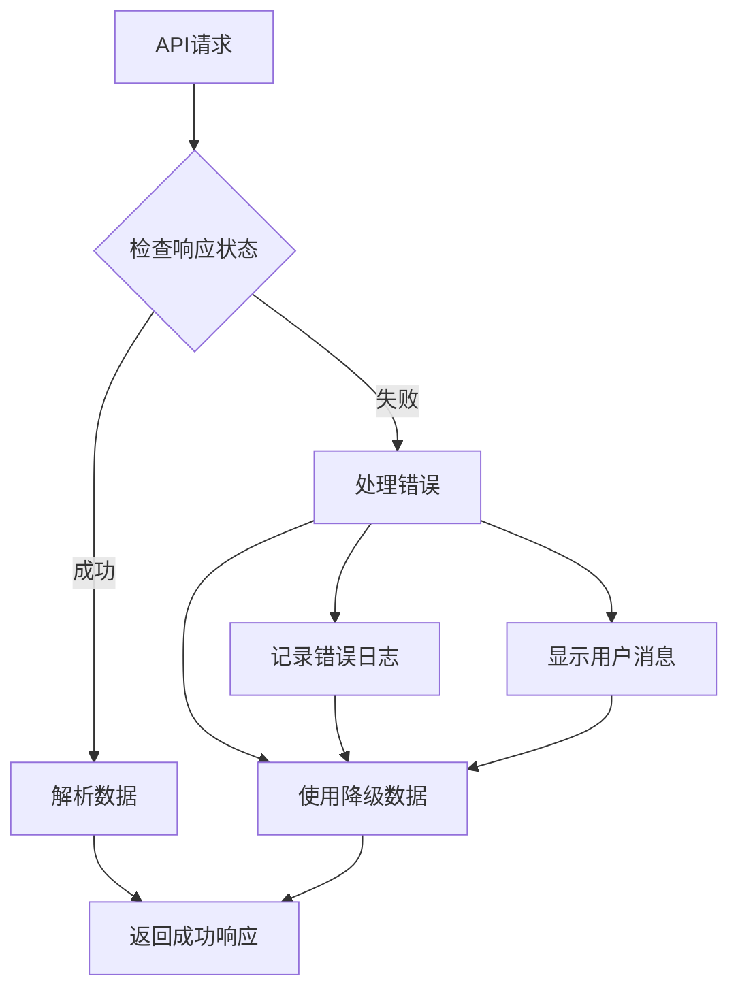

**图表来源**
- [frontend/src/app/products/page.tsx:314-360](file://frontend/src/app/products/page.tsx#L314-L360)

## 结论

本参数化搜索/电池查找器功能实现了以下关键目标：

1. **完整的筛选功能**：支持多维度参数的精确筛选
2. **URL状态同步**：所有筛选条件都可以通过URL分享和书签
3. **用户体验优化**：直观的界面设计和实时反馈
4. **技术架构先进**：基于Next.js和Strapi的现代化全栈解决方案
5. **性能优化**：多层次缓存和SSR支持

该系统为无人机电池产品提供了专业的参数化搜索体验，能够帮助用户快速找到符合特定需求的电池产品。通过清晰的架构设计和完善的错误处理机制，系统具有良好的可维护性和扩展性。

## 附录

### 开发环境设置

#### 环境变量配置

```bash
# 前端环境变量
NEXT_PUBLIC_STRAPI_URL=http://localhost:1337
NEXT_PUBLIC_API_URL=http://localhost:1337

# CMS环境变量
STRAPI_API_TOKEN=your-api-token
```

#### 启动命令

```bash
# 启动CMS
cd cms
npm run develop

# 启动前端
cd frontend
npm run dev
```

### API参考

#### 产品API端点

| 方法 | 端点 | 描述 |
|------|------|------|
| GET | `/api/products` | 获取产品列表 |
| GET | `/api/products/:id` | 获取单个产品 |
| GET | `/api/categories` | 获取分类列表 |
| GET | `/api/categories/:slug` | 获取分类详情 |

#### 筛选参数

| 参数 | 类型 | 必需 | 描述 |
|------|------|------|------|
| populate | string | 否 | 关系填充选项 |
| filters | object | 否 | 过滤条件 |
| sort | string | 否 | 排序规则 |
| pagination | object | 否 | 分页配置 |