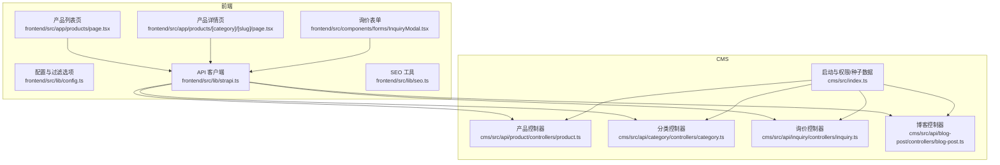
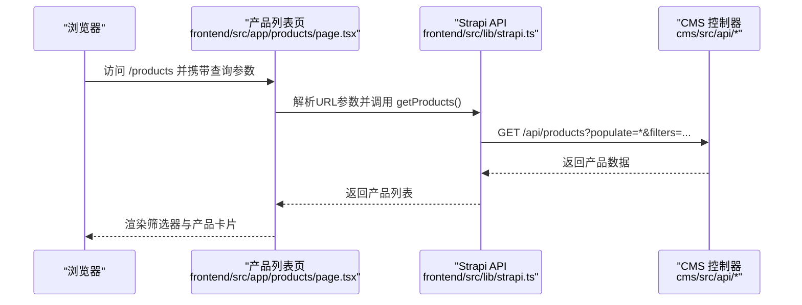
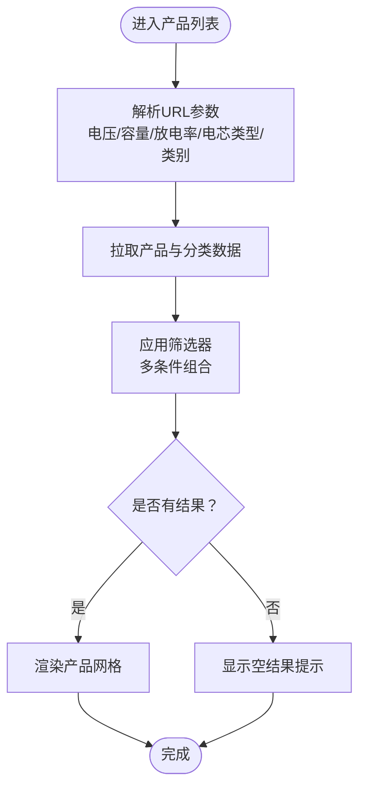
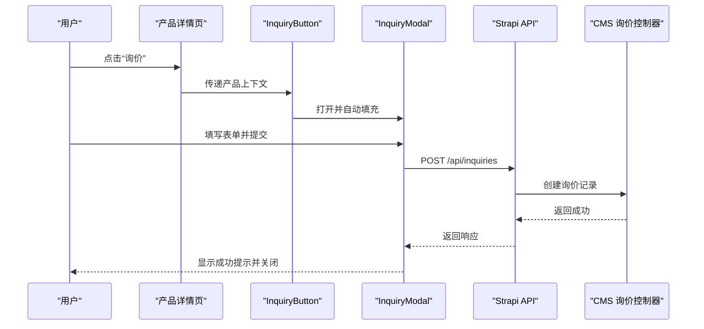
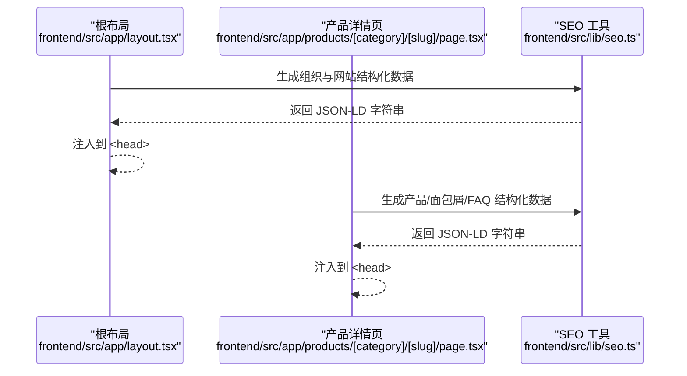
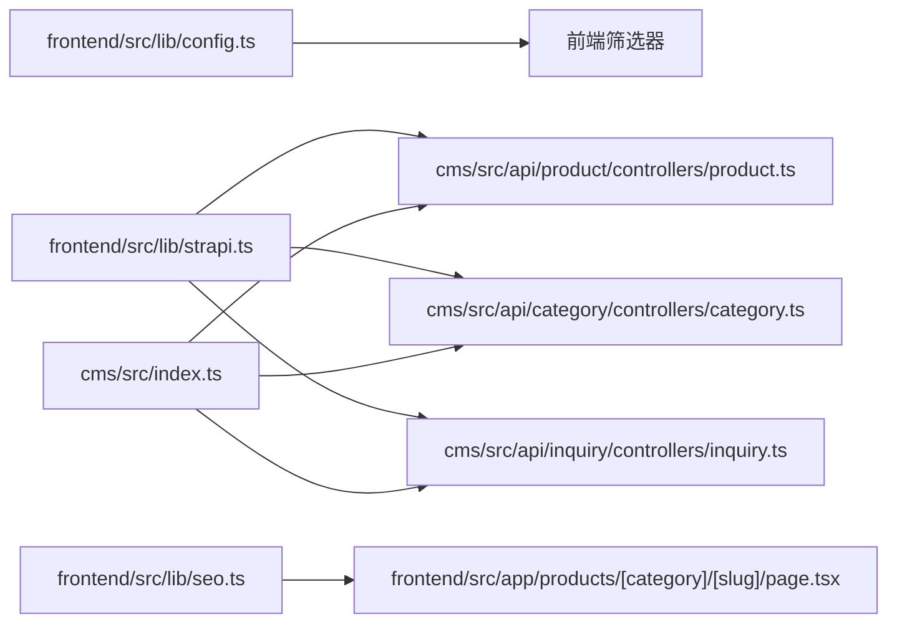

# 核心功能特性

<cite>
**本文引用的文件**
- [cms/src/index.ts](file://cms/src/index.ts)
- [cms/src/api/product/controllers/product.ts](file://cms/src/api/product/controllers/product.ts)
- [cms/src/api/category/controllers/category.ts](file://cms/src/api/category/controllers/category.ts)
- [cms/src/api/inquiry/controllers/inquiry.ts](file://cms/src/api/inquiry/controllers/inquiry.ts)
- [cms/src/api/blog-post/controllers/blog-post.ts](file://cms/src/api/blog-post/controllers/blog-post.ts)
- [frontend/src/app/products/page.tsx](file://frontend/src/app/products/page.tsx)
- [frontend/src/app/products/[category]/[slug]/page.tsx](file://frontend/src/app/products/[category]/[slug]/page.tsx)
- [frontend/src/components/forms/InquiryModal.tsx](file://frontend/src/components/forms/InquiryModal.tsx)
- [frontend/src/components/forms/InquiryButton.tsx](file://frontend/src/components/forms/InquiryButton.tsx)
- [frontend/src/lib/strapi.ts](file://frontend/src/lib/strapi.ts)
- [frontend/src/lib/seo.ts](file://frontend/src/lib/seo.ts)
- [frontend/src/lib/config.ts](file://frontend/src/lib/config.ts)
- [frontend/src/types/index.ts](file://frontend/src/types/index.ts)
- [frontend/src/app/layout.tsx](file://frontend/src/app/layout.tsx)
</cite>

## 目录
1. [引言](#引言)
2. [项目结构](#项目结构)
3. [核心组件](#核心组件)
4. [架构总览](#架构总览)
5. [详细组件分析](#详细组件分析)
6. [依赖分析](#依赖分析)
7. [性能考虑](#性能考虑)
8. [故障排查指南](#故障排查指南)
9. [结论](#结论)
10. [附录](#附录)

## 引言
本文件聚焦 Battivus 飞控电池网站项目的核心功能特性，围绕以下三大能力展开：
- 参数化搜索与电池查找器：基于电压、容量、放电率、电芯类型与类别的多维筛选，支持 URL 参数同步与实时筛选。
- 上下文相关询价表单：在产品详情页自动带入产品信息，提升转化效率与用户体验。
- SEO 结构化数据标记：通过 JSON-LD 生成产品、组织、面包屑、文章与网站搜索等结构化数据，增强搜索引擎可见性。

文档同时提供面向用户的使用场景说明、面向开发者的实现细节与集成指南，并展示功能间协作关系与数据流。

## 项目结构
项目采用前后端分离架构：
- 前端（Next.js）：负责页面渲染、交互逻辑、SEO 结构化数据注入、参数化搜索与询价表单。
- CMS（Strapi v5）：提供内容管理与 API，包含产品、分类、博客、询价等内容类型。

图表来源
- [frontend/src/app/products/page.tsx:1-580](file://frontend/src/app/products/page.tsx#L1-L580)
- [frontend/src/app/products/[category]/[slug]/page.tsx](file://frontend/src/app/products/[category]/[slug]/page.tsx#L1-L566)
- [frontend/src/components/forms/InquiryModal.tsx:1-370](file://frontend/src/components/forms/InquiryModal.tsx#L1-L370)
- [frontend/src/lib/strapi.ts:1-412](file://frontend/src/lib/strapi.ts#L1-L412)
- [frontend/src/lib/seo.ts:1-225](file://frontend/src/lib/seo.ts#L1-L225)
- [frontend/src/lib/config.ts:1-177](file://frontend/src/lib/config.ts#L1-L177)
- [cms/src/index.ts:1-315](file://cms/src/index.ts#L1-L315)
- [cms/src/api/product/controllers/product.ts:1-40](file://cms/src/api/product/controllers/product.ts#L1-L40)
- [cms/src/api/category/controllers/category.ts:1-40](file://cms/src/api/category/controllers/category.ts#L1-L40)
- [cms/src/api/inquiry/controllers/inquiry.ts:1-40](file://cms/src/api/inquiry/controllers/inquiry.ts#L1-L40)
- [cms/src/api/blog-post/controllers/blog-post.ts:1-53](file://cms/src/api/blog-post/controllers/blog-post.ts#L1-L53)

章节来源
- [frontend/src/app/products/page.tsx:1-580](file://frontend/src/app/products/page.tsx#L1-L580)
- [frontend/src/app/products/[category]/[slug]/page.tsx](file://frontend/src/app/products/[category]/[slug]/page.tsx#L1-L566)
- [frontend/src/components/forms/InquiryModal.tsx:1-370](file://frontend/src/components/forms/InquiryModal.tsx#L1-L370)
- [frontend/src/lib/strapi.ts:1-412](file://frontend/src/lib/strapi.ts#L1-L412)
- [frontend/src/lib/seo.ts:1-225](file://frontend/src/lib/seo.ts#L1-L225)
- [frontend/src/lib/config.ts:1-177](file://frontend/src/lib/config.ts#L1-L177)
- [cms/src/index.ts:1-315](file://cms/src/index.ts#L1-L315)
- [cms/src/api/product/controllers/product.ts:1-40](file://cms/src/api/product/controllers/product.ts#L1-L40)
- [cms/src/api/category/controllers/category.ts:1-40](file://cms/src/api/category/controllers/category.ts#L1-L40)
- [cms/src/api/inquiry/controllers/inquiry.ts:1-40](file://cms/src/api/inquiry/controllers/inquiry.ts#L1-L40)
- [cms/src/api/blog-post/controllers/blog-post.ts:1-53](file://cms/src/api/blog-post/controllers/blog-post.ts#L1-L53)

## 核心组件
- 参数化搜索与电池查找器
  - 前端通过 URL 查询参数解析与状态同步，实现电压、容量、放电率、电芯类型与类别的多维筛选，并即时更新 URL。
  - 后端提供产品与分类 API，支持 populate 关联查询与分页排序。
- 上下文相关询价表单
  - 在产品详情页通过按钮触发，自动带入产品名称、SKU、URL 等上下文信息，提交后写入 CMS 询价内容类型。
- SEO 结构化数据标记
  - 生成产品、组织、网站、文章、面包屑与 FAQ 的 JSON-LD，并在页面 head 注入，提升搜索结果丰富度与点击率。

章节来源
- [frontend/src/app/products/page.tsx:278-580](file://frontend/src/app/products/page.tsx#L278-L580)
- [frontend/src/lib/strapi.ts:170-306](file://frontend/src/lib/strapi.ts#L170-L306)
- [frontend/src/lib/seo.ts:4-161](file://frontend/src/lib/seo.ts#L4-L161)
- [frontend/src/app/products/[category]/[slug]/page.tsx](file://frontend/src/app/products/[category]/[slug]/page.tsx#L223-L250)
- [frontend/src/components/forms/InquiryModal.tsx:15-95](file://frontend/src/components/forms/InquiryModal.tsx#L15-L95)

## 架构总览
整体数据流从浏览器发起请求到 Strapi API，再由前端渲染页面与注入结构化数据。参数化搜索通过 URL 同步状态，询价表单通过 API 写入 CMS。

图表来源
- [frontend/src/app/products/page.tsx:278-360](file://frontend/src/app/products/page.tsx#L278-L360)
- [frontend/src/lib/strapi.ts:184-219](file://frontend/src/lib/strapi.ts#L184-L219)
- [cms/src/api/product/controllers/product.ts:1-40](file://cms/src/api/product/controllers/product.ts#L1-L40)

章节来源
- [frontend/src/app/products/page.tsx:278-360](file://frontend/src/app/products/page.tsx#L278-L360)
- [frontend/src/lib/strapi.ts:184-219](file://frontend/src/lib/strapi.ts#L184-L219)
- [cms/src/api/product/controllers/product.ts:1-40](file://cms/src/api/product/controllers/product.ts#L1-L40)

## 详细组件分析

### 组件一：参数化搜索与电池查找器
- 设计理念
  - 以“用户即决策者”为核心，通过直观的筛选器与实时 URL 同步，让用户快速缩小选择范围并分享精确链接。
- 实现原理
  - URL 参数解析：从 URLSearchParams 读取电压、容量上下限、放电率、电芯类型与类别。
  - 状态驱动：React 状态与 URL 同步，使用 router.push 更新地址栏而不刷新页面。
  - 过滤逻辑：在客户端进行内存过滤，支持多选与范围组合。
  - 后端 API：通过 Strapi API 提供 populate 关联查询，支持按类别 slug 等条件过滤。
- 用户体验价值
  - 支持移动端侧边栏筛选与一键清空；结果为空时提供引导提示与重置按钮。
- 技术实现要点
  - URL 参数编码/解码：逗号分隔数组、数字转换。
  - 过滤函数：多条件组合判断，确保每条规则都满足。
  - 错误处理：网络异常时降级显示错误提示并回退到本地配置数据。
- 使用场景与操作流程
  - 场景：寻找特定电压与容量范围的电池，或仅看某类别的产品。
  - 流程：打开产品列表 → 选择筛选项 → 查看 URL 自动更新 → 分享链接给同事复现筛选结果。

图表来源
- [frontend/src/app/products/page.tsx:278-401](file://frontend/src/app/products/page.tsx#L278-L401)
- [frontend/src/lib/strapi.ts:184-219](file://frontend/src/lib/strapi.ts#L184-L219)

章节来源
- [frontend/src/app/products/page.tsx:278-401](file://frontend/src/app/products/page.tsx#L278-L401)
- [frontend/src/lib/strapi.ts:184-219](file://frontend/src/lib/strapi.ts#L184-L219)
- [frontend/src/lib/config.ts:149-177](file://frontend/src/lib/config.ts#L149-L177)

### 组件二：上下文相关询价表单
- 设计理念
  - 将“购买意向”前置到产品详情页，减少用户填写成本，提高询价转化率。
- 实现原理
  - 按钮触发：InquiryButton 打开 Modal，传入当前产品名称、SKU、URL。
  - 表单字段：姓名、邮箱、公司、国家、数量区间、消息、隐私协议勾选。
  - 自动填充：表单初始值来自 props，提交时附加来源页面 URL。
  - 提交流程：调用 submitInquiry 写入 CMS 的 inquiry 内容类型。
- 用户体验价值
  - 成功提交后短暂反馈，随后自动关闭并清空表单。
- 技术实现要点
  - 表单状态管理：受控组件，onChange 同步更新。
  - 提交错误处理：捕获异常并统一反馈，保证交互连续性。
  - 身体滚动控制：打开 Modal 时禁用背景滚动，避免页面抖动。
- 使用场景与操作流程
  - 场景：用户在产品详情页看到合适的产品，直接点击“询价”。
  - 流程：点击按钮 → 填写必填项 → 提交 → 显示成功提示 → 关闭弹窗。

图表来源
- [frontend/src/components/forms/InquiryButton.tsx:1-55](file://frontend/src/components/forms/InquiryButton.tsx#L1-L55)
- [frontend/src/components/forms/InquiryModal.tsx:15-95](file://frontend/src/components/forms/InquiryModal.tsx#L15-L95)
- [frontend/src/lib/strapi.ts:290-306](file://frontend/src/lib/strapi.ts#L290-L306)
- [cms/src/api/inquiry/controllers/inquiry.ts:1-40](file://cms/src/api/inquiry/controllers/inquiry.ts#L1-L40)

章节来源
- [frontend/src/components/forms/InquiryButton.tsx:1-55](file://frontend/src/components/forms/InquiryButton.tsx#L1-L55)
- [frontend/src/components/forms/InquiryModal.tsx:15-95](file://frontend/src/components/forms/InquiryModal.tsx#L15-L95)
- [frontend/src/lib/strapi.ts:290-306](file://frontend/src/lib/strapi.ts#L290-L306)
- [cms/src/api/inquiry/controllers/inquiry.ts:1-40](file://cms/src/api/inquiry/controllers/inquiry.ts#L1-L40)

### 组件三：SEO 结构化数据标记
- 设计理念
  - 通过 JSON-LD 提升搜索结果的丰富度，帮助用户更直观地了解产品与品牌信息。
- 实现原理
  - 组织结构：品牌、联系点、社交媒体、地址等。
  - 网站结构：站点名称、URL、描述、搜索入口（SearchAction）。
  - 产品结构：名称、描述、SKU、品牌、制造商、图片、报价信息与属性。
  - 面包屑与文章：分别生成对应 JSON-LD 并注入页面 head。
  - 元数据：title/description/keywords/robots/openGraph/twitter/canonical。
- 用户体验价值
  - 更丰富的搜索摘要，提升点击率与信任感。
- 技术实现要点
  - 页面级注入：在根布局中注入组织与网站结构化数据。
  - 详情页注入：在产品详情页动态生成产品、面包屑与 FAQ 结构化数据。
  - 类型安全：通过类型定义约束数据结构，避免运行期错误。
- 使用场景与操作流程
  - 场景：用户在 Google 搜索“FPV 电池”，希望看到品牌、价格、规格等信息。
  - 流程：访问产品详情页 → head 注入 JSON-LD → 搜索引擎抓取并展示丰富摘要。

图表来源
- [frontend/src/app/layout.tsx:74-87](file://frontend/src/app/layout.tsx#L74-L87)
- [frontend/src/app/products/[category]/[slug]/page.tsx](file://frontend/src/app/products/[category]/[slug]/page.tsx#L223-L249)
- [frontend/src/lib/seo.ts:4-161](file://frontend/src/lib/seo.ts#L4-L161)

章节来源
- [frontend/src/app/layout.tsx:74-87](file://frontend/src/app/layout.tsx#L74-L87)
- [frontend/src/app/products/[category]/[slug]/page.tsx](file://frontend/src/app/products/[category]/[slug]/page.tsx#L223-L249)
- [frontend/src/lib/seo.ts:4-161](file://frontend/src/lib/seo.ts#L4-L161)

## 依赖分析
- 前端依赖
  - Strapi API 客户端：封装通用 fetch 逻辑，支持 populate、filters、sort、pagination 与 revalidate。
  - 类型系统：统一的产品、分类、博客、解决方案与询价数据结构，确保前后端契约一致。
  - 配置与过滤：集中管理站点配置、导航、分类与筛选选项。
- CMS 依赖
  - 权限与种子数据：启动时为公共角色授予必要 API 权限，并初始化产品与分类数据。
  - 控制器：提供标准 CRUD 接口，支持按 slug 或 id 查询。
- 数据耦合
  - 产品与分类：通过关联字段建立关系，前端通过 populate 获取完整数据。
  - 询价：表单提交写入 CMS，便于后台管理与跟进。

图表来源
- [frontend/src/lib/config.ts:1-177](file://frontend/src/lib/config.ts#L1-L177)
- [frontend/src/lib/strapi.ts:1-412](file://frontend/src/lib/strapi.ts#L1-L412)
- [frontend/src/lib/seo.ts:1-225](file://frontend/src/lib/seo.ts#L1-L225)
- [frontend/src/app/products/[category]/[slug]/page.tsx](file://frontend/src/app/products/[category]/[slug]/page.tsx#L1-L566)
- [cms/src/index.ts:1-315](file://cms/src/index.ts#L1-L315)
- [cms/src/api/product/controllers/product.ts:1-40](file://cms/src/api/product/controllers/product.ts#L1-L40)
- [cms/src/api/category/controllers/category.ts:1-40](file://cms/src/api/category/controllers/category.ts#L1-L40)
- [cms/src/api/inquiry/controllers/inquiry.ts:1-40](file://cms/src/api/inquiry/controllers/inquiry.ts#L1-L40)

章节来源
- [frontend/src/lib/config.ts:1-177](file://frontend/src/lib/config.ts#L1-L177)
- [frontend/src/lib/strapi.ts:1-412](file://frontend/src/lib/strapi.ts#L1-L412)
- [frontend/src/lib/seo.ts:1-225](file://frontend/src/lib/seo.ts#L1-L225)
- [frontend/src/app/products/[category]/[slug]/page.tsx](file://frontend/src/app/products/[category]/[slug]/page.tsx#L1-L566)
- [cms/src/index.ts:1-315](file://cms/src/index.ts#L1-L315)
- [cms/src/api/product/controllers/product.ts:1-40](file://cms/src/api/product/controllers/product.ts#L1-L40)
- [cms/src/api/category/controllers/category.ts:1-40](file://cms/src/api/category/controllers/category.ts#L1-L40)
- [cms/src/api/inquiry/controllers/inquiry.ts:1-40](file://cms/src/api/inquiry/controllers/inquiry.ts#L1-L40)

## 性能考虑
- 缓存与增量更新
  - Strapi API 客户端设置 revalidate 间隔，平衡新鲜度与性能。
  - 产品详情页使用静态参数生成与 revalidate，降低冷启动成本。
- 网络优化
  - 优先使用本地配置作为降级方案，避免因 CMS 不可用导致整页失败。
  - 图片与媒体通过 getStrapiMedia 统一处理，支持 CDN 与相对路径。
- 交互性能
  - 参数化搜索在客户端进行，避免频繁网络请求；当筛选条件复杂时可考虑服务端过滤。
  - 询价表单提交采用异步处理，成功后快速反馈，减少用户等待。

## 故障排查指南
- 产品列表无法加载
  - 检查 Strapi URL 环境变量是否正确，确认 API 可达性。
  - 若分类接口失败，前端会回退到本地配置，确认本地配置是否齐全。
- 询价提交失败
  - 检查 Strapi API Token 是否配置，确认 CMS 询价内容类型存在且允许公开创建。
  - 查看浏览器网络面板，定位具体错误状态码。
- SEO 结构化数据未生效
  - 确认页面已注入 JSON-LD，检查 JSON-LD 语法与字段完整性。
  - 使用 Google Rich Results Test 或结构化数据测试工具验证。
- 参数化搜索无结果
  - 检查 URL 参数格式（数组逗号分隔、数值转换），确认筛选条件与实际产品数据匹配。

章节来源
- [frontend/src/lib/strapi.ts:1-412](file://frontend/src/lib/strapi.ts#L1-L412)
- [frontend/src/components/forms/InquiryModal.tsx:46-95](file://frontend/src/components/forms/InquiryModal.tsx#L46-L95)
- [frontend/src/lib/seo.ts:164-166](file://frontend/src/lib/seo.ts#L164-L166)
- [frontend/src/app/products/page.tsx:314-360](file://frontend/src/app/products/page.tsx#L314-L360)

## 结论
本项目通过参数化搜索、上下文相关询价与结构化数据三大核心功能，构建了高效、易用且具备良好 SEO 表现的飞控电池产品网站。前端以 URL 同步与本地过滤提升交互体验，CMS 提供稳定的内容与 API 支撑，二者协同实现了从“发现产品”到“促成交易”的完整闭环。

## 附录
- 开发者配置建议
  - 环境变量：NEXT_PUBLIC_STRAPI_URL、STRAPI_API_TOKEN。
  - 种子数据：首次部署时由 CMS 启动脚本自动创建分类与产品数据。
  - 类型一致性：严格遵循 types/index.ts 中的数据结构，避免字段不一致导致的运行时错误。
- 用户使用建议
  - 使用参数化搜索快速定位目标产品，复制 URL 分享给团队复现。
  - 在产品详情页直接发起询价，系统会自动带入产品信息，提升沟通效率。