# 站点结构设计

<cite>
**本文档引用的文件**
- [WEBSITE_ARCHITECTURE.md](file://WEBSITE_ARCHITECTURE.md)
- [layout.tsx](file://frontend/src/app/layout.tsx)
- [seo.ts](file://frontend/src/lib/seo.ts)
- [config.ts](file://frontend/src/lib/config.ts)
- [index.ts](file://cms/src/index.ts)
- [page.tsx](file://frontend/src/app/page.tsx)
- [page.tsx](file://frontend/src/app/products/page.tsx)
- [page.tsx](file://frontend/src/app/solutions/page.tsx)
- [page.tsx](file://frontend/src/app/blog/page.tsx)
- [page.tsx](file://frontend/src/app/contact/page.tsx)
- [page.tsx](file://frontend/src/app/about/page.tsx)
- [page.tsx](file://frontend/src/app/customization/page.tsx)
- [page.tsx](file://frontend/src/app/technology/page.tsx)
- [page.tsx](file://frontend/src/app/blog/[slug]/page.tsx)
- [page.tsx](file://frontend/src/app/products/[category]/[slug]/page.tsx)
</cite>

## 目录
1. [项目概述](#项目概述)
2. [整体架构](#整体架构)
3. [URL架构与页面组织](#url架构与页面组织)
4. [核心页面详细分析](#核心页面详细分析)
5. [导航逻辑与用户路径设计](#导航逻辑与用户路径设计)
6. [SEO优化策略](#seo优化策略)
7. [技术实现指导](#技术实现指导)
8. [未来扩展规划](#未来扩展规划)
9. [性能考虑](#性能考虑)
10. [故障排除指南](#故障排除指南)
11. [结论](#结论)

## 项目概述

Battivus飞控电池网站是一个专业的无人机电池B2B电商平台，专注于为全球客户提供定制化的锂聚合物电池解决方案。该项目采用现代化的技术栈，结合了Next.js前端框架和Strapi内容管理系统，旨在构建一个高性能、SEO友好的企业级网站。

### 核心业务目标
- 建立专业的B2B无人机电池网站平台
- 最大化Google搜索引擎索引和SEO排名
- 支持访客通过搜索发现产品
- 通过WhatsApp和邮件等多种渠道转化潜在客户
- 为营销团队提供独立的内容管理能力

## 整体架构

### 技术架构选项对比

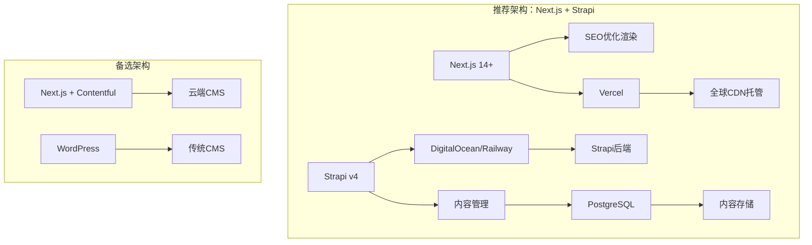

**图表来源**
- [WEBSITE_ARCHITECTURE.md:50-95](file://WEBSITE_ARCHITECTURE.md#L50-L95)

### 关键特性确认

| 特性 | 描述 | 实现方式 |
|------|------|----------|
| 参数化搜索 | 支持按电压、容量、放电率筛选电池 | URL参数过滤 + SSR兼容 |
| 上下文询价表单 | 自动填充产品信息的询价系统 | 模态框 + 自动字段填充 |
| SEO结构化数据 | 产品Schema + FAQ Schema标记 | JSON-LD自动生成 |
| 多渠道线索捕获 | WhatsApp、邮件、表单 | 浮动按钮 + 联系表单 |

**章节来源**
- [WEBSITE_ARCHITECTURE.md:21-24](file://WEBSITE_ARCHITECTURE.md#L21-L24)

## URL架构与页面组织

### 完整URL架构设计

```mermaid
graph TD
A[/] --> B[首页]
A --> C[产品中心]
C --> D[无人机电池]
D --> E[FPV赛车电池]
D --> F[农业喷洒电池]
D --> G[VTOL电池]
D --> H[工业检测电池]
D --> I[产品详情页]
A --> J[解决方案]
J --> K[航拍测绘]
J --> L[农业喷洒]
J --> M[工业巡检]
J --> N[重载无人机]
A --> O[技术能力]
O --> P[认证标准]
O --> Q[制造工艺]
O --> R[研发创新]
A --> S[定制化服务]
A --> T[关于我们]
A --> U[博客]
U --> V[文章详情]
A --> W[联系我们]
A --> X[资源下载]
```

**图表来源**
- [WEBSITE_ARCHITECTURE.md:189-219](file://WEBSITE_ARCHITECTURE.md#L189-L219)

### 页面层级关系

| 页面层级 | URL模式 | 页面类型 | 功能定位 |
|----------|---------|----------|----------|
| 一级页面 | `/` | 首页 | 品牌展示、核心价值主张 |
| 一级页面 | `/products` | 产品中心 | 电池产品展示与筛选 |
| 二级页面 | `/products/:category` | 产品分类 | 按应用领域分类展示 |
| 三级页面 | `/products/:category/:slug` | 产品详情 | 单个产品深度介绍 |
| 一级页面 | `/solutions` | 解决方案 | 行业应用案例展示 |
| 一级页面 | `/technology` | 技术能力 | 公司技术实力展示 |
| 一级页面 | `/customization` | 定制化服务 | OEM/ODM服务介绍 |
| 一级页面 | `/about` | 关于我们 | 公司背景与文化展示 |
| 一级页面 | `/blog` | 博客 | 行业资讯与技术文章 |
| 二级页面 | `/blog/:slug` | 文章详情 | 单篇文章深度阅读 |
| 一级页面 | `/contact` | 联系我们 | 客户沟通与服务入口 |

**章节来源**
- [WEBSITE_ARCHITECTURE.md:189-219](file://WEBSITE_ARCHITECTURE.md#L189-L219)

## 核心页面详细分析

### 首页设计

首页作为品牌的第一印象，采用了多层次的信息架构：

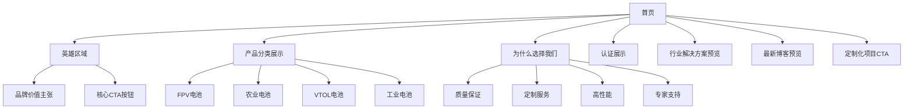

**图表来源**
- [page.tsx:28-329](file://frontend/src/app/page.tsx#L28-L329)

### 产品中心架构

产品中心实现了完整的电池筛选系统：

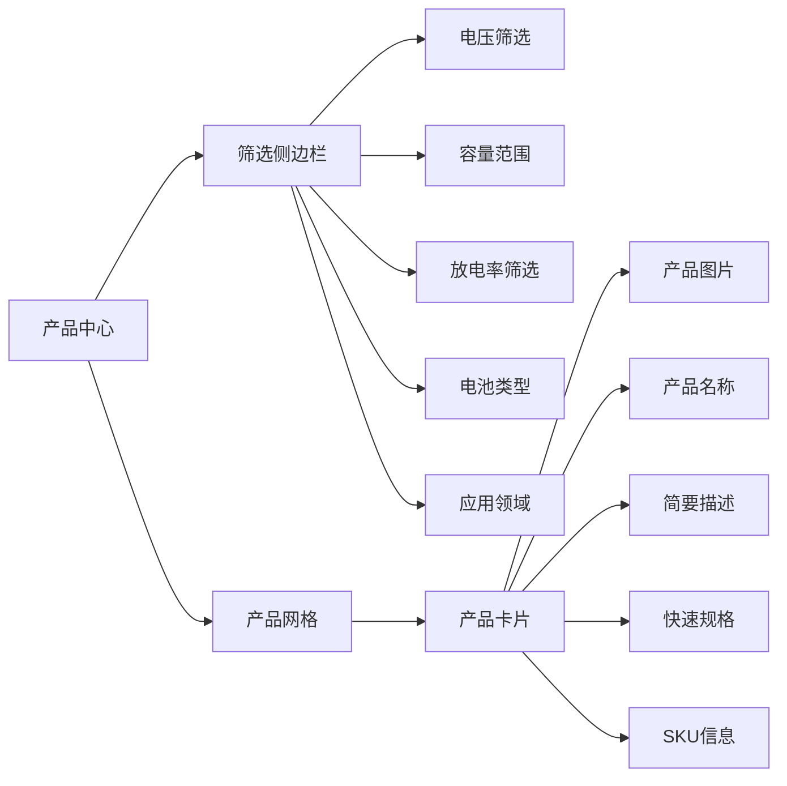

**图表来源**
- [page.tsx:47-580](file://frontend/src/app/products/page.tsx#L47-L580)

### 产品详情页

产品详情页集成了多种功能模块：

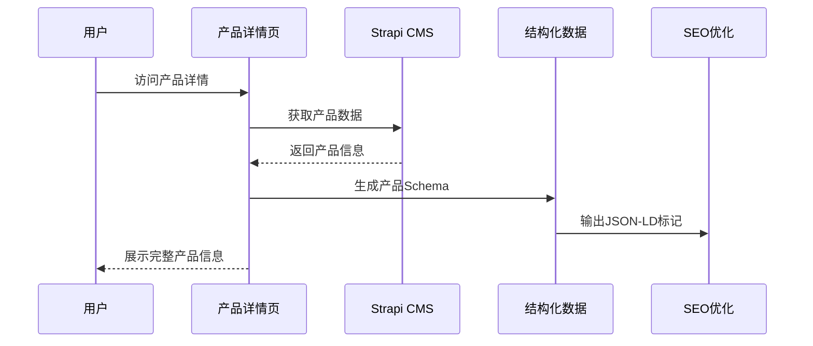

**图表来源**
- [page.tsx:202-566](file://frontend/src/app/products/[category]/[slug]/page.tsx#L202-L566)

**章节来源**
- [page.tsx:1-395](file://frontend/src/app/page.tsx#L1-L395)
- [page.tsx:1-580](file://frontend/src/app/products/page.tsx#L1-L580)
- [page.tsx:1-566](file://frontend/src/app/products/[category]/[slug]/page.tsx#L1-L566)

## 导航逻辑与用户路径设计

### 用户访问路径分析

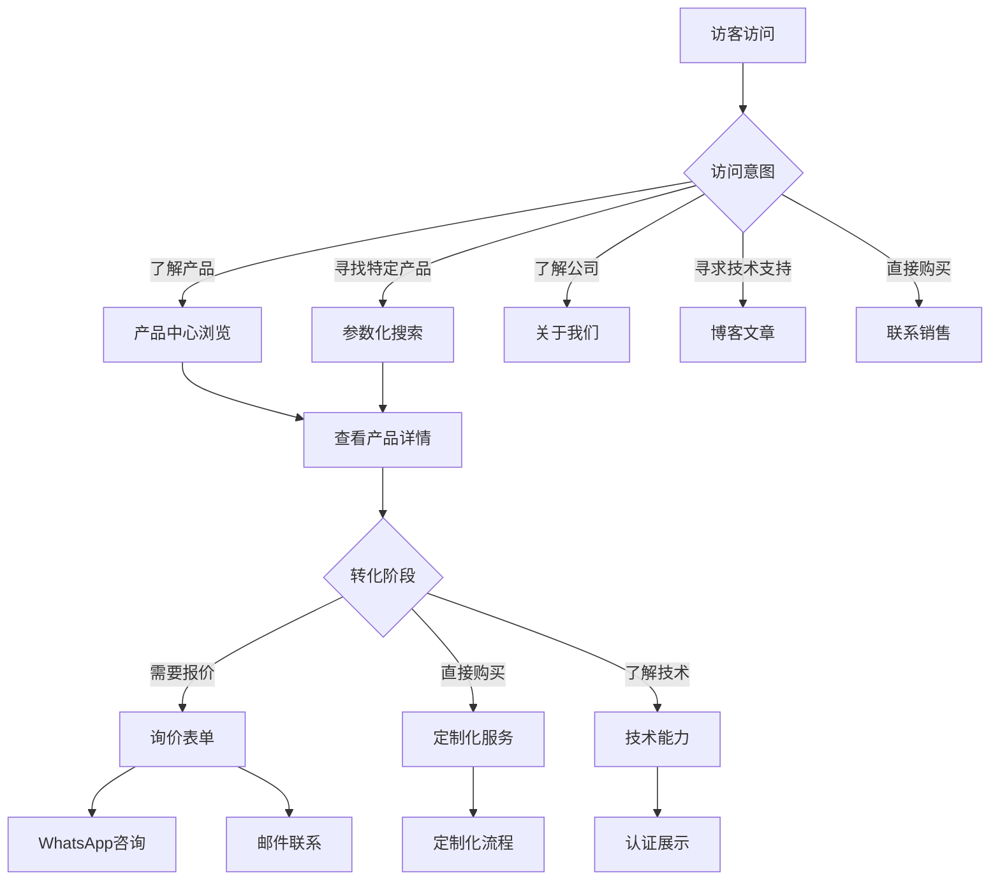

### 导航设计原则

| 导航层级 | 设计原则 | 实现方式 |
|----------|----------|----------|
| 一级导航 | 简洁明确，覆盖核心功能 | 固定在页面顶部 |
| 二级导航 | 细分产品类别 | 下拉菜单形式 |
| 内部导航 | 清晰的面包屑路径 | 自动生成 |
| 移动端导航 | 触摸友好，响应式设计 | 折叠菜单 |

**章节来源**
- [config.ts:26-50](file://frontend/src/lib/config.ts#L26-L50)

## SEO优化策略

### 结构化数据实现

项目实现了全面的SEO优化策略：

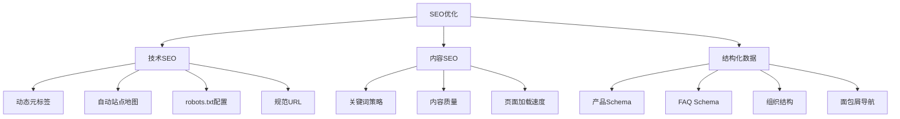

**图表来源**
- [WEBSITE_ARCHITECTURE.md:464-554](file://WEBSITE_ARCHITECTURE.md#L464-L554)

### 关键词策略

| 页面类型 | 主要关键词 | 辅助关键词 |
|----------|------------|------------|
| 首页 | 无人机电池制造商、UAV电池供应商 | 定制锂聚合物电池、OEM无人机电池 |
| 产品中心 | 无人机电池、UAV电池包 | 高放电电池、锂聚合物电池 |
| FPV分类 | FPV无人机电池、竞速无人机电池 | 高C率锂聚合物、6S FPV电池 |
| 农业应用 | 农业无人机电池、喷洒无人机电池 | 长续航无人机电池、22000mAh无人机 |
| 解决方案 | 无人机电源解决方案、UAV电池系统 | 定制电池组、电池集成 |
| 博客 | 如何选择无人机电池、锂聚合物电池指南 | 电池安全、无人机电池维护 |

**章节来源**
- [WEBSITE_ARCHITECTURE.md:555-565](file://WEBSITE_ARCHITECTURE.md#L555-L565)

## 技术实现指导

### 前端架构实现

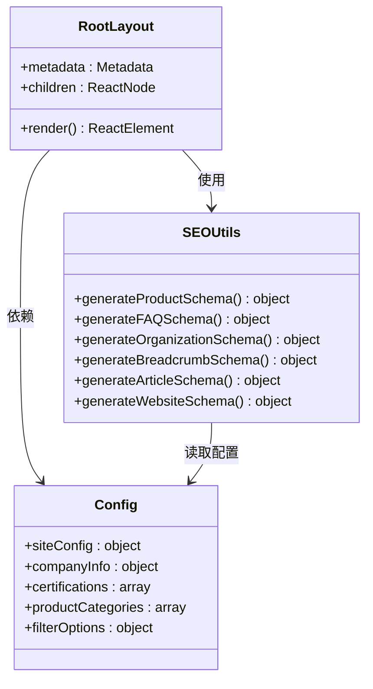

**图表来源**
- [layout.tsx:13-99](file://frontend/src/app/layout.tsx#L13-L99)
- [seo.ts:4-225](file://frontend/src/lib/seo.ts#L4-L225)
- [config.ts:3-177](file://frontend/src/lib/config.ts#L3-L177)

### CMS内容管理

项目使用Strapi作为内容管理系统，实现了灵活的内容管理：

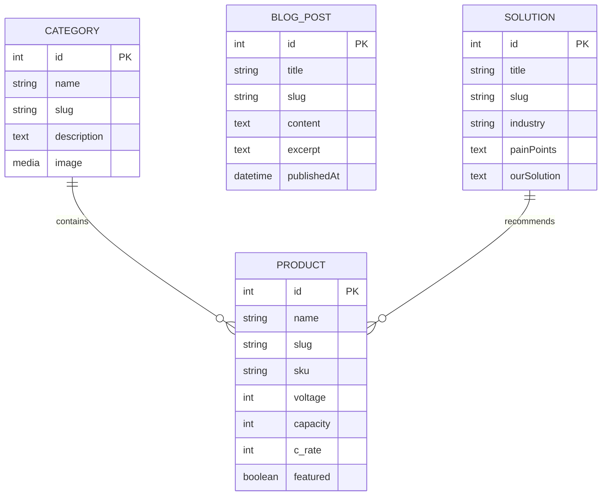

**图表来源**
- [WEBSITE_ARCHITECTURE.md:361-461](file://WEBSITE_ARCHITECTURE.md#L361-L461)

**章节来源**
- [layout.tsx:1-100](file://frontend/src/app/layout.tsx#L1-L100)
- [seo.ts:1-225](file://frontend/src/lib/seo.ts#L1-L225)
- [config.ts:1-177](file://frontend/src/lib/config.ts#L1-L177)
- [index.ts:1-315](file://cms/src/index.ts#L1-L315)

## 未来扩展规划

### 工业电池产品线扩展

基于当前架构，可以轻松扩展到工业电池产品线：

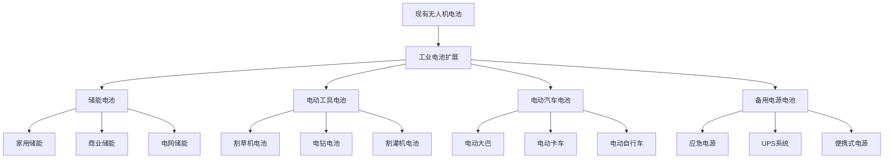

### 多语言支持规划

```mermaid
flowchart LR
A[单语言版本] --> B[多语言架构]
B --> C[语言检测]
B --> D[内容本地化]
B --> E[URL国际化]
C --> F[浏览器语言检测]
C --> G[用户偏好设置]
D --> H[内容翻译管理]
D --> I[媒体文件本地化]
D --> J[日期时间格式化]
E --> K[/en/路径]
E --> L[/zh/路径]
E --> M[/ja/路径]
```

### 技术升级路线图

| 时间阶段 | 技术升级 | 目标 |
|----------|----------|------|
| 第1阶段 | Next.js 14基础功能 | 稳定的SEO和性能表现 |
| 第2阶段 | App Router优化 | 更好的用户体验和加载速度 |
| 第3阶段 | 多语言支持 | 扩展国际市场覆盖 |
| 第4阶段 | 微服务架构 | 支持更大规模的业务需求 |
| 第5阶段 | AI辅助功能 | 智能推荐和个性化体验 |

**章节来源**
- [WEBSITE_ARCHITECTURE.md:18-18](file://WEBSITE_ARCHITECTURE.md#L18-L18)

## 性能考虑

### 加载性能优化

项目采用了多项性能优化措施：

| 优化策略 | 实现方式 | 性能收益 |
|----------|----------|----------|
| 静态生成 | Next.js静态页面生成 | 减少服务器负载 |
| 图片优化 | Next.js Image组件 | 自动格式转换和压缩 |
| 代码分割 | React懒加载 | 减少初始包大小 |
| 缓存策略 | CDN缓存和浏览器缓存 | 提高页面加载速度 |
| 预加载 | 关键资源预加载 | 改善首屏加载时间 |

### SEO性能指标

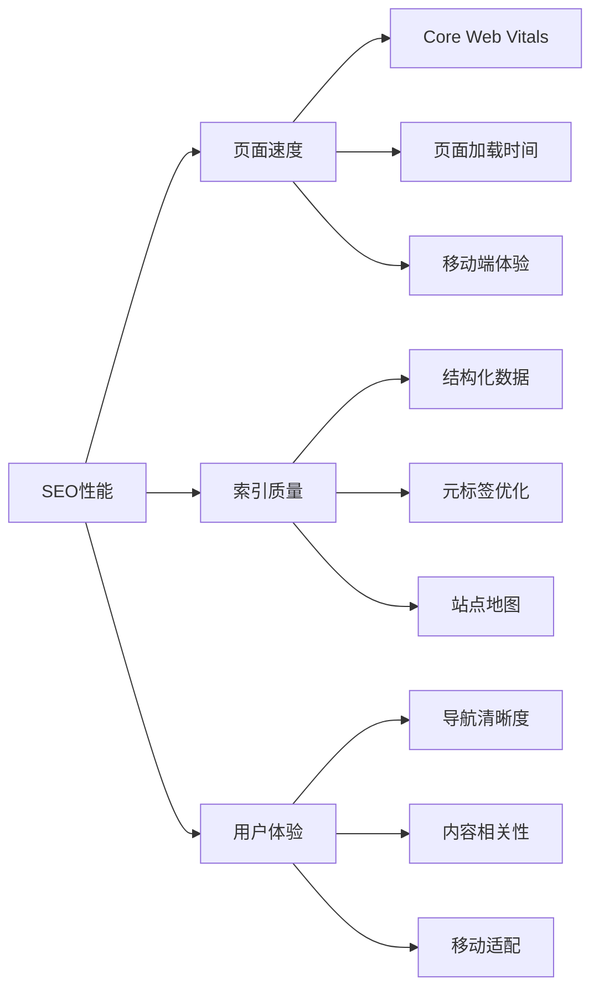

## 故障排除指南

### 常见问题诊断

| 问题类型 | 症状 | 可能原因 | 解决方案 |
|----------|------|----------|----------|
| 页面加载慢 | 首屏加载时间过长 | 图片未优化、JavaScript过大 | 启用图片优化、代码分割 |
| SEO排名低 | 搜索引擎收录少 | 缺少结构化数据、元标签不正确 | 添加JSON-LD、优化元标签 |
| 移动端显示异常 | 移动端布局错乱 | 缺少响应式设计 | 添加viewport元标签、响应式样式 |
| 内容更新不生效 | 新内容未显示 | 缓存问题、CDN同步延迟 | 清除缓存、检查CDN配置 |

### 开发环境调试

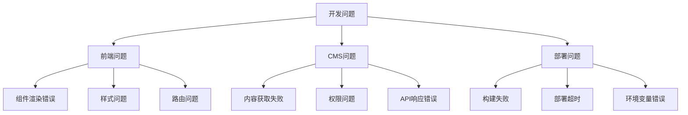

**章节来源**
- [layout.tsx:13-64](file://frontend/src/app/layout.tsx#L13-L64)

## 结论

Battivus飞控电池网站项目通过精心设计的URL架构和页面组织，成功构建了一个功能完整、SEO优化的专业B2B电商平台。项目的核心优势包括：

### 设计原则总结

1. **用户导向**：以用户需求为中心的导航设计和信息架构
2. **SEO优先**：全面的SEO优化策略和技术实现
3. **技术先进**：采用最新的Next.js和Strapi技术栈
4. **可扩展性**：模块化设计支持未来的功能扩展
5. **性能优化**：从架构层面确保优秀的用户体验

### 技术实现亮点

- **参数化搜索系统**：提供精确的产品筛选功能
- **上下文询价表单**：提升转化率的智能表单设计
- **结构化数据标记**：增强搜索引擎可见性
- **响应式设计**：适配各种设备和屏幕尺寸
- **内容管理系统**：为非技术人员提供易用的内容管理界面

### 未来发展建议

1. **持续优化SEO**：定期更新内容，监控排名表现
2. **扩展产品线**：根据市场需求添加新的电池类型
3. **国际化扩展**：逐步实现多语言支持
4. **数据分析**：建立完善的用户行为分析体系
5. **技术创新**：关注新技术发展，保持技术领先

这个项目为B2B电商网站的建设提供了优秀的参考模板，其设计理念和技术实现都值得其他类似项目借鉴学习。