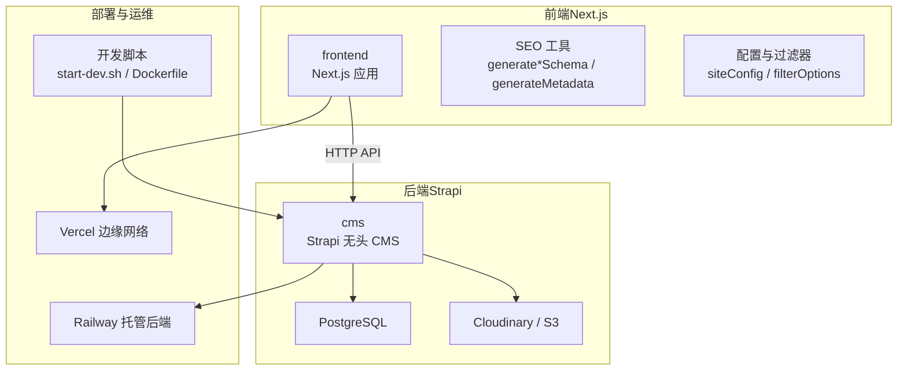
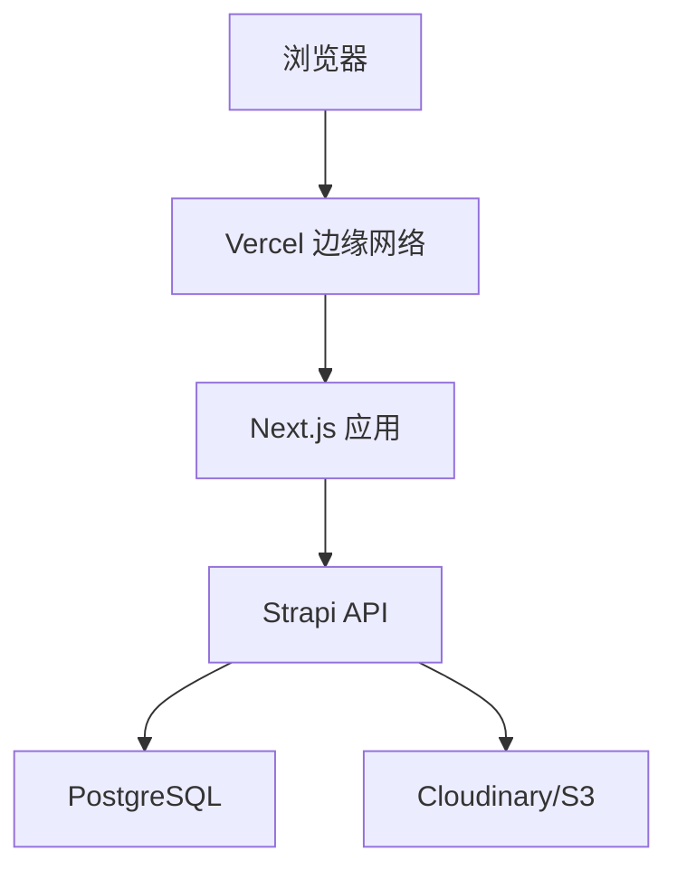
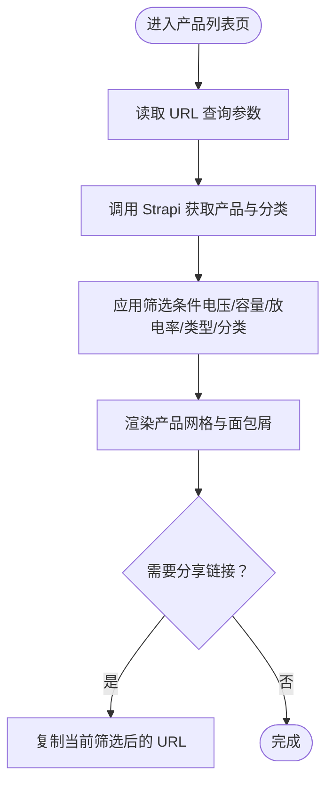
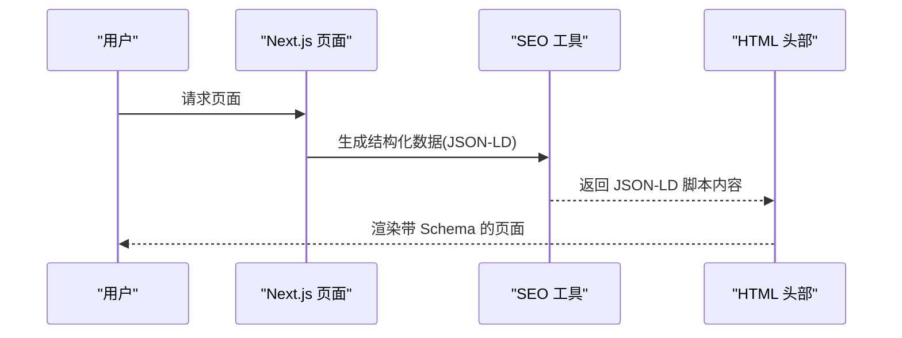
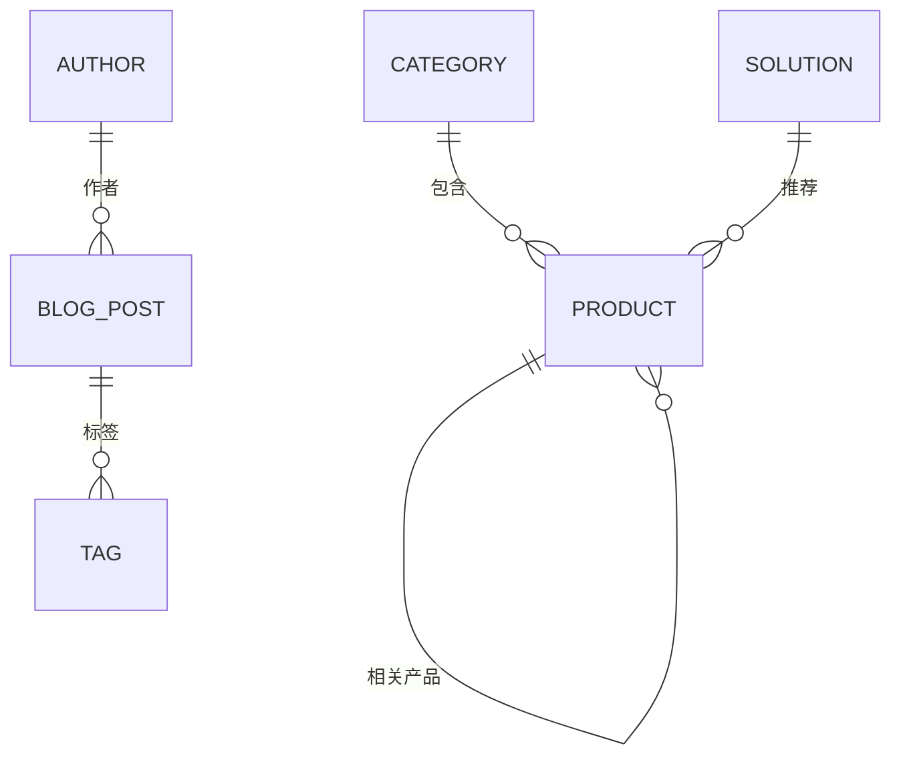
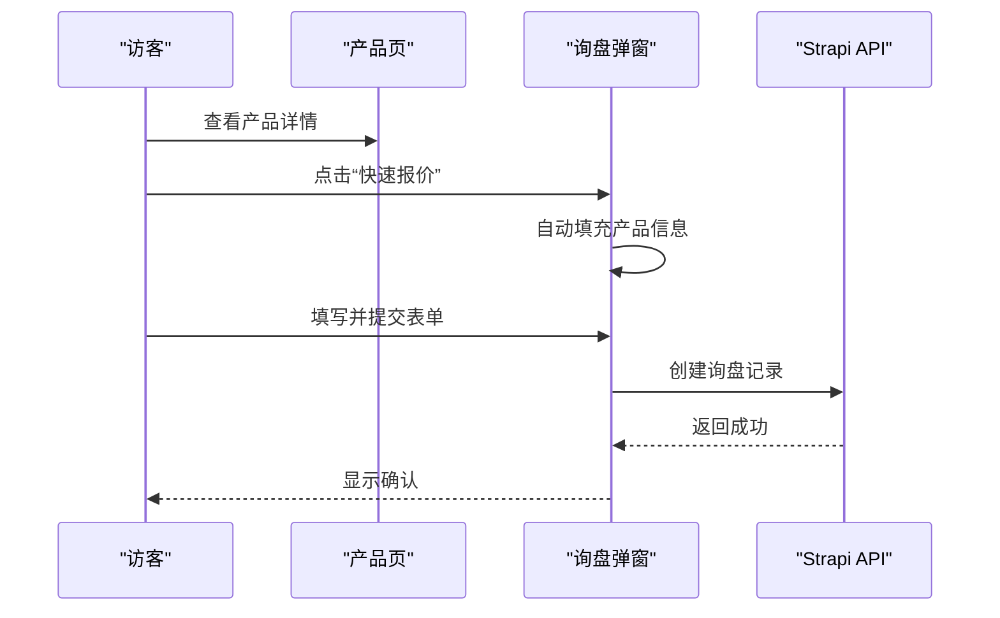
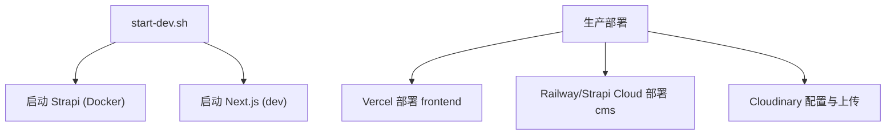
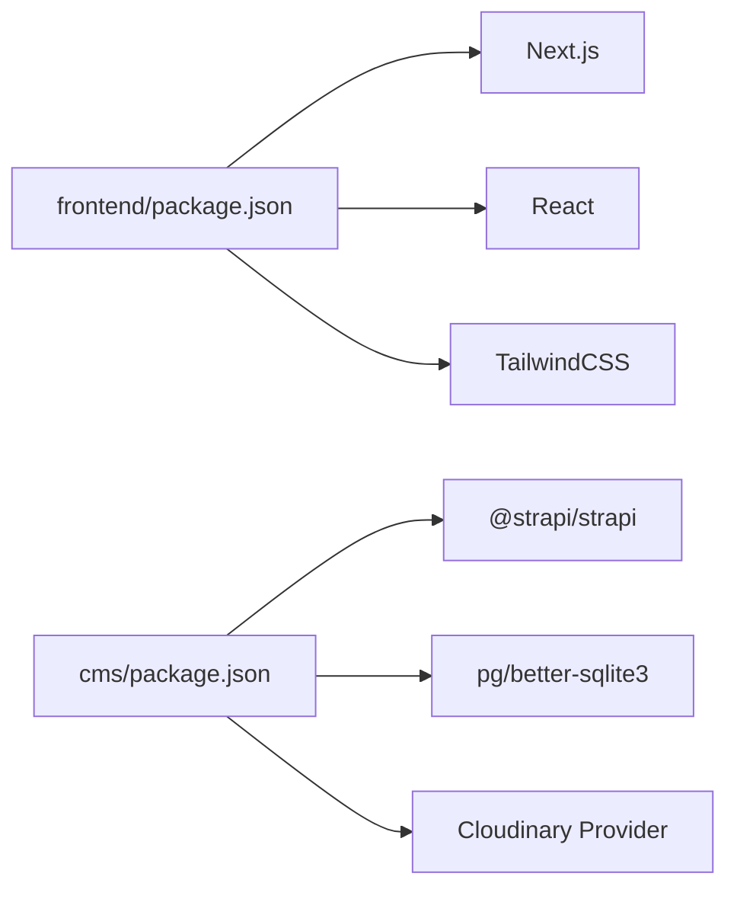

# 项目概述

<cite>
**本文引用的文件**
- [WEBSITE_ARCHITECTURE.md](file://WEBSITE_ARCHITECTURE.md)
- [DEPLOYMENT.md](file://DEPLOYMENT.md)
- [cms/package.json](file://cms/package.json)
- [frontend/package.json](file://frontend/package.json)
- [cms/src/index.ts](file://cms/src/index.ts)
- [cms/src/api/product/content-types/product/schema.json](file://cms/src/api/product/content-types/product/schema.json)
- [cms/src/api/category/content-types/category/schema.json](file://cms/src/api/category/content-types/category/schema.json)
- [frontend/src/lib/config.ts](file://frontend/src/lib/config.ts)
- [frontend/src/lib/seo.ts](file://frontend/src/lib/seo.ts)
- [frontend/src/app/layout.tsx](file://frontend/src/app/layout.tsx)
- [frontend/src/app/products/page.tsx](file://frontend/src/app/products/page.tsx)
- [cms/Dockerfile](file://cms/Dockerfile)
- [start-dev.sh](file://start-dev.sh)
</cite>

## 目录
1. [引言](#引言)
2. [项目结构](#项目结构)
3. [核心组件](#核心组件)
4. [架构总览](#架构总览)
5. [详细组件分析](#详细组件分析)
6. [依赖关系分析](#依赖关系分析)
7. [性能考量](#性能考量)
8. [故障排查指南](#故障排查指南)
9. [结论](#结论)
10. [附录](#附录)

## 引言
本项目是为 Battivus 飞控电池打造的 B2B 无人机电池网站，目标是以专业、可扩展的方式服务全球客户，重点突出以下能力：
- 参数化搜索（电池检索器）：通过电压、容量、放电率、电池类型等多维筛选快速定位产品
- SEO 优化：结构化数据（Schema）、站点地图、开放图谱、动态元标签
- 内容管理：基于 Strapi 的无头 CMS，支持营销团队独立维护内容
- 转化渠道：WhatsApp 浮窗、邮件表单、快速报价等多通道线索收集
- 技术架构：Next.js（App Router）+ Strapi（Headless CMS），前后端分离，便于扩展与部署

该架构在性能、SEO、灵活性与成本之间取得平衡，适合以“无人机电池”为核心品类的 B2B 网站起步与演进。

## 项目结构
项目采用前后端分离的双仓库结构：
- 前端（frontend）：Next.js 应用，负责页面渲染、SEO、交互与样式
- 后端（cms）：Strapi 无头 CMS，负责内容模型、媒体存储与 API 提供
- 运维脚本：start-dev.sh 提供一键启动/停止服务的能力；Dockerfile 用于后端镜像构建

图表来源
- [DEPLOYMENT.md:10-17](file://DEPLOYMENT.md#L10-L17)
- [cms/package.json:14-25](file://cms/package.json#L14-L25)
- [frontend/package.json:11-15](file://frontend/package.json#L11-L15)
- [cms/Dockerfile:1-43](file://cms/Dockerfile#L1-L43)
- [start-dev.sh:1-195](file://start-dev.sh#L1-L195)

章节来源
- [WEBSITE_ARCHITECTURE.md:48-95](file://WEBSITE_ARCHITECTURE.md#L48-L95)
- [DEPLOYMENT.md:8-17](file://DEPLOYMENT.md#L8-L17)

## 核心组件
- 参数化搜索（电池检索器）
  - 支持电压（S 数）、容量（mAh）、放电率（C）、电池类型等筛选
  - URL 持久化筛选状态，便于分享与回溯
  - 前端实时过滤，无需刷新
- SEO 体系
  - 动态生成站点元信息、Open Graph、Twitter Card
  - 结构化数据：组织、网站、产品、文章、FAQ 等 JSON-LD
  - 站点地图与爬虫策略
- 内容模型（Strapi）
  - 产品、分类、博客、解决方案、询盘等模型
  - 支持富文本、媒体上传、SEO 字段
- 转化与联系
  - 产品页“快速报价”弹窗、WhatsApp 浮窗按钮
  - 联系页表单与隐私条款
- 开发与部署
  - 前端：Next.js（App Router），TailwindCSS，TypeScript
  - 后端：Strapi v5，PostgreSQL，Cloudinary
  - 部署：Vercel（前端）、Railway（后端）、Cloudinary（媒体）

章节来源
- [WEBSITE_ARCHITECTURE.md:223-338](file://WEBSITE_ARCHITECTURE.md#L223-L338)
- [frontend/src/lib/seo.ts:4-166](file://frontend/src/lib/seo.ts#L4-L166)
- [frontend/src/lib/config.ts:149-177](file://frontend/src/lib/config.ts#L149-L177)
- [cms/src/api/product/content-types/product/schema.json:12-31](file://cms/src/api/product/content-types/product/schema.json#L12-L31)
- [cms/src/api/category/content-types/category/schema.json:12-19](file://cms/src/api/category/content-types/category/schema.json#L12-L19)

## 架构总览
系统采用“前端静态/服务端渲染 + 无头 CMS”的现代架构：
- 前端（Next.js）：在 Vercel 全球边缘网络上进行页面渲染与缓存，具备优秀的 SEO 与性能指标
- 后端（Strapi）：提供 RESTful API，支持内容发布、媒体托管与权限控制
- 数据库：PostgreSQL 存储内容与关系
- 媒体：Cloudinary 或 S3 承载图片与文档
- 部署：前端自动部署到 Vercel，后端可选 Railway 或 Strapi Cloud

图表来源
- [WEBSITE_ARCHITECTURE.md:52-71](file://WEBSITE_ARCHITECTURE.md#L52-L71)
- [DEPLOYMENT.md:10-17](file://DEPLOYMENT.md#L10-L17)

章节来源
- [WEBSITE_ARCHITECTURE.md:48-95](file://WEBSITE_ARCHITECTURE.md#L48-L95)
- [DEPLOYMENT.md:3-17](file://DEPLOYMENT.md#L3-L17)

## 详细组件分析

### 参数化搜索（电池检索器）
- 功能要点
  - 侧边栏筛选：电压（S）、容量范围、放电率（C）、电池类型、分类
  - 实时过滤：变更筛选条件即时更新结果，URL 同步状态
  - 分类导航：按 FPV、农业、VTOL、工业等分类浏览
- 技术实现
  - 前端使用客户端状态与 URL 查询参数同步
  - 通过 Next.js App Router 页面加载数据并渲染
  - 使用配置常量定义筛选选项与默认值
- 用户体验
  - 移动端支持抽屉式筛选面板
  - 加载骨架屏与空状态提示

图表来源
- [frontend/src/app/products/page.tsx:278-401](file://frontend/src/app/products/page.tsx#L278-L401)
- [frontend/src/lib/config.ts:149-177](file://frontend/src/lib/config.ts#L149-L177)

章节来源
- [WEBSITE_ARCHITECTURE.md:225-272](file://WEBSITE_ARCHITECTURE.md#L225-L272)
- [frontend/src/app/products/page.tsx:47-212](file://frontend/src/app/products/page.tsx#L47-L212)
- [frontend/src/lib/config.ts:149-177](file://frontend/src/lib/config.ts#L149-L177)

### SEO 与结构化数据
- 技术 SEO
  - 动态生成标题、描述、关键词、Open Graph、Twitter Card
  - 站点地图与爬虫策略配置
- 结构化数据
  - 组织、网站、产品、文章、FAQ 等 JSON-LD
  - 在根布局中注入组织与网站 Schema，页面级注入产品/文章 Schema
- 关键路径
  - 根布局设置全局元信息与 Schema
  - 产品详情页注入产品 Schema 与面包屑
  - 博文详情页注入文章 Schema

图表来源
- [frontend/src/app/layout.tsx:74-87](file://frontend/src/app/layout.tsx#L74-L87)
- [frontend/src/lib/seo.ts:4-166](file://frontend/src/lib/seo.ts#L4-L166)

章节来源
- [WEBSITE_ARCHITECTURE.md:464-565](file://WEBSITE_ARCHITECTURE.md#L464-L565)
- [frontend/src/lib/seo.ts:4-166](file://frontend/src/lib/seo.ts#L4-L166)
- [frontend/src/app/layout.tsx:13-64](file://frontend/src/app/layout.tsx#L13-L64)

### 内容模型（Strapi）
- 核心模型
  - 产品：名称、SKU、短描述、规格（电压/容量/放电率/重量/尺寸/连接器/电池类型）、图片、数据表、相关产品、应用、SEO 字段
  - 分类：名称、别名、描述、图片、SEO 字段
  - 博客：标题、别名、内容、摘要、封面、作者、标签、发布时间、SEO 字段
  - 解决方案：标题、别名、行业、英雄图、痛点、方案、推荐产品、案例研究、SEO 字段
  - 询盘：提交表单创建记录（公开权限）
- 初始化与种子
  - 启动时自动配置公开角色权限
  - 若数据库为空或关系缺失则重新播种测试数据（产品与分类）

图表来源
- [cms/src/api/product/content-types/product/schema.json:12-31](file://cms/src/api/product/content-types/product/schema.json#L12-L31)
- [cms/src/api/category/content-types/category/schema.json:12-19](file://cms/src/api/category/content-types/category/schema.json#L12-L19)

章节来源
- [WEBSITE_ARCHITECTURE.md:361-461](file://WEBSITE_ARCHITECTURE.md#L361-L461)
- [cms/src/index.ts:161-216](file://cms/src/index.ts#L161-L216)

### 转化与联系（Inquiry 与 WhatsApp）
- 行为设计
  - 产品页“快速报价”弹窗，预填产品名称、SKU、URL
  - 联系页表单与隐私条款
  - 全局 WhatsApp 浮窗按钮，支持多号码展示
- 数据采集
  - 询盘表单字段：姓名、邮箱、公司、数量、消息、时间戳、来源页
- 权限与安全
  - 公开角色仅启用查询与创建询盘权限
  - 生产环境建议最小权限原则与密钥管理

图表来源
- [WEBSITE_ARCHITECTURE.md:275-338](file://WEBSITE_ARCHITECTURE.md#L275-L338)
- [cms/src/index.ts:186-188](file://cms/src/index.ts#L186-L188)

章节来源
- [WEBSITE_ARCHITECTURE.md:568-623](file://WEBSITE_ARCHITECTURE.md#L568-L623)
- [cms/src/index.ts:161-216](file://cms/src/index.ts#L161-L216)

### 开发与部署（本地与生产）
- 本地开发
  - start-dev.sh 提供统一入口：启动/停止 CMS（Docker）与前端（Next.js）
  - 前端默认监听 3000，CMS 默认监听 1337
- 生产部署
  - 前端：Vercel 自动部署，根目录指向 frontend
  - 后端：Railway（推荐）或 Strapi Cloud
  - 媒体：Cloudinary，需在插件中配置凭据
- 安全与迁移
  - 生产环境必须设置强随机密钥
  - 可使用 Strapi Transfer 将本地内容迁移到生产

图表来源
- [start-dev.sh:72-100](file://start-dev.sh#L72-L100)
- [DEPLOYMENT.md:109-130](file://DEPLOYMENT.md#L109-L130)
- [cms/Dockerfile:1-43](file://cms/Dockerfile#L1-L43)

章节来源
- [DEPLOYMENT.md:21-130](file://DEPLOYMENT.md#L21-L130)
- [start-dev.sh:1-195](file://start-dev.sh#L1-L195)

## 依赖关系分析
- 前端依赖
  - Next.js、React、TailwindCSS、TypeScript
  - 通过环境变量访问 Strapi API
- 后端依赖
  - Strapi v5、PostgreSQL、Cloudinary 上传插件
  - Dockerfile 定义构建与运行流程
- 运行时耦合
  - 前端与后端通过 HTTP API 通信
  - 媒体资源由后端托管并通过 Cloudinary 提供 CDN

图表来源
- [frontend/package.json:11-25](file://frontend/package.json#L11-L25)
- [cms/package.json:14-25](file://cms/package.json#L14-L25)

章节来源
- [frontend/package.json:1-26](file://frontend/package.json#L1-L26)
- [cms/package.json:1-36](file://cms/package.json#L1-L36)

## 性能考量
- 前端性能
  - Next.js App Router 提供 SSR/SSG，利于 SEO 与首屏速度
  - TailwindCSS 与骨架屏提升视觉反馈与加载体验
- 后端性能
  - Strapi API 响应与数据库索引设计影响查询性能
  - 媒体资源由 Cloudinary 提供 CDN 与压缩
- 运维建议
  - 生产环境开启最小权限与强密钥
  - 使用 Vercel 与 Railway 的自动部署与健康检查
  - 定期审查结构化数据与站点地图，确保搜索引擎友好

## 故障排查指南
- 常见问题
  - 前端无法访问 API：检查 NEXT_PUBLIC_STRAPI_URL 与 API Token
  - 图片不显示：检查 Cloudinary 凭据与插件配置
  - 本地开发端口冲突：使用 start-dev.sh 控制启动/停止
  - 生产权限不足：确认 Strapi 公共角色权限只允许必要操作
- 排查步骤
  - 查看 Vercel/Railway 部署日志
  - 在浏览器控制台查看网络请求与错误
  - 在 Strapi 后台检查内容与媒体是否发布
  - 使用结构化数据校验工具验证 JSON-LD

章节来源
- [DEPLOYMENT.md:186-191](file://DEPLOYMENT.md#L186-L191)
- [start-dev.sh:51-70](file://start-dev.sh#L51-L70)

## 结论
本项目以“Next.js + Strapi”为核心技术栈，围绕“参数化搜索 + SEO + 内容管理 + 转化渠道”构建了面向 B2B 无人机电池市场的网站。该架构在性能、SEO、可维护性与成本之间取得良好平衡，既适合初创阶段快速上线，也为未来扩展（如多语言、多站点、更复杂业务流）预留空间。

## 附录
- URL 架构（示例）
  - 首页、产品中心、解决方案、技术能力、定制服务、关于、博客、联系
- 关键特性清单
  - 参数化搜索、结构化数据、站点地图、WhatsApp 浮窗、快速报价、媒体 CDN

章节来源
- [WEBSITE_ARCHITECTURE.md:189-219](file://WEBSITE_ARCHITECTURE.md#L189-L219)